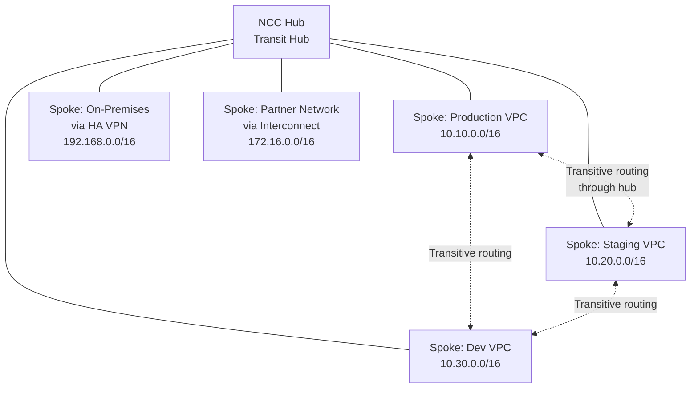

# How to Set Up a Hub-and-Spoke Network Topology Using Network Connectivity Center in GCP

Author: [nawazdhandala](https://www.github.com/nawazdhandala)

Tags: GCP, Network Connectivity Center, Hub and Spoke, VPC, Networking

Description: A practical guide to building a hub-and-spoke network topology in GCP using Network Connectivity Center, enabling transitive connectivity between VPC networks, VPNs, and interconnects.

---

As your GCP footprint grows, you end up with multiple VPC networks that need to communicate. VPC peering works for simple setups, but it is non-transitive and the connection limit caps at 25 per network. For larger environments, you need a hub-and-spoke topology where a central hub provides connectivity between all spoke networks.

Network Connectivity Center (NCC) is Google's managed service for building this topology. It provides transitive connectivity, supports VPC spokes, VPN spokes, and Interconnect spokes, and handles route exchange automatically.

## The Hub-and-Spoke Architecture



Every spoke can reach every other spoke through the hub. This is the key advantage over VPC peering - you get transitive connectivity without managing N*(N-1)/2 peering connections.

## Prerequisites

Before setting up NCC:

1. Non-overlapping IP ranges across all spoke networks
2. Network Connectivity Center API enabled
3. Appropriate IAM roles (networkconnectivity.admin)

```bash
# Enable the required APIs
gcloud services enable networkconnectivity.googleapis.com
gcloud services enable compute.googleapis.com
```

## Step 1: Create the NCC Hub

The hub is a logical construct that ties the spokes together:

```bash
# Create the Network Connectivity Center hub
gcloud network-connectivity hubs create transit-hub \
  --description="Central hub for multi-VPC connectivity" \
  --labels=env=production
```

Verify the hub:

```bash
# Describe the hub
gcloud network-connectivity hubs describe transit-hub \
  --format="yaml(name, state, createTime)"
```

## Step 2: Add VPC Spokes

Each VPC network that needs connectivity becomes a spoke. Let us add three VPC networks:

```bash
# Add the production VPC as a spoke
gcloud network-connectivity spokes linked-vpc-network create spoke-production \
  --hub=transit-hub \
  --vpc-network=projects/my-project/global/networks/production-vpc \
  --location=global \
  --description="Production VPC spoke" \
  --labels=env=production
```

```bash
# Add the staging VPC as a spoke
gcloud network-connectivity spokes linked-vpc-network create spoke-staging \
  --hub=transit-hub \
  --vpc-network=projects/my-project/global/networks/staging-vpc \
  --location=global \
  --description="Staging VPC spoke" \
  --labels=env=staging
```

```bash
# Add the dev VPC as a spoke
gcloud network-connectivity spokes linked-vpc-network create spoke-dev \
  --hub=transit-hub \
  --vpc-network=projects/my-project/global/networks/dev-vpc \
  --location=global \
  --description="Development VPC spoke" \
  --labels=env=development
```

## Step 3: Verify Route Exchange

Once spokes are connected, NCC automatically exchanges routes between them. Verify that routes from other spokes appear:

```bash
# Check routes in the production VPC - should see staging and dev routes
gcloud compute routes list \
  --project=my-project \
  --filter="network=production-vpc AND description:NCC" \
  --format="table(name, destRange, nextHopHub, priority)"
```

```bash
# List spokes and their status
gcloud network-connectivity spokes list \
  --hub=transit-hub \
  --format="table(name, linkedVpcNetwork.uri, state)"
```

All spokes should show `ACTIVE` state.

## Step 4: Add On-Premises Connectivity via VPN Spoke

NCC can also connect on-premises networks through VPN or Interconnect spokes. First, set up HA VPN:

```bash
# Create a Cloud Router for the VPN hub
gcloud compute routers create ncc-router \
  --network=transit-vpc \
  --region=us-central1 \
  --asn=65000

# Create HA VPN gateway
gcloud compute vpn-gateways create ncc-vpn-gw \
  --network=transit-vpc \
  --region=us-central1

# Create VPN tunnels (simplified - you need two for HA)
gcloud compute vpn-tunnels create tunnel-0 \
  --region=us-central1 \
  --vpn-gateway=ncc-vpn-gw \
  --peer-gcp-gateway=onprem-vpn-gw \
  --shared-secret=my-secret \
  --router=ncc-router \
  --vpn-gateway-interface=0

# Configure BGP sessions on Cloud Router
gcloud compute routers add-bgp-peer ncc-router \
  --region=us-central1 \
  --peer-name=onprem-peer-0 \
  --interface=tunnel-0-iface \
  --peer-ip-address=169.254.0.2 \
  --peer-asn=65001
```

Then add the VPN tunnels as an NCC spoke:

```bash
# Add the VPN tunnels as a spoke to the NCC hub
gcloud network-connectivity spokes linked-vpn-tunnels create spoke-onprem \
  --hub=transit-hub \
  --vpn-tunnels=projects/my-project/regions/us-central1/vpnTunnels/tunnel-0,projects/my-project/regions/us-central1/vpnTunnels/tunnel-1 \
  --region=us-central1 \
  --site-to-site-data-transfer \
  --description="On-premises connectivity via HA VPN"
```

Now on-premises routes advertised via BGP are distributed to all VPC spokes, and VPC subnet routes are advertised back to on-premises.

## Step 5: Configure Firewall Rules

NCC handles routing, but each VPC still manages its own firewall rules. Create rules in each spoke to allow traffic from other spokes:

```bash
# In production VPC: allow traffic from staging and dev subnets
gcloud compute firewall-rules create allow-from-ncc-spokes \
  --project=my-project \
  --network=production-vpc \
  --direction=INGRESS \
  --action=ALLOW \
  --rules=tcp,udp,icmp \
  --source-ranges=10.20.0.0/16,10.30.0.0/16,192.168.0.0/16 \
  --description="Allow traffic from NCC spoke networks"
```

Repeat similar rules in each spoke VPC, adjusting source ranges to include the other spoke networks.

## Excluding Specific Subnets from Route Export

You might not want every subnet in a spoke to be reachable from other spokes. NCC supports route filtering:

```bash
# Update a spoke to exclude specific subnets from route export
gcloud network-connectivity spokes linked-vpc-network update spoke-dev \
  --hub=transit-hub \
  --location=global \
  --exclude-export-ranges=10.30.100.0/24,10.30.200.0/24
```

This keeps the excluded subnets private to the dev VPC while sharing the rest.

## Monitoring NCC

Check the health and status of your NCC hub:

```bash
# Describe the hub with all spoke information
gcloud network-connectivity hubs describe transit-hub \
  --format=yaml

# List all spokes and their status
gcloud network-connectivity spokes list \
  --hub=transit-hub \
  --format="table(name, spokeType, state, linkedVpcNetwork.uri, linkedVpnTunnels.uris)"
```

Set up monitoring alerts for spoke connectivity issues:

```bash
# Check hub routing table
gcloud network-connectivity hubs list-routes transit-hub \
  --spoke=spoke-production \
  --format="table(destRange, type, nextHopVpcNetwork)"
```

## Cross-Project Hub Configuration

NCC hubs can connect VPCs from different projects. The VPC spoke creation references the full project path:

```bash
# Add a VPC from a different project as a spoke
gcloud network-connectivity spokes linked-vpc-network create spoke-team-b \
  --hub=transit-hub \
  --vpc-network=projects/team-b-project/global/networks/team-b-vpc \
  --location=global \
  --description="Team B VPC from separate project"
```

The project hosting the VPC needs to grant the NCC service account appropriate permissions.

## NCC vs. VPC Peering: When to Choose Which

| Criteria | VPC Peering | NCC Hub-and-Spoke |
|----------|------------|-------------------|
| Transitive connectivity | No | Yes |
| Max connections | 25 per VPC | Higher limits |
| Route management | Automatic subnet routes | Managed by hub |
| On-premises integration | Separate VPN/Interconnect | Unified through hub |
| Cost | Free | NCC pricing applies |
| Complexity | Low | Medium |

Use VPC peering for simple two-network connections. Use NCC when you have more than a handful of networks, need transitive connectivity, or want unified on-premises integration.

## Removing a Spoke

To disconnect a network from the hub:

```bash
# Remove a spoke from the hub
gcloud network-connectivity spokes delete spoke-dev \
  --location=global --quiet
```

Routes from the removed spoke are automatically withdrawn from all other spokes.

## Wrapping Up

Network Connectivity Center provides the hub-and-spoke topology that complex GCP deployments need. It solves the transitivity limitation of VPC peering and unifies VPC, VPN, and Interconnect connectivity under a single management plane. Start by creating a hub, add your VPCs as spokes, and let NCC handle route exchange. The initial setup is more involved than simple VPC peering, but the result is a scalable network architecture that grows cleanly as you add more networks, regions, and on-premises locations.
