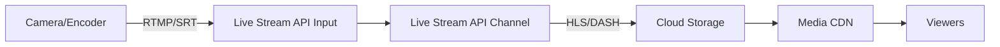

# How to Set Up a Live Video Streaming Pipeline Using Google Cloud Live Stream API

Author: [nawazdhandala](https://www.github.com/nawazdhandala)

Tags: GCP, Live Stream API, Video Streaming, Live Broadcasting, Media

Description: Set up a production-ready live video streaming pipeline on Google Cloud using the Live Stream API for real-time encoding and delivery.

---

Building a live streaming platform involves several moving parts: ingesting the live feed from a camera or encoder, transcoding it into multiple quality levels in real time, packaging it for delivery, and pushing it to a CDN. Google Cloud's Live Stream API handles the ingestion and transcoding portion, producing adaptive bitrate streams that you can deliver through Media CDN or any other CDN.

In this guide, I will set up a complete live streaming pipeline from ingest to playback.

## Architecture



The Live Stream API acts as a cloud-native live encoder. It receives your live feed, transcodes it into multiple renditions, and outputs HLS/DASH segments to Cloud Storage.

## Prerequisites

- GCP project with the Live Stream API enabled
- Cloud Storage bucket for stream output
- OBS Studio or any RTMP-compatible encoder
- Python 3.8+

```bash
# Enable required APIs
gcloud services enable livestream.googleapis.com
gcloud services enable storage.googleapis.com

# Install the client library
pip install google-cloud-live-stream

# Create an output bucket
gsutil mb -l us-central1 gs://your-stream-output-bucket
```

## Step 1: Create an Input Endpoint

The input endpoint is where your encoder sends the live feed:

```python
# create_input.py - Creates a Live Stream API input endpoint

from google.cloud.video.live_stream_v1 import LivestreamServiceClient
from google.cloud.video.live_stream_v1 import types

def create_input(project_id, location, input_id):
    """Creates an input endpoint that accepts RTMP streams from encoders.
    Returns the input URI that your encoder should target."""

    client = LivestreamServiceClient()
    parent = f"projects/{project_id}/locations/{location}"

    input_config = types.Input()
    input_config.type_ = types.Input.Type.RTMP_PUSH

    # Create the input endpoint
    operation = client.create_input(
        parent=parent,
        input=input_config,
        input_id=input_id,
    )

    result = operation.result(timeout=120)
    print(f"Input created: {result.name}")
    print(f"RTMP URI: {result.uri}")

    return result

# Create the input
input_endpoint = create_input(
    project_id="your-project",
    location="us-central1",
    input_id="my-stream-input",
)
```

The API returns an RTMP URI that you will configure in your encoder.

## Step 2: Create a Channel

The channel defines how the live stream is encoded and where the output goes:

```python
# create_channel.py - Creates a live streaming channel with ABR encoding

from google.cloud.video.live_stream_v1 import LivestreamServiceClient
from google.cloud.video.live_stream_v1 import types
from google.protobuf import duration_pb2

def create_channel(project_id, location, channel_id, input_name, output_bucket):
    """Creates a live streaming channel that transcodes the input
    into multiple quality levels and outputs HLS segments.

    Args:
        project_id: GCP project ID
        location: API location (e.g., us-central1)
        channel_id: Unique ID for this channel
        input_name: Full resource name of the input endpoint
        output_bucket: GCS bucket for stream output
    """

    client = LivestreamServiceClient()
    parent = f"projects/{project_id}/locations/{location}"

    channel = types.Channel()

    # Attach the input endpoint
    input_attachment = types.InputAttachment()
    input_attachment.key = "primary-input"
    input_attachment.input = input_name
    channel.input_attachments = [input_attachment]

    # Configure output destination
    output = types.Channel.Output()
    output.uri = f"gs://{output_bucket}/live-output/"
    channel.output = output

    # Define elementary streams (encoding profiles)

    # 1080p video stream
    video_1080 = types.ElementaryStream()
    video_1080.key = "video-1080p"
    video_1080.video_stream = types.VideoStream()
    video_1080.video_stream.h264 = types.VideoStream.H264CodecSettings()
    video_1080.video_stream.h264.profile = "high"
    video_1080.video_stream.h264.height_pixels = 1080
    video_1080.video_stream.h264.width_pixels = 1920
    video_1080.video_stream.h264.bitrate_bps = 5000000
    video_1080.video_stream.h264.frame_rate = 30
    video_1080.video_stream.h264.gop_duration = duration_pb2.Duration(seconds=2)

    # 720p video stream
    video_720 = types.ElementaryStream()
    video_720.key = "video-720p"
    video_720.video_stream = types.VideoStream()
    video_720.video_stream.h264 = types.VideoStream.H264CodecSettings()
    video_720.video_stream.h264.profile = "main"
    video_720.video_stream.h264.height_pixels = 720
    video_720.video_stream.h264.width_pixels = 1280
    video_720.video_stream.h264.bitrate_bps = 2500000
    video_720.video_stream.h264.frame_rate = 30
    video_720.video_stream.h264.gop_duration = duration_pb2.Duration(seconds=2)

    # 480p video stream for mobile
    video_480 = types.ElementaryStream()
    video_480.key = "video-480p"
    video_480.video_stream = types.VideoStream()
    video_480.video_stream.h264 = types.VideoStream.H264CodecSettings()
    video_480.video_stream.h264.profile = "main"
    video_480.video_stream.h264.height_pixels = 480
    video_480.video_stream.h264.width_pixels = 854
    video_480.video_stream.h264.bitrate_bps = 1000000
    video_480.video_stream.h264.frame_rate = 30
    video_480.video_stream.h264.gop_duration = duration_pb2.Duration(seconds=2)

    # Audio stream
    audio = types.ElementaryStream()
    audio.key = "audio-aac"
    audio.audio_stream = types.AudioStream()
    audio.audio_stream.codec = "aac"
    audio.audio_stream.bitrate_bps = 128000
    audio.audio_stream.channel_count = 2
    audio.audio_stream.sample_rate_hertz = 48000

    channel.elementary_streams = [video_1080, video_720, video_480, audio]

    # Create mux streams that package video and audio together
    mux_streams = []
    for res in ["1080p", "720p", "480p"]:
        mux = types.MuxStream()
        mux.key = f"mux-{res}"
        mux.elementary_streams = [f"video-{res}", "audio-aac"]
        mux.segment_settings = types.SegmentSettings()
        mux.segment_settings.segment_duration = duration_pb2.Duration(seconds=4)
        mux_streams.append(mux)

    channel.mux_streams = mux_streams

    # Create HLS manifest
    manifest = types.Manifest()
    manifest.file_name = "main.m3u8"
    manifest.type_ = types.Manifest.ManifestType.HLS
    manifest.mux_streams = ["mux-1080p", "mux-720p", "mux-480p"]
    manifest.max_segment_count = 5  # DVR window of 5 segments
    manifest.segment_keep_duration = duration_pb2.Duration(seconds=60)

    channel.manifests = [manifest]

    # Create the channel
    operation = client.create_channel(
        parent=parent,
        channel=channel,
        channel_id=channel_id,
    )

    result = operation.result(timeout=300)
    print(f"Channel created: {result.name}")
    print(f"State: {result.streaming_state.name}")
    return result

channel = create_channel(
    project_id="your-project",
    location="us-central1",
    channel_id="my-live-channel",
    input_name="projects/your-project/locations/us-central1/inputs/my-stream-input",
    output_bucket="your-stream-output-bucket",
)
```

## Step 3: Start the Channel

The channel must be started before it will process incoming streams:

```python
def start_channel(project_id, location, channel_id):
    """Starts the channel so it begins accepting and transcoding input."""

    client = LivestreamServiceClient()
    name = f"projects/{project_id}/locations/{location}/channels/{channel_id}"

    operation = client.start_channel(name=name)
    result = operation.result(timeout=120)
    print(f"Channel started: {name}")
    return result

def stop_channel(project_id, location, channel_id):
    """Stops the channel. The channel must be stopped before deletion."""

    client = LivestreamServiceClient()
    name = f"projects/{project_id}/locations/{location}/channels/{channel_id}"

    operation = client.stop_channel(name=name)
    result = operation.result(timeout=120)
    print(f"Channel stopped: {name}")
    return result

start_channel("your-project", "us-central1", "my-live-channel")
```

## Step 4: Configure Your Encoder

In OBS Studio or your preferred encoder:

1. Go to Settings, then Stream
2. Set the Service to "Custom"
3. Enter the RTMP URI from Step 1 as the Server
4. Enter the stream key (provided with the input URI)
5. In the Output settings, configure your encoding:
   - Video bitrate: 6000 Kbps (match or exceed your highest output)
   - Audio bitrate: 192 Kbps
   - Encoder: x264 or hardware encoder
   - Keyframe interval: 2 seconds (must match GOP duration)

Start streaming from OBS. The Live Stream API will pick up the feed and begin transcoding.

## Step 5: Verify the Stream Output

```bash
# Check that HLS segments are being written to the bucket
gsutil ls gs://your-stream-output-bucket/live-output/

# The master playlist should be available at:
# gs://your-stream-output-bucket/live-output/main.m3u8
```

You can play the stream using any HLS-compatible player. For testing, use a tool like ffplay:

```bash
# Play the live stream using ffplay
ffplay "https://storage.googleapis.com/your-stream-output-bucket/live-output/main.m3u8"
```

## Step 6: Monitor Stream Health

```python
def get_channel_status(project_id, location, channel_id):
    """Gets the current status and health of a live streaming channel."""

    client = LivestreamServiceClient()
    name = f"projects/{project_id}/locations/{location}/channels/{channel_id}"

    channel = client.get_channel(name=name)

    print(f"Channel: {channel.name}")
    print(f"Streaming state: {channel.streaming_state.name}")

    if channel.streaming_error:
        print(f"Error: {channel.streaming_error}")

    # Check input attachment status
    for attachment in channel.input_attachments:
        print(f"Input: {attachment.key}")

    return channel

get_channel_status("your-project", "us-central1", "my-live-channel")
```

## Step 7: Clean Up

When your stream ends, stop the channel and clean up resources:

```python
def cleanup(project_id, location, channel_id, input_id):
    """Stops the channel and deletes all resources.
    Resources must be deleted in the correct order."""

    client = LivestreamServiceClient()

    # Stop the channel first
    channel_name = f"projects/{project_id}/locations/{location}/channels/{channel_id}"
    try:
        operation = client.stop_channel(name=channel_name)
        operation.result(timeout=120)
    except Exception:
        pass  # Channel might already be stopped

    # Delete the channel
    operation = client.delete_channel(name=channel_name)
    operation.result(timeout=120)
    print(f"Deleted channel: {channel_id}")

    # Delete the input
    input_name = f"projects/{project_id}/locations/{location}/inputs/{input_id}"
    operation = client.delete_input(name=input_name)
    operation.result(timeout=120)
    print(f"Deleted input: {input_id}")
```

## Wrapping Up

The Live Stream API abstracts away the complexity of running live encoding infrastructure. You create an input, define your encoding profile, start the channel, and point your encoder at it. The API handles the real-time transcoding, segment packaging, and manifest generation. Combined with Media CDN for delivery, you get a broadcast-quality live streaming platform without managing any encoding servers. The key is matching your encoder settings (keyframe interval, bitrate) with your channel configuration for the cleanest possible output.
