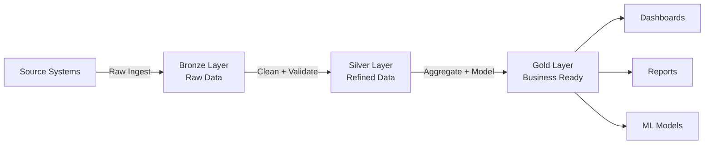

# How to Set Up a Medallion Architecture on BigQuery with Bronze Silver and Gold Data Layers

Author: [nawazdhandala](https://www.github.com/nawazdhandala)

Tags: GCP, BigQuery, Medallion Architecture, Data Engineering, ETL, Data Warehouse

Description: A step-by-step guide to implementing the bronze-silver-gold medallion architecture pattern in BigQuery for organized, reliable, and performant data pipelines.

---

The medallion architecture is a data design pattern that organizes your data into three layers - bronze, silver, and gold - each with increasing levels of quality and structure. It has become popular because it is simple to understand, easy to maintain, and scales well. BigQuery is a great fit for this pattern because it handles both the storage and compute for all three layers without needing a separate processing engine. This guide shows how to implement it.

## The Three Layers Explained

Think of the layers as a refinement pipeline:

- Bronze: Raw data, exactly as it arrives from sources. No transformations applied. This is your safety net - if something goes wrong downstream, you can always reprocess from bronze.
- Silver: Cleaned, validated, and standardized data. Duplicates removed, data types corrected, schemas enforced. This is your "single source of truth."
- Gold: Business-level aggregates and models optimized for specific use cases. Dashboards, reports, and ML features read from gold.



## Step 1: Create the Dataset Structure

Organize your BigQuery datasets to reflect the medallion layers:

```sql
-- Create datasets for each layer
-- Bronze: Raw ingested data
CREATE SCHEMA IF NOT EXISTS `my-project.bronze`
OPTIONS (
  location = 'us-central1',
  description = 'Raw data layer - source data with minimal transformation',
  default_table_expiration_days = 365,
  labels = [('layer', 'bronze')]
);

-- Silver: Cleaned and validated data
CREATE SCHEMA IF NOT EXISTS `my-project.silver`
OPTIONS (
  location = 'us-central1',
  description = 'Refined data layer - cleaned, validated, deduplicated',
  labels = [('layer', 'silver')]
);

-- Gold: Business-ready aggregates
CREATE SCHEMA IF NOT EXISTS `my-project.gold`
OPTIONS (
  location = 'us-central1',
  description = 'Business layer - aggregated and modeled for consumption',
  labels = [('layer', 'gold')]
);
```

## Step 2: Implement the Bronze Layer

The bronze layer should capture everything with minimal processing. Add metadata columns to track lineage:

```sql
-- Bronze table for order events
CREATE OR REPLACE TABLE `my-project.bronze.orders_raw`
(
  -- Original source columns stored as strings to avoid ingestion failures
  raw_payload STRING OPTIONS(description='Original JSON payload from source'),
  -- Metadata columns added during ingestion
  _source_system STRING OPTIONS(description='System that produced this record'),
  _ingestion_timestamp TIMESTAMP DEFAULT CURRENT_TIMESTAMP() OPTIONS(description='When this record was ingested'),
  _source_file STRING OPTIONS(description='Source file or stream name'),
  _batch_id STRING OPTIONS(description='Batch identifier for this load')
)
PARTITION BY DATE(_ingestion_timestamp)
OPTIONS (
  description = 'Raw order events from the orders service. No transformations applied.',
  labels = [('source', 'orders-service'), ('freshness', 'streaming')]
);
```

Load data into bronze from various sources:

```sql
-- Load from Cloud Storage (batch ingestion)
LOAD DATA INTO `my-project.bronze.orders_raw`
(raw_payload, _source_system, _source_file, _batch_id)
FROM FILES (
  format = 'JSON',
  uris = ['gs://my-project-data-landing/orders/2026/02/17/*.json']
)
WITH CONNECTION `us-central1.my-connection`;
```

For streaming ingestion, use the BigQuery Storage Write API or Pub/Sub to BigQuery subscription:

```bash
# Create a Pub/Sub subscription that writes directly to BigQuery
gcloud pubsub subscriptions create orders-to-bronze \
  --topic=order-events \
  --bigquery-table=my-project:bronze.orders_raw \
  --write-metadata \
  --use-topic-schema
```

## Step 3: Build the Silver Layer

The silver layer is where the real work happens. Use scheduled queries or dbt models to transform bronze data:

```sql
-- Silver table with proper schema and data types
CREATE OR REPLACE TABLE `my-project.silver.orders`
(
  order_id STRING NOT NULL OPTIONS(description='Unique order identifier'),
  customer_id STRING NOT NULL OPTIONS(description='Customer who placed the order'),
  order_date DATE NOT NULL OPTIONS(description='Date the order was placed'),
  status STRING NOT NULL OPTIONS(description='Current order status'),
  total_amount NUMERIC OPTIONS(description='Order total in USD'),
  item_count INT64 OPTIONS(description='Number of items in the order'),
  shipping_address STRUCT<
    street STRING,
    city STRING,
    state STRING,
    zip STRING,
    country STRING
  > OPTIONS(description='Shipping address details'),
  created_at TIMESTAMP OPTIONS(description='Original creation time from source'),
  updated_at TIMESTAMP OPTIONS(description='Last update time from source'),
  _processed_at TIMESTAMP DEFAULT CURRENT_TIMESTAMP() OPTIONS(description='When this record was processed into silver')
)
PARTITION BY order_date
CLUSTER BY status, customer_id
OPTIONS (
  description = 'Cleaned and validated orders. Deduplicated by order_id, latest version kept.'
);

-- Scheduled query to process bronze into silver (runs every hour)
-- This uses MERGE for idempotent processing
MERGE INTO `my-project.silver.orders` AS target
USING (
  -- Parse the raw JSON payload and apply cleaning rules
  WITH parsed AS (
    SELECT
      JSON_VALUE(raw_payload, '$.order_id') AS order_id,
      JSON_VALUE(raw_payload, '$.customer_id') AS customer_id,
      SAFE.PARSE_DATE('%Y-%m-%d', JSON_VALUE(raw_payload, '$.order_date')) AS order_date,
      LOWER(TRIM(JSON_VALUE(raw_payload, '$.status'))) AS status,
      SAFE_CAST(JSON_VALUE(raw_payload, '$.total_amount') AS NUMERIC) AS total_amount,
      SAFE_CAST(JSON_VALUE(raw_payload, '$.item_count') AS INT64) AS item_count,
      STRUCT(
        JSON_VALUE(raw_payload, '$.shipping.street') AS street,
        JSON_VALUE(raw_payload, '$.shipping.city') AS city,
        JSON_VALUE(raw_payload, '$.shipping.state') AS state,
        JSON_VALUE(raw_payload, '$.shipping.zip') AS zip,
        JSON_VALUE(raw_payload, '$.shipping.country') AS country
      ) AS shipping_address,
      SAFE.PARSE_TIMESTAMP('%Y-%m-%dT%H:%M:%S', JSON_VALUE(raw_payload, '$.created_at')) AS created_at,
      SAFE.PARSE_TIMESTAMP('%Y-%m-%dT%H:%M:%S', JSON_VALUE(raw_payload, '$.updated_at')) AS updated_at,
      _ingestion_timestamp,
      -- Use row_number to keep only the latest version of each order
      ROW_NUMBER() OVER (
        PARTITION BY JSON_VALUE(raw_payload, '$.order_id')
        ORDER BY _ingestion_timestamp DESC
      ) AS rn
    FROM `my-project.bronze.orders_raw`
    WHERE DATE(_ingestion_timestamp) >= DATE_SUB(CURRENT_DATE(), INTERVAL 1 DAY)
      AND JSON_VALUE(raw_payload, '$.order_id') IS NOT NULL
  )
  SELECT * EXCEPT(rn, _ingestion_timestamp)
  FROM parsed
  WHERE rn = 1
    AND order_date IS NOT NULL
    AND total_amount > 0
) AS source
ON target.order_id = source.order_id
WHEN MATCHED AND source.updated_at > target.updated_at THEN
  UPDATE SET
    status = source.status,
    total_amount = source.total_amount,
    item_count = source.item_count,
    shipping_address = source.shipping_address,
    updated_at = source.updated_at,
    _processed_at = CURRENT_TIMESTAMP()
WHEN NOT MATCHED THEN
  INSERT ROW;
```

## Step 4: Build the Gold Layer

Gold tables are purpose-built for specific consumers. Here are a few common patterns:

```sql
-- Gold: Daily order metrics for the executive dashboard
CREATE OR REPLACE TABLE `my-project.gold.daily_order_metrics`
PARTITION BY order_date
AS
SELECT
  order_date,
  COUNT(*) AS total_orders,
  SUM(total_amount) AS total_revenue,
  AVG(total_amount) AS avg_order_value,
  APPROX_QUANTILES(total_amount, 100)[OFFSET(50)] AS median_order_value,
  COUNTIF(status = 'delivered') AS delivered_count,
  COUNTIF(status = 'cancelled') AS cancelled_count,
  SAFE_DIVIDE(COUNTIF(status = 'cancelled'), COUNT(*)) AS cancellation_rate,
  SUM(item_count) AS total_items_sold
FROM `my-project.silver.orders`
GROUP BY order_date;

-- Gold: Customer lifetime value for the marketing team
CREATE OR REPLACE TABLE `my-project.gold.customer_ltv`
CLUSTER BY customer_segment
AS
SELECT
  customer_id,
  COUNT(*) AS total_orders,
  SUM(total_amount) AS lifetime_value,
  MIN(order_date) AS first_order_date,
  MAX(order_date) AS last_order_date,
  DATE_DIFF(MAX(order_date), MIN(order_date), DAY) AS customer_tenure_days,
  AVG(total_amount) AS avg_order_value,
  CASE
    WHEN SUM(total_amount) >= 10000 THEN 'platinum'
    WHEN SUM(total_amount) >= 5000 THEN 'gold'
    WHEN SUM(total_amount) >= 1000 THEN 'silver'
    ELSE 'bronze'
  END AS customer_segment
FROM `my-project.silver.orders`
WHERE status != 'cancelled'
GROUP BY customer_id;
```

## Step 5: Set Up Scheduling

Use BigQuery scheduled queries to keep each layer fresh:

```bash
# Schedule bronze-to-silver transformation (runs hourly)
bq query --use_legacy_sql=false \
  --schedule="every 1 hours" \
  --display_name="Bronze to Silver: Orders" \
  --destination_table="" \
  "$(cat silver_transform.sql)"

# Schedule silver-to-gold aggregation (runs daily)
bq query --use_legacy_sql=false \
  --schedule="every 24 hours" \
  --display_name="Silver to Gold: Daily Metrics" \
  --destination_table="my-project:gold.daily_order_metrics" \
  --replace \
  "$(cat gold_metrics.sql)"
```

## Step 6: Implement Data Quality Checks

Add quality checks between layers to catch issues early:

```sql
-- Quality check: Verify silver layer data quality after each refresh
-- Store results in a monitoring table
INSERT INTO `my-project.silver._data_quality_log` (check_name, check_time, status, details)

SELECT 'null_check_order_id' AS check_name, CURRENT_TIMESTAMP(),
  CASE WHEN cnt > 0 THEN 'FAIL' ELSE 'PASS' END,
  FORMAT('Found %d null order_ids', cnt)
FROM (SELECT COUNT(*) cnt FROM `my-project.silver.orders` WHERE order_id IS NULL)

UNION ALL

SELECT 'row_count_check', CURRENT_TIMESTAMP(),
  CASE WHEN cnt < 100 THEN 'WARN' ELSE 'PASS' END,
  FORMAT('Silver orders has %d rows for today', cnt)
FROM (SELECT COUNT(*) cnt FROM `my-project.silver.orders` WHERE order_date = CURRENT_DATE())

UNION ALL

SELECT 'freshness_check', CURRENT_TIMESTAMP(),
  CASE WHEN age_hours > 2 THEN 'FAIL' ELSE 'PASS' END,
  FORMAT('Latest record is %d hours old', age_hours)
FROM (
  SELECT TIMESTAMP_DIFF(CURRENT_TIMESTAMP(), MAX(_processed_at), HOUR) AS age_hours
  FROM `my-project.silver.orders`
);
```

## Access Control by Layer

Apply different access controls to each layer:

```bash
# Bronze: Only the data engineering team can access
bq add-iam-policy-binding --member="group:data-engineering@company.com" \
  --role="roles/bigquery.dataEditor" my-project:bronze

# Silver: Data engineers can edit, analysts can read
bq add-iam-policy-binding --member="group:data-analysts@company.com" \
  --role="roles/bigquery.dataViewer" my-project:silver

# Gold: Everyone in the data org can read
bq add-iam-policy-binding --member="group:data-org@company.com" \
  --role="roles/bigquery.dataViewer" my-project:gold
```

## Why This Pattern Works

The medallion architecture works because each layer has a clear purpose and boundary. When an upstream source changes format, only the bronze-to-silver transformation needs updating. When the business needs a new metric, you add a gold table without touching the silver layer. When something goes wrong, you can trace the data lineage from gold back to bronze and find exactly where the issue occurred.

On BigQuery specifically, this pattern is cost-effective because you are not running a separate processing cluster. The transformations are just SQL queries, and BigQuery handles the compute. Partitioning by date at each layer means you only process and scan recent data during incremental refreshes, keeping costs predictable.

Start with a small number of source tables and expand gradually. The pattern becomes more valuable as your data ecosystem grows and more teams rely on the gold layer outputs.
