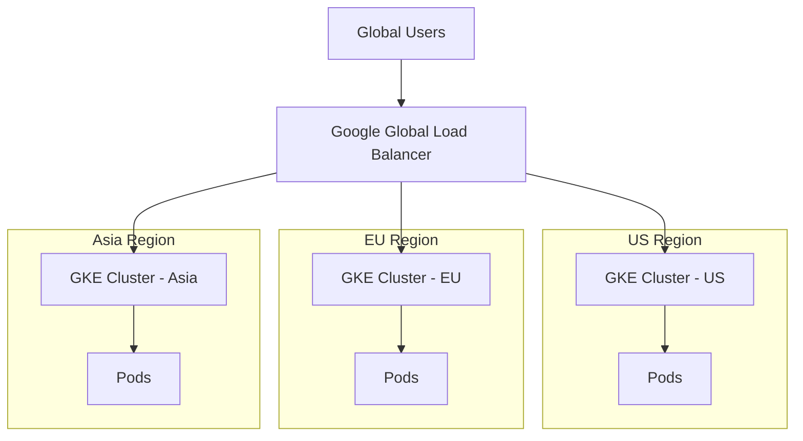

# How to Set Up a Multi-Cluster GKE Ingress for Cross-Region Load Balancing

Author: [nawazdhandala](https://www.github.com/nawazdhandala)

Tags: GCP, GKE, Kubernetes, Multi-Cluster, Load Balancing, High Availability

Description: Learn how to configure Multi-Cluster Ingress on GKE to distribute traffic across clusters in different regions for global load balancing and high availability.

---

Running a single GKE cluster in one region works until it does not. Regional outages happen, and when your one cluster goes down, your entire application goes with it. Multi-Cluster Ingress (MCI) solves this by placing a global Google Cloud Load Balancer in front of multiple GKE clusters across different regions. Traffic is automatically routed to the nearest healthy cluster, giving you both lower latency and higher availability.

I set this up for a service that needed 99.99% uptime, and the failover behavior during a simulated regional outage was exactly what we needed - automatic, fast, and transparent to users. Let me walk through the setup.

## Architecture Overview

Multi-Cluster Ingress uses a global HTTP(S) load balancer that routes to backends in multiple GKE clusters.



Users in the US hit the US cluster, EU users hit the EU cluster, and Asian users hit the Asia cluster. If any cluster goes down, traffic automatically shifts to the remaining healthy clusters.

## Prerequisites

Multi-Cluster Ingress requires GKE Enterprise (formerly Anthos). You also need:

- Multiple GKE clusters in different regions
- Fleet membership for each cluster
- The Hub and Multi-Cluster Ingress APIs enabled

```bash
# Enable required APIs
gcloud services enable \
  gkehub.googleapis.com \
  multiclusteringress.googleapis.com \
  multiclusterservicediscovery.googleapis.com \
  container.googleapis.com \
  trafficdirector.googleapis.com
```

## Step 1: Create GKE Clusters in Multiple Regions

Create clusters in at least two regions.

```bash
# Create the US cluster
gcloud container clusters create cluster-us \
  --region us-central1 \
  --num-nodes 3 \
  --workload-pool YOUR_PROJECT_ID.svc.id.goog

# Create the EU cluster
gcloud container clusters create cluster-eu \
  --region europe-west1 \
  --num-nodes 3 \
  --workload-pool YOUR_PROJECT_ID.svc.id.goog

# Create the Asia cluster
gcloud container clusters create cluster-asia \
  --region asia-southeast1 \
  --num-nodes 3 \
  --workload-pool YOUR_PROJECT_ID.svc.id.goog
```

## Step 2: Register Clusters with the Fleet

Register each cluster as a fleet member.

```bash
# Register the US cluster
gcloud container fleet memberships register cluster-us \
  --gke-cluster us-central1/cluster-us \
  --enable-workload-identity

# Register the EU cluster
gcloud container fleet memberships register cluster-eu \
  --gke-cluster europe-west1/cluster-eu \
  --enable-workload-identity

# Register the Asia cluster
gcloud container fleet memberships register cluster-asia \
  --gke-cluster asia-southeast1/cluster-asia \
  --enable-workload-identity

# Verify all memberships
gcloud container fleet memberships list
```

## Step 3: Enable Multi-Cluster Ingress

Enable MCI and designate a config cluster. The config cluster is where you create the MultiClusterIngress and MultiClusterService resources that control the global load balancer.

```bash
# Enable Multi-Cluster Ingress with cluster-us as the config cluster
gcloud container fleet ingress enable \
  --config-membership cluster-us \
  --location us-central1
```

The config cluster is special - it hosts the MCI control plane resources. Pick a cluster in your primary region.

## Step 4: Deploy Your Application to All Clusters

Deploy the same application across all clusters. You can use Config Sync or just apply manifests to each cluster.

```yaml
# deployment.yaml - Deploy to each cluster
apiVersion: apps/v1
kind: Deployment
metadata:
  name: web-app
  namespace: default
spec:
  replicas: 3
  selector:
    matchLabels:
      app: web-app
  template:
    metadata:
      labels:
        app: web-app
    spec:
      containers:
        - name: web-app
          image: us-docker.pkg.dev/YOUR_PROJECT_ID/my-repo/web-app:latest
          ports:
            - containerPort: 8080
          readinessProbe:
            httpGet:
              path: /healthz
              port: 8080
            initialDelaySeconds: 10
            periodSeconds: 5
          resources:
            requests:
              cpu: "250m"
              memory: "256Mi"
```

```bash
# Deploy to each cluster by switching contexts
gcloud container clusters get-credentials cluster-us --region us-central1
kubectl apply -f deployment.yaml

gcloud container clusters get-credentials cluster-eu --region europe-west1
kubectl apply -f deployment.yaml

gcloud container clusters get-credentials cluster-asia --region asia-southeast1
kubectl apply -f deployment.yaml
```

## Step 5: Create the MultiClusterService

The MultiClusterService (MCS) resource tells the load balancer how to reach your application across clusters. Apply this to the config cluster only.

```yaml
# multi-cluster-service.yaml - Defines the cross-cluster backend
apiVersion: networking.gke.io/v1
kind: MultiClusterService
metadata:
  name: web-app-mcs
  namespace: default
spec:
  template:
    spec:
      selector:
        app: web-app
      ports:
        - name: http
          protocol: TCP
          port: 8080
          targetPort: 8080
  clusters:
    # List the clusters that should receive traffic
    - link: "us-central1/cluster-us"
    - link: "europe-west1/cluster-eu"
    - link: "asia-southeast1/cluster-asia"
```

```bash
# Switch to the config cluster and apply
gcloud container clusters get-credentials cluster-us --region us-central1
kubectl apply -f multi-cluster-service.yaml
```

## Step 6: Create the MultiClusterIngress

The MultiClusterIngress resource creates the global load balancer.

```yaml
# multi-cluster-ingress.yaml - Global load balancer configuration
apiVersion: networking.gke.io/v1
kind: MultiClusterIngress
metadata:
  name: web-app-mci
  namespace: default
  annotations:
    # Reserve and use a static IP
    networking.gke.io/static-ip: web-app-global-ip
    # Enable CDN for static content (optional)
    # networking.gke.io/frontend-config: cdn-config
spec:
  template:
    spec:
      backend:
        serviceName: web-app-mcs
        servicePort: 8080
      rules:
        - host: "app.example.com"
          http:
            paths:
              - path: /
                pathType: Prefix
                backend:
                  serviceName: web-app-mcs
                  servicePort: 8080
```

```bash
# Reserve a global static IP
gcloud compute addresses create web-app-global-ip --global

# Apply the MultiClusterIngress to the config cluster
kubectl apply -f multi-cluster-ingress.yaml
```

## Step 7: Configure DNS

Point your domain to the global static IP.

```bash
# Get the reserved IP
gcloud compute addresses describe web-app-global-ip --global --format "value(address)"

# Create a DNS A record:
# app.example.com -> <GLOBAL_IP>
```

## Verifying the Setup

Check that everything is working.

```bash
# Check MultiClusterIngress status
kubectl describe multiclusteringress web-app-mci

# Check MultiClusterService status
kubectl describe multiclusterservice web-app-mcs

# Verify the load balancer was created
gcloud compute forwarding-rules list --global

# Test from different regions
curl -H "Host: app.example.com" http://GLOBAL_IP/healthz
```

## Health Checks and Failover

The global load balancer continuously health-checks backends in all regions. If a cluster fails health checks, traffic is automatically redirected to healthy clusters.

```bash
# Simulate a regional failure by scaling down one cluster
gcloud container clusters get-credentials cluster-eu --region europe-west1
kubectl scale deployment web-app --replicas=0

# Traffic to EU users will now route to the next closest healthy cluster
# (US or Asia depending on geographic proximity)

# Restore the EU cluster
kubectl scale deployment web-app --replicas=3
```

Failover typically happens within 30-60 seconds after health checks fail.

## Adding SSL/TLS

Add Google-managed certificates for HTTPS.

```yaml
# Update the MultiClusterIngress with SSL
apiVersion: networking.gke.io/v1
kind: MultiClusterIngress
metadata:
  name: web-app-mci
  namespace: default
  annotations:
    networking.gke.io/static-ip: web-app-global-ip
    networking.gke.io/pre-shared-certs: "web-app-ssl-cert"
spec:
  template:
    spec:
      rules:
        - host: "app.example.com"
          http:
            paths:
              - path: /
                pathType: Prefix
                backend:
                  serviceName: web-app-mcs
                  servicePort: 8080
```

```bash
# Create a managed SSL certificate
gcloud compute ssl-certificates create web-app-ssl-cert \
  --domains app.example.com \
  --global
```

## Monitoring Multi-Cluster Traffic

Monitor traffic distribution across regions.

```bash
# View backend health across all regions
gcloud compute backend-services get-health BACKEND_SERVICE_NAME --global

# Check load balancer metrics in Cloud Monitoring
# Navigate to: Monitoring > Dashboards > Load Balancing
```

You can also set up alerts for when a backend in any region becomes unhealthy.

## Cost Considerations

Multi-Cluster Ingress costs include:

- GKE Enterprise license (per vCPU per cluster)
- Global load balancer forwarding rules
- Cross-region data transfer
- Compute in each region

The cross-region data transfer is the one to watch. If your clusters need to communicate with each other (not just serve traffic independently), the cross-region bandwidth charges add up.

## Wrapping Up

Multi-Cluster Ingress on GKE gives you global load balancing with automatic failover across regions. Users get routed to the nearest healthy cluster for low latency, and if any region goes down, traffic seamlessly shifts to other regions. The setup requires GKE Enterprise and a bit of upfront work to register clusters and deploy applications across regions, but the availability improvement is significant. For any service that needs to survive regional outages or serve a global user base with low latency, this is the right architecture.
