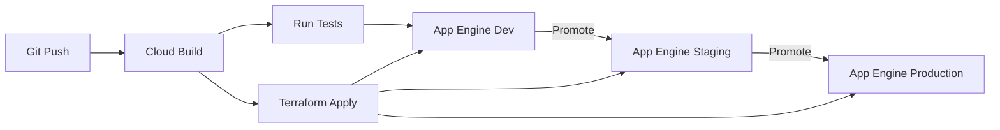

# How to Set Up a Multi-Environment CI/CD Pipeline for App Engine Using Cloud Build and Terraform

Author: [nawazdhandala](https://www.github.com/nawazdhandala)

Tags: GCP, App Engine, Cloud Build, Terraform, CI/CD

Description: Learn how to set up a multi-environment CI/CD pipeline for Google App Engine applications using Cloud Build and Terraform for infrastructure management.

---

App Engine is one of the simplest ways to deploy web applications on GCP, but managing multiple environments - dev, staging, production - requires some planning. You need consistent infrastructure across environments, automated deployments, and proper promotion workflows.

In this post, I will show you how to combine Cloud Build for CI/CD with Terraform for infrastructure management to create a pipeline that deploys App Engine applications across multiple environments reliably.

## Architecture Overview



Each environment is a separate GCP project, which gives you clean isolation for billing, IAM, and resource management.

## Step 1: Define Infrastructure with Terraform

Create a Terraform configuration that manages your App Engine setup across environments:

```hcl
# terraform/variables.tf
variable "project_id" {
  description = "GCP project ID"
  type        = string
}

variable "environment" {
  description = "Environment name (dev, staging, production)"
  type        = string
}

variable "region" {
  description = "GCP region for App Engine"
  type        = string
  default     = "us-central"
}

variable "app_version" {
  description = "Application version to deploy"
  type        = string
  default     = "latest"
}

# Scaling configuration per environment
variable "scaling_config" {
  type = map(object({
    min_instances = number
    max_instances = number
    target_cpu    = number
  }))
  default = {
    dev = {
      min_instances = 0
      max_instances = 2
      target_cpu    = 0.8
    }
    staging = {
      min_instances = 1
      max_instances = 5
      target_cpu    = 0.7
    }
    production = {
      min_instances = 2
      max_instances = 20
      target_cpu    = 0.6
    }
  }
}
```

```hcl
# terraform/main.tf
provider "google" {
  project = var.project_id
  region  = var.region
}

# Enable required APIs
resource "google_project_service" "appengine" {
  service = "appengine.googleapis.com"
}

resource "google_project_service" "cloudbuild" {
  service = "cloudbuild.googleapis.com"
}

# App Engine application
resource "google_app_engine_application" "app" {
  project     = var.project_id
  location_id = var.region

  depends_on = [google_project_service.appengine]
}

# Cloud SQL instance for the application
resource "google_sql_database_instance" "main" {
  name             = "app-db-${var.environment}"
  database_version = "POSTGRES_15"
  region           = "${var.region}1"

  settings {
    tier = var.environment == "production" ? "db-custom-2-8192" : "db-f1-micro"

    backup_configuration {
      enabled    = var.environment == "production" ? true : false
      start_time = "02:00"
    }

    ip_configuration {
      ipv4_enabled = false
    }
  }
}

resource "google_sql_database" "app_db" {
  name     = "app"
  instance = google_sql_database_instance.main.name
}

# Secret Manager for environment-specific secrets
resource "google_secret_manager_secret" "db_password" {
  secret_id = "db-password"

  replication {
    auto {}
  }
}

# Firewall and security rules
resource "google_app_engine_firewall_rule" "default" {
  # In production, restrict to known IPs
  # In dev/staging, allow all for easier testing
  priority     = 1000
  action       = "ALLOW"
  source_range = var.environment == "production" ? "0.0.0.0/0" : "*"
}
```

Create environment-specific variable files:

```hcl
# terraform/environments/dev.tfvars
project_id  = "my-app-dev"
environment = "dev"
region      = "us-central"

# terraform/environments/staging.tfvars
project_id  = "my-app-staging"
environment = "staging"
region      = "us-central"

# terraform/environments/production.tfvars
project_id  = "my-app-production"
environment = "production"
region      = "us-central"
```

## Step 2: Create the App Engine Configuration

Set up App Engine service configuration:

```yaml
# app.yaml - Base App Engine configuration
runtime: python311
instance_class: F2

env_variables:
  ENVIRONMENT: "${ENVIRONMENT}"

automatic_scaling:
  min_instances: ${MIN_INSTANCES}
  max_instances: ${MAX_INSTANCES}
  target_cpu_utilization: ${TARGET_CPU}
  min_pending_latency: 30ms
  max_pending_latency: automatic

vpc_access_connector:
  name: projects/${PROJECT_ID}/locations/${REGION}/connectors/app-connector

handlers:
  - url: /static
    static_dir: static
    secure: always
  - url: /.*
    script: auto
    secure: always

readiness_check:
  path: "/health"
  check_interval_sec: 5
  timeout_sec: 4
  failure_threshold: 2
  success_threshold: 2
```

Create a script that generates environment-specific app.yaml:

```bash
#!/bin/bash
# generate-app-yaml.sh - Generate environment-specific app.yaml
# Usage: ./generate-app-yaml.sh <environment>

ENVIRONMENT=$1

case $ENVIRONMENT in
  dev)
    MIN_INSTANCES=0
    MAX_INSTANCES=2
    TARGET_CPU=0.8
    PROJECT_ID="my-app-dev"
    ;;
  staging)
    MIN_INSTANCES=1
    MAX_INSTANCES=5
    TARGET_CPU=0.7
    PROJECT_ID="my-app-staging"
    ;;
  production)
    MIN_INSTANCES=2
    MAX_INSTANCES=20
    TARGET_CPU=0.6
    PROJECT_ID="my-app-production"
    ;;
  *)
    echo "Unknown environment: $ENVIRONMENT"
    exit 1
    ;;
esac

REGION="us-central1"

# Replace template variables in app.yaml
sed -e "s/\${ENVIRONMENT}/$ENVIRONMENT/g" \
    -e "s/\${MIN_INSTANCES}/$MIN_INSTANCES/g" \
    -e "s/\${MAX_INSTANCES}/$MAX_INSTANCES/g" \
    -e "s/\${TARGET_CPU}/$TARGET_CPU/g" \
    -e "s/\${PROJECT_ID}/$PROJECT_ID/g" \
    -e "s/\${REGION}/$REGION/g" \
    app.yaml.template > app.yaml

echo "Generated app.yaml for $ENVIRONMENT"
```

## Step 3: Create the Cloud Build Pipeline

Build a multi-stage pipeline that handles testing, infrastructure, and deployment:

```yaml
# cloudbuild.yaml - Full CI/CD pipeline
steps:
  # Stage 1: Run tests
  - name: 'python:3.11'
    entrypoint: 'bash'
    args:
      - '-c'
      - |
        pip install -r requirements.txt
        pip install -r requirements-dev.txt
        python -m pytest tests/ -v --tb=short
    id: 'test'

  # Stage 2: Apply infrastructure changes with Terraform
  - name: 'hashicorp/terraform:1.7'
    entrypoint: 'sh'
    args:
      - '-c'
      - |
        cd terraform
        terraform init \
          -backend-config="bucket=${_TF_STATE_BUCKET}" \
          -backend-config="prefix=${_ENVIRONMENT}"
        terraform plan \
          -var-file=environments/${_ENVIRONMENT}.tfvars \
          -out=tfplan
        terraform apply tfplan
    id: 'terraform'
    waitFor: ['test']

  # Stage 3: Generate environment-specific app.yaml
  - name: 'gcr.io/cloud-builders/gcloud'
    entrypoint: 'bash'
    args:
      - '-c'
      - |
        chmod +x generate-app-yaml.sh
        ./generate-app-yaml.sh ${_ENVIRONMENT}
    id: 'generate-config'
    waitFor: ['terraform']

  # Stage 4: Deploy to App Engine
  - name: 'gcr.io/cloud-builders/gcloud'
    args:
      - 'app'
      - 'deploy'
      - 'app.yaml'
      - '--project=${_TARGET_PROJECT}'
      - '--version=${SHORT_SHA}'
      - '--no-promote'
      - '--quiet'
    id: 'deploy'
    waitFor: ['generate-config']

  # Stage 5: Run smoke tests against the new version
  - name: 'python:3.11'
    entrypoint: 'bash'
    args:
      - '-c'
      - |
        VERSION_URL="https://${SHORT_SHA}-dot-${_TARGET_PROJECT}.appspot.com"
        echo "Testing: $VERSION_URL"

        pip install requests
        python -c "
        import requests
        import sys
        r = requests.get('$VERSION_URL/health', timeout=30)
        if r.status_code == 200:
            print('Health check passed')
        else:
            print(f'Health check failed: {r.status_code}')
            sys.exit(1)
        "
    id: 'smoke-test'
    waitFor: ['deploy']

  # Stage 6: Promote the new version to serve traffic
  - name: 'gcr.io/cloud-builders/gcloud'
    args:
      - 'app'
      - 'services'
      - 'set-traffic'
      - 'default'
      - '--splits=${SHORT_SHA}=1'
      - '--project=${_TARGET_PROJECT}'
      - '--quiet'
    id: 'promote'
    waitFor: ['smoke-test']

substitutions:
  _ENVIRONMENT: dev
  _TARGET_PROJECT: my-app-dev
  _TF_STATE_BUCKET: my-terraform-state
```

## Step 4: Create Triggers for Each Environment

```bash
# Dev trigger - runs on every push to main
gcloud builds triggers create github \
  --name="deploy-dev" \
  --repo-name=my-app \
  --repo-owner=my-org \
  --branch-pattern="^main$" \
  --build-config=cloudbuild.yaml \
  --substitutions="_ENVIRONMENT=dev,_TARGET_PROJECT=my-app-dev"

# Staging trigger - manual or tag-based
gcloud builds triggers create github \
  --name="deploy-staging" \
  --repo-name=my-app \
  --repo-owner=my-org \
  --tag-pattern="^v[0-9]+\.[0-9]+\.[0-9]+-rc.*$" \
  --build-config=cloudbuild.yaml \
  --substitutions="_ENVIRONMENT=staging,_TARGET_PROJECT=my-app-staging"

# Production trigger - manual approval required
gcloud builds triggers create github \
  --name="deploy-production" \
  --repo-name=my-app \
  --repo-owner=my-org \
  --tag-pattern="^v[0-9]+\.[0-9]+\.[0-9]+$" \
  --build-config=cloudbuild.yaml \
  --substitutions="_ENVIRONMENT=production,_TARGET_PROJECT=my-app-production" \
  --require-approval
```

## Step 5: Implement Rollback

App Engine keeps previous versions, so rollback is straightforward:

```bash
# List recent versions
gcloud app versions list --project=my-app-production --limit=5

# Roll back to a specific version
gcloud app services set-traffic default \
  --splits=PREVIOUS_VERSION=1 \
  --project=my-app-production

# Or use Cloud Build for automated rollback
gcloud builds triggers run deploy-production \
  --substitutions="_ENVIRONMENT=production,_TARGET_PROJECT=my-app-production,SHORT_SHA=PREVIOUS_VERSION"
```

## Wrapping Up

A multi-environment CI/CD pipeline for App Engine with Cloud Build and Terraform gives you repeatable, auditable deployments across dev, staging, and production. Terraform manages the infrastructure consistently, Cloud Build handles the build-test-deploy cycle, and App Engine's built-in versioning gives you easy rollback.

The key is keeping environments as similar as possible (same Terraform modules, different variables) and always deploying with `--no-promote` first so you can test before directing traffic. This approach scales well and keeps your deployment process predictable.
