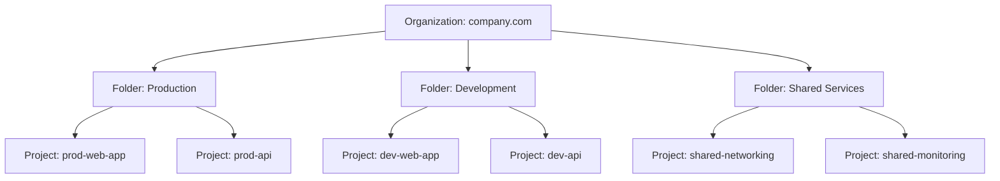

# How to Set Up a New Google Cloud Project with Organization Policies and Folder Hierarchy

Author: [nawazdhandala](https://www.github.com/nawazdhandala)

Tags: GCP, Organization Policies, Resource Hierarchy, Project Setup, Governance, Cloud Foundation

Description: Set up a well-structured Google Cloud project from scratch with proper folder hierarchy, organization policies, and governance controls for production readiness.

---

Setting up a new GCP project the right way from the start saves you from painful restructuring later. I have seen organizations create projects with no folder structure, no naming conventions, and no organization policies - and then spend months untangling the mess when they need to scale. The first project might not matter much, but the patterns you establish early get replicated across dozens or hundreds of projects.

Here is how to set up a new project with proper structure, policies, and governance from day one.

## Understanding the Resource Hierarchy

Every GCP resource exists within a hierarchy:



IAM policies and organization policies inherit downward. A policy set at the organization level applies to every folder and project. A policy set on a folder applies to all projects in that folder.

## Step 1: Design Your Folder Structure

Before creating projects, plan your folder hierarchy. There are two common approaches:

**Environment-based** (recommended for smaller organizations):
```
Organization
  - Production
  - Staging
  - Development
  - Shared Services
```

**Business unit-based** (better for larger organizations):
```
Organization
  - Engineering
    - Production
    - Development
  - Data Science
    - Production
    - Development
  - Shared Infrastructure
```

Create the folders:

```bash
# Get your organization ID
gcloud organizations list

# Create top-level folders
gcloud resource-manager folders create \
  --display-name="Production" \
  --organization=ORGANIZATION_ID

gcloud resource-manager folders create \
  --display-name="Development" \
  --organization=ORGANIZATION_ID

gcloud resource-manager folders create \
  --display-name="Staging" \
  --organization=ORGANIZATION_ID

gcloud resource-manager folders create \
  --display-name="Shared Services" \
  --organization=ORGANIZATION_ID
```

## Step 2: Establish Naming Conventions

Pick a naming convention and stick with it. Here is a pattern that works well:

```
{environment}-{team}-{application}-{random-suffix}
```

Examples:
- `prod-platform-api-a1b2` (production API project)
- `dev-data-pipeline-c3d4` (development data pipeline project)
- `shared-networking-e5f6` (shared networking project)

The random suffix prevents naming collisions since GCP project IDs must be globally unique.

## Step 3: Create the Project

```bash
# Create a new project under the Production folder
gcloud projects create prod-webapp-a1b2 \
  --name="Production Web Application" \
  --folder=PRODUCTION_FOLDER_ID \
  --labels="environment=production,team=platform,app=webapp"

# Link the project to a billing account
gcloud billing projects link prod-webapp-a1b2 \
  --billing-account=BILLING_ACCOUNT_ID

# Enable commonly needed APIs
gcloud services enable \
  compute.googleapis.com \
  container.googleapis.com \
  cloudbuild.googleapis.com \
  monitoring.googleapis.com \
  logging.googleapis.com \
  cloudresourcemanager.googleapis.com \
  iam.googleapis.com \
  --project=prod-webapp-a1b2
```

## Step 4: Set Organization Policies

Organization policies enforce guardrails across your organization. Set these at the organization or folder level so they apply to all projects.

### Restrict Resource Locations

Prevent resources from being created in unapproved regions. This is important for data residency compliance.

```bash
# Restrict resources to US regions only
gcloud resource-manager org-policies set-policy /dev/stdin \
  --organization=ORGANIZATION_ID << 'EOF'
constraint: constraints/gcp.resourceLocations
listPolicy:
  allowedValues:
    - in:us-locations
EOF
```

### Restrict VM External IPs

Production VMs should generally not have external IP addresses. Use Cloud NAT for outbound access instead.

```bash
# Deny external IPs on VMs in the production folder
gcloud resource-manager org-policies set-policy /dev/stdin \
  --folder=PRODUCTION_FOLDER_ID << 'EOF'
constraint: constraints/compute.vmExternalIpAccess
listPolicy:
  allValues: DENY
EOF
```

### Require OS Login

OS Login integrates SSH access with IAM, giving you centralized access control and audit logging.

```bash
# Require OS Login for all Compute Engine instances
gcloud resource-manager org-policies set-policy /dev/stdin \
  --organization=ORGANIZATION_ID << 'EOF'
constraint: constraints/compute.requireOsLogin
booleanPolicy:
  enforced: true
EOF
```

### Restrict Service Account Key Creation

Service account keys are a security risk. Prevent their creation and use Workload Identity instead.

```bash
# Disable service account key creation in production
gcloud resource-manager org-policies set-policy /dev/stdin \
  --folder=PRODUCTION_FOLDER_ID << 'EOF'
constraint: constraints/iam.disableServiceAccountKeyCreation
booleanPolicy:
  enforced: true
EOF
```

### Enforce Uniform Bucket-Level Access

Prevent the use of ACLs on Cloud Storage buckets, which are harder to manage and audit than IAM.

```bash
# Require uniform bucket-level access
gcloud resource-manager org-policies set-policy /dev/stdin \
  --organization=ORGANIZATION_ID << 'EOF'
constraint: constraints/storage.uniformBucketLevelAccess
booleanPolicy:
  enforced: true
EOF
```

### Restrict Allowed IAM Member Domains

Prevent granting access to external email addresses:

```bash
# Only allow IAM members from your organization domain
gcloud resource-manager org-policies set-policy /dev/stdin \
  --organization=ORGANIZATION_ID << 'EOF'
constraint: constraints/iam.allowedPolicyMemberDomains
listPolicy:
  allowedValues:
    - C0xxxxxxx  # Your Cloud Identity customer ID
EOF
```

## Step 5: Set Up Default IAM

Grant roles at the folder level so they automatically apply to new projects:

```bash
# Platform team gets admin access to production projects
gcloud resource-manager folders add-iam-policy-binding PRODUCTION_FOLDER_ID \
  --member="group:platform-team@company.com" \
  --role="roles/editor"

# Developers get viewer access to production (read-only)
gcloud resource-manager folders add-iam-policy-binding PRODUCTION_FOLDER_ID \
  --member="group:developers@company.com" \
  --role="roles/viewer"

# Developers get editor access to development projects
gcloud resource-manager folders add-iam-policy-binding DEVELOPMENT_FOLDER_ID \
  --member="group:developers@company.com" \
  --role="roles/editor"

# Security team gets security reviewer access everywhere
gcloud organizations add-iam-policy-binding ORGANIZATION_ID \
  --member="group:security-team@company.com" \
  --role="roles/iam.securityReviewer"
```

## Step 6: Configure Default Labels

Labels help with cost tracking and resource organization. Establish required labels:

```bash
# Add labels to the project
gcloud projects update prod-webapp-a1b2 \
  --update-labels="environment=production,team=platform,cost-center=eng-001,managed-by=terraform"
```

Create a label policy document that all teams follow:

| Label Key | Required | Values | Purpose |
|-----------|----------|--------|---------|
| environment | Yes | production, staging, development | Environment identification |
| team | Yes | platform, data, frontend, etc. | Team ownership |
| cost-center | Yes | Department code | Billing allocation |
| managed-by | No | terraform, console, gcloud | How the resource is managed |

## Step 7: Set Up Audit Logging

Enable Data Access audit logs for sensitive services:

```bash
# Enable audit logging for the project
gcloud projects set-iam-policy prod-webapp-a1b2 /dev/stdin << 'EOF'
{
  "auditConfigs": [
    {
      "service": "allServices",
      "auditLogConfigs": [
        {"logType": "ADMIN_READ"},
        {"logType": "DATA_WRITE"},
        {"logType": "DATA_READ"}
      ]
    }
  ],
  "bindings": []
}
EOF
```

Export audit logs to a central project for long-term storage:

```bash
# Create a log sink at the organization level to capture all audit logs
gcloud logging sinks create org-audit-sink \
  bigquery.googleapis.com/projects/shared-logging/datasets/audit_logs \
  --organization=ORGANIZATION_ID \
  --log-filter='logName:"cloudaudit.googleapis.com"'
```

## Step 8: Automate with Terraform

For reproducibility, codify your project setup with Terraform:

```hcl
# main.tf - Project factory module
resource "google_project" "production_app" {
  name            = "Production Web Application"
  project_id      = "prod-webapp-a1b2"
  folder_id       = google_folder.production.name
  billing_account = var.billing_account_id

  labels = {
    environment = "production"
    team        = "platform"
    cost_center = "eng-001"
    managed_by  = "terraform"
  }
}

# Enable required APIs
resource "google_project_service" "apis" {
  for_each = toset([
    "compute.googleapis.com",
    "container.googleapis.com",
    "monitoring.googleapis.com",
    "logging.googleapis.com",
  ])

  project = google_project.production_app.project_id
  service = each.value
}

# Organization policy for the production folder
resource "google_org_policy_policy" "restrict_locations" {
  name   = "folders/${google_folder.production.folder_id}/policies/gcp.resourceLocations"
  parent = "folders/${google_folder.production.folder_id}"

  spec {
    rules {
      values {
        allowed_values = ["in:us-locations"]
      }
    }
  }
}
```

## Project Setup Checklist

Use this checklist for every new project:

- [ ] Project created under the correct folder
- [ ] Billing account linked
- [ ] Labels applied (environment, team, cost-center)
- [ ] Required APIs enabled
- [ ] IAM roles granted to appropriate groups
- [ ] Organization policies verified
- [ ] Audit logging enabled
- [ ] Budget alerts configured
- [ ] Default VPC deleted (if using custom networking)

## Wrapping Up

A well-structured GCP project starts with a clear folder hierarchy, enforced organization policies, and consistent naming and labeling conventions. Do this right for the first project, automate it with Terraform, and every subsequent project follows the same pattern. The organization policies act as guardrails that prevent common security mistakes, and the folder-based IAM inheritance reduces the burden of managing access across many projects. Invest the time to set up the foundation properly - it pays for itself many times over as your cloud footprint grows.
