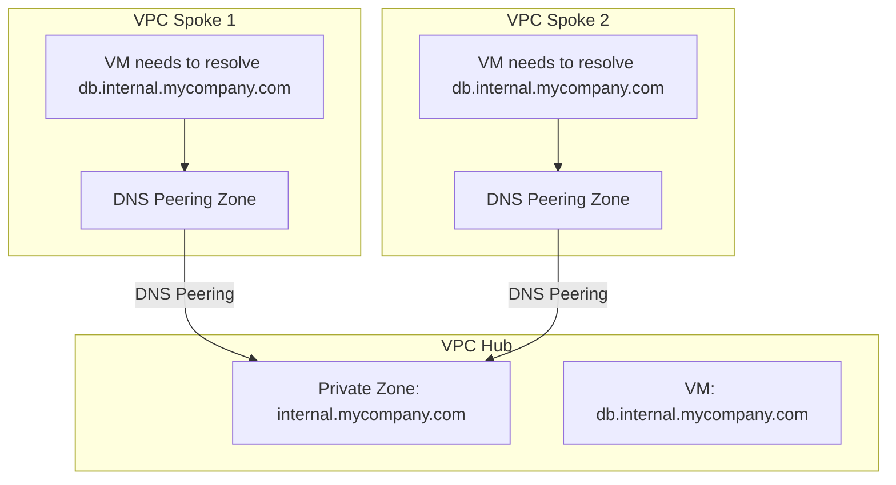

# How to Set Up a Private DNS Zone Visible Only to Specific VPC Networks in GCP

Author: [nawazdhandala](https://www.github.com/nawazdhandala)

Tags: GCP, Cloud DNS, Private DNS, VPC, Internal DNS

Description: Learn how to create and configure private DNS zones in Google Cloud DNS that are only visible to specific VPC networks for internal service discovery and hostname resolution.

---

In any cloud environment of reasonable size, you need a way for internal services to find each other by name. Hardcoding IP addresses is fragile and painful to maintain. Private DNS zones in Google Cloud DNS solve this by letting you create DNS records that are only visible from within specific VPC networks. Your internal services get proper hostnames like `db.internal.mycompany.com` or `api.staging.internal`, and those names are completely invisible from the public internet.

This post covers setting up private DNS zones, scoping them to specific VPCs, handling overlapping zones, and integrating with other GCP services.

## What Is a Private DNS Zone?

A private DNS zone is a Cloud DNS managed zone with `visibility=private`. Unlike public zones that are queryable by anyone on the internet, private zones are only resolvable from VMs within the VPC networks you explicitly authorize.

When a VM in an authorized VPC makes a DNS query that matches a private zone, Cloud DNS responds with the records from that zone. Queries from outside the authorized VPCs get no response (the zone is invisible to them).

## Step 1: Create a Private DNS Zone

```bash
# Create a private DNS zone visible to a specific VPC
gcloud dns managed-zones create internal-zone \
    --dns-name="internal.mycompany.com." \
    --description="Private DNS for internal services" \
    --visibility=private \
    --networks=my-vpc
```

The `--networks` parameter specifies which VPC networks can see this zone. You can list multiple networks:

```bash
# Create a zone visible to multiple VPCs
gcloud dns managed-zones create shared-internal-zone \
    --dns-name="shared.internal." \
    --description="Shared private DNS zone" \
    --visibility=private \
    --networks=vpc-production,vpc-staging,vpc-development
```

## Step 2: Add DNS Records

Adding records to a private zone works exactly the same as a public zone:

```bash
# Add an A record for an internal database
gcloud dns record-sets create db.internal.mycompany.com. \
    --zone=internal-zone \
    --type=A \
    --ttl=300 \
    --rrdatas="10.128.0.50"

# Add an A record for an internal API
gcloud dns record-sets create api.internal.mycompany.com. \
    --zone=internal-zone \
    --type=A \
    --ttl=300 \
    --rrdatas="10.128.0.60"

# Add an A record for a cache server
gcloud dns record-sets create cache.internal.mycompany.com. \
    --zone=internal-zone \
    --type=A \
    --ttl=60 \
    --rrdatas="10.128.0.70"

# Add a CNAME for a service alias
gcloud dns record-sets create redis.internal.mycompany.com. \
    --zone=internal-zone \
    --type=CNAME \
    --ttl=300 \
    --rrdatas="cache.internal.mycompany.com."
```

## Step 3: Test Resolution from a VM

SSH into a VM in one of the authorized VPCs and test:

```bash
# Test DNS resolution from within the VPC
dig db.internal.mycompany.com +short
# Expected: 10.128.0.50

dig api.internal.mycompany.com +short
# Expected: 10.128.0.60

# Verify the zone is not visible from the public internet
# From a machine outside GCP:
dig db.internal.mycompany.com +short
# Expected: no result (NXDOMAIN)
```

## Per-Environment DNS Zones

A common pattern is having separate DNS zones for each environment:

```bash
# Production environment zone
gcloud dns managed-zones create prod-zone \
    --dns-name="prod.internal." \
    --visibility=private \
    --networks=vpc-production

# Staging environment zone
gcloud dns managed-zones create staging-zone \
    --dns-name="staging.internal." \
    --visibility=private \
    --networks=vpc-staging

# Development environment zone
gcloud dns managed-zones create dev-zone \
    --dns-name="dev.internal." \
    --visibility=private \
    --networks=vpc-development
```

Add environment-specific records:

```bash
# Production database
gcloud dns record-sets create db.prod.internal. \
    --zone=prod-zone --type=A --ttl=300 \
    --rrdatas="10.0.1.50"

# Staging database
gcloud dns record-sets create db.staging.internal. \
    --zone=staging-zone --type=A --ttl=300 \
    --rrdatas="10.1.1.50"
```

This way, applications use the same relative name (`db.<env>.internal`) but resolve to different IPs based on the environment.

## Overlapping Zones and Split-Horizon DNS

You can create private zones that overlap with public domains. This is called split-horizon DNS - internal clients see different records than external clients for the same domain name.

```bash
# Create a private zone for a domain you also host publicly
gcloud dns managed-zones create private-example \
    --dns-name="example.com." \
    --visibility=private \
    --networks=my-vpc
```

Now, VMs in `my-vpc` that query `app.example.com` will get the private zone's response instead of the public DNS response. This is useful for:
- Pointing internal clients to internal load balancer IPs
- Blocking access to certain subdomains internally
- Providing internal-only services under your public domain

```bash
# Internal clients see the internal IP for app.example.com
gcloud dns record-sets create app.example.com. \
    --zone=private-example \
    --type=A \
    --ttl=300 \
    --rrdatas="10.128.0.100"
```

External clients querying `app.example.com` see the public IP from the public zone. Internal clients see `10.128.0.100`.

## DNS Peering

If you have multiple VPCs and want to centralize DNS management, use DNS peering. This lets a VPC forward DNS queries to another VPC's DNS:

```bash
# Create a DNS peering zone in vpc-spoke that forwards to vpc-hub
gcloud dns managed-zones create peering-to-hub \
    --dns-name="internal.mycompany.com." \
    --visibility=private \
    --networks=vpc-spoke \
    --target-network=vpc-hub \
    --target-project=hub-project
```

Now VMs in `vpc-spoke` can resolve names from the private zone attached to `vpc-hub`.



## Updating Authorized Networks

To add or remove VPC networks from an existing private zone:

```bash
# Add a new network to the zone
gcloud dns managed-zones update internal-zone \
    --networks=my-vpc,new-vpc

# Note: you must list ALL networks, not just the new one
# This replaces the entire network list
```

This is important: the `--networks` flag replaces the entire list, it does not append. Always include all networks that should have access.

## Private Zones with GKE

GKE clusters automatically have access to private DNS zones in their VPC. You can use private zones for service discovery between GKE clusters and non-GKE services:

```bash
# Create records for GKE-accessible internal services
gcloud dns record-sets create legacy-api.internal.mycompany.com. \
    --zone=internal-zone \
    --type=A \
    --ttl=300 \
    --rrdatas="10.128.0.80"
```

Pods in GKE can resolve `legacy-api.internal.mycompany.com` to reach the legacy API running on a VM.

## Private Zones with Shared VPC

In a Shared VPC setup, create the private zone in the host project and authorize the shared VPC network:

```bash
# Create a private zone in the host project
gcloud dns managed-zones create shared-dns \
    --dns-name="internal.mycompany.com." \
    --visibility=private \
    --networks=projects/host-project/global/networks/shared-vpc \
    --project=host-project
```

VMs in service projects using the shared VPC can resolve names from this zone.

## Automating Record Management

For dynamic environments where IPs change frequently, automate DNS updates:

```bash
#!/bin/bash
# Script to update an internal DNS record when a new instance is created
# This could be triggered by a Cloud Function on instance creation events

INSTANCE_NAME=$1
ZONE_NAME="internal-zone"
DNS_NAME="${INSTANCE_NAME}.internal.mycompany.com."

# Get the instance's internal IP
IP=$(gcloud compute instances describe "$INSTANCE_NAME" \
    --zone=us-central1-a \
    --format="get(networkInterfaces[0].networkIP)")

# Create or update the DNS record
gcloud dns record-sets create "$DNS_NAME" \
    --zone="$ZONE_NAME" \
    --type=A \
    --ttl=60 \
    --rrdatas="$IP" 2>/dev/null || \
gcloud dns record-sets update "$DNS_NAME" \
    --zone="$ZONE_NAME" \
    --type=A \
    --ttl=60 \
    --rrdatas="$IP"

echo "Updated $DNS_NAME -> $IP"
```

## Reverse DNS Zones

You can also create private reverse DNS (PTR) zones for IP-to-name resolution:

```bash
# Create a reverse DNS zone for the 10.128.0.0/24 subnet
gcloud dns managed-zones create reverse-zone \
    --dns-name="0.128.10.in-addr.arpa." \
    --visibility=private \
    --networks=my-vpc

# Add a PTR record
gcloud dns record-sets create 50.0.128.10.in-addr.arpa. \
    --zone=reverse-zone \
    --type=PTR \
    --ttl=300 \
    --rrdatas="db.internal.mycompany.com."
```

## Wrapping Up

Private DNS zones in Cloud DNS are a fundamental building block for any GCP environment. They give your internal services proper hostnames without exposing them to the internet, they support split-horizon DNS for different internal and external resolution, and they integrate well with VPC peering and Shared VPC architectures. Start with a simple internal zone, add records for your services, and expand to environment-specific zones and DNS peering as your infrastructure grows.
