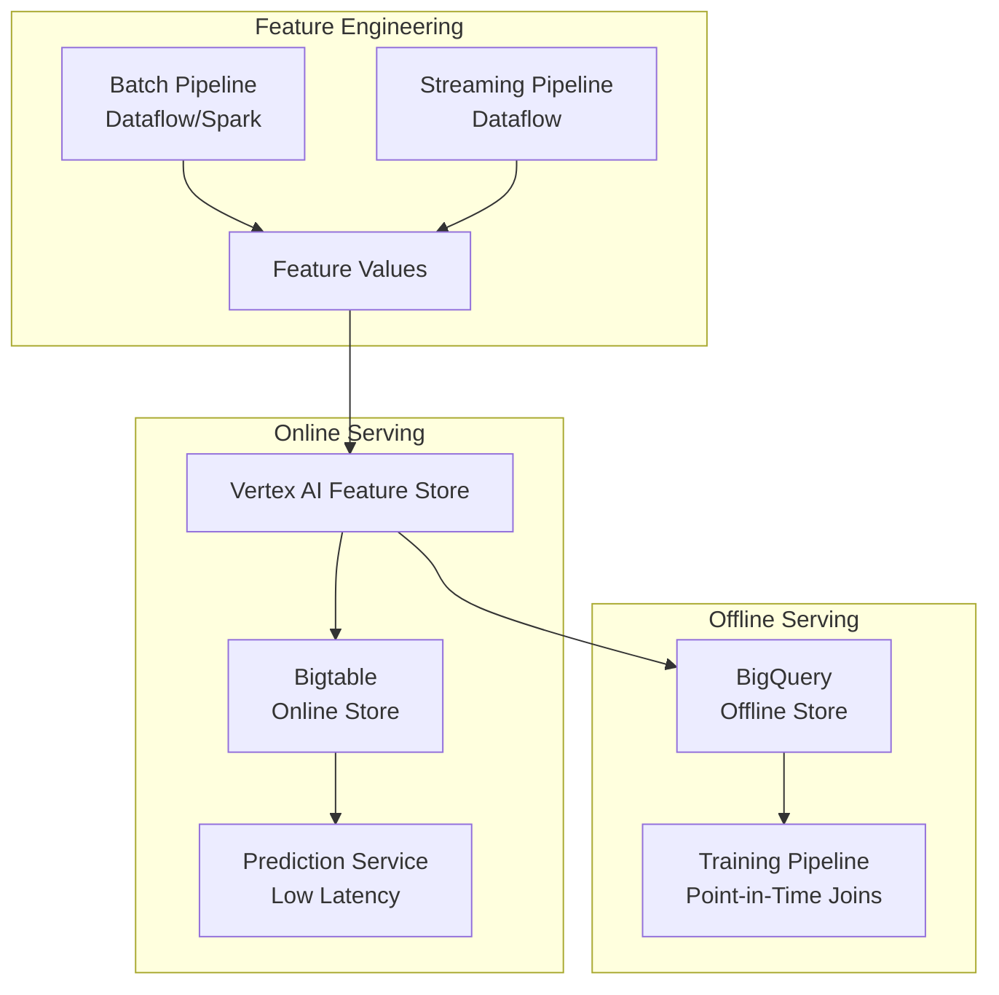

# How to Set Up a Real-Time Feature Store on GCP Using Bigtable and Vertex AI Feature Store

Author: [nawazdhandala](https://www.github.com/nawazdhandala)

Tags: GCP, Vertex AI, Feature Store, Bigtable, Machine Learning, Real-Time ML, MLOps

Description: Learn how to build a real-time feature store on GCP using Bigtable for low-latency serving and Vertex AI Feature Store for feature management, versioning, and offline training.

---

Serving machine learning features in real time is one of those problems that looks simple until you try to build it. Your model needs features with sub-millisecond latency at prediction time, but those same features need to be available in batch for training without introducing training-serving skew. A feature store solves this by providing a single system that handles both. On GCP, you can combine Vertex AI Feature Store for management and offline serving with Bigtable for ultra-low-latency online serving. Here is how to set it up.

## The Feature Store Architecture



## Step 1: Create the Vertex AI Feature Store

Start by creating a feature store instance and defining your feature groups:

```bash
# Enable the required APIs
gcloud services enable aiplatform.googleapis.com
gcloud services enable bigtable.googleapis.com
gcloud services enable bigtableadmin.googleapis.com
```

Create the feature store using the Vertex AI SDK:

```python
# create_feature_store.py - Set up the feature store and feature groups
from google.cloud import aiplatform

# Initialize the Vertex AI client
aiplatform.init(project='my-project', location='us-central1')

# Create a Feature Online Store backed by Bigtable
feature_online_store = aiplatform.FeatureOnlineStore.create(
    name="production-feature-store",
    bigtable=aiplatform.FeatureOnlineStore.Bigtable(
        auto_scaling=aiplatform.FeatureOnlineStore.Bigtable.AutoScaling(
            min_node_count=1,
            max_node_count=5,
            cpu_utilization_target=60,
        )
    ),
)

print(f"Created online store: {feature_online_store.resource_name}")
```

## Step 2: Define Feature Groups and Features

Feature groups organize related features together. Define them based on your entity types:

```python
# define_features.py - Create feature groups for user and product features
from google.cloud import aiplatform
from google.cloud.aiplatform import FeatureGroup

aiplatform.init(project='my-project', location='us-central1')

# Create a feature group for user features
# The source is a BigQuery table that contains the feature values
user_feature_group = FeatureGroup.create(
    name="user_features",
    source=FeatureGroup.BigQuery(
        uri="bq://my-project.features.user_features",
        entity_id_columns=["user_id"],
    ),
    description="User behavioral and demographic features",
)

# Register individual features within the group
user_feature_group.create_feature(
    name="total_orders_30d",
    description="Total number of orders in the last 30 days",
    value_type="INT64",
)

user_feature_group.create_feature(
    name="avg_order_value_30d",
    description="Average order value in the last 30 days",
    value_type="DOUBLE",
)

user_feature_group.create_feature(
    name="days_since_last_order",
    description="Number of days since the customer last ordered",
    value_type="INT64",
)

user_feature_group.create_feature(
    name="customer_segment",
    description="Customer segment: platinum, gold, silver, bronze",
    value_type="STRING",
)

print(f"Created feature group: {user_feature_group.resource_name}")

# Create a feature group for product features
product_feature_group = FeatureGroup.create(
    name="product_features",
    source=FeatureGroup.BigQuery(
        uri="bq://my-project.features.product_features",
        entity_id_columns=["product_id"],
    ),
    description="Product catalog and performance features",
)

product_feature_group.create_feature(
    name="avg_rating",
    description="Average product rating from reviews",
    value_type="DOUBLE",
)

product_feature_group.create_feature(
    name="total_purchases_7d",
    description="Total purchases in the last 7 days",
    value_type="INT64",
)

product_feature_group.create_feature(
    name="category",
    description="Product category",
    value_type="STRING",
)

print(f"Created feature group: {product_feature_group.resource_name}")
```

## Step 3: Create Feature Views for Online Serving

Feature views connect feature groups to the online store, making them available for real-time serving:

```python
# create_feature_views.py - Set up online serving views
from google.cloud import aiplatform

aiplatform.init(project='my-project', location='us-central1')

# Get the online store
online_store = aiplatform.FeatureOnlineStore("production-feature-store")

# Create a feature view for user features
user_feature_view = online_store.create_feature_view(
    name="user_features_view",
    source=aiplatform.FeatureView.BigQuerySource(
        uri="bq://my-project.features.user_features",
        entity_id_columns=["user_id"],
    ),
    sync_config=aiplatform.FeatureView.SyncConfig(
        cron="0 */4 * * *"  # Sync from BigQuery every 4 hours
    ),
)

# Create a feature view for product features
product_feature_view = online_store.create_feature_view(
    name="product_features_view",
    source=aiplatform.FeatureView.BigQuerySource(
        uri="bq://my-project.features.product_features",
        entity_id_columns=["product_id"],
    ),
    sync_config=aiplatform.FeatureView.SyncConfig(
        cron="0 */1 * * *"  # Sync every hour for faster-changing product features
    ),
)

print("Feature views created and syncing")
```

## Step 4: Compute Features with a Batch Pipeline

Create a Dataflow pipeline that computes features and writes them to BigQuery (the offline store):

```python
# compute_user_features.py - Batch feature computation pipeline
from pyspark.sql import SparkSession
from pyspark.sql.functions import (
    col, count, avg, datediff, current_date, max as spark_max,
    when, sum as spark_sum
)

spark = SparkSession.builder \
    .appName("UserFeatureComputation") \
    .getOrCreate()

# Read from the silver layer orders table
orders = spark.read.format("bigquery") \
    .option("table", "my-project.silver.orders") \
    .load()

# Compute user-level features
user_features = orders \
    .filter(col("order_date") >= current_date() - 30) \
    .groupBy("customer_id") \
    .agg(
        count("order_id").alias("total_orders_30d"),
        avg("total_amount").alias("avg_order_value_30d"),
        datediff(current_date(), spark_max("order_date")).alias("days_since_last_order"),
    ) \
    .withColumn(
        "customer_segment",
        when(col("avg_order_value_30d") >= 500, "platinum")
        .when(col("avg_order_value_30d") >= 200, "gold")
        .when(col("avg_order_value_30d") >= 50, "silver")
        .otherwise("bronze")
    ) \
    .withColumnRenamed("customer_id", "user_id")

# Write to BigQuery (the offline feature store)
user_features.write \
    .format("bigquery") \
    .option("table", "my-project.features.user_features") \
    .option("temporaryGcsBucket", "my-project-temp") \
    .mode("overwrite") \
    .save()

print(f"Computed features for {user_features.count()} users")
spark.stop()
```

## Step 5: Stream Real-Time Feature Updates

For features that need to be fresher than the batch sync interval, write directly to Bigtable:

```python
# stream_features.py - Stream real-time feature updates to Bigtable
from google.cloud import bigtable
from google.cloud.bigtable import row as bt_row
import json
from datetime import datetime

def update_user_feature(user_id, feature_name, feature_value):
    """Update a single feature value in Bigtable for real-time serving."""
    client = bigtable.Client(project='my-project', admin=True)
    instance = client.instance('feature-store-instance')
    table = instance.table('user_features')

    # Create or update the row for this user
    row_key = f"user#{user_id}".encode()
    row = table.direct_row(row_key)

    # Set the feature value in the 'features' column family
    row.set_cell(
        column_family_id='features',
        column=feature_name.encode(),
        value=str(feature_value).encode(),
        timestamp=datetime.utcnow()
    )
    row.commit()


def process_order_event(event):
    """Process an order event and update relevant user features."""
    user_id = event['user_id']
    order_amount = event['total_amount']

    # Update real-time features based on the new order
    # In a production system, you would read the current values and recompute
    update_user_feature(user_id, 'last_order_amount', order_amount)
    update_user_feature(user_id, 'last_order_timestamp', event['timestamp'])
    update_user_feature(user_id, 'days_since_last_order', 0)
```

## Step 6: Serve Features at Prediction Time

When your model needs features for a prediction, fetch them from the online store:

```python
# serve_features.py - Fetch features for real-time predictions
from google.cloud import aiplatform

aiplatform.init(project='my-project', location='us-central1')

def get_prediction_features(user_id, product_id):
    """Fetch features for a prediction request from the online store."""
    online_store = aiplatform.FeatureOnlineStore("production-feature-store")

    # Fetch user features
    user_view = online_store.get_feature_view("user_features_view")
    user_features = user_view.fetch_feature_values(
        entity_id=user_id,
        feature_ids=[
            "total_orders_30d",
            "avg_order_value_30d",
            "days_since_last_order",
            "customer_segment",
        ]
    )

    # Fetch product features
    product_view = online_store.get_feature_view("product_features_view")
    product_features = product_view.fetch_feature_values(
        entity_id=product_id,
        feature_ids=[
            "avg_rating",
            "total_purchases_7d",
            "category",
        ]
    )

    # Combine features into a single dictionary for the model
    combined = {}
    for key, value in user_features.items():
        combined[f"user_{key}"] = value
    for key, value in product_features.items():
        combined[f"product_{key}"] = value

    return combined


# Example usage in a prediction endpoint
from flask import Flask, request, jsonify

app = Flask(__name__)

@app.route('/predict', methods=['POST'])
def predict():
    data = request.json
    user_id = data['user_id']
    product_id = data['product_id']

    # Get features from the feature store
    features = get_prediction_features(user_id, product_id)

    # Call your model with the features
    prediction = model.predict(features)

    return jsonify({
        'prediction': prediction,
        'features_used': list(features.keys())
    })
```

## Step 7: Generate Training Data with Point-in-Time Joins

For model training, you need features as they were at the time of each historical event, not as they are today. This is called a point-in-time join:

```sql
-- training_data.sql - Generate training data with point-in-time correct features
-- This ensures no data leakage from the future into training examples
SELECT
  e.user_id,
  e.product_id,
  e.event_timestamp,
  e.label,  -- Whether the user purchased (1) or not (0)

  -- User features as of the event time
  uf.total_orders_30d,
  uf.avg_order_value_30d,
  uf.days_since_last_order,
  uf.customer_segment,

  -- Product features as of the event time
  pf.avg_rating,
  pf.total_purchases_7d,
  pf.category

FROM `my-project.training.events` e

-- Point-in-time join for user features
LEFT JOIN (
  SELECT *, ROW_NUMBER() OVER (
    PARTITION BY user_id
    ORDER BY feature_timestamp DESC
  ) AS rn
  FROM `my-project.features.user_features_history`
  WHERE feature_timestamp <= e.event_timestamp
) uf ON e.user_id = uf.user_id AND uf.rn = 1

-- Point-in-time join for product features
LEFT JOIN (
  SELECT *, ROW_NUMBER() OVER (
    PARTITION BY product_id
    ORDER BY feature_timestamp DESC
  ) AS rn
  FROM `my-project.features.product_features_history`
  WHERE feature_timestamp <= e.event_timestamp
) pf ON e.product_id = pf.product_id AND pf.rn = 1;
```

## Monitoring Feature Freshness

Track how stale your features are to catch pipeline failures:

```python
# monitor_freshness.py - Check feature freshness and alert on staleness
from google.cloud import monitoring_v3
from google.cloud import aiplatform

def check_feature_freshness():
    """Check if online features are stale."""
    aiplatform.init(project='my-project', location='us-central1')

    online_store = aiplatform.FeatureOnlineStore("production-feature-store")

    # Check sync status for each feature view
    for view_name in ["user_features_view", "product_features_view"]:
        view = online_store.get_feature_view(view_name)
        sync_status = view.get_sync_status()

        print(f"{view_name}: last sync at {sync_status.last_sync_time}")
        if sync_status.is_stale:
            print(f"WARNING: {view_name} features are stale!")
```

Building a real-time feature store requires coordination between batch and streaming systems, but the payoff is significant. You get consistent features between training and serving, sub-millisecond online lookups through Bigtable, and a single source of truth for all your ML features. Start with your most critical model's features and expand the store as you onboard more models.
