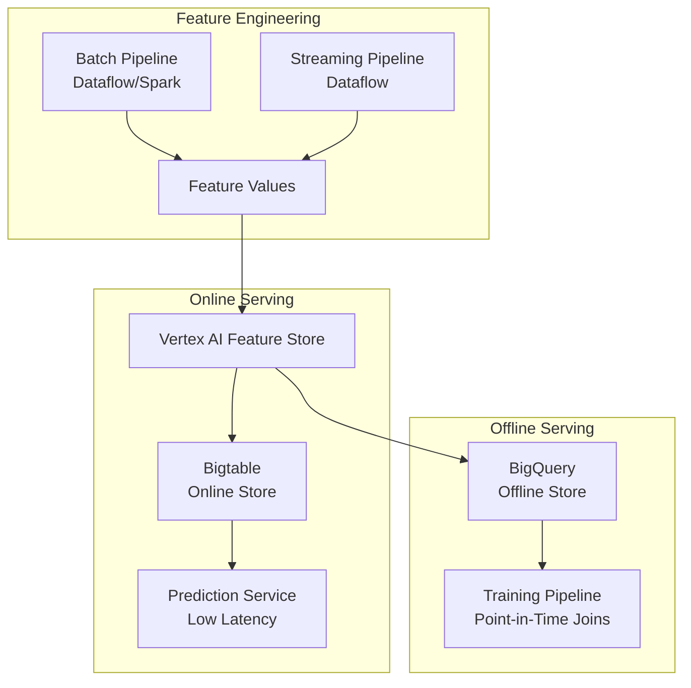

# How to Set Up a Real-Time Feature Store on GCP Using Bigtable

Author: [nawazdhandala](https://www.github.com/nawazdhandala)

Tags: GCP, Vertex AI, Feature Store, Bigtable, Machine Learning, Real-Time ML, MLOps

Description: Learn how to build a real-time feature store on GCP using Bigtable for low-latency serving and Vertex AI Feature Store for feature management, versioning, and offline training.

---

Serving machine learning features in real time is one of those problems that looks simple until you try to build it. Your model needs features with low latency at prediction time, but those same features need to be available in batch for training without introducing training-serving skew. A feature store solves this by providing a single system that handles both. On GCP, you can combine Vertex AI Feature Store for management and offline serving with Bigtable for low-latency online serving at large scale. Here is how to set it up.

## The Feature Store Architecture


```mermaid
flowchart TD
    subgraph Feature Engineering
        A[Batch Pipeline<br/>Dataflow/Spark] --> B[Feature Values]
        C[Streaming Pipeline<br/>Dataflow] --> B
    end

    B --> D[Vertex AI Feature Store]

    subgraph Online Serving
        D --> E[Bigtable<br/>Online Store]
        E --> F[Prediction Service<br/>Low Latency]
    end

    subgraph Offline Serving
        D --> G[BigQuery<br/>Offline Store]
        G --> H[Training Pipeline<br/>Point-in-Time Joins]
    end
```

## Step 1: Create the Vertex AI Feature Store

Start by creating a feature store instance and defining your feature groups:

```bash
# Enable the required APIs

gcloud services enable aiplatform.googleapis.com
gcloud services enable bigtable.googleapis.com
gcloud services enable bigtableadmin.googleapis.com
```

Create the feature store using the Vertex AI SDK:

```python
# create_feature_store.py - Set up the feature store and feature groups
from google.cloud import aiplatform
from vertexai.resources.preview import feature_store

# Initialize the Vertex AI client
aiplatform.init(project='my-project', location='us-central1')

# Create a Feature Online Store backed by Bigtable
feature_online_store = feature_store.FeatureOnlineStore.create_bigtable_store(
    "production_feature_store",
)

print(f"Created online store: {feature_online_store.name}")
```

## Step 2: Define Feature Groups and Features

Feature groups organize related features together. Define them based on your entity types:

```python
# define_features.py - Create feature groups for user and product features
from google.cloud import aiplatform
from vertexai.resources.preview import feature_store

aiplatform.init(project='my-project', location='us-central1')

# Create a feature group for user features
# The source is a BigQuery table that contains the feature values
user_feature_group = feature_store.FeatureGroup.create(
    name="user_features",
    source=feature_store.utils.FeatureGroupBigQuerySource(
        uri="bq://my-project.features.user_features",
        entity_id_columns=["user_id"],
    ),
)

# Register individual features within the group
user_feature_group.create_feature(
    name="total_orders_30d",
    version_column_name="total_orders_30d",
)

user_feature_group.create_feature(
    name="avg_order_value_30d",
    version_column_name="avg_order_value_30d",
)

user_feature_group.create_feature(
    name="days_since_last_order",
    version_column_name="days_since_last_order",
)

user_feature_group.create_feature(
    name="customer_segment",
    version_column_name="customer_segment",
)

print(f"Created feature group: {user_feature_group.name}")

# Create a feature group for product features
product_feature_group = feature_store.FeatureGroup.create(
    name="product_features",
    source=feature_store.utils.FeatureGroupBigQuerySource(
        uri="bq://my-project.features.product_features",
        entity_id_columns=["product_id"],
    ),
)

product_feature_group.create_feature(
    name="avg_rating",
    version_column_name="avg_rating",
)

product_feature_group.create_feature(
    name="total_purchases_7d",
    version_column_name="total_purchases_7d",
)

product_feature_group.create_feature(
    name="category",
    version_column_name="category",
)

print(f"Created feature group: {product_feature_group.name}")
```

## Step 3: Create Feature Views for Online Serving

Feature views connect BigQuery sources or feature groups to the online store, making them available for real-time serving:

```python
# create_feature_views.py - Set up online serving views
from google.cloud import aiplatform
from vertexai.resources.preview import feature_store

aiplatform.init(project='my-project', location='us-central1')

# Get the online store
online_store = feature_store.FeatureOnlineStore("production_feature_store")

# Create a feature view for user features
user_feature_view = online_store.create_feature_view(
    name="user_features_view",
    source=feature_store.utils.FeatureViewBigQuerySource(
        uri="bq://my-project.features.user_features",
        entity_id_columns=["user_id"],
    ),
)

# Create a feature view for product features
product_feature_view = online_store.create_feature_view(
    name="product_features_view",
    source=feature_store.utils.FeatureViewBigQuerySource(
        uri="bq://my-project.features.product_features",
        entity_id_columns=["product_id"],
    ),
)

print("Feature views created and syncing")
```

If you need an explicit sync schedule, set the feature view `sync_config` with the REST API. For example, use `"cron": "0 */4 * * *"` for a four-hour sync interval.

## Step 4: Compute Features with a Batch Pipeline

Create a Dataflow pipeline that computes features and writes them to BigQuery (the offline store):

```python
# compute_user_features.py - Batch feature computation pipeline
from pyspark.sql import SparkSession
from pyspark.sql.functions import (
    col, count, avg, datediff, current_date, max as spark_max, when
)

spark = SparkSession.builder \
    .appName("UserFeatureComputation") \
    .getOrCreate()

# Read from the silver layer orders table
orders = spark.read.format("bigquery") \
    .option("table", "my-project.silver.orders") \
    .load()

# Compute user-level features
user_features = orders \
    .filter(col("order_date") >= current_date() - 30) \
    .groupBy("customer_id") \
    .agg(
        count("order_id").alias("total_orders_30d"),
        avg("total_amount").alias("avg_order_value_30d"),
        datediff(current_date(), spark_max("order_date")).alias("days_since_last_order"),
    ) \
    .withColumn(
        "customer_segment",
        when(col("avg_order_value_30d") >= 500, "platinum")
        .when(col("avg_order_value_30d") >= 200, "gold")
        .when(col("avg_order_value_30d") >= 50, "silver")
        .otherwise("bronze")
    ) \
    .withColumnRenamed("customer_id", "user_id")

# Write to BigQuery (the offline feature store)
user_features.write \
    .format("bigquery") \
    .option("table", "my-project.features.user_features") \
    .option("temporaryGcsBucket", "my-project-temp") \
    .mode("overwrite") \
    .save()

print(f"Computed features for {user_features.count()} users")
spark.stop()
```

## Step 5: Stream Real-Time Feature Updates

For features that need to be fresher than the batch sync interval, write directly to the feature view. Direct writes are available for Bigtable online serving and are currently a preview feature:

```python
# stream_features.py - Stream real-time feature updates to the feature view
import google.auth
from google.auth.transport.requests import AuthorizedSession

PROJECT_ID = "my-project"
LOCATION = "us-central1"
ONLINE_STORE = "production_feature_store"
FEATURE_VIEW = "user_features_view"


def _feature_value(value):
    """Convert Python values to the Feature Store typed value format."""
    if isinstance(value, bool):
        return {"bool_value": value}
    if isinstance(value, int):
        return {"int64_value": value}
    if isinstance(value, float):
        return {"double_value": value}
    return {"string_value": str(value)}


def update_user_features(user_id, features):
    """Update feature values in a Bigtable-backed feature view."""
    credentials, _ = google.auth.default(
        scopes=["https://www.googleapis.com/auth/cloud-platform"]
    )
    session = AuthorizedSession(credentials)
    feature_view = (
        f"projects/{PROJECT_ID}/locations/{LOCATION}/featureOnlineStores/"
        f"{ONLINE_STORE}/featureViews/{FEATURE_VIEW}"
    )
    url = f"https://{LOCATION}-aiplatform.googleapis.com/v1beta1/{feature_view}:directWrite"

    payload = [
        {
            "feature_view": feature_view,
            "data_key_and_feature_values": {
                "data_key": {"key": str(user_id)},
                "features": [
                    {
                        "name": name,
                        "value_and_timestamp": {"value": _feature_value(value)},
                    }
                    for name, value in features.items()
                ],
            },
        }
    ]

    response = session.post(url, json=payload)
    response.raise_for_status()
    return response.json()


def process_order_event(event):
    """Process an order event and update relevant user features."""
    user_id = event['user_id']
    order_amount = event['total_amount']

    # Update real-time features based on the new order
    # In a production system, you would read the current values and recompute
    update_user_features(
        user_id,
        {
            "last_order_amount": order_amount,
            "last_order_timestamp": event["timestamp"],
            "days_since_last_order": 0,
        },
    )
```

## Step 6: Serve Features at Prediction Time

When your model needs features for a prediction, fetch them from the online store:

```python
# serve_features.py - Fetch features for real-time predictions
from google.cloud import aiplatform
from vertexai.resources.preview.feature_store import FeatureOnlineStore, FeatureView

aiplatform.init(project='my-project', location='us-central1')

def get_prediction_features(user_id, product_id):
    """Fetch features for a prediction request from the online store."""
    online_store = FeatureOnlineStore("production_feature_store")

    # Fetch user features
    user_view = FeatureView("user_features_view", feature_online_store_id=online_store.name)
    user_features = user_view.read(str(user_id))

    # Fetch product features
    product_view = FeatureView("product_features_view", feature_online_store_id=online_store.name)
    product_features = product_view.read(str(product_id))

    # Combine features into a single dictionary for the model
    combined = {}
    for key, value in user_features.items():
        combined[f"user_{key}"] = value
    for key, value in product_features.items():
        combined[f"product_{key}"] = value

    return combined


# Example usage in a prediction endpoint
from flask import Flask, request, jsonify

app = Flask(__name__)

@app.route('/predict', methods=['POST'])
def predict():
    data = request.json
    user_id = data['user_id']
    product_id = data['product_id']

    # Get features from the feature store
    features = get_prediction_features(user_id, product_id)

    # Call your model with the features
    prediction = model.predict(features)

    return jsonify({
        'prediction': prediction,
        'features_used': list(features.keys())
    })
```

## Step 7: Generate Training Data with Point-in-Time Joins

For model training, you need features as they were at the time of each historical event, not as they are today. This is called a point-in-time join:

```sql
-- training_data.sql - Generate training data with point-in-time correct features
-- This ensures no data leakage from the future into training examples
WITH user_features_asof AS (
  SELECT
    e.user_id,
    e.product_id,
    e.event_timestamp,
    e.label,
    uf.total_orders_30d,
    uf.avg_order_value_30d,
    uf.days_since_last_order,
    uf.customer_segment
  FROM `my-project.training.events` e
  LEFT JOIN `my-project.features.user_features_history` uf
    ON e.user_id = uf.user_id
   AND uf.feature_timestamp <= e.event_timestamp
  QUALIFY ROW_NUMBER() OVER (
    PARTITION BY e.user_id, e.product_id, e.event_timestamp, e.label
    ORDER BY uf.feature_timestamp IS NULL, uf.feature_timestamp DESC
  ) = 1
),
product_features_asof AS (
  SELECT
    e.user_id,
    e.product_id,
    e.event_timestamp,
    e.label,
    pf.avg_rating,
    pf.total_purchases_7d,
    pf.category
  FROM `my-project.training.events` e
  LEFT JOIN `my-project.features.product_features_history` pf
    ON e.product_id = pf.product_id
   AND pf.feature_timestamp <= e.event_timestamp
  QUALIFY ROW_NUMBER() OVER (
    PARTITION BY e.user_id, e.product_id, e.event_timestamp, e.label
    ORDER BY pf.feature_timestamp IS NULL, pf.feature_timestamp DESC
  ) = 1
)
SELECT
  u.user_id,
  u.product_id,
  u.event_timestamp,
  u.label,  -- Whether the user purchased (1) or not (0)

  -- User features as of the event time
  u.total_orders_30d,
  u.avg_order_value_30d,
  u.days_since_last_order,
  u.customer_segment,

  -- Product features as of the event time
  p.avg_rating,
  p.total_purchases_7d,
  p.category
FROM user_features_asof u
LEFT JOIN product_features_asof p
  ON u.user_id = p.user_id
 AND u.product_id = p.product_id
 AND u.event_timestamp = p.event_timestamp
 AND u.label = p.label;
```

## Monitoring Feature Freshness

Track how stale your features are to catch pipeline failures:

```python
# monitor_freshness.py - Check feature freshness and alert on staleness
from datetime import datetime, timezone

import google.auth
from google.auth.transport.requests import AuthorizedSession

PROJECT_ID = "my-project"
LOCATION = "us-central1"
ONLINE_STORE = "production_feature_store"
MAX_STALENESS_SECONDS = 6 * 60 * 60


def list_syncs(feature_view):
    credentials, _ = google.auth.default(
        scopes=["https://www.googleapis.com/auth/cloud-platform"]
    )
    session = AuthorizedSession(credentials)
    url = (
        f"https://{LOCATION}-aiplatform.googleapis.com/v1/projects/{PROJECT_ID}"
        f"/locations/{LOCATION}/featureOnlineStores/{ONLINE_STORE}"
        f"/featureViews/{feature_view}/featureViewSyncs"
    )
    response = session.get(url)
    response.raise_for_status()
    return response.json().get("featureViewSyncs", [])


def check_feature_freshness():
    """Check whether scheduled feature view syncs are stale."""
    for view_name in ["user_features_view", "product_features_view"]:
        syncs = list_syncs(view_name)
        completed = [
            sync for sync in syncs
            if sync.get("runTime", {}).get("endTime")
            and sync.get("finalStatus", {}).get("code", 0) == 0
        ]
        if not completed:
            print(f"WARNING: {view_name} has no successful syncs")
            continue

        latest = max(sync["runTime"]["endTime"] for sync in completed)
        latest_time = datetime.fromisoformat(latest.replace("Z", "+00:00"))
        age_seconds = (datetime.now(timezone.utc) - latest_time).total_seconds()

        print(f"{view_name}: last successful sync at {latest}")
        if age_seconds > MAX_STALENESS_SECONDS:
            print(f"WARNING: {view_name} features are stale!")
```

Building a real-time feature store requires coordination between batch and streaming systems, but the payoff is significant. You get consistent features between training and serving, low-latency online lookups through Bigtable, and a single source of truth for all your ML features. Start with your most critical model's features and expand the store as you onboard more models.
