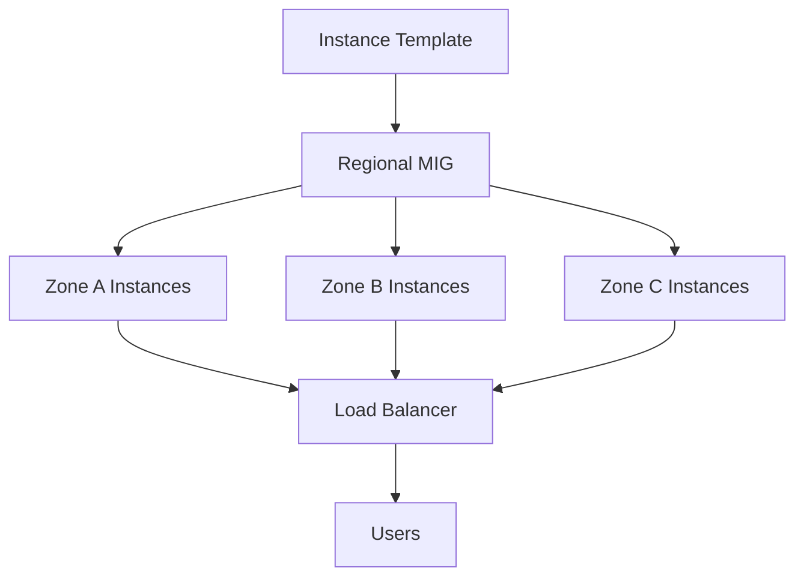

# How to Set Up a Regional Managed Instance Group for High Availability Across Zones

Author: [nawazdhandala](https://www.github.com/nawazdhandala)

Tags: GCP, Compute Engine, Managed Instance Group, High Availability, Autoscaling

Description: Step-by-step guide to creating a regional managed instance group on Google Compute Engine that distributes VMs across multiple zones for fault tolerance and high availability.

---

A single zone going down should not take your application with it. That is the whole point of regional managed instance groups (MIGs) in Google Compute Engine. Instead of putting all your VMs in one zone, a regional MIG spreads them across multiple zones in a region, so if one zone has an issue, the others keep serving traffic.

I have used regional MIGs for production workloads where downtime was not an option, and the setup is more straightforward than you might expect. Let me walk through the entire process.

## Understanding Regional vs Zonal MIGs

A zonal MIG runs all its instances in a single zone. If that zone goes down, every instance goes with it. A regional MIG distributes instances across up to three zones in a region. Google handles the distribution automatically, and you can configure how instances are spread.

Here is the flow at a high level:



## Step 1: Create an Instance Template

Before creating the MIG, you need an instance template. This defines what each VM in the group looks like - machine type, disk, startup script, and so on.

```bash
# Create an instance template for the managed instance group
gcloud compute instance-templates create web-server-template \
  --machine-type=e2-medium \
  --image-family=debian-12 \
  --image-project=debian-cloud \
  --boot-disk-size=20GB \
  --tags=http-server,https-server,health-check \
  --metadata-from-file=startup-script=startup.sh \
  --labels=app=web-server,env=production
```

Your startup script should install and configure whatever software your instances need. Here is a simple example:

```bash
#!/bin/bash
# startup.sh - Install and configure nginx with a health check endpoint
apt-get update
apt-get install -y nginx

# Create a health check endpoint
cat > /var/www/html/health <<EOF
OK
EOF

# Configure nginx to serve on port 80
systemctl enable nginx
systemctl start nginx
```

## Step 2: Create a Health Check

Health checks let the MIG know which instances are healthy. Unhealthy instances get replaced automatically.

```bash
# Create an HTTP health check that pings the /health endpoint
gcloud compute health-checks create http web-server-health-check \
  --port=80 \
  --request-path=/health \
  --check-interval=10s \
  --timeout=5s \
  --healthy-threshold=2 \
  --unhealthy-threshold=3
```

This health check hits `/health` on port 80 every 10 seconds. An instance is considered healthy after 2 consecutive successes and unhealthy after 3 consecutive failures. Tune these values based on your application - you do not want the health check to be so aggressive that it replaces instances during normal load spikes.

## Step 3: Create the Regional Managed Instance Group

Now for the main event. This command creates a regional MIG that spans three zones:

```bash
# Create a regional managed instance group across three zones
gcloud compute instance-groups managed create web-server-mig \
  --template=web-server-template \
  --size=6 \
  --region=us-central1 \
  --zones=us-central1-a,us-central1-b,us-central1-c \
  --health-check=web-server-health-check \
  --initial-delay=120
```

This creates 6 instances distributed across the three specified zones - roughly 2 per zone. The `--initial-delay=120` gives instances 120 seconds to boot and pass the health check before the MIG starts considering them unhealthy.

## Step 4: Configure Distribution Policy

By default, a regional MIG uses an even distribution policy. You can change this behavior depending on your needs.

The even distribution (default) tries to keep the same number of instances in each zone:

```bash
# Set the distribution policy to EVEN (default behavior)
gcloud compute instance-groups managed update web-server-mig \
  --region=us-central1 \
  --instance-redistribution-type=PROACTIVE
```

With `PROACTIVE` redistribution, the MIG automatically moves instances between zones to maintain even distribution. If you set it to `NONE`, the MIG will not rebalance - it will only place new instances in zones that need them when scaling up.

## Step 5: Set Up Autoscaling

Static instance counts waste money during quiet periods and fall short during peaks. Autoscaling fixes this:

```bash
# Configure autoscaling based on CPU utilization
gcloud compute instance-groups managed set-autoscaling web-server-mig \
  --region=us-central1 \
  --min-num-replicas=3 \
  --max-num-replicas=15 \
  --target-cpu-utilization=0.65 \
  --cool-down-period=90
```

This configuration keeps between 3 and 15 instances running, scaling based on a 65% CPU target. The cool-down period of 90 seconds prevents rapid scaling fluctuations by waiting before collecting metrics from newly created instances.

You can also scale based on other metrics:

```bash
# Configure autoscaling based on HTTP load balancing utilization
gcloud compute instance-groups managed set-autoscaling web-server-mig \
  --region=us-central1 \
  --min-num-replicas=3 \
  --max-num-replicas=15 \
  --scale-based-on-load-balancing \
  --target-load-balancing-utilization=0.7
```

## Step 6: Configure Update Policy

When you change the instance template, you need a strategy for rolling out updates. The update policy controls how this happens:

```bash
# Set update policy for rolling updates
gcloud compute instance-groups managed rolling-action start-update web-server-mig \
  --version=template=web-server-template-v2 \
  --region=us-central1 \
  --type=proactive \
  --max-surge=3 \
  --max-unavailable=0 \
  --min-ready=60
```

This configuration creates up to 3 extra instances during the update (`--max-surge=3`) while keeping zero instances unavailable (`--max-unavailable=0`). The result is a zero-downtime rolling update.

## Step 7: Connect to a Load Balancer

A regional MIG by itself just runs instances. To actually serve traffic, connect it to a load balancer.

First, create a backend service:

```bash
# Create a backend service that uses the MIG
gcloud compute backend-services create web-backend \
  --protocol=HTTP \
  --health-checks=web-server-health-check \
  --global

# Add the regional MIG as a backend
gcloud compute backend-services add-backend web-backend \
  --instance-group=web-server-mig \
  --instance-group-region=us-central1 \
  --balancing-mode=UTILIZATION \
  --max-utilization=0.8 \
  --global
```

Then set up the URL map and forwarding rule:

```bash
# Create a URL map
gcloud compute url-maps create web-map \
  --default-service=web-backend

# Create a target HTTP proxy
gcloud compute target-http-proxies create web-proxy \
  --url-map=web-map

# Create a forwarding rule (this gives you an external IP)
gcloud compute forwarding-rules create web-forwarding-rule \
  --global \
  --target-http-proxy=web-proxy \
  --ports=80
```

## Monitoring and Verification

After everything is set up, verify the MIG is working as expected:

```bash
# Check the status of the regional MIG
gcloud compute instance-groups managed list-instances web-server-mig \
  --region=us-central1

# Verify instance distribution across zones
gcloud compute instance-groups managed describe web-server-mig \
  --region=us-central1 \
  --format="yaml(distributionPolicy)"
```

## Testing Failover

You should test zone failure before you rely on this setup in production. The simplest way is to manually delete instances in one zone and watch the MIG recreate them:

```bash
# Delete an instance to simulate failure - MIG will recreate it
gcloud compute instances delete web-server-mig-xxxx \
  --zone=us-central1-a \
  --quiet
```

Watch the MIG replace the deleted instance:

```bash
# Watch the MIG recreate instances in real time
watch -n 5 "gcloud compute instance-groups managed list-instances web-server-mig \
  --region=us-central1 \
  --format='table(instance, zone, status)'"
```

The MIG should detect the missing instance and create a replacement within a minute or two. If you have autoscaling enabled, the replacement will be placed in whatever zone needs it most to maintain even distribution.

## Key Takeaways

Regional MIGs are one of the simplest ways to get zone-level fault tolerance on GCP. The combination of automatic instance replacement, health checking, autoscaling, and zone distribution means your application stays up even when individual zones do not. The setup takes about 15 minutes, and the peace of mind is well worth it.
