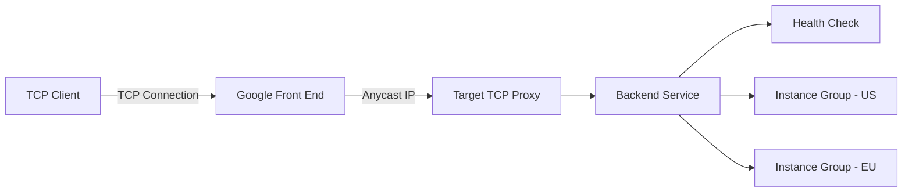

# How to Set Up a TCP Proxy Load Balancer for Non-HTTP Workloads in GCP

Author: [nawazdhandala](https://www.github.com/nawazdhandala)

Tags: GCP, TCP Proxy, Load Balancer, Networking, Non-HTTP

Description: A practical guide to setting up a TCP proxy load balancer in GCP for distributing non-HTTP TCP traffic like database connections, game servers, and custom protocols.

---

Not everything speaks HTTP. Database connections, game servers, mail servers, custom TCP protocols - these all need load balancing too. The TCP proxy load balancer in GCP handles this by terminating TCP connections at the Google edge and proxying them to your backend instances. It gives you global load balancing with intelligent routing for any TCP workload, without requiring your traffic to be HTTP.

This post covers the full setup, from backend configuration to testing, with practical examples for common non-HTTP use cases.

## How the TCP Proxy Load Balancer Works

The TCP proxy load balancer operates at Layer 4 (TCP). Unlike the passthrough network load balancer that forwards packets unchanged, the TCP proxy terminates the client's TCP connection at a Google Front End (GFE) and opens a new connection to the backend. This architecture provides several benefits:

- **Global anycast IP**: A single IP address routes to the nearest Google edge location
- **SSL/TLS offloading**: Optionally terminate SSL at the proxy level
- **Intelligent routing**: Traffic goes to the closest healthy backend region
- **DDoS protection**: Google's edge infrastructure absorbs attacks before they reach your backends

The trade-off is that your backend sees the proxy's IP as the source address, not the client's original IP. The client's IP is available through the PROXY protocol if you enable it.

## Prerequisites

- A GCP project with Compute Engine API enabled
- Backend instances running your TCP service
- The `gcloud` CLI installed and configured

## Step 1: Create Instance Groups

Set up your backend instances in an instance group. You can use managed or unmanaged instance groups:

```bash
# Create an unmanaged instance group and add instances
gcloud compute instance-groups unmanaged create tcp-backend-group \
    --zone=us-central1-a

gcloud compute instance-groups unmanaged add-instances tcp-backend-group \
    --zone=us-central1-a \
    --instances=tcp-server-1,tcp-server-2,tcp-server-3

# Set the named port for the TCP service
gcloud compute instance-groups set-named-ports tcp-backend-group \
    --named-ports=my-tcp-port:5000 \
    --zone=us-central1-a
```

## Step 2: Create a Health Check

TCP health checks verify that the backend port is accepting connections:

```bash
# Create a TCP health check for the backend service
gcloud compute health-checks create tcp tcp-proxy-health-check \
    --port=5000 \
    --check-interval=10s \
    --timeout=5s \
    --healthy-threshold=2 \
    --unhealthy-threshold=3 \
    --global
```

If your service supports a request/response pattern, you can add that:

```bash
# Create a health check with request/response validation
gcloud compute health-checks create tcp tcp-proxy-health-check-v2 \
    --port=5000 \
    --request="HEALTHCHECK" \
    --response="OK" \
    --check-interval=10s \
    --timeout=5s \
    --global
```

## Step 3: Create a Backend Service

The backend service for a TCP proxy load balancer uses the `TCP` protocol:

```bash
# Create a backend service for TCP proxy load balancing
gcloud compute backend-services create tcp-proxy-backend \
    --protocol=TCP \
    --health-checks=tcp-proxy-health-check \
    --global
```

Add the instance group as a backend:

```bash
# Add the instance group to the backend service
gcloud compute backend-services add-backend tcp-proxy-backend \
    --instance-group=tcp-backend-group \
    --instance-group-zone=us-central1-a \
    --global
```

For multi-region setups, add instance groups from different regions:

```bash
# Add backends in multiple regions for geographic distribution
gcloud compute backend-services add-backend tcp-proxy-backend \
    --instance-group=tcp-backend-eu \
    --instance-group-zone=europe-west1-b \
    --global
```

## Step 4: Create a Target TCP Proxy

The target TCP proxy connects the frontend to the backend service:

```bash
# Create a target TCP proxy
gcloud compute target-tcp-proxies create my-tcp-proxy \
    --backend-service=tcp-proxy-backend
```

If you want SSL/TLS termination at the proxy, use a target SSL proxy instead:

```bash
# Create a target SSL proxy for encrypted TCP connections
gcloud compute ssl-certificates create tcp-ssl-cert \
    --certificate=server.crt \
    --private-key=server.key \
    --global

gcloud compute target-ssl-proxies create my-ssl-proxy \
    --backend-service=tcp-proxy-backend \
    --ssl-certificates=tcp-ssl-cert
```

## Step 5: Reserve a Global IP and Create the Forwarding Rule

```bash
# Reserve a global static IP for the TCP proxy
gcloud compute addresses create tcp-proxy-ip \
    --ip-version=IPV4 \
    --global

# Create the forwarding rule
gcloud compute forwarding-rules create tcp-proxy-rule \
    --global \
    --target-tcp-proxy=my-tcp-proxy \
    --address=tcp-proxy-ip \
    --ports=5000
```

You can specify multiple ports or port ranges:

```bash
# Forward a range of ports
gcloud compute forwarding-rules create tcp-proxy-multi-port \
    --global \
    --target-tcp-proxy=my-tcp-proxy \
    --address=tcp-proxy-ip \
    --ports=5000-5010
```

## Step 6: Configure Firewall Rules

Allow traffic from Google's proxy and health check IP ranges:

```bash
# Allow health check traffic
gcloud compute firewall-rules create allow-tcp-proxy-health \
    --network=default \
    --action=allow \
    --direction=ingress \
    --source-ranges=130.211.0.0/22,35.191.0.0/16 \
    --target-tags=tcp-backend \
    --rules=tcp:5000

# Allow traffic from Google Front Ends
gcloud compute firewall-rules create allow-tcp-proxy-traffic \
    --network=default \
    --action=allow \
    --direction=ingress \
    --source-ranges=130.211.0.0/22,35.191.0.0/16 \
    --target-tags=tcp-backend \
    --rules=tcp:5000
```

## Step 7: Enable PROXY Protocol (Optional)

Since the TCP proxy terminates the client connection, your backend normally cannot see the client's real IP address. PROXY protocol solves this by prepending the client's IP information to the TCP stream.

```bash
# Enable PROXY protocol on the target TCP proxy
gcloud compute target-tcp-proxies update my-tcp-proxy \
    --proxy-header=PROXY_V1
```

Your backend application needs to understand PROXY protocol to parse this header. Here is an example in Python:

```python
# Simple TCP server that reads PROXY protocol v1 header
import socket

server = socket.socket(socket.AF_INET, socket.SOCK_STREAM)
server.bind(('0.0.0.0', 5000))
server.listen(5)

while True:
    client_sock, addr = server.accept()
    # Read the PROXY protocol header (first line)
    data = client_sock.recv(1024).decode()
    if data.startswith('PROXY'):
        # Parse: PROXY TCP4 <src_ip> <dst_ip> <src_port> <dst_port>
        parts = data.split('\r\n')[0].split(' ')
        client_ip = parts[2]
        print(f"Real client IP: {client_ip}")
        # Read the actual application data
        app_data = data.split('\r\n', 1)[1] if '\r\n' in data else ''
    client_sock.close()
```

## Architecture Overview



## Use Case: Database Connection Pooling

A common use case for the TCP proxy load balancer is distributing database connections across read replicas:

```bash
# Create backend for PostgreSQL read replicas on port 5432
gcloud compute backend-services create postgres-read-pool \
    --protocol=TCP \
    --health-checks=tcp-pg-check \
    --global \
    --session-affinity=CLIENT_IP \
    --connection-draining-timeout=300s

# Add read replicas
gcloud compute backend-services add-backend postgres-read-pool \
    --instance-group=pg-replicas \
    --instance-group-zone=us-central1-a \
    --global
```

The `--session-affinity=CLIENT_IP` ensures a client consistently connects to the same replica, which is important for connection-oriented protocols.

## Use Case: Game Server Load Balancing

For game servers that use custom TCP protocols:

```bash
# Create backend for game servers
gcloud compute backend-services create game-server-pool \
    --protocol=TCP \
    --health-checks=game-health-check \
    --global \
    --timeout=86400s

# Long timeout for persistent game sessions
gcloud compute forwarding-rules create game-server-rule \
    --global \
    --target-tcp-proxy=game-tcp-proxy \
    --address=game-server-ip \
    --ports=7777
```

The long timeout (86400 seconds = 24 hours) prevents the proxy from closing idle game connections prematurely.

## Monitoring and Logging

Enable logging for the TCP proxy load balancer:

```bash
# Enable logging on the backend service
gcloud compute backend-services update tcp-proxy-backend \
    --enable-logging \
    --logging-sample-rate=1.0 \
    --global
```

View the logs:

```bash
# Query TCP proxy load balancer logs
gcloud logging read 'resource.type="tcp_ssl_proxy_rule"' \
    --limit=20 \
    --format="table(timestamp,jsonPayload.connection.src_ip,jsonPayload.connection.dest_ip)"
```

## Wrapping Up

The TCP proxy load balancer fills an important niche in GCP for workloads that need global load balancing but do not use HTTP. It gives you a single anycast IP, intelligent geographic routing, and SSL offloading for any TCP protocol. The setup is simpler than HTTP(S) load balancers since there are no URL maps, but the core concepts of backend services, health checks, and forwarding rules are the same. For non-HTTP workloads that need to be globally accessible, it is hard to beat.
