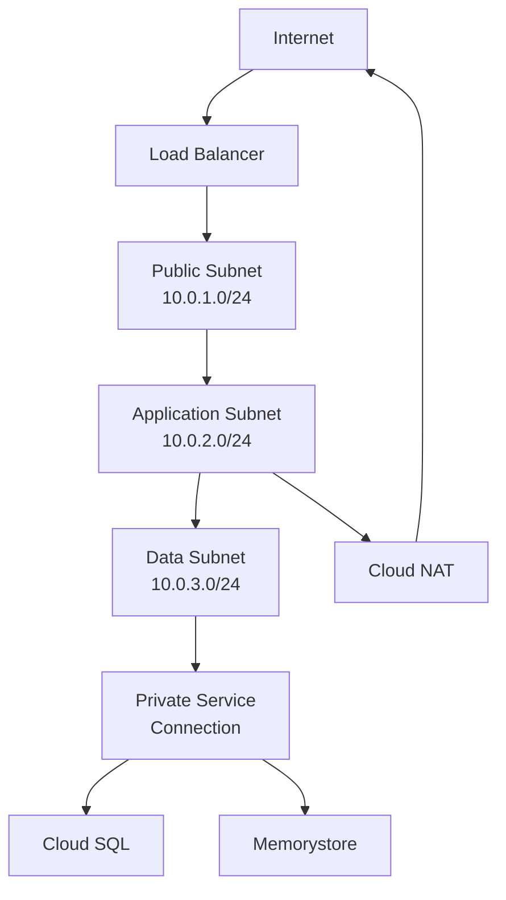

# How to Set Up a VPC Network with Subnets and Firewall Rules Using Terraform on GCP

Author: [nawazdhandala](https://www.github.com/nawazdhandala)

Tags: GCP, Terraform, VPC, Networking, Firewall Rules, Infrastructure as Code

Description: Learn how to create a VPC network with custom subnets, firewall rules, and NAT configuration using Terraform on Google Cloud Platform for secure infrastructure.

---

Networking is the foundation of your cloud infrastructure. Every compute instance, database, and managed service sits on a network, and getting the network architecture right from the start saves you from painful restructuring later. Terraform makes it possible to define your entire network topology in code, review changes in pull requests, and replicate the setup across environments.

This guide walks through setting up a production-ready VPC network on GCP using Terraform, complete with custom subnets, firewall rules, Cloud NAT, and Cloud Router.

## Why Custom VPC Instead of Default

GCP projects come with a default VPC that has subnets in every region and permissive firewall rules. This is convenient for testing but not suitable for production because:

- You cannot control the IP ranges
- The default firewall rules allow internal traffic on all ports
- Every region gets a subnet whether you need it or not
- It is hard to reason about security when the defaults are wide open

A custom VPC gives you full control over your network topology.

## Creating the VPC Network

Start with a VPC network with custom subnet mode:

```hcl
# vpc.tf - Custom VPC network
resource "google_compute_network" "main" {
  name                    = "main-vpc"
  auto_create_subnetworks = false  # We will create subnets manually
  routing_mode            = "REGIONAL"
  project                 = var.project_id

  # Delete the default routes when the network is created
  # We will add our own routes explicitly
  delete_default_routes_on_create = false
}
```

Setting `auto_create_subnetworks = false` is the critical setting. This tells GCP to not create a subnet in every region automatically.

## Creating Subnets

Design your subnets around your application tiers. A common pattern is separate subnets for web-facing, application, and data tiers:

```hcl
# subnets.tf - Custom subnets for different application tiers

# Public-facing subnet for load balancers and bastion hosts
resource "google_compute_subnetwork" "public" {
  name          = "public-subnet"
  ip_cidr_range = "10.0.1.0/24"
  region        = var.region
  network       = google_compute_network.main.id
  project       = var.project_id

  # Enable private Google access so instances without external IPs
  # can still reach Google APIs
  private_ip_google_access = true

  log_config {
    aggregation_interval = "INTERVAL_5_SEC"
    flow_sampling        = 0.5
    metadata             = "INCLUDE_ALL_METADATA"
  }
}

# Application tier subnet
resource "google_compute_subnetwork" "application" {
  name          = "application-subnet"
  ip_cidr_range = "10.0.2.0/24"
  region        = var.region
  network       = google_compute_network.main.id
  project       = var.project_id

  private_ip_google_access = true

  # Secondary ranges for GKE pods and services (if using GKE)
  secondary_ip_range {
    range_name    = "pods"
    ip_cidr_range = "10.4.0.0/14"
  }

  secondary_ip_range {
    range_name    = "services"
    ip_cidr_range = "10.8.0.0/20"
  }

  log_config {
    aggregation_interval = "INTERVAL_5_SEC"
    flow_sampling        = 0.5
    metadata             = "INCLUDE_ALL_METADATA"
  }
}

# Data tier subnet for databases and storage
resource "google_compute_subnetwork" "data" {
  name          = "data-subnet"
  ip_cidr_range = "10.0.3.0/24"
  region        = var.region
  network       = google_compute_network.main.id
  project       = var.project_id

  private_ip_google_access = true
}
```

A few things worth noting:

- **private_ip_google_access**: Enable this on all subnets. It lets instances without external IPs access Google APIs and services.
- **log_config**: VPC flow logs are essential for network debugging and security monitoring. The sampling rate of 0.5 captures half of all flows, which is a good balance between visibility and cost.
- **secondary_ip_range**: Only needed if you are running GKE in this subnet.

## Firewall Rules

GCP firewalls are applied at the network level and use network tags to target specific instances. The default deny-all ingress and allow-all egress rules apply when no other rules match.

Here is a comprehensive firewall configuration:

```hcl
# firewall.tf - Firewall rules for the VPC

# Allow internal communication within the VPC
resource "google_compute_firewall" "allow_internal" {
  name    = "allow-internal"
  network = google_compute_network.main.name
  project = var.project_id

  allow {
    protocol = "tcp"
    ports    = ["0-65535"]
  }

  allow {
    protocol = "udp"
    ports    = ["0-65535"]
  }

  allow {
    protocol = "icmp"
  }

  # Only allow traffic from within the VPC CIDR ranges
  source_ranges = [
    "10.0.1.0/24",  # public subnet
    "10.0.2.0/24",  # application subnet
    "10.0.3.0/24",  # data subnet
  ]

  priority = 1000
}

# Allow HTTP and HTTPS traffic from the internet to tagged instances
resource "google_compute_firewall" "allow_http" {
  name    = "allow-http-https"
  network = google_compute_network.main.name
  project = var.project_id

  allow {
    protocol = "tcp"
    ports    = ["80", "443"]
  }

  source_ranges = ["0.0.0.0/0"]
  target_tags   = ["http-server"]  # Only instances with this tag

  priority = 1000
}

# Allow SSH from specific IP ranges (for bastion access)
resource "google_compute_firewall" "allow_ssh" {
  name    = "allow-ssh"
  network = google_compute_network.main.name
  project = var.project_id

  allow {
    protocol = "tcp"
    ports    = ["22"]
  }

  # Restrict SSH to your office IP or VPN range
  source_ranges = var.ssh_allowed_cidrs
  target_tags   = ["ssh-allowed"]

  priority = 1000
}

# Allow health check traffic from Google's health check ranges
resource "google_compute_firewall" "allow_health_checks" {
  name    = "allow-health-checks"
  network = google_compute_network.main.name
  project = var.project_id

  allow {
    protocol = "tcp"
  }

  # Google's health check source ranges
  source_ranges = [
    "130.211.0.0/22",
    "35.191.0.0/16",
  ]

  target_tags = ["health-check"]

  priority = 1000
}

# Allow IAP tunnel access for secure SSH without public IPs
resource "google_compute_firewall" "allow_iap" {
  name    = "allow-iap-tunnel"
  network = google_compute_network.main.name
  project = var.project_id

  allow {
    protocol = "tcp"
    ports    = ["22", "3389"]
  }

  # IAP's source IP range
  source_ranges = ["35.235.240.0/20"]

  priority = 1000
}

# Deny all other ingress (explicit deny for clarity)
resource "google_compute_firewall" "deny_all_ingress" {
  name    = "deny-all-ingress"
  network = google_compute_network.main.name
  project = var.project_id

  deny {
    protocol = "all"
  }

  source_ranges = ["0.0.0.0/0"]
  priority      = 65534
}
```

## Cloud Router and Cloud NAT

Instances without external IPs need Cloud NAT to reach the internet (for pulling packages, downloading updates, and so on):

```hcl
# nat.tf - Cloud Router and Cloud NAT for outbound internet access

# Cloud Router for NAT and dynamic routing
resource "google_compute_router" "main" {
  name    = "main-router"
  network = google_compute_network.main.id
  region  = var.region
  project = var.project_id
}

# Cloud NAT for outbound internet access from private instances
resource "google_compute_router_nat" "main" {
  name                               = "main-nat"
  router                             = google_compute_router.main.name
  region                             = var.region
  project                            = var.project_id
  nat_ip_allocate_option             = "AUTO_ONLY"
  source_subnetwork_ip_ranges_to_nat = "ALL_SUBNETWORKS_ALL_IP_RANGES"

  log_config {
    enable = true
    filter = "ERRORS_ONLY"
  }

  # Minimum ports per VM for consistent outbound connectivity
  min_ports_per_vm = 256
}
```

## Private Service Connection

For managed services like Cloud SQL and Memorystore that need to connect to your VPC:

```hcl
# private_services.tf - Private service connection for managed services

# Reserve an IP range for Google managed services
resource "google_compute_global_address" "private_services" {
  name          = "private-services-range"
  purpose       = "VPC_PEERING"
  address_type  = "INTERNAL"
  prefix_length = 16
  network       = google_compute_network.main.id
  project       = var.project_id
}

# Create the peering connection
resource "google_service_networking_connection" "private_services" {
  network                 = google_compute_network.main.id
  service                 = "servicenetworking.googleapis.com"
  reserved_peering_ranges = [google_compute_global_address.private_services.name]
}
```

## Variables

```hcl
# variables.tf
variable "project_id" {
  description = "GCP project ID"
  type        = string
}

variable "region" {
  description = "GCP region"
  type        = string
  default     = "us-central1"
}

variable "ssh_allowed_cidrs" {
  description = "CIDR blocks allowed to SSH into instances"
  type        = list(string)
  default     = []
}
```

## Outputs

```hcl
# outputs.tf
output "network_id" {
  description = "The ID of the VPC network"
  value       = google_compute_network.main.id
}

output "network_name" {
  description = "The name of the VPC network"
  value       = google_compute_network.main.name
}

output "public_subnet_id" {
  description = "The ID of the public subnet"
  value       = google_compute_subnetwork.public.id
}

output "application_subnet_id" {
  description = "The ID of the application subnet"
  value       = google_compute_subnetwork.application.id
}

output "data_subnet_id" {
  description = "The ID of the data subnet"
  value       = google_compute_subnetwork.data.id
}

output "router_name" {
  description = "The name of the Cloud Router"
  value       = google_compute_router.main.name
}
```

## Network Visualization

Here is how the network topology looks:



## Best Practices

1. **Use custom subnets.** Auto-created subnets give you no control over IP ranges and create subnets in regions you do not use.
2. **Enable VPC flow logs** for network visibility and security monitoring. Adjust the sampling rate based on your logging budget.
3. **Use network tags** to target firewall rules. Never apply broad firewall rules to all instances.
4. **Allow health check traffic.** Google's load balancers and managed services need to reach your instances for health checks.
5. **Use IAP tunneling** instead of bastion hosts for SSH access. It is simpler and more secure.
6. **Enable private Google access** on all subnets so instances without external IPs can reach Google APIs.
7. **Plan your IP ranges** before creating subnets. Changing CIDR ranges later requires destroying and recreating the subnet.

## Wrapping Up

A well-designed VPC network with Terraform is the foundation for everything else you build on GCP. Custom subnets give you control over IP allocation, firewall rules enforce your security policy, and Cloud NAT provides outbound connectivity without exposing instances to the internet. Define your network in code from day one, and you will have a setup that is secure, documented, and reproducible across environments.
