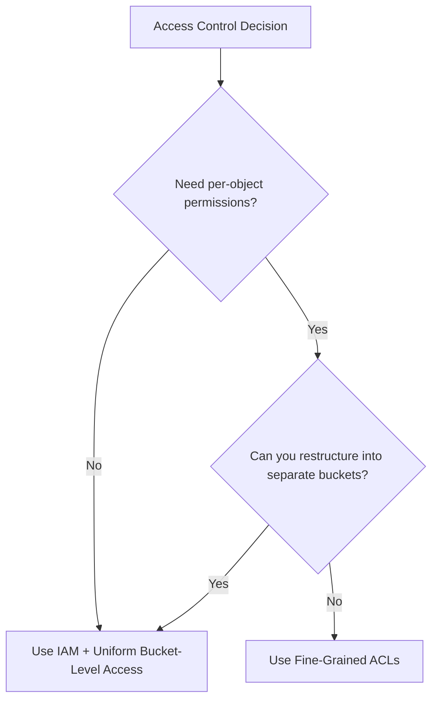

# How to Set Up ACLs and IAM Permissions for Google Cloud Storage Buckets

Author: [nawazdhandala](https://www.github.com/nawazdhandala)

Tags: GCP, Google Cloud Storage, IAM, Access Control, Security

Description: Learn how to configure ACLs and IAM permissions for Google Cloud Storage buckets to control access securely and follow the principle of least privilege.

---

Getting access control right on Cloud Storage buckets is one of the most important things you can do for your GCP security posture. Too permissive, and you risk data leaks. Too restrictive, and your team cannot get work done. Google Cloud Storage offers two access control systems - IAM and ACLs - and understanding when to use each one is key to setting up secure, maintainable permissions.

This guide covers both systems, with practical examples for common access patterns.

## IAM vs ACLs: Which One to Use

Google Cloud Storage provides two overlapping systems for access control:

**IAM (Identity and Access Management)** operates at the bucket level. You grant roles to principals (users, groups, service accounts), and those roles apply to all objects in the bucket.

**ACLs (Access Control Lists)** operate at both the bucket and individual object level. They provide fine-grained, per-object permissions.

The general recommendation is to use IAM exclusively and enable uniform bucket-level access. ACLs add complexity and make it harder to audit who has access to what.



## Setting Up IAM Permissions

### Common IAM Roles for Cloud Storage

Here are the roles you will use most often:

| Role | What It Grants |
|---|---|
| `roles/storage.objectViewer` | Read objects and list objects |
| `roles/storage.objectCreator` | Upload objects (no read/delete) |
| `roles/storage.objectAdmin` | Full control over objects |
| `roles/storage.admin` | Full control over buckets and objects |
| `roles/storage.legacyBucketReader` | List bucket contents |
| `roles/storage.legacyObjectReader` | Read objects only |

### Granting IAM Roles via gcloud

Grant a user read access to a bucket:

```bash
# Grant a user permission to view objects in a bucket
gcloud storage buckets add-iam-policy-binding gs://my-data-bucket \
  --member="user:alice@example.com" \
  --role="roles/storage.objectViewer"
```

Grant a service account write access:

```bash
# Allow a service account to upload objects to the bucket
gcloud storage buckets add-iam-policy-binding gs://my-data-bucket \
  --member="serviceAccount:my-app@my-project.iam.gserviceaccount.com" \
  --role="roles/storage.objectCreator"
```

Grant a Google Group access:

```bash
# Give a team group read and write access
gcloud storage buckets add-iam-policy-binding gs://my-data-bucket \
  --member="group:data-team@example.com" \
  --role="roles/storage.objectAdmin"
```

### Viewing Current IAM Policies

```bash
# List all IAM bindings on a bucket
gcloud storage buckets get-iam-policy gs://my-data-bucket
```

### Removing IAM Roles

```bash
# Remove a user's read access
gcloud storage buckets remove-iam-policy-binding gs://my-data-bucket \
  --member="user:alice@example.com" \
  --role="roles/storage.objectViewer"
```

## Enabling Uniform Bucket-Level Access

Uniform bucket-level access disables ACLs entirely, so all access is controlled through IAM. This simplifies permission management and makes auditing easier.

```bash
# Enable uniform bucket-level access
gcloud storage buckets update gs://my-data-bucket \
  --uniform-bucket-level-access
```

Once enabled, there is a 90-day grace period during which you can revert. After 90 days, it becomes permanent.

Check the current status:

```bash
# Check if uniform bucket-level access is enabled
gcloud storage buckets describe gs://my-data-bucket \
  --format="json(iamConfiguration)"
```

## Working with ACLs

If you need per-object access control, here is how ACLs work. Note that ACLs are only available when uniform bucket-level access is NOT enabled.

### Predefined ACLs

GCS offers predefined ACL sets that cover common scenarios:

```bash
# Make a specific object publicly readable
gcloud storage objects update gs://my-bucket/public/logo.png \
  --predefined-acl=publicRead

# Set an object to be accessible only by the owner
gcloud storage objects update gs://my-bucket/private/secret.txt \
  --predefined-acl=private
```

Available predefined ACLs:
- `private` - owner only
- `publicRead` - owner has full control, everyone can read
- `publicReadWrite` - everyone can read and write
- `authenticatedRead` - any authenticated Google user can read
- `bucketOwnerRead` - bucket owner can read
- `bucketOwnerFullControl` - bucket owner has full control

### Setting ACLs on Upload

```bash
# Upload a file with a specific ACL
gcloud storage cp ./public-image.png gs://my-bucket/public/ \
  --predefined-acl=publicRead
```

### Viewing Object ACLs

```bash
# View the ACL for a specific object
gcloud storage objects describe gs://my-bucket/data/file.csv \
  --format="json(acl)"
```

### Custom ACL Entries

Grant a specific user access to a specific object:

```bash
# Grant a user read access to a specific object
gcloud storage objects update gs://my-bucket/shared/report.pdf \
  --add-acl-grant=entity=user-bob@example.com,role=READER
```

## IAM Conditions for Fine-Grained Access

IAM conditions let you add restrictions to IAM bindings without using ACLs. For example, you can restrict access based on object name prefix:

```bash
# Grant access only to objects under the reports/ prefix
gcloud storage buckets add-iam-policy-binding gs://my-data-bucket \
  --member="user:analyst@example.com" \
  --role="roles/storage.objectViewer" \
  --condition='expression=resource.name.startsWith("projects/_/buckets/my-data-bucket/objects/reports/"),title=reports-only'
```

This is more maintainable than per-object ACLs and works with uniform bucket-level access.

## Setting Up Permissions with Terraform

```hcl
# Bucket with uniform bucket-level access
resource "google_storage_bucket" "data_bucket" {
  name     = "my-data-bucket"
  location = "US"

  uniform_bucket_level_access = true
}

# Grant the data team read/write access
resource "google_storage_bucket_iam_member" "data_team_admin" {
  bucket = google_storage_bucket.data_bucket.name
  role   = "roles/storage.objectAdmin"
  member = "group:data-team@example.com"
}

# Grant the application service account upload-only access
resource "google_storage_bucket_iam_member" "app_upload" {
  bucket = google_storage_bucket.data_bucket.name
  role   = "roles/storage.objectCreator"
  member = "serviceAccount:my-app@my-project.iam.gserviceaccount.com"
}

# Grant a specific user read-only access
resource "google_storage_bucket_iam_member" "analyst_read" {
  bucket = google_storage_bucket.data_bucket.name
  role   = "roles/storage.objectViewer"
  member = "user:analyst@example.com"
}
```

## Setting Permissions in Python

```python
from google.cloud import storage

def grant_bucket_access(bucket_name, member, role):
    """Grant an IAM role to a member on a bucket."""
    client = storage.Client()
    bucket = client.bucket(bucket_name)

    # Get the current IAM policy
    policy = bucket.get_iam_policy(requested_policy_version=3)

    # Add the new binding
    policy.bindings.append({
        "role": role,
        "members": {member},
    })

    # Set the updated policy
    bucket.set_iam_policy(policy)

    print(f"Granted {role} to {member} on {bucket_name}")

def revoke_bucket_access(bucket_name, member, role):
    """Remove an IAM role from a member on a bucket."""
    client = storage.Client()
    bucket = client.bucket(bucket_name)

    policy = bucket.get_iam_policy(requested_policy_version=3)

    # Find and update the binding
    for binding in policy.bindings:
        if binding["role"] == role and member in binding["members"]:
            binding["members"].discard(member)
            break

    bucket.set_iam_policy(policy)

    print(f"Revoked {role} from {member} on {bucket_name}")

# Grant read access to a service account
grant_bucket_access(
    "my-data-bucket",
    "serviceAccount:analytics@my-project.iam.gserviceaccount.com",
    "roles/storage.objectViewer"
)
```

## Common Access Patterns

### Public Website Hosting

```bash
# Make all objects in a bucket publicly readable
gcloud storage buckets add-iam-policy-binding gs://my-website-bucket \
  --member="allUsers" \
  --role="roles/storage.objectViewer"
```

### Application Backend with Separate Read/Write

```bash
# API service can read and write
gcloud storage buckets add-iam-policy-binding gs://app-data \
  --member="serviceAccount:api-service@proj.iam.gserviceaccount.com" \
  --role="roles/storage.objectAdmin"

# Background worker can only read
gcloud storage buckets add-iam-policy-binding gs://app-data \
  --member="serviceAccount:worker@proj.iam.gserviceaccount.com" \
  --role="roles/storage.objectViewer"
```

### Cross-Project Access

```bash
# Allow a service account from another project to read objects
gcloud storage buckets add-iam-policy-binding gs://shared-data \
  --member="serviceAccount:reader@other-project.iam.gserviceaccount.com" \
  --role="roles/storage.objectViewer"
```

## Security Best Practices

1. **Always use uniform bucket-level access** unless you have a specific need for per-object permissions.
2. **Grant the minimum role needed.** If a service only reads data, give it `objectViewer`, not `objectAdmin`.
3. **Use service accounts, not user accounts** for applications and automated systems.
4. **Prefer groups over individual users.** Managing access through Google Groups scales better.
5. **Audit permissions regularly** using `gcloud storage buckets get-iam-policy`.
6. **Never use `allUsers` or `allAuthenticatedUsers`** unless the data is intentionally public.

Getting permissions right from the start saves you from security incidents and painful debugging sessions later. Use IAM with uniform bucket-level access, follow the principle of least privilege, and audit regularly.
