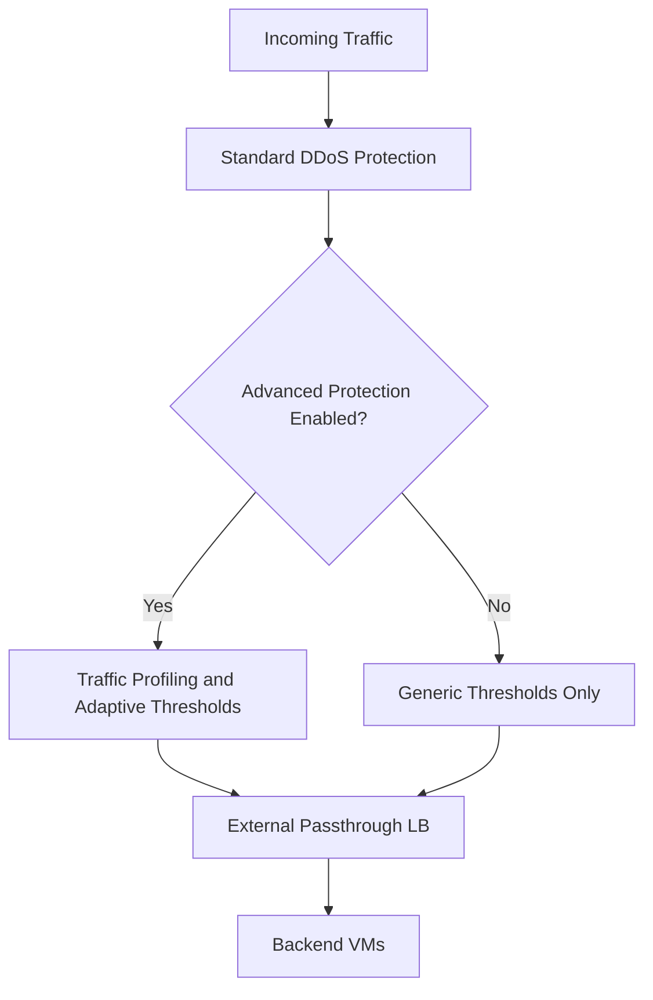

# How to Set Up Advanced Network DDoS Protection for External Passthrough Load Balancers in GCP

Author: [nawazdhandala](https://www.github.com/nawazdhandala)

Tags: GCP, DDoS Protection, Cloud Armor, Load Balancer, Network Security

Description: Configure Google Cloud Armor Advanced Network DDoS Protection to defend external passthrough load balancers against volumetric and protocol-based DDoS attacks.

---

External passthrough load balancers in GCP handle TCP and UDP traffic without terminating connections. They are commonly used for game servers, VoIP, and custom protocols. The challenge is that they do not support standard Cloud Armor backend security policies because there is no HTTP layer to inspect. That is where Cloud Armor Advanced Network DDoS Protection comes in - it provides always-on, volumetric DDoS mitigation specifically for these network-level load balancers.

This guide walks through setting up Advanced Network DDoS Protection for your external passthrough load balancers.

## Understanding the Protection Layers

GCP provides two layers of DDoS protection:

**Standard Network DDoS Protection** is always on and free for all GCP resources. It mitigates common volumetric attacks like SYN floods and UDP amplification attacks. However, it operates with generic thresholds that may not be tuned for your specific traffic patterns.

**Advanced Network DDoS Protection** is a paid tier that adds per-resource traffic profiling, adaptive thresholds, and attack telemetry. It learns your normal traffic patterns and can detect anomalies that the standard tier would miss.



## Prerequisites

Before you begin:

- You need a GCP project with billing enabled
- Cloud Armor API must be enabled
- You should have an existing external passthrough network load balancer (or be ready to create one)
- Your account needs the `compute.securityAdmin` role or equivalent permissions
- Advanced Network DDoS Protection requires enrollment in Cloud Armor Enterprise

## Step 1: Enable Cloud Armor Enterprise

Advanced Network DDoS Protection requires a Cloud Armor Enterprise subscription. Enable it at the project level:

```bash
# Enable Cloud Armor Enterprise for the project
gcloud compute security-policies create enterprise-policy \
  --type=CLOUD_ARMOR_NETWORK \
  --project=your-project-id
```

You can verify the enrollment status:

```bash
# Check Cloud Armor Enterprise enrollment
gcloud compute project-info describe \
  --project=your-project-id \
  --format="value(securityPolicyConfig)"
```

## Step 2: Create a Network Security Policy

Unlike HTTP(S) load balancers that use standard Cloud Armor policies, external passthrough load balancers use network-edge security policies:

```bash
# Create a network edge security policy
gcloud compute security-policies create network-ddos-policy \
  --type=CLOUD_ARMOR_NETWORK \
  --region=us-central1 \
  --description="Advanced DDoS protection for passthrough LB" \
  --project=your-project-id
```

Note that network security policies are regional, matching the region of your external passthrough load balancer.

## Step 3: Enable Advanced DDoS Protection on the Policy

Enable the advanced protection features on your network security policy:

```bash
# Enable advanced DDoS protection
gcloud compute security-policies update network-ddos-policy \
  --region=us-central1 \
  --network-ddos-protection=ADVANCED \
  --project=your-project-id
```

This turns on traffic profiling and adaptive threshold detection for any resources attached to this policy.

## Step 4: Add Network Filtering Rules

You can add rules to the network security policy to filter traffic at the network layer:

```bash
# Allow traffic from specific IP ranges
gcloud compute security-policies rules create 1000 \
  --security-policy=network-ddos-policy \
  --region=us-central1 \
  --network-src-ip-ranges="203.0.113.0/24,198.51.100.0/24" \
  --network-dest-ports="443,8443" \
  --network-ip-protocols="tcp" \
  --action=allow \
  --description="Allow traffic from known client ranges on expected ports"

# Block traffic from known bad IP ranges
gcloud compute security-policies rules create 2000 \
  --security-policy=network-ddos-policy \
  --region=us-central1 \
  --network-src-ip-ranges="192.0.2.0/24" \
  --action=deny \
  --description="Block traffic from known malicious ranges"

# Set default rule to allow (after DDoS filtering)
gcloud compute security-policies rules update 2147483647 \
  --security-policy=network-ddos-policy \
  --region=us-central1 \
  --action=allow \
  --description="Default allow after DDoS mitigation"
```

## Step 5: Attach the Policy to Your Forwarding Rule

The policy needs to be attached to the forwarding rule of your external passthrough load balancer:

```bash
# List forwarding rules to find the right one
gcloud compute forwarding-rules list \
  --filter="loadBalancingScheme=EXTERNAL" \
  --project=your-project-id

# Attach the security policy to the forwarding rule
gcloud compute forwarding-rules update your-forwarding-rule \
  --region=us-central1 \
  --security-policy=network-ddos-policy \
  --security-policy-region=us-central1 \
  --project=your-project-id
```

## Step 6: Configure Traffic Profiling

Advanced Network DDoS Protection automatically profiles your traffic after attachment. The profiling period typically takes about 24 hours to establish a baseline. During this learning period, the system is still providing protection using standard thresholds, but the adaptive detection improves as it learns your normal patterns.

You can check the profiling status:

```bash
# Check the security policy details including profiling status
gcloud compute security-policies describe network-ddos-policy \
  --region=us-central1 \
  --project=your-project-id \
  --format=yaml
```

## Monitoring and Alerting

Set up monitoring to get visibility into DDoS attack detection and mitigation:

```bash
# View DDoS attack logs
gcloud logging read \
  'resource.type="networksecurity.googleapis.com/SecurityPolicy" AND jsonPayload.ddosAttackEvent!=""' \
  --project=your-project-id \
  --limit=20 \
  --format=json
```

For real-time visibility, set up a Cloud Monitoring dashboard with the following metrics:

- `compute.googleapis.com/security_policy/matched_packet_count` - packets matched by policy rules
- `compute.googleapis.com/security_policy/dropped_packet_count` - packets dropped by DDoS mitigation
- Network throughput to your forwarding rules

```bash
# Create an alert for detected DDoS attacks
gcloud alpha monitoring policies create \
  --display-name="DDoS Attack Detected" \
  --condition-display-name="Network DDoS attack in progress" \
  --condition-filter='resource.type="networksecurity.googleapis.com/SecurityPolicy" AND metric.type="networksecurity.googleapis.com/security_policy/dropped_packet_count"' \
  --condition-threshold-value=10000 \
  --condition-threshold-duration=60s \
  --notification-channels=your-channel-id
```

## Tuning for Specific Protocols

If your passthrough load balancer handles specific protocols, you can create targeted rules:

```bash
# For a game server - allow UDP on game ports, block everything else
gcloud compute security-policies rules create 1000 \
  --security-policy=network-ddos-policy \
  --region=us-central1 \
  --network-dest-ports="27015-27030" \
  --network-ip-protocols="udp" \
  --action=allow \
  --description="Allow UDP traffic on game server ports"

# Block UDP on non-game ports to prevent amplification abuse
gcloud compute security-policies rules create 1100 \
  --security-policy=network-ddos-policy \
  --region=us-central1 \
  --network-ip-protocols="udp" \
  --action=deny \
  --description="Block UDP on all other ports"
```

## Handling Attack Events

When an attack is detected, Advanced Network DDoS Protection automatically applies mitigation. You can see active mitigations:

```bash
# List active DDoS mitigations
gcloud compute security-policies describe network-ddos-policy \
  --region=us-central1 \
  --format="yaml(ddosProtectionConfig, adaptiveProtectionConfig)" \
  --project=your-project-id
```

During an active attack, you may want to add temporary rules to further restrict traffic:

```bash
# Emergency rule to only allow traffic from your primary market
gcloud compute security-policies rules create 100 \
  --security-policy=network-ddos-policy \
  --region=us-central1 \
  --network-src-ip-ranges="0.0.0.0/0" \
  --network-src-region-codes="US,CA" \
  --action=allow \
  --description="Emergency: restrict to US/CA traffic only during attack"
```

## Cost Considerations

Advanced Network DDoS Protection is part of Cloud Armor Enterprise, which has a subscription fee. There are also per-resource charges for each forwarding rule that has a network security policy attached. Factor this into your budget, especially if you have many forwarding rules. For most production workloads facing real DDoS risk, the cost is justified by the protection and telemetry you get.

## Key Differences from HTTP(S) DDoS Protection

Keep these distinctions in mind:

- Network policies operate at layers 3 and 4, not layer 7
- No WAF rules, header inspection, or path matching
- Rules are regional, not global
- Policies attach to forwarding rules, not backend services
- Traffic profiling is automatic and continuous

## Wrapping Up

Advanced Network DDoS Protection fills an important security gap for external passthrough load balancers in GCP. While standard DDoS protection covers basic volumetric attacks, the advanced tier gives you adaptive thresholds, traffic profiling, and detailed attack telemetry that are essential for any production workload handling non-HTTP traffic. The setup is straightforward, and the protection starts working immediately while it builds its traffic profile over the first 24 hours. If you are running game servers, VoIP services, or any custom protocol behind passthrough load balancers, this should be part of your production security baseline.
