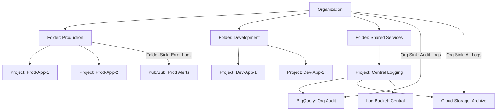

# How to Set Up Aggregated Log Sinks at the Organization Level in Cloud Logging

Author: [nawazdhandala](https://www.github.com/nawazdhandala)

Tags: GCP, Cloud Logging, Aggregated Sinks, Organization, Centralized Logging

Description: Learn how to create aggregated log sinks at the organization or folder level in Cloud Logging to centralize logs from all projects in one destination.

---

In organizations with dozens or hundreds of GCP projects, managing log exports per project is not practical. You need a centralized approach - a single set of sinks that captures logs from every project in your organization and routes them to a shared destination. That is what aggregated log sinks do.

In this post, I will explain how aggregated sinks work at the organization and folder levels and walk through setting them up for common scenarios like security log centralization and compliance archival.

## What Are Aggregated Log Sinks?

Regular log sinks operate at the project level - they only see logs from the project where they are created. Aggregated sinks, on the other hand, can be created at the organization or folder level and capture logs from all child projects automatically.

When you create an aggregated sink at the organization level, it processes logs from every project in the organization. When you create one at the folder level, it processes logs from every project in that folder and its subfolders.

This is a pull model - the sink automatically receives logs from all child resources without needing to configure anything in individual projects.

## When to Use Aggregated Sinks

Common use cases:

- **Centralized security monitoring**: Route all audit logs to a central SIEM project
- **Compliance archival**: Archive all logs to a central Cloud Storage bucket for regulatory retention
- **Cross-project analytics**: Send all logs to a central BigQuery dataset for organization-wide analysis
- **Third-party integration**: Forward all logs to Splunk, Datadog, or another external system through a central Pub/Sub topic

## Prerequisites

To create aggregated sinks, you need:

- **Organization-level**: `roles/logging.configWriter` on the organization
- **Folder-level**: `roles/logging.configWriter` on the folder
- The destination resource (BigQuery dataset, Cloud Storage bucket, Pub/Sub topic, or log bucket) must already exist

## Creating Organization-Level Aggregated Sinks

### Sink to BigQuery for Central Analytics

```bash
# Create an organization-level sink that routes all audit logs to BigQuery
gcloud logging sinks create org-audit-to-bigquery \
  bigquery.googleapis.com/projects/central-logging-project/datasets/org_audit_logs \
  --organization=ORGANIZATION_ID \
  --include-children \
  --log-filter='logName:"cloudaudit.googleapis.com"'
```

The `--include-children` flag is critical - without it, the sink only captures logs generated at the organization level itself, not from child projects.

### Sink to Cloud Storage for Compliance Archival

```bash
# Create an organization-level sink that archives all logs to Cloud Storage
gcloud logging sinks create org-archive-all \
  storage.googleapis.com/org-wide-log-archive \
  --organization=ORGANIZATION_ID \
  --include-children \
  --log-filter=''
```

An empty filter means all logs are captured.

### Sink to Pub/Sub for SIEM Integration

```bash
# Create an organization-level sink that streams security logs to Pub/Sub
gcloud logging sinks create org-security-to-pubsub \
  pubsub.googleapis.com/projects/central-logging-project/topics/security-logs \
  --organization=ORGANIZATION_ID \
  --include-children \
  --log-filter='logName:"cloudaudit.googleapis.com%2Factivity" OR logName:"cloudaudit.googleapis.com%2Fpolicy"'
```

### Sink to a Central Log Bucket

You can also route logs to a log bucket in a central project:

```bash
# Create an organization-level sink to a central log bucket
gcloud logging sinks create org-central-logs \
  logging.googleapis.com/projects/central-logging-project/locations/global/buckets/org-logs \
  --organization=ORGANIZATION_ID \
  --include-children \
  --log-filter='severity>=WARNING'
```

## Granting Permissions to the Sink

After creating an aggregated sink, you need to grant its service account write access to the destination. The sink's service account is automatically created.

First, get the writer identity:

```bash
# Get the organization sink's writer identity
gcloud logging sinks describe org-audit-to-bigquery \
  --organization=ORGANIZATION_ID \
  --format='value(writerIdentity)'
```

This returns something like `serviceAccount:o123456789-123456@gcp-sa-logging.iam.gserviceaccount.com`.

Then grant access to the destination:

```bash
# For BigQuery destination
gcloud projects add-iam-policy-binding central-logging-project \
  --member="serviceAccount:o123456789-123456@gcp-sa-logging.iam.gserviceaccount.com" \
  --role="roles/bigquery.dataEditor"

# For Cloud Storage destination
gcloud storage buckets add-iam-policy-binding gs://org-wide-log-archive \
  --member="serviceAccount:o123456789-123456@gcp-sa-logging.iam.gserviceaccount.com" \
  --role="roles/storage.objectCreator"

# For Pub/Sub destination
gcloud pubsub topics add-iam-policy-binding security-logs \
  --project=central-logging-project \
  --member="serviceAccount:o123456789-123456@gcp-sa-logging.iam.gserviceaccount.com" \
  --role="roles/pubsub.publisher"
```

## Creating Folder-Level Aggregated Sinks

Folder-level sinks work the same way but are scoped to a specific folder. This is useful when different business units or environments need different log routing:

```bash
# Create a folder-level sink for the production folder
gcloud logging sinks create prod-audit-logs \
  bigquery.googleapis.com/projects/central-logging-project/datasets/prod_audit_logs \
  --folder=FOLDER_ID \
  --include-children \
  --log-filter='logName:"cloudaudit.googleapis.com"'
```

## Architecture Pattern: Centralized Logging Hub

Here is a common architecture for organization-wide log management:



## Intercepting vs Non-Intercepting Sinks

By default, aggregated sinks do not intercept logs - the logs still flow to each project's `_Default` and `_Required` sinks. This means logs are stored both in the individual project and in the central destination.

If you want to intercept logs (prevent them from going to the project-level sinks), use the `--intercept-children` flag:

```bash
# Create an intercepting sink that prevents logs from going to project-level sinks
gcloud logging sinks create org-intercept-debug \
  logging.googleapis.com/projects/central-logging-project/locations/global/buckets/debug-logs \
  --organization=ORGANIZATION_ID \
  --include-children \
  --intercept-children \
  --log-filter='severity=DEBUG'
```

This is useful for cost management - you can intercept debug-level logs at the organization level and route them to a central bucket with short retention, preventing each project from paying for debug log ingestion.

## Managing Aggregated Sinks

### List Organization Sinks

```bash
# List all sinks at the organization level
gcloud logging sinks list --organization=ORGANIZATION_ID
```

### Update a Sink

```bash
# Update the filter on an organization sink
gcloud logging sinks update org-audit-to-bigquery \
  --organization=ORGANIZATION_ID \
  --log-filter='logName:"cloudaudit.googleapis.com%2Factivity"'
```

### Delete a Sink

```bash
# Delete an organization sink
gcloud logging sinks delete org-audit-to-bigquery \
  --organization=ORGANIZATION_ID
```

## Terraform Configuration

```hcl
# Central logging project resources
resource "google_bigquery_dataset" "org_audit" {
  project    = var.central_logging_project
  dataset_id = "org_audit_logs"
  location   = "US"
}

resource "google_storage_bucket" "org_archive" {
  name     = "${var.organization_id}-log-archive"
  project  = var.central_logging_project
  location = "US"

  uniform_bucket_level_access = true

  lifecycle_rule {
    action {
      type          = "SetStorageClass"
      storage_class = "COLDLINE"
    }
    condition {
      age = 90
    }
  }
}

# Organization-level aggregated sink to BigQuery
resource "google_logging_organization_sink" "audit_bigquery" {
  name             = "org-audit-to-bigquery"
  org_id           = var.organization_id
  destination      = "bigquery.googleapis.com/projects/${var.central_logging_project}/datasets/${google_bigquery_dataset.org_audit.dataset_id}"
  filter           = "logName:\"cloudaudit.googleapis.com\""
  include_children = true

  bigquery_options {
    use_partitioned_tables = true
  }
}

# Organization-level aggregated sink to Cloud Storage
resource "google_logging_organization_sink" "archive_storage" {
  name             = "org-archive-all"
  org_id           = var.organization_id
  destination      = "storage.googleapis.com/${google_storage_bucket.org_archive.name}"
  filter           = ""
  include_children = true
}

# Grant BigQuery access to the sink
resource "google_bigquery_dataset_iam_member" "org_sink_writer" {
  project    = var.central_logging_project
  dataset_id = google_bigquery_dataset.org_audit.dataset_id
  role       = "roles/bigquery.dataEditor"
  member     = google_logging_organization_sink.audit_bigquery.writer_identity
}

# Grant Cloud Storage access to the sink
resource "google_storage_bucket_iam_member" "org_sink_writer" {
  bucket = google_storage_bucket.org_archive.name
  role   = "roles/storage.objectCreator"
  member = google_logging_organization_sink.archive_storage.writer_identity
}
```

## Cost Considerations

Aggregated sinks can generate significant volumes:

- **Ingestion is charged per project**: The aggregated sink does not affect ingestion charges. Each project still pays for its own log ingestion.
- **Destination costs are centralized**: Storage costs in BigQuery, Cloud Storage, or Pub/Sub are charged to the destination project.
- **Use filters aggressively**: Do not route all logs from all projects unless you have a specific need. Focus on audit logs, error logs, or security-relevant logs.

## Wrapping Up

Aggregated log sinks are essential for organizations running multiple GCP projects. They provide centralized visibility without requiring per-project configuration, which is both more reliable and easier to maintain. Start with an organization-level audit log sink - that alone provides enormous security value - and expand to other log types as your centralized logging infrastructure matures.
