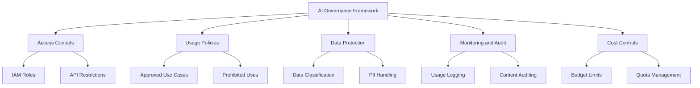

# How to Set Up AI Governance Policies for Generative AI on Google Cloud

Author: [nawazdhandala](https://www.github.com/nawazdhandala)

Tags: GCP, AI Governance, Generative AI, Responsible AI, Vertex AI, Policy, Google Cloud

Description: Establish AI governance policies for generative AI workloads on Google Cloud including access controls, usage monitoring, and compliance frameworks.

---

Generative AI is the first technology where most organizations deployed it before setting up governance. Teams started using Gemini, built prototypes, pushed to production, and then someone asked "wait, should we have a policy for this?" If that sounds familiar, this guide will help you set up proper governance for generative AI on Google Cloud - covering access controls, usage policies, monitoring, and compliance.

## Why AI Governance Matters for GenAI

Generative AI introduces risks that traditional software does not:

- Models can produce harmful, inaccurate, or biased content
- Sensitive data can leak through prompts or training data
- Outputs may infringe on copyrights or intellectual property
- Compliance requirements (GDPR, HIPAA, SOC 2) apply to AI systems too
- Cost can spiral quickly with uncontrolled API usage

Governance is not about slowing things down. It is about making sure you can move fast without creating legal, ethical, or security problems.



## Step 1: Set Up IAM Access Controls

Control who can access generative AI services and at what level:

```bash
# Create a custom IAM role for AI developers with limited permissions
gcloud iam roles create aiDeveloper \
    --project=your-project-id \
    --title="AI Developer" \
    --description="Can use AI APIs but cannot modify models or endpoints" \
    --permissions="\
aiplatform.endpoints.predict,\
aiplatform.endpoints.list,\
aiplatform.models.list,\
aiplatform.models.get"

# Create a role for AI administrators who can deploy and manage
gcloud iam roles create aiAdmin \
    --project=your-project-id \
    --title="AI Administrator" \
    --description="Full access to manage AI models and endpoints" \
    --permissions="\
aiplatform.endpoints.predict,\
aiplatform.endpoints.create,\
aiplatform.endpoints.delete,\
aiplatform.endpoints.deploy,\
aiplatform.endpoints.undeploy,\
aiplatform.models.create,\
aiplatform.models.delete,\
aiplatform.models.deploy,\
aiplatform.models.upload"

# Assign roles to groups (not individual users)
gcloud projects add-iam-policy-binding your-project-id \
    --member="group:ai-developers@yourcompany.com" \
    --role="projects/your-project-id/roles/aiDeveloper"

gcloud projects add-iam-policy-binding your-project-id \
    --member="group:ai-admins@yourcompany.com" \
    --role="projects/your-project-id/roles/aiAdmin"
```

## Step 2: Implement API Usage Policies with VPC Service Controls

Restrict how AI APIs can be accessed:

```bash
# Create a VPC Service Controls perimeter for AI services
gcloud access-context-manager perimeters create ai-perimeter \
    --title="AI Services Perimeter" \
    --resources="projects/your-project-number" \
    --restricted-services="\
aiplatform.googleapis.com,\
generativelanguage.googleapis.com" \
    --access-levels="accessPolicies/YOUR_POLICY/accessLevels/trusted-networks" \
    --policy=YOUR_POLICY_ID
```

This ensures AI APIs can only be called from approved networks and identities, preventing unauthorized access or data exfiltration through the API.

## Step 3: Create a Usage Policy Document

Define clear policies for how generative AI can be used in your organization. Here is a practical implementation using Firestore to store and enforce policies:

```python
# ai_policy.py - Enforce AI usage policies programmatically
from google.cloud import firestore
from datetime import datetime
import json

db = firestore.Client()

# Define the governance policies
POLICIES = {
    "approved_models": [
        "gemini-2.0-flash",
        "gemini-2.0-pro",
        "text-embedding-005",
    ],
    "prohibited_use_cases": [
        "generating_fake_news",
        "impersonating_individuals",
        "automated_hiring_decisions",
        "medical_diagnosis_without_review",
    ],
    "data_restrictions": {
        "no_pii_in_prompts": True,
        "no_customer_data_in_training": True,
        "max_retention_days": 90,
        "require_data_classification": True,
    },
    "output_policies": {
        "require_human_review_for": [
            "customer_facing_content",
            "legal_documents",
            "medical_information",
        ],
        "must_disclose_ai_generation": True,
    },
    "cost_limits": {
        "daily_budget_usd": 500,
        "per_request_max_tokens": 8192,
        "monthly_budget_usd": 10000,
    },
}

def store_policies():
    """Store governance policies in Firestore for centralized enforcement."""
    doc_ref = db.collection("ai_governance").document("current_policy")
    doc_ref.set({
        "policies": POLICIES,
        "version": "1.0",
        "effective_date": datetime.utcnow().isoformat(),
        "approved_by": "AI Governance Board",
    })

def check_policy_compliance(request_context):
    """Validate an AI API request against governance policies.
    Returns True if the request is compliant, False with reason if not."""

    policy_doc = db.collection("ai_governance").document("current_policy").get()
    policies = policy_doc.to_dict()["policies"]

    # Check if the model is approved
    if request_context.get("model") not in policies["approved_models"]:
        return False, f"Model {request_context['model']} is not in the approved list"

    # Check token limits
    if request_context.get("max_tokens", 0) > policies["cost_limits"]["per_request_max_tokens"]:
        return False, "Request exceeds maximum token limit"

    # Check for PII in prompts (basic check - use DLP API for production)
    if policies["data_restrictions"]["no_pii_in_prompts"]:
        if contains_pii(request_context.get("prompt", "")):
            return False, "Prompt appears to contain PII - remove personal data before sending"

    return True, "Compliant"
```

## Step 4: Implement Prompt Logging and Auditing

Log all interactions with generative AI for audit purposes:

```python
# audit_logger.py - Log AI interactions for governance auditing
from google.cloud import bigquery, logging as cloud_logging
from datetime import datetime
import hashlib
import json

# Set up Cloud Logging for real-time audit trail
logging_client = cloud_logging.Client()
logger = logging_client.logger("ai-governance-audit")

bq_client = bigquery.Client()

def log_ai_interaction(user_id, model, prompt, response, use_case, metadata=None):
    """Log an AI interaction for audit trail and compliance.
    Hashes sensitive content while preserving audit capability."""

    # Hash the prompt and response for privacy while maintaining auditability
    prompt_hash = hashlib.sha256(prompt.encode()).hexdigest()

    audit_record = {
        "timestamp": datetime.utcnow().isoformat(),
        "user_id": user_id,
        "model": model,
        "use_case": use_case,
        "prompt_hash": prompt_hash,
        "prompt_length": len(prompt),
        "response_length": len(response),
        "estimated_tokens": (len(prompt) + len(response)) // 4,
        "metadata": json.dumps(metadata or {}),
    }

    # Write to Cloud Logging for real-time monitoring
    logger.log_struct(audit_record, severity="INFO")

    # Write to BigQuery for long-term audit storage
    table_ref = bq_client.dataset("ai_governance").table("interaction_logs")
    bq_client.insert_rows_json(table_ref, [audit_record])

    return audit_record
```

Create the BigQuery table for audit storage:

```sql
-- Audit log table for AI interactions
CREATE TABLE `your-project.ai_governance.interaction_logs` (
    timestamp TIMESTAMP NOT NULL,
    user_id STRING NOT NULL,
    model STRING NOT NULL,
    use_case STRING,
    prompt_hash STRING,
    prompt_length INT64,
    response_length INT64,
    estimated_tokens INT64,
    metadata JSON
)
PARTITION BY DATE(timestamp)
OPTIONS (
    partition_expiration_days = 365  -- Keep logs for 1 year
);
```

## Step 5: Implement Data Loss Prevention for Prompts

Use the Cloud DLP API to scan prompts for sensitive data before sending them to AI models:

```python
# dlp_scanner.py - Scan prompts for sensitive data using Cloud DLP
from google.cloud import dlp_v2

dlp_client = dlp_v2.DlpServiceClient()
PROJECT_ID = "your-project-id"

def scan_prompt_for_pii(prompt_text):
    """Scan a prompt for personally identifiable information before sending to an AI model.
    Returns list of findings and whether the prompt should be blocked."""

    # Configure what types of sensitive data to look for
    inspect_config = dlp_v2.InspectConfig(
        info_types=[
            dlp_v2.InfoType(name="EMAIL_ADDRESS"),
            dlp_v2.InfoType(name="PHONE_NUMBER"),
            dlp_v2.InfoType(name="CREDIT_CARD_NUMBER"),
            dlp_v2.InfoType(name="US_SOCIAL_SECURITY_NUMBER"),
            dlp_v2.InfoType(name="PERSON_NAME"),
            dlp_v2.InfoType(name="STREET_ADDRESS"),
        ],
        min_likelihood=dlp_v2.Likelihood.LIKELY,
        include_quote=False,  # Do not include the actual sensitive data in findings
    )

    item = dlp_v2.ContentItem(value=prompt_text)

    response = dlp_client.inspect_content(
        request={
            "parent": f"projects/{PROJECT_ID}",
            "inspect_config": inspect_config,
            "item": item,
        }
    )

    findings = []
    for finding in response.result.findings:
        findings.append({
            "type": finding.info_type.name,
            "likelihood": finding.likelihood.name,
        })

    # Block if any high-likelihood PII is found
    should_block = len(findings) > 0

    return {
        "has_pii": should_block,
        "findings": findings,
        "finding_count": len(findings),
    }
```

## Step 6: Set Up Cost Controls

Prevent runaway AI spending with budget alerts and quotas:

```bash
# Set a daily budget alert for Vertex AI spending
gcloud billing budgets create \
    --billing-account=YOUR_BILLING_ACCOUNT \
    --display-name="AI Services Daily Budget" \
    --budget-amount=500 \
    --filter-projects="projects/your-project-id" \
    --filter-services="services/aiplatform.googleapis.com" \
    --threshold-rule=percent=80,basis=CURRENT_SPEND \
    --threshold-rule=percent=100,basis=CURRENT_SPEND \
    --notifications-rule-pubsub-topic="projects/your-project-id/topics/budget-alerts"
```

## Step 7: Regular Governance Reviews

Create automated compliance reports:

```sql
-- Weekly governance compliance report
SELECT
    DATE_TRUNC(timestamp, WEEK) AS week,
    model,
    use_case,
    COUNT(*) AS total_requests,
    SUM(estimated_tokens) AS total_tokens,
    COUNT(DISTINCT user_id) AS unique_users,
    ROUND(SUM(estimated_tokens) * 0.0001, 2) AS estimated_cost_usd
FROM `your-project.ai_governance.interaction_logs`
WHERE timestamp > TIMESTAMP_SUB(CURRENT_TIMESTAMP(), INTERVAL 7 DAY)
GROUP BY 1, 2, 3
ORDER BY total_requests DESC;
```

## Monitoring

Use OneUptime to monitor the health of your governance infrastructure itself - the DLP scanning service, the audit logging pipeline, and the policy enforcement layer. If governance tools go down, AI usage continues without guardrails, which is exactly when problems happen.

## Summary

AI governance for generative AI on Google Cloud involves five layers: access controls through IAM, usage policies enforced programmatically, data protection through DLP scanning, audit logging for compliance, and cost controls through budgets and quotas. The goal is not to block AI usage but to create guardrails that let your teams use AI confidently and safely. Start with the basics - IAM and logging - and layer on DLP scanning and policy enforcement as your AI usage grows.
