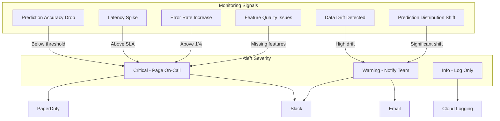

# How to Set Up Alerting and Notifications for ML Model Degradation on GCP with Cloud Monitoring

Author: [nawazdhandala](https://www.github.com/nawazdhandala)

Tags: Cloud Monitoring, Vertex AI, MLOps, Alerting, Google Cloud

Description: Learn how to set up comprehensive alerting and notification systems for detecting ML model degradation on Google Cloud Platform using Cloud Monitoring.

---

Your ML model in production is like a car on the highway. When it is running well, nobody notices. When it starts to degrade, you want to know before it crashes. The problem with ML models is that they can degrade silently - they keep returning predictions, the API still responds with 200 status codes, but the predictions themselves are gradually getting worse.

Setting up proper alerting for ML model degradation requires monitoring multiple signals: prediction accuracy, data drift, latency, error rates, and prediction distribution changes. On GCP, Cloud Monitoring is the central hub that ties all these signals together. In this post, I will show you how to set up a comprehensive alerting system that catches model degradation early.

## The Alerting Strategy

Different types of degradation require different monitoring approaches. Here is the full picture.



## Step 1: Set Up Notification Channels

First, configure where alerts get sent.

```python
# alerting/setup_channels.py
from google.cloud import monitoring_v3

def setup_notification_channels(project_id):
    """Create notification channels for different alert severities."""
    client = monitoring_v3.NotificationChannelServiceClient()
    project_name = f"projects/{project_id}"

    channels = {}

    # Email channel for the ML team
    email_channel = monitoring_v3.NotificationChannel(
        type_="email",
        display_name="ML Team Email",
        labels={"email_address": "ml-team@company.com"},
    )
    channels["email"] = client.create_notification_channel(
        name=project_name, notification_channel=email_channel
    )

    # Slack channel for real-time notifications
    slack_channel = monitoring_v3.NotificationChannel(
        type_="slack",
        display_name="ML Alerts Slack Channel",
        labels={"channel_name": "#ml-alerts"},
    )
    channels["slack"] = client.create_notification_channel(
        name=project_name, notification_channel=slack_channel
    )

    # PagerDuty for critical alerts that need immediate response
    pagerduty_channel = monitoring_v3.NotificationChannel(
        type_="pagerduty",
        display_name="ML On-Call PagerDuty",
        labels={"service_key": "YOUR_PAGERDUTY_SERVICE_KEY"},
    )
    channels["pagerduty"] = client.create_notification_channel(
        name=project_name, notification_channel=pagerduty_channel
    )

    for name, channel in channels.items():
        print(f"Created {name} channel: {channel.name}")

    return channels
```

## Step 2: Create Error Rate Alerts

The most basic alert - if your model endpoint is throwing errors, you need to know immediately.

```python
# alerting/error_rate_alert.py
from google.cloud import monitoring_v3

def create_error_rate_alert(project_id, endpoint_id, notification_channels):
    """Alert when the prediction endpoint error rate exceeds threshold."""
    client = monitoring_v3.AlertPolicyServiceClient()

    alert = monitoring_v3.AlertPolicy(
        display_name=f"ML Endpoint Error Rate - {endpoint_id}",
        documentation=monitoring_v3.AlertPolicy.Documentation(
            content=(
                "## Prediction Endpoint Error Rate Alert\n\n"
                "The prediction endpoint error rate has exceeded the threshold.\n\n"
                "**Immediate Actions:**\n"
                "1. Check endpoint logs in Cloud Logging\n"
                "2. Verify the model is still deployed\n"
                "3. Check if input data format has changed\n"
                "4. Consider rolling back to previous model version"
            ),
            mime_type="text/markdown",
        ),
        conditions=[
            monitoring_v3.AlertPolicy.Condition(
                display_name="Error rate above 1%",
                condition_threshold=monitoring_v3.AlertPolicy.Condition.MetricThreshold(
                    filter=(
                        'metric.type="aiplatform.googleapis.com/prediction/online/error_count"'
                        f' AND resource.labels.endpoint_id="{endpoint_id}"'
                    ),
                    comparison=monitoring_v3.ComparisonType.COMPARISON_GT,
                    threshold_value=10,  # More than 10 errors per interval
                    duration={"seconds": 300},
                    aggregations=[
                        monitoring_v3.Aggregation(
                            alignment_period={"seconds": 300},
                            per_series_aligner=monitoring_v3.Aggregation.Aligner.ALIGN_SUM,
                        )
                    ],
                ),
            ),
        ],
        notification_channels=[
            notification_channels["pagerduty"],
            notification_channels["slack"],
        ],
        alert_strategy=monitoring_v3.AlertPolicy.AlertStrategy(
            auto_close={"seconds": 1800},  # Auto-close after 30 min if resolved
        ),
    )

    result = client.create_alert_policy(
        name=f"projects/{project_id}", alert_policy=alert
    )
    print(f"Error rate alert created: {result.name}")
    return result
```

## Step 3: Create Latency Alerts

High latency can indicate model issues, infrastructure problems, or traffic spikes.

```python
# alerting/latency_alert.py
from google.cloud import monitoring_v3

def create_latency_alerts(project_id, endpoint_id, notification_channels):
    """Create tiered latency alerts for the prediction endpoint."""
    client = monitoring_v3.AlertPolicyServiceClient()

    # Warning: P95 latency above 500ms
    warning_alert = monitoring_v3.AlertPolicy(
        display_name=f"ML Endpoint P95 Latency Warning - {endpoint_id}",
        conditions=[
            monitoring_v3.AlertPolicy.Condition(
                display_name="P95 latency above 500ms",
                condition_threshold=monitoring_v3.AlertPolicy.Condition.MetricThreshold(
                    filter=(
                        'metric.type="aiplatform.googleapis.com/prediction/online/response_latencies"'
                        f' AND resource.labels.endpoint_id="{endpoint_id}"'
                    ),
                    comparison=monitoring_v3.ComparisonType.COMPARISON_GT,
                    threshold_value=500,
                    duration={"seconds": 600},
                    aggregations=[
                        monitoring_v3.Aggregation(
                            alignment_period={"seconds": 300},
                            per_series_aligner=monitoring_v3.Aggregation.Aligner.ALIGN_PERCENTILE_95,
                        )
                    ],
                ),
            ),
        ],
        notification_channels=[notification_channels["slack"]],
    )

    client.create_alert_policy(
        name=f"projects/{project_id}", alert_policy=warning_alert
    )

    # Critical: P95 latency above 2000ms
    critical_alert = monitoring_v3.AlertPolicy(
        display_name=f"ML Endpoint P95 Latency Critical - {endpoint_id}",
        conditions=[
            monitoring_v3.AlertPolicy.Condition(
                display_name="P95 latency above 2000ms",
                condition_threshold=monitoring_v3.AlertPolicy.Condition.MetricThreshold(
                    filter=(
                        'metric.type="aiplatform.googleapis.com/prediction/online/response_latencies"'
                        f' AND resource.labels.endpoint_id="{endpoint_id}"'
                    ),
                    comparison=monitoring_v3.ComparisonType.COMPARISON_GT,
                    threshold_value=2000,
                    duration={"seconds": 300},
                    aggregations=[
                        monitoring_v3.Aggregation(
                            alignment_period={"seconds": 300},
                            per_series_aligner=monitoring_v3.Aggregation.Aligner.ALIGN_PERCENTILE_95,
                        )
                    ],
                ),
            ),
        ],
        notification_channels=[
            notification_channels["pagerduty"],
            notification_channels["slack"],
        ],
    )

    print("Latency alerts created (warning + critical)")
```

## Step 4: Create Custom Accuracy Drop Alerts

This requires custom metrics because Vertex AI does not track accuracy natively. You need to compute accuracy from prediction logs and ground truth, then write it as a custom metric.

```python
# alerting/accuracy_monitor.py
from google.cloud import monitoring_v3
from google.cloud import bigquery
import time

class AccuracyMonitor:
    """Computes model accuracy and writes it as a custom metric
    that Cloud Monitoring can alert on."""

    def __init__(self, project_id):
        self.project_id = project_id
        self.monitoring_client = monitoring_v3.MetricServiceClient()
        self.bq_client = bigquery.Client()
        self.project_name = f"projects/{project_id}"

    def compute_and_report_accuracy(self, model_id):
        """Compute current accuracy and write it as a custom metric."""

        # Query accuracy from prediction logs joined with ground truth
        query = """
        SELECT
            ROUND(
                COUNTIF(
                    JSON_EXTRACT_SCALAR(p.response, '$.predictions[0].class') = g.actual_label
                ) / NULLIF(COUNT(*), 0), 4
            ) as accuracy,
            COUNT(*) as sample_size
        FROM ml_monitoring.prediction_logs p
        JOIN ml_monitoring.ground_truth g ON p.request_id = g.request_id
        WHERE p.logging_time > TIMESTAMP_SUB(CURRENT_TIMESTAMP(), INTERVAL 1 HOUR)
        """

        result = list(self.bq_client.query(query).result())

        if not result or result[0]["sample_size"] < 100:
            print("Not enough samples to compute accuracy")
            return

        accuracy = result[0]["accuracy"]
        sample_size = result[0]["sample_size"]

        # Write the accuracy as a custom metric
        series = monitoring_v3.TimeSeries()
        series.metric.type = "custom.googleapis.com/ml/model_accuracy"
        series.metric.labels["model_id"] = model_id

        series.resource.type = "global"
        series.resource.labels["project_id"] = self.project_id

        now = time.time()
        interval = monitoring_v3.TimeInterval(
            {"end_time": {"seconds": int(now)}}
        )
        point = monitoring_v3.Point(
            {"interval": interval, "value": {"double_value": accuracy}}
        )
        series.points = [point]

        self.monitoring_client.create_time_series(
            request={"name": self.project_name, "time_series": [series]}
        )

        print(f"Accuracy metric reported: {accuracy:.4f} (n={sample_size})")

    def compute_and_report_prediction_distribution(self, model_id):
        """Track the distribution of prediction classes over time."""

        query = """
        SELECT
            JSON_EXTRACT_SCALAR(response, '$.predictions[0].class') as predicted_class,
            COUNT(*) as count
        FROM ml_monitoring.prediction_logs
        WHERE logging_time > TIMESTAMP_SUB(CURRENT_TIMESTAMP(), INTERVAL 1 HOUR)
        GROUP BY predicted_class
        """

        results = self.bq_client.query(query).result()
        total = sum(row["count"] for row in results)

        for row in results:
            ratio = row["count"] / total if total > 0 else 0

            series = monitoring_v3.TimeSeries()
            series.metric.type = "custom.googleapis.com/ml/prediction_class_ratio"
            series.metric.labels["model_id"] = model_id
            series.metric.labels["predicted_class"] = str(row["predicted_class"])

            series.resource.type = "global"
            series.resource.labels["project_id"] = self.project_id

            now = time.time()
            interval = monitoring_v3.TimeInterval(
                {"end_time": {"seconds": int(now)}}
            )
            point = monitoring_v3.Point(
                {"interval": interval, "value": {"double_value": ratio}}
            )
            series.points = [point]

            self.monitoring_client.create_time_series(
                request={"name": self.project_name, "time_series": [series]}
            )
```

Now create an alert on the custom accuracy metric.

```python
# alerting/accuracy_alert.py
from google.cloud import monitoring_v3

def create_accuracy_drop_alert(project_id, model_id, notification_channels):
    """Alert when model accuracy drops below threshold."""
    client = monitoring_v3.AlertPolicyServiceClient()

    alert = monitoring_v3.AlertPolicy(
        display_name=f"ML Model Accuracy Drop - {model_id}",
        documentation=monitoring_v3.AlertPolicy.Documentation(
            content=(
                "## Model Accuracy Drop Alert\n\n"
                "Model accuracy has dropped below the threshold.\n\n"
                "**Investigation Steps:**\n"
                "1. Check for data drift in feature distributions\n"
                "2. Review recent data pipeline changes\n"
                "3. Check if ground truth labeling quality changed\n"
                "4. Compare with previous model version performance\n"
                "5. Consider triggering a retraining pipeline"
            ),
            mime_type="text/markdown",
        ),
        conditions=[
            monitoring_v3.AlertPolicy.Condition(
                display_name="Accuracy below 80%",
                condition_threshold=monitoring_v3.AlertPolicy.Condition.MetricThreshold(
                    filter=(
                        'metric.type="custom.googleapis.com/ml/model_accuracy"'
                        f' AND metric.labels.model_id="{model_id}"'
                    ),
                    comparison=monitoring_v3.ComparisonType.COMPARISON_LT,
                    threshold_value=0.80,
                    duration={"seconds": 1800},  # Must be below for 30 minutes
                    aggregations=[
                        monitoring_v3.Aggregation(
                            alignment_period={"seconds": 900},
                            per_series_aligner=monitoring_v3.Aggregation.Aligner.ALIGN_MEAN,
                        )
                    ],
                ),
            ),
        ],
        notification_channels=[
            notification_channels["pagerduty"],
            notification_channels["slack"],
            notification_channels["email"],
        ],
    )

    result = client.create_alert_policy(
        name=f"projects/{project_id}", alert_policy=alert
    )
    print(f"Accuracy alert created: {result.name}")
    return result
```

## Step 5: Create a Drift Alert

Set up alerts for when model monitoring detects data drift.

```python
# alerting/drift_alert.py
from google.cloud import monitoring_v3

def create_drift_alert(project_id, notification_channels):
    """Alert when feature drift scores exceed threshold."""
    client = monitoring_v3.AlertPolicyServiceClient()

    alert = monitoring_v3.AlertPolicy(
        display_name="ML Model Data Drift Detected",
        documentation=monitoring_v3.AlertPolicy.Documentation(
            content=(
                "## Data Drift Alert\n\n"
                "Feature drift has been detected in the production model.\n\n"
                "**Investigation Steps:**\n"
                "1. Check which features are drifting in the monitoring dashboard\n"
                "2. Investigate upstream data pipeline changes\n"
                "3. Check if seasonal patterns explain the drift\n"
                "4. Evaluate if retraining is needed"
            ),
            mime_type="text/markdown",
        ),
        conditions=[
            monitoring_v3.AlertPolicy.Condition(
                display_name="Feature drift score exceeds 0.3",
                condition_threshold=monitoring_v3.AlertPolicy.Condition.MetricThreshold(
                    filter=(
                        'metric.type="custom.googleapis.com/ml/feature_drift_score"'
                    ),
                    comparison=monitoring_v3.ComparisonType.COMPARISON_GT,
                    threshold_value=0.3,
                    duration={"seconds": 0},
                    aggregations=[
                        monitoring_v3.Aggregation(
                            alignment_period={"seconds": 3600},
                            per_series_aligner=monitoring_v3.Aggregation.Aligner.ALIGN_MAX,
                        )
                    ],
                ),
            ),
        ],
        notification_channels=[
            notification_channels["slack"],
            notification_channels["email"],
        ],
    )

    result = client.create_alert_policy(
        name=f"projects/{project_id}", alert_policy=alert
    )
    print(f"Drift alert created: {result.name}")
    return result
```

## Step 6: Schedule the Metrics Reporter

Deploy a Cloud Function that computes and reports custom metrics on a schedule.

```python
# cloud_function/metrics_reporter.py
import functions_framework
from alerting.accuracy_monitor import AccuracyMonitor

@functions_framework.http
def report_model_metrics(request):
    """Cloud Function that computes and reports model metrics."""
    monitor = AccuracyMonitor("my-project")

    # Report accuracy
    monitor.compute_and_report_accuracy("my-model-v1")

    # Report prediction distribution
    monitor.compute_and_report_prediction_distribution("my-model-v1")

    return {"status": "metrics_reported"}
```

```bash
# Deploy the metrics reporter
gcloud functions deploy report-model-metrics \
  --gen2 \
  --runtime python310 \
  --trigger-http \
  --region us-central1 \
  --service-account ml-monitoring-sa@my-project.iam.gserviceaccount.com

# Schedule it to run every 15 minutes
gcloud scheduler jobs create http report-model-metrics-job \
  --schedule="*/15 * * * *" \
  --uri="https://us-central1-my-project.cloudfunctions.net/report-model-metrics" \
  --http-method=POST \
  --oidc-service-account-email=scheduler-sa@my-project.iam.gserviceaccount.com \
  --location=us-central1
```

## Alert Tuning Tips

Setting up alerts is just the beginning. Here are tips for keeping them effective:

- Start with generous thresholds and tighten them as you learn your model's normal behavior
- Use different duration requirements for different severities (instant for critical, 30 minutes for warnings)
- Set up alert suppression during known maintenance windows
- Review alert fatigue monthly - if an alert fires too often without action, raise the threshold or remove it
- Include runbook links in alert documentation so on-call engineers know what to do

## Wrapping Up

A comprehensive alerting system for ML model degradation is built in layers: infrastructure metrics (errors, latency) from Cloud Monitoring, model quality metrics (accuracy, drift) from custom metrics, and business metrics (conversion rates, user satisfaction) from your application. Each layer catches different types of problems. Set up tiered notification channels so critical alerts page the on-call engineer while warnings go to Slack. And most importantly, keep your alerts actionable - every alert should have a clear set of investigation steps in its documentation.
