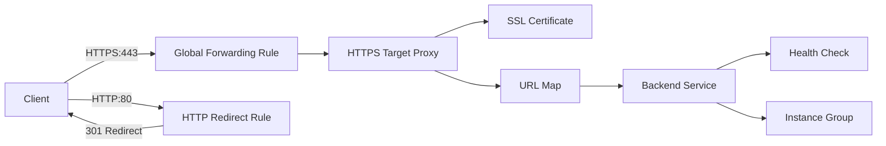

# How to Set Up an External HTTP(S) Load Balancer with Managed SSL Certificates in GCP

Author: [nawazdhandala](https://www.github.com/nawazdhandala)

Tags: GCP, Load Balancer, SSL, HTTPS, Google Cloud

Description: Step-by-step guide to setting up an external HTTP(S) load balancer with Google-managed SSL certificates in GCP for secure, scalable web traffic distribution.

---

If you are running a web application on Google Cloud Platform and want to serve traffic over HTTPS without managing your own certificates, the external HTTP(S) load balancer with Google-managed SSL certificates is the way to go. Google handles the certificate lifecycle - provisioning, renewal, and rotation - so you can focus on building your application instead of wrestling with certificate management.

In this post, I will walk you through the entire setup process, from creating backend resources to attaching a managed SSL certificate and verifying everything works.

## Prerequisites

Before starting, you need a few things in place:

- A GCP project with billing enabled
- The `gcloud` CLI installed and configured
- At least one instance group or backend service running your application
- A registered domain name with DNS access (you will need to point it at the load balancer IP)

## Step 1: Reserve a Global Static IP Address

Your load balancer needs a static external IP address. This is the IP you will point your domain's DNS records to.

```bash
# Reserve a global static IP address for the load balancer
gcloud compute addresses create lb-ipv4-address \
    --ip-version=IPV4 \
    --global
```

Grab the IP so you can update your DNS records:

```bash
# Display the reserved IP address
gcloud compute addresses describe lb-ipv4-address \
    --format="get(address)" \
    --global
```

Go to your DNS provider and create an A record pointing your domain (e.g., `app.example.com`) to this IP address. DNS propagation can take anywhere from a few minutes to 48 hours, though it is usually much faster.

## Step 2: Create a Health Check

Health checks tell the load balancer which backend instances are ready to receive traffic. If an instance fails the health check, traffic stops going to it.

```bash
# Create an HTTP health check that pings the root path
gcloud compute health-checks create http http-basic-check \
    --port 80 \
    --request-path="/" \
    --check-interval=10s \
    --timeout=5s \
    --healthy-threshold=2 \
    --unhealthy-threshold=3
```

The settings above check the root path on port 80 every 10 seconds. An instance is considered healthy after 2 consecutive successes and unhealthy after 3 consecutive failures.

## Step 3: Create a Backend Service

The backend service ties your instance group to the load balancer and applies the health check.

```bash
# Create a backend service with the health check attached
gcloud compute backend-services create web-backend-service \
    --protocol=HTTP \
    --port-name=http \
    --health-checks=http-basic-check \
    --global
```

Now add your instance group to the backend service:

```bash
# Add the instance group as a backend
gcloud compute backend-services add-backend web-backend-service \
    --instance-group=my-instance-group \
    --instance-group-zone=us-central1-a \
    --global
```

## Step 4: Create a URL Map

The URL map routes incoming requests to the appropriate backend service. For a basic setup, you just need a default route.

```bash
# Create a URL map that sends all traffic to the backend service
gcloud compute url-maps create web-map-https \
    --default-service web-backend-service
```

## Step 5: Create the Google-Managed SSL Certificate

This is where the magic happens. Google will automatically provision and renew the certificate for your domain.

```bash
# Create a Google-managed SSL certificate for your domain
gcloud compute ssl-certificates create my-ssl-cert \
    --domains=app.example.com \
    --global
```

You can specify multiple domains by separating them with commas:

```bash
# Create a certificate covering multiple domains
gcloud compute ssl-certificates create my-multi-cert \
    --domains=app.example.com,www.example.com,api.example.com \
    --global
```

Keep in mind that the certificate will not be provisioned until DNS is properly configured and the load balancer is serving traffic. Google needs to verify domain ownership through the HTTP-01 challenge.

## Step 6: Create the HTTPS Target Proxy

The target proxy connects the URL map to the SSL certificate.

```bash
# Create an HTTPS target proxy linking the URL map and SSL certificate
gcloud compute target-https-proxies create https-lb-proxy \
    --url-map=web-map-https \
    --ssl-certificates=my-ssl-cert
```

## Step 7: Create the Global Forwarding Rule

The forwarding rule ties the external IP address to the target proxy on port 443.

```bash
# Create the forwarding rule to route HTTPS traffic to the proxy
gcloud compute forwarding-rules create https-content-rule \
    --address=lb-ipv4-address \
    --global \
    --target-https-proxy=https-lb-proxy \
    --ports=443
```

## Step 8: Set Up HTTP to HTTPS Redirect (Optional but Recommended)

You almost certainly want to redirect HTTP traffic to HTTPS. This requires a separate HTTP load balancer that redirects all requests.

```bash
# Create a URL map that redirects HTTP to HTTPS
gcloud compute url-maps import http-redirect \
    --source=/dev/stdin <<EOF
name: http-redirect
defaultUrlRedirect:
  redirectResponseCode: MOVED_PERMANENTLY_DEFAULT
  httpsRedirect: True
EOF

# Create an HTTP target proxy for the redirect
gcloud compute target-http-proxies create http-redirect-proxy \
    --url-map=http-redirect

# Create a forwarding rule for port 80
gcloud compute forwarding-rules create http-redirect-rule \
    --address=lb-ipv4-address \
    --global \
    --target-http-proxy=http-redirect-proxy \
    --ports=80
```

## Step 9: Verify Certificate Provisioning

Google-managed certificates can take anywhere from 15 minutes to an hour to provision. Check the status with:

```bash
# Check the status of your managed SSL certificate
gcloud compute ssl-certificates describe my-ssl-cert \
    --global \
    --format="get(managed.status)"
```

You want to see `ACTIVE`. If it shows `PROVISIONING`, give it more time. If it shows `FAILED_NOT_VISIBLE`, double-check your DNS records and make sure the forwarding rule is in place.

## Step 10: Test Your Setup

Once the certificate is active, test it:

```bash
# Verify HTTPS is working
curl -I https://app.example.com

# Verify HTTP redirects to HTTPS
curl -I http://app.example.com
```

You should see a 200 response from the HTTPS request and a 301 redirect from the HTTP request.

## Architecture Overview

Here is how all the pieces fit together:



## Common Issues and Fixes

**Certificate stuck in PROVISIONING state**: The most common cause is DNS not pointing to the load balancer IP. Verify with `dig app.example.com` and confirm the A record matches your reserved IP.

**502 Bad Gateway errors**: This usually means the health check is failing. Check that your application is responding on the health check port and path. Also verify that firewall rules allow traffic from the Google health check IP ranges (130.211.0.0/22 and 35.191.0.0/16).

**Mixed content warnings**: If your application serves some resources over HTTP, browsers will block or warn about them. Make sure your application generates HTTPS URLs for all resources.

## Cost Considerations

The external HTTP(S) load balancer has a few cost components: a base charge for the forwarding rule (around $0.025/hour), a charge per GB of data processed, and the managed SSL certificate itself is free. For most applications, the load balancer cost is modest compared to the compute resources behind it.

## Wrapping Up

Setting up an external HTTP(S) load balancer with managed SSL certificates in GCP is straightforward once you understand the components. The key pieces are the backend service, URL map, SSL certificate, target proxy, and forwarding rule. Google handles certificate provisioning and renewal automatically, which eliminates one of the more tedious parts of running HTTPS in production. Just make sure your DNS is configured before you create the certificate, and give it some time to provision.
