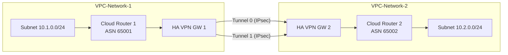

# How to Set Up an HA VPN Connection Between Two GCP VPC Networks

Author: [nawazdhandala](https://www.github.com/nawazdhandala)

Tags: GCP, VPN, HA VPN, VPC, Networking, Cloud Networking

Description: Learn how to set up a high-availability VPN connection between two Google Cloud VPC networks using HA VPN gateways and Cloud Router for dynamic routing.

---

If you have workloads spread across multiple VPC networks in Google Cloud, you probably need a way to connect them privately. While VPC peering is one option, sometimes you need the encryption and routing flexibility that VPN provides. That is where HA VPN comes in.

HA VPN (High Availability VPN) gives you an IPsec VPN connection with a 99.99% uptime SLA when properly configured. In this post, I will walk you through connecting two GCP VPC networks using HA VPN, step by step.

## Why HA VPN Between VPCs?

You might ask: why not just use VPC Peering? There are a few reasons to choose HA VPN instead:

- **Encryption in transit**: HA VPN encrypts all traffic between VPCs using IPsec. VPC Peering does not.
- **Overlapping IP ranges**: VPC Peering requires non-overlapping CIDR ranges. VPN can work around this with NAT.
- **Transitive routing**: VPC Peering is non-transitive. VPN with Cloud Router lets you build more flexible routing topologies.
- **Cross-org connectivity**: HA VPN works across different GCP organizations, while peering has limitations.

## Prerequisites

Before starting, make sure you have:

- Two VPC networks in GCP (they can be in the same or different projects)
- The Compute Engine API enabled in both projects
- Appropriate IAM permissions (Compute Network Admin role)
- Non-overlapping subnet ranges (unless you plan to use NAT)

## Step 1: Create the HA VPN Gateways

You need one HA VPN gateway in each VPC. Each gateway automatically gets two external interfaces for redundancy.

Create the gateway in the first VPC:

```bash
# Create HA VPN gateway in vpc-network-1
gcloud compute vpn-gateways create ha-vpn-gw-1 \
    --network=vpc-network-1 \
    --region=us-central1
```

Create the gateway in the second VPC:

```bash
# Create HA VPN gateway in vpc-network-2
gcloud compute vpn-gateways create ha-vpn-gw-2 \
    --network=vpc-network-2 \
    --region=us-central1
```

## Step 2: Create Cloud Routers

HA VPN uses BGP for dynamic route exchange, which requires Cloud Router on each side.

```bash
# Create Cloud Router in the first VPC
gcloud compute routers create router-1 \
    --region=us-central1 \
    --network=vpc-network-1 \
    --asn=65001

# Create Cloud Router in the second VPC
gcloud compute routers create router-2 \
    --region=us-central1 \
    --network=vpc-network-2 \
    --asn=65002
```

The ASN (Autonomous System Number) values need to be different for each router. You can use any private ASN in the range 64512-65534 or 4200000000-4294967294.

## Step 3: Create the VPN Tunnels

For a full 99.99% SLA, you need to create four tunnels total - two from each gateway interface to each interface on the other gateway. At minimum, you need two tunnels (one per gateway interface) connecting to the peer.

Here is how to create two tunnels connecting interface 0 to interface 0 and interface 1 to interface 1:

```bash
# Tunnel from gw-1 interface 0 to gw-2 interface 0
gcloud compute vpn-tunnels create tunnel-1-to-2-if0 \
    --peer-gcp-gateway=ha-vpn-gw-2 \
    --region=us-central1 \
    --ike-version=2 \
    --shared-secret=your-shared-secret-here \
    --router=router-1 \
    --vpn-gateway=ha-vpn-gw-1 \
    --interface=0 \
    --peer-gcp-gateway-region=us-central1

# Tunnel from gw-1 interface 1 to gw-2 interface 1
gcloud compute vpn-tunnels create tunnel-1-to-2-if1 \
    --peer-gcp-gateway=ha-vpn-gw-2 \
    --region=us-central1 \
    --ike-version=2 \
    --shared-secret=your-shared-secret-here \
    --router=router-1 \
    --vpn-gateway=ha-vpn-gw-1 \
    --interface=1 \
    --peer-gcp-gateway-region=us-central1
```

Now create the tunnels on the other side:

```bash
# Tunnel from gw-2 interface 0 to gw-1 interface 0
gcloud compute vpn-tunnels create tunnel-2-to-1-if0 \
    --peer-gcp-gateway=ha-vpn-gw-1 \
    --region=us-central1 \
    --ike-version=2 \
    --shared-secret=your-shared-secret-here \
    --router=router-2 \
    --vpn-gateway=ha-vpn-gw-2 \
    --interface=0 \
    --peer-gcp-gateway-region=us-central1

# Tunnel from gw-2 interface 1 to gw-1 interface 1
gcloud compute vpn-tunnels create tunnel-2-to-1-if1 \
    --peer-gcp-gateway=ha-vpn-gw-1 \
    --region=us-central1 \
    --ike-version=2 \
    --shared-secret=your-shared-secret-here \
    --router=router-2 \
    --vpn-gateway=ha-vpn-gw-2 \
    --interface=1 \
    --peer-gcp-gateway-region=us-central1
```

Make sure the shared secret matches on both sides of each tunnel pair.

## Step 4: Configure BGP Sessions

Now you need to create BGP sessions on each Cloud Router so the two VPCs can exchange routes.

```bash
# Add BGP interface and peer on router-1 for tunnel on interface 0
gcloud compute routers add-interface router-1 \
    --interface-name=if-tunnel-1-to-2-if0 \
    --ip-address=169.254.0.1 \
    --mask-length=30 \
    --vpn-tunnel=tunnel-1-to-2-if0 \
    --region=us-central1

gcloud compute routers add-bgp-peer router-1 \
    --peer-name=peer-tunnel-1-to-2-if0 \
    --interface=if-tunnel-1-to-2-if0 \
    --peer-ip-address=169.254.0.2 \
    --peer-asn=65002 \
    --region=us-central1

# Add BGP interface and peer on router-1 for tunnel on interface 1
gcloud compute routers add-interface router-1 \
    --interface-name=if-tunnel-1-to-2-if1 \
    --ip-address=169.254.1.1 \
    --mask-length=30 \
    --vpn-tunnel=tunnel-1-to-2-if1 \
    --region=us-central1

gcloud compute routers add-bgp-peer router-1 \
    --peer-name=peer-tunnel-1-to-2-if1 \
    --interface=if-tunnel-1-to-2-if1 \
    --peer-ip-address=169.254.1.2 \
    --peer-asn=65002 \
    --region=us-central1
```

Repeat for router-2 with the corresponding IP addresses:

```bash
# Add BGP interface and peer on router-2 for tunnel on interface 0
gcloud compute routers add-interface router-2 \
    --interface-name=if-tunnel-2-to-1-if0 \
    --ip-address=169.254.0.2 \
    --mask-length=30 \
    --vpn-tunnel=tunnel-2-to-1-if0 \
    --region=us-central1

gcloud compute routers add-bgp-peer router-2 \
    --peer-name=peer-tunnel-2-to-1-if0 \
    --interface=if-tunnel-2-to-1-if0 \
    --peer-ip-address=169.254.0.1 \
    --peer-asn=65001 \
    --region=us-central1

# Add BGP interface and peer on router-2 for tunnel on interface 1
gcloud compute routers add-interface router-2 \
    --interface-name=if-tunnel-2-to-1-if1 \
    --ip-address=169.254.1.2 \
    --mask-length=30 \
    --vpn-tunnel=tunnel-2-to-1-if1 \
    --region=us-central1

gcloud compute routers add-bgp-peer router-2 \
    --peer-name=peer-tunnel-2-to-1-if1 \
    --interface=if-tunnel-2-to-1-if1 \
    --peer-ip-address=169.254.1.1 \
    --peer-asn=65001 \
    --region=us-central1
```

## Step 5: Verify the Connection

Give it a minute or two for the BGP sessions to establish, then verify everything is working.

```bash
# Check VPN tunnel status
gcloud compute vpn-tunnels describe tunnel-1-to-2-if0 \
    --region=us-central1 \
    --format="value(status, detailedStatus)"

# Check BGP session status on Cloud Router
gcloud compute routers get-status router-1 \
    --region=us-central1 \
    --format="table(result.bgpPeerStatus[].name, result.bgpPeerStatus[].status, result.bgpPeerStatus[].numLearnedRoutes)"
```

You should see `ESTABLISHED` for the tunnel status and `UP` for the BGP peer status.

## Architecture Overview

Here is a visual overview of what you just built:



## Troubleshooting Tips

If your tunnels are not coming up, check these common issues:

- **Shared secret mismatch**: The pre-shared key must be identical on both tunnel ends.
- **Firewall rules**: Make sure you have firewall rules allowing traffic between the subnets on both VPCs.
- **BGP ASN conflicts**: Each Cloud Router needs a unique ASN.
- **Link-local IP overlap**: The 169.254.x.x addresses used for BGP peering must not overlap between tunnel pairs.

## Wrapping Up

Setting up HA VPN between two GCP VPCs is a reliable way to establish encrypted, dynamically-routed connectivity. The key ingredients are paired HA VPN gateways, Cloud Routers with BGP, and properly configured tunnels on both sides. Once the BGP sessions are up, routes propagate automatically, and you get failover between the redundant tunnels without any manual intervention.

For production environments, always configure tunnels on both interfaces of each gateway to qualify for the 99.99% SLA. And remember to use strong, unique shared secrets for each tunnel pair.
