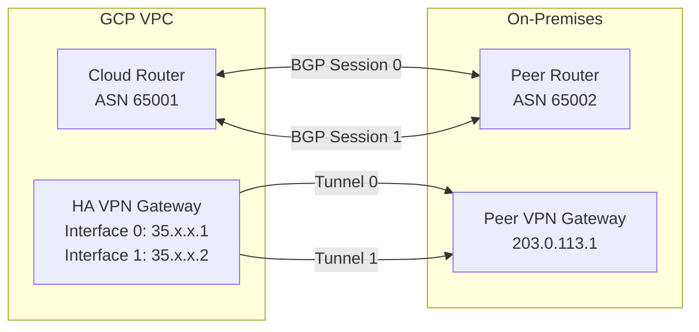

# How to Set Up an HA VPN Gateway with BGP Sessions in GCP

Author: [nawazdhandala](https://www.github.com/nawazdhandala)

Tags: GCP, HA VPN, BGP, Cloud Router, Networking

Description: Deploy a high-availability VPN gateway in GCP with BGP dynamic routing to establish resilient, encrypted site-to-site connectivity with automatic failover.

---

HA VPN is Google Cloud's recommended VPN solution for production workloads. Unlike Classic VPN, HA VPN provides a 99.99% availability SLA when configured with two tunnels, and it uses BGP for dynamic routing so that routes are automatically exchanged between your on-premises network and GCP. No more manually managing static routes that break when a tunnel goes down.

This guide walks through the complete setup of an HA VPN gateway with BGP sessions, from gateway creation to route verification.

## How HA VPN Works

An HA VPN gateway has two interfaces, each with its own external IP address. You create VPN tunnels from each interface to your peer gateway, giving you redundancy. If one tunnel fails, traffic automatically shifts to the other.

BGP (Border Gateway Protocol) handles route exchange. Cloud Router on the GCP side advertises your VPC routes to the peer, and the peer advertises its routes back. When a tunnel goes down, BGP detects it and updates routes accordingly.



## Prerequisites

You need:
- A GCP project with billing enabled
- A VPC network with subnets
- Your on-premises VPN gateway's public IP address(es)
- Your on-premises network's ASN (Autonomous System Number)
- The on-premises network ranges you want to advertise
- A shared secret (pre-shared key) for the VPN tunnels

## Step 1: Create a Cloud Router

The Cloud Router handles BGP sessions with your on-premises router:

```bash
# Create a Cloud Router with a private ASN
gcloud compute routers create vpn-router \
  --network=your-vpc \
  --region=us-central1 \
  --asn=65001 \
  --project=your-project-id
```

Choose an ASN in the private range (64512-65534 for 16-bit, or 4200000000-4294967294 for 32-bit). Make sure it does not conflict with your on-premises ASN.

## Step 2: Create the HA VPN Gateway

Create the HA VPN gateway. This automatically provisions two external IP addresses:

```bash
# Create an HA VPN gateway
gcloud compute vpn-gateways create ha-vpn-gateway \
  --network=your-vpc \
  --region=us-central1 \
  --project=your-project-id
```

View the assigned external IPs:

```bash
# Get the HA VPN gateway details
gcloud compute vpn-gateways describe ha-vpn-gateway \
  --region=us-central1 \
  --project=your-project-id \
  --format="yaml(vpnInterfaces)"
```

Note both IP addresses. You will need to configure these on your on-premises VPN gateway.

## Step 3: Create the Peer VPN Gateway

Register your on-premises VPN gateway in GCP:

```bash
# Create a peer VPN gateway with a single external IP
gcloud compute external-vpn-gateways create on-prem-gateway \
  --interfaces="0=203.0.113.1" \
  --project=your-project-id
```

If your on-premises gateway has two external IPs (for full HA):

```bash
# Create a peer VPN gateway with two external IPs
gcloud compute external-vpn-gateways create on-prem-gateway \
  --interfaces="0=203.0.113.1,1=203.0.113.2" \
  --project=your-project-id
```

## Step 4: Create VPN Tunnels

Create two tunnels - one from each HA VPN interface:

```bash
# Create tunnel 0 from HA VPN interface 0
gcloud compute vpn-tunnels create tunnel-0 \
  --vpn-gateway=ha-vpn-gateway \
  --vpn-gateway-region=us-central1 \
  --peer-external-gateway=on-prem-gateway \
  --peer-external-gateway-interface=0 \
  --interface=0 \
  --ike-version=2 \
  --shared-secret="your-shared-secret-here" \
  --router=vpn-router \
  --region=us-central1 \
  --project=your-project-id

# Create tunnel 1 from HA VPN interface 1
gcloud compute vpn-tunnels create tunnel-1 \
  --vpn-gateway=ha-vpn-gateway \
  --vpn-gateway-region=us-central1 \
  --peer-external-gateway=on-prem-gateway \
  --peer-external-gateway-interface=0 \
  --interface=1 \
  --ike-version=2 \
  --shared-secret="your-shared-secret-here" \
  --router=vpn-router \
  --region=us-central1 \
  --project=your-project-id
```

If the peer gateway has two interfaces, point tunnel-1 to interface 1:

```bash
# Tunnel 1 to peer interface 1 (for dual-interface peers)
gcloud compute vpn-tunnels create tunnel-1 \
  --vpn-gateway=ha-vpn-gateway \
  --vpn-gateway-region=us-central1 \
  --peer-external-gateway=on-prem-gateway \
  --peer-external-gateway-interface=1 \
  --interface=1 \
  --ike-version=2 \
  --shared-secret="your-shared-secret-here" \
  --router=vpn-router \
  --region=us-central1 \
  --project=your-project-id
```

## Step 5: Create BGP Sessions

Add BGP interfaces and peers to the Cloud Router for each tunnel:

```bash
# Add BGP interface for tunnel 0
gcloud compute routers add-interface vpn-router \
  --interface-name=bgp-interface-0 \
  --vpn-tunnel=tunnel-0 \
  --ip-address=169.254.0.1 \
  --mask-length=30 \
  --region=us-central1 \
  --project=your-project-id

# Add BGP peer for tunnel 0
gcloud compute routers add-bgp-peer vpn-router \
  --peer-name=bgp-peer-0 \
  --interface=bgp-interface-0 \
  --peer-ip-address=169.254.0.2 \
  --peer-asn=65002 \
  --region=us-central1 \
  --project=your-project-id

# Add BGP interface for tunnel 1
gcloud compute routers add-interface vpn-router \
  --interface-name=bgp-interface-1 \
  --vpn-tunnel=tunnel-1 \
  --ip-address=169.254.1.1 \
  --mask-length=30 \
  --region=us-central1 \
  --project=your-project-id

# Add BGP peer for tunnel 1
gcloud compute routers add-bgp-peer vpn-router \
  --peer-name=bgp-peer-1 \
  --interface=bgp-interface-1 \
  --peer-ip-address=169.254.1.2 \
  --peer-asn=65002 \
  --region=us-central1 \
  --project=your-project-id
```

The BGP link-local IP addresses (169.254.x.x) must match what you configure on the on-premises router. Each side of the tunnel uses a /30 block for the BGP session.

## Step 6: Configure the On-Premises Router

On your on-premises router, configure:
- Two IPsec tunnels pointing to the GCP HA VPN gateway's two external IPs
- The same pre-shared key on each tunnel
- BGP sessions using the link-local IP addresses from Step 5
- Advertise your on-premises network prefixes via BGP

The exact configuration depends on your router vendor. Here is a generic example:

```
# Tunnel 0 settings
Peer IP: [GCP HA VPN Interface 0 IP]
Local BGP IP: 169.254.0.2
Remote BGP IP: 169.254.0.1
Remote ASN: 65001

# Tunnel 1 settings
Peer IP: [GCP HA VPN Interface 1 IP]
Local BGP IP: 169.254.1.2
Remote BGP IP: 169.254.1.1
Remote ASN: 65001
```

## Step 7: Verify the Setup

Check tunnel status:

```bash
# Check VPN tunnel status
gcloud compute vpn-tunnels describe tunnel-0 \
  --region=us-central1 \
  --format="yaml(status, detailedStatus)" \
  --project=your-project-id

gcloud compute vpn-tunnels describe tunnel-1 \
  --region=us-central1 \
  --format="yaml(status, detailedStatus)" \
  --project=your-project-id
```

Both tunnels should show `status: ESTABLISHED`.

Check BGP session status:

```bash
# Check BGP session status
gcloud compute routers get-status vpn-router \
  --region=us-central1 \
  --project=your-project-id \
  --format="yaml(result.bgpPeerStatus)"
```

BGP peers should show `status: UP` and list the routes being advertised and received.

Check learned routes:

```bash
# View routes learned from the on-premises network
gcloud compute routers get-status vpn-router \
  --region=us-central1 \
  --project=your-project-id \
  --format="yaml(result.bestRoutesForRouter)"
```

## Testing Connectivity

From a GCP VM, ping an on-premises host:

```bash
# Test connectivity to on-premises
gcloud compute ssh your-vm \
  --zone=us-central1-a \
  --command="ping -c 5 192.168.1.1" \
  --project=your-project-id
```

Replace `192.168.1.1` with an actual on-premises IP address that should be reachable.

## Monitoring

Set up monitoring for your VPN tunnels:

```bash
# Check tunnel bytes in/out
gcloud monitoring metrics list \
  --filter='metric.type="compute.googleapis.com/vpn_tunnel/sent_bytes_count"' \
  --project=your-project-id
```

Key metrics to monitor:
- Tunnel sent/received bytes
- Tunnel sent/received packets
- BGP session status
- BGP routes received/advertised

## Wrapping Up

HA VPN with BGP is the production-grade VPN setup for GCP. The dual-tunnel configuration provides redundancy with automatic failover, and BGP ensures routes are dynamically updated without manual intervention. The setup involves several steps - creating the gateway, tunnels, and BGP sessions - but each step is straightforward. Once established, the VPN runs reliably with minimal maintenance needed. The main ongoing task is monitoring tunnel health and BGP session status to catch any issues early.
