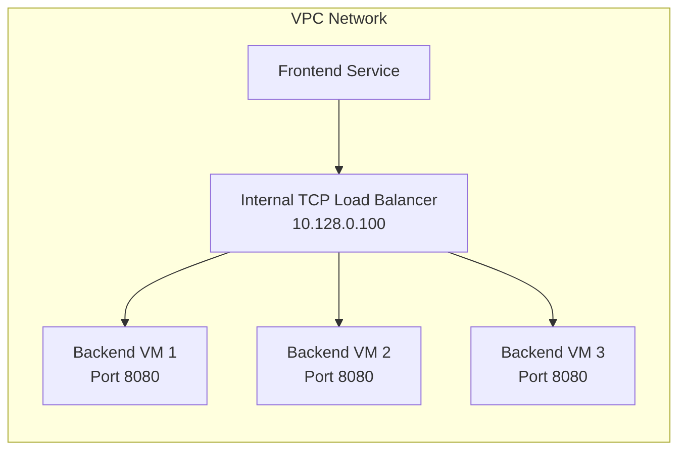

# How to Set Up an Internal TCP Load Balancer for a Managed Instance Group on Compute Engine

Author: [nawazdhandala](https://www.github.com/nawazdhandala)

Tags: GCP, Compute Engine, Load Balancer, Internal TCP, Managed Instance Groups

Description: Learn how to set up an internal TCP load balancer for a managed instance group on GCP Compute Engine to distribute traffic across backend instances privately.

---

Not every load balancer needs to face the internet. Internal TCP load balancers distribute traffic between services within your VPC network - think microservices calling each other, application servers talking to database replicas, or any backend-to-backend communication. They provide a single IP address that routes traffic to healthy instances without exposing anything to the public internet.

In this post, I will walk through setting up an internal TCP load balancer in front of a managed instance group on GCP Compute Engine.

## Architecture Overview

Here is what we are building:



The internal load balancer gets a private IP address from your VPC subnet. Traffic from frontend services hits this IP and gets distributed across healthy backend instances.

## Step 1: Create an Instance Template

First, create an instance template for the backend instances. This template includes a simple web server that listens on port 8080.

```bash
# Create an instance template for backend services
gcloud compute instance-templates create backend-template \
    --machine-type=e2-medium \
    --image-family=debian-12 \
    --image-project=debian-cloud \
    --tags=backend-service \
    --metadata=startup-script='#!/bin/bash
apt-get update && apt-get install -y python3
HOSTNAME=$(hostname)

# Start a simple HTTP server that returns the hostname
python3 -c "
from http.server import HTTPServer, BaseHTTPRequestHandler
import socket

class Handler(BaseHTTPRequestHandler):
    def do_GET(self):
        if self.path == \"/health\":
            self.send_response(200)
            self.end_headers()
            self.wfile.write(b\"ok\")
        else:
            self.send_response(200)
            self.end_headers()
            self.wfile.write(f\"Response from {socket.gethostname()}\".encode())
    def log_message(self, format, *args):
        pass

HTTPServer((\"0.0.0.0\", 8080), Handler).serve_forever()
" &'
```

## Step 2: Create a Managed Instance Group

Create a managed instance group with three instances:

```bash
# Create a managed instance group with 3 backend instances
gcloud compute instance-groups managed create backend-mig \
    --template=backend-template \
    --size=3 \
    --zone=us-central1-a
```

Set the named port so the load balancer knows which port to send traffic to:

```bash
# Configure the named port for the instance group
gcloud compute instance-groups set-named-ports backend-mig \
    --named-ports=http:8080 \
    --zone=us-central1-a
```

## Step 3: Create a Health Check

The load balancer uses a health check to determine which instances can receive traffic:

```bash
# Create a health check for the backend service
gcloud compute health-checks create http backend-health-check \
    --port=8080 \
    --request-path=/health \
    --check-interval=10s \
    --timeout=5s \
    --healthy-threshold=2 \
    --unhealthy-threshold=3
```

## Step 4: Create a Backend Service

The backend service ties the instance group to the health check:

```bash
# Create a regional backend service for the internal load balancer
gcloud compute backend-services create backend-service \
    --load-balancing-scheme=INTERNAL \
    --protocol=TCP \
    --health-checks=backend-health-check \
    --region=us-central1
```

Add the instance group as a backend:

```bash
# Add the managed instance group as a backend
gcloud compute backend-services add-backend backend-service \
    --instance-group=backend-mig \
    --instance-group-zone=us-central1-a \
    --region=us-central1
```

## Step 5: Create a Forwarding Rule

The forwarding rule gives the load balancer its internal IP address:

```bash
# Create a forwarding rule that assigns an internal IP to the load balancer
gcloud compute forwarding-rules create backend-forwarding-rule \
    --load-balancing-scheme=INTERNAL \
    --network=default \
    --subnet=default \
    --region=us-central1 \
    --ip-protocol=TCP \
    --ports=8080 \
    --backend-service=backend-service
```

You can also specify a particular IP address:

```bash
# Create a forwarding rule with a specific internal IP
gcloud compute forwarding-rules create backend-forwarding-rule \
    --load-balancing-scheme=INTERNAL \
    --network=default \
    --subnet=default \
    --region=us-central1 \
    --ip-protocol=TCP \
    --ports=8080 \
    --backend-service=backend-service \
    --address=10.128.0.100
```

## Step 6: Create Firewall Rules

Allow health check traffic and inter-service communication:

```bash
# Allow health check probes from Google's health check ranges
gcloud compute firewall-rules create allow-health-check-backend \
    --network=default \
    --action=allow \
    --direction=ingress \
    --source-ranges=130.211.0.0/22,35.191.0.0/16 \
    --target-tags=backend-service \
    --rules=tcp:8080

# Allow traffic from frontend services to the backend
gcloud compute firewall-rules create allow-internal-backend \
    --network=default \
    --action=allow \
    --direction=ingress \
    --source-tags=frontend-service \
    --target-tags=backend-service \
    --rules=tcp:8080
```

## Step 7: Test the Load Balancer

Get the internal IP of the load balancer:

```bash
# Get the forwarding rule details including the IP address
gcloud compute forwarding-rules describe backend-forwarding-rule \
    --region=us-central1 \
    --format="value(IPAddress)"
```

From any VM in the same VPC, test the load balancer:

```bash
# From a frontend VM, test the internal load balancer
curl http://10.128.0.100:8080
# Response from backend-mig-xxxx

curl http://10.128.0.100:8080
# Response from backend-mig-yyyy

curl http://10.128.0.100:8080
# Response from backend-mig-zzzz
```

You should see responses from different backend instances as traffic is distributed.

## Complete Terraform Configuration

Here is the full setup in Terraform:

```hcl
# Instance template for backend services
resource "google_compute_instance_template" "backend" {
  name_prefix  = "backend-"
  machine_type = "e2-medium"

  disk {
    source_image = "debian-cloud/debian-12"
    auto_delete  = true
    boot         = true
  }

  network_interface {
    network    = "default"
    subnetwork = "default"
  }

  tags = ["backend-service"]

  metadata_startup_script = file("${path.module}/scripts/backend-startup.sh")

  lifecycle {
    create_before_destroy = true
  }
}

# Managed instance group
resource "google_compute_instance_group_manager" "backend" {
  name               = "backend-mig"
  base_instance_name = "backend"
  zone               = "us-central1-a"
  target_size        = 3

  version {
    instance_template = google_compute_instance_template.backend.id
  }

  named_port {
    name = "http"
    port = 8080
  }
}

# Health check
resource "google_compute_health_check" "backend" {
  name               = "backend-health-check"
  check_interval_sec = 10
  timeout_sec        = 5
  healthy_threshold  = 2
  unhealthy_threshold = 3

  http_health_check {
    port         = 8080
    request_path = "/health"
  }
}

# Regional backend service for internal load balancing
resource "google_compute_region_backend_service" "backend" {
  name                  = "backend-service"
  region                = "us-central1"
  load_balancing_scheme = "INTERNAL"
  protocol              = "TCP"
  health_checks         = [google_compute_health_check.backend.id]

  backend {
    group = google_compute_instance_group_manager.backend.instance_group
  }
}

# Forwarding rule (the load balancer's internal IP)
resource "google_compute_forwarding_rule" "backend" {
  name                  = "backend-forwarding-rule"
  region                = "us-central1"
  load_balancing_scheme = "INTERNAL"
  network               = "default"
  subnetwork            = "default"
  ip_protocol           = "TCP"
  ports                 = ["8080"]
  backend_service       = google_compute_region_backend_service.backend.id
}

# Firewall rules
resource "google_compute_firewall" "health_check" {
  name    = "allow-health-check-backend"
  network = "default"

  allow {
    protocol = "tcp"
    ports    = ["8080"]
  }

  source_ranges = ["130.211.0.0/22", "35.191.0.0/16"]
  target_tags   = ["backend-service"]
}

resource "google_compute_firewall" "internal" {
  name    = "allow-internal-backend"
  network = "default"

  allow {
    protocol = "tcp"
    ports    = ["8080"]
  }

  source_tags = ["frontend-service"]
  target_tags = ["backend-service"]
}
```

## Session Affinity

If you need requests from the same client to consistently reach the same backend, configure session affinity:

```bash
# Enable client IP session affinity
gcloud compute backend-services update backend-service \
    --session-affinity=CLIENT_IP \
    --region=us-central1
```

Options include:
- **NONE**: No session affinity (default, best for stateless services)
- **CLIENT_IP**: Route based on client IP address
- **CLIENT_IP_PROTO**: Route based on client IP and protocol
- **CLIENT_IP_PORT_PROTO**: Route based on client IP, port, and protocol

## Multi-Zone Setup

For high availability, use backends across multiple zones:

```bash
# Create MIGs in multiple zones
gcloud compute instance-groups managed create backend-mig-b \
    --template=backend-template \
    --size=3 \
    --zone=us-central1-b

# Add the second zone as a backend
gcloud compute backend-services add-backend backend-service \
    --instance-group=backend-mig-b \
    --instance-group-zone=us-central1-b \
    --region=us-central1
```

Or use a regional MIG for automatic distribution:

```bash
# Regional MIG distributes across zones automatically
gcloud compute instance-groups managed create backend-regional-mig \
    --template=backend-template \
    --size=6 \
    --region=us-central1
```

## DNS Integration

Instead of hardcoding the load balancer IP, use Cloud DNS:

```bash
# Create a DNS record for the internal load balancer
gcloud dns record-sets create backend.internal.example.com \
    --zone=internal-zone \
    --type=A \
    --ttl=60 \
    --rrdatas=10.128.0.100
```

Now frontend services can reach the backend at `backend.internal.example.com:8080`.

## Wrapping Up

Internal TCP load balancers are the backbone of microservices communication on GCP. They keep traffic private, distribute load across healthy instances, and provide a stable endpoint that does not change when backend instances are added or removed. The setup is a bit involved with all the components (health check, backend service, forwarding rule, firewall rules), but once in place, it works reliably and requires minimal maintenance. For production workloads, always use multi-zone backends and combine with autoscaling for a fully resilient setup.
