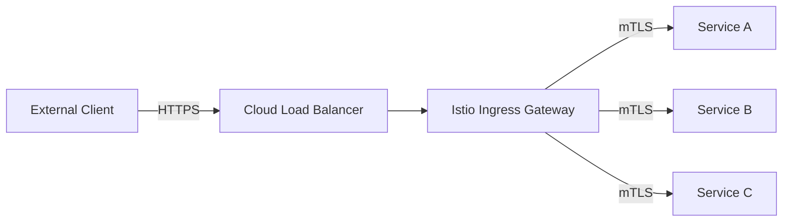

# How to Set Up an Istio Ingress Gateway with TLS Termination on GKE

Author: [nawazdhandala](https://www.github.com/nawazdhandala)

Tags: GCP, Istio, Ingress Gateway, TLS Termination, GKE

Description: Learn how to deploy and configure an Istio Ingress Gateway on GKE with TLS termination to securely expose your mesh services to external traffic.

---

Your services inside the mesh communicate over mTLS, but traffic coming from outside the mesh - from browsers, mobile apps, or API clients - needs an entry point. The Istio Ingress Gateway serves as that entry point, handling TLS termination, routing, and load balancing for external traffic before it enters the mesh. On GKE, the ingress gateway gets a Google Cloud Load Balancer IP, giving you a production-ready way to expose your services.

This guide walks through deploying an ingress gateway, configuring TLS with your own certificates, and setting up routing rules for your services.

## Architecture

The flow looks like this: external clients connect to the Load Balancer IP over HTTPS, the ingress gateway terminates TLS, and then forwards the request into the mesh where mTLS takes over.



## Step 1: Deploy the Ingress Gateway

For Cloud Service Mesh with the managed control plane, you deploy the gateway as a regular Kubernetes deployment with the `inject.istio.io/templates: gateway` annotation.

```yaml
# ingress-gateway.yaml
# Deploys an Istio ingress gateway with auto-injection
apiVersion: v1
kind: ServiceAccount
metadata:
  name: istio-ingressgateway
  namespace: istio-system
---
apiVersion: apps/v1
kind: Deployment
metadata:
  name: istio-ingressgateway
  namespace: istio-system
spec:
  replicas: 2
  selector:
    matchLabels:
      app: istio-ingressgateway
      istio: ingressgateway
  template:
    metadata:
      annotations:
        inject.istio.io/templates: gateway
      labels:
        app: istio-ingressgateway
        istio: ingressgateway
    spec:
      serviceAccountName: istio-ingressgateway
      containers:
      - name: istio-proxy
        image: auto
        resources:
          requests:
            cpu: 200m
            memory: 256Mi
          limits:
            cpu: 2000m
            memory: 1024Mi
        ports:
        - containerPort: 8080
          protocol: TCP
        - containerPort: 8443
          protocol: TCP
---
apiVersion: v1
kind: Service
metadata:
  name: istio-ingressgateway
  namespace: istio-system
spec:
  type: LoadBalancer
  selector:
    app: istio-ingressgateway
    istio: ingressgateway
  ports:
  - name: http
    port: 80
    targetPort: 8080
  - name: https
    port: 443
    targetPort: 8443
```

```bash
# Deploy the gateway
kubectl apply -f ingress-gateway.yaml

# Wait for the external IP to be assigned
kubectl get svc istio-ingressgateway -n istio-system -w
```

Note the external IP address. You will need to point your DNS records at it.

## Step 2: Create the TLS Certificate Secret

You need a TLS certificate for your domain. You can use a certificate from a public CA, Let's Encrypt, or Google-managed certificates.

### Option A: Use Your Own Certificate

If you already have a certificate and key.

```bash
# Create the Kubernetes secret with your certificate
kubectl create secret tls my-tls-cert \
    --cert=path/to/fullchain.pem \
    --key=path/to/privkey.pem \
    -n istio-system
```

### Option B: Use cert-manager with Let's Encrypt

Install cert-manager and configure automatic certificate provisioning.

```bash
# Install cert-manager
kubectl apply -f https://github.com/cert-manager/cert-manager/releases/download/v1.14.0/cert-manager.yaml
```

Create a certificate issuer and certificate.

```yaml
# cert-issuer.yaml
# Let's Encrypt certificate issuer
apiVersion: cert-manager.io/v1
kind: ClusterIssuer
metadata:
  name: letsencrypt-prod
spec:
  acme:
    server: https://acme-v02.api.letsencrypt.org/directory
    email: admin@example.com
    privateKeySecretRef:
      name: letsencrypt-prod-key
    solvers:
    - http01:
        ingress:
          class: istio
---
# certificate.yaml
# Certificate request for your domain
apiVersion: cert-manager.io/v1
kind: Certificate
metadata:
  name: my-app-cert
  namespace: istio-system
spec:
  secretName: my-tls-cert
  issuerRef:
    name: letsencrypt-prod
    kind: ClusterIssuer
  dnsNames:
  - api.example.com
  - www.example.com
```

```bash
kubectl apply -f cert-issuer.yaml
```

## Step 3: Configure the Gateway Resource

The Gateway resource tells the ingress gateway which hosts and ports to listen on and which TLS certificates to use.

```yaml
# gateway.yaml
# Configures TLS termination on the ingress gateway
apiVersion: networking.istio.io/v1beta1
kind: Gateway
metadata:
  name: my-app-gateway
  namespace: istio-system
spec:
  selector:
    istio: ingressgateway
  servers:
  # HTTPS server with TLS termination
  - port:
      number: 443
      name: https
      protocol: HTTPS
    tls:
      mode: SIMPLE
      credentialName: my-tls-cert
    hosts:
    - "api.example.com"
    - "www.example.com"
  # HTTP server that redirects to HTTPS
  - port:
      number: 80
      name: http
      protocol: HTTP
    tls:
      httpsRedirect: true
    hosts:
    - "api.example.com"
    - "www.example.com"
```

```bash
kubectl apply -f gateway.yaml
```

The `httpsRedirect: true` on the HTTP server means any HTTP request gets a 301 redirect to HTTPS. This ensures all traffic is encrypted.

## Step 4: Configure Routing with VirtualService

The VirtualService defines how requests are routed from the gateway to your mesh services.

```yaml
# virtual-service.yaml
# Routes traffic from the gateway to backend services
apiVersion: networking.istio.io/v1beta1
kind: VirtualService
metadata:
  name: my-app-routes
  namespace: default
spec:
  hosts:
  - "api.example.com"
  gateways:
  - istio-system/my-app-gateway
  http:
  # Route /api/v1/* to the API service
  - match:
    - uri:
        prefix: /api/v1/
    route:
    - destination:
        host: api-service
        port:
          number: 8080
    timeout: 30s
    retries:
      attempts: 3
      perTryTimeout: 10s
      retryOn: "5xx,reset,connect-failure"
  # Route /auth/* to the auth service
  - match:
    - uri:
        prefix: /auth/
    route:
    - destination:
        host: auth-service
        port:
          number: 8080
  # Default route
  - route:
    - destination:
        host: frontend-service
        port:
          number: 8080
```

```bash
kubectl apply -f virtual-service.yaml
```

## Step 5: Configure TLS for Multiple Domains

If you serve multiple domains, add them to the Gateway and create separate VirtualServices.

```yaml
# multi-domain-gateway.yaml
# Gateway serving multiple domains with different certificates
apiVersion: networking.istio.io/v1beta1
kind: Gateway
metadata:
  name: multi-domain-gateway
  namespace: istio-system
spec:
  selector:
    istio: ingressgateway
  servers:
  - port:
      number: 443
      name: https-main
      protocol: HTTPS
    tls:
      mode: SIMPLE
      credentialName: main-site-cert
    hosts:
    - "www.example.com"
  - port:
      number: 443
      name: https-api
      protocol: HTTPS
    tls:
      mode: SIMPLE
      credentialName: api-cert
    hosts:
    - "api.example.com"
  - port:
      number: 443
      name: https-admin
      protocol: HTTPS
    tls:
      mode: SIMPLE
      credentialName: admin-cert
    hosts:
    - "admin.example.com"
```

Istio uses SNI (Server Name Indication) to select the correct certificate based on the hostname the client requests.

## Step 6: Enable Mutual TLS at the Gateway (Optional)

For APIs that require client certificate authentication, configure the gateway for mutual TLS.

```yaml
# mtls-gateway.yaml
# Gateway requiring client certificates
apiVersion: networking.istio.io/v1beta1
kind: Gateway
metadata:
  name: mtls-api-gateway
  namespace: istio-system
spec:
  selector:
    istio: ingressgateway
  servers:
  - port:
      number: 443
      name: https-mtls
      protocol: HTTPS
    tls:
      mode: MUTUAL
      credentialName: server-cert
      # The CA certificate used to verify client certificates
      caCertificates: /etc/istio/gateway-ca/ca.pem
    hosts:
    - "secure-api.example.com"
```

## Step 7: Test the Configuration

Verify that everything works end to end.

```bash
# Test HTTPS access
curl -v https://api.example.com/api/v1/health

# Test HTTP redirect
curl -v -L http://api.example.com/
# Should redirect to https://api.example.com/

# Test with a specific host header (useful before DNS is updated)
GATEWAY_IP=$(kubectl get svc istio-ingressgateway -n istio-system -o jsonpath='{.status.loadBalancer.ingress[0].ip}')
curl -v --resolve "api.example.com:443:$GATEWAY_IP" https://api.example.com/api/v1/health
```

## Step 8: Add Security Headers

Use an EnvoyFilter to add security headers to all responses from the gateway.

```yaml
# security-headers.yaml
# Adds security headers to gateway responses
apiVersion: networking.istio.io/v1alpha3
kind: EnvoyFilter
metadata:
  name: security-headers
  namespace: istio-system
spec:
  workloadSelector:
    labels:
      istio: ingressgateway
  configPatches:
  - applyTo: HTTP_FILTER
    match:
      context: GATEWAY
      listener:
        filterChain:
          filter:
            name: envoy.filters.network.http_connection_manager
    patch:
      operation: INSERT_BEFORE
      value:
        name: envoy.filters.http.lua
        typed_config:
          "@type": type.googleapis.com/envoy.extensions.filters.http.lua.v3.Lua
          inlineCode: |
            function envoy_on_response(response_handle)
              response_handle:headers():add("Strict-Transport-Security", "max-age=31536000; includeSubDomains")
              response_handle:headers():add("X-Content-Type-Options", "nosniff")
              response_handle:headers():add("X-Frame-Options", "DENY")
            end
```

## Monitoring the Gateway

Monitor your ingress gateway to catch issues before they affect users.

```bash
# Check gateway logs
kubectl logs -l app=istio-ingressgateway -n istio-system -f

# Check gateway metrics
kubectl exec -it deploy/istio-ingressgateway -n istio-system -- \
    curl -s localhost:15000/stats | grep "downstream_cx\|http.inbound"
```

Set up Cloud Monitoring alerts for:

- Gateway pod restarts
- High error rates (5xx responses)
- TLS handshake failures
- Connection count approaching limits

## Troubleshooting

**404 Not Found**: The gateway is receiving the request but no VirtualService matches. Check that the VirtualService specifies the correct gateway name and host.

**SSL handshake failure**: The certificate secret might not exist or might have the wrong name. Verify with `kubectl get secret my-tls-cert -n istio-system`.

**Connection timeout**: The backend service might not be responding. Check that the service exists and pods are running. Also check that the port in the VirtualService matches the service port.

**502 Bad Gateway**: Usually means the backend returned an error. Check the backend pod logs and the Envoy proxy logs on the gateway.

An Istio Ingress Gateway gives you a flexible, powerful entry point for external traffic into your mesh. Combined with TLS termination and the full suite of Istio traffic management features, it replaces traditional load balancer configurations with something far more capable.
