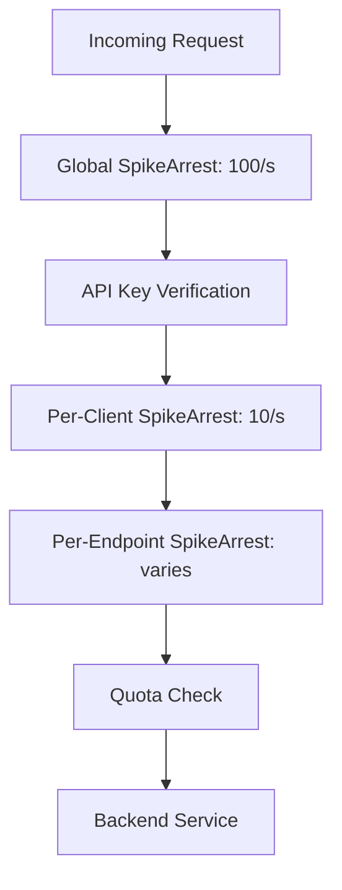

# How to Set Up Apigee Spike Arrest Policy to Handle Traffic Bursts

Author: [nawazdhandala](https://www.github.com/nawazdhandala)

Tags: Apigee, GCP, Spike Arrest, Traffic Management, API Protection

Description: A detailed guide to configuring the Apigee SpikeArrest policy to protect your backend APIs from sudden traffic bursts and ensure stable performance.

---

Traffic spikes are inevitable. Maybe a popular blog post links to your API, a mobile app push notification triggers a stampede of requests, or a client has a bug that fires requests in a tight loop. Your backend has a finite capacity, and when requests exceed that capacity, everything degrades - response times climb, errors multiply, and eventually the service goes down. The SpikeArrest policy in Apigee is your first line of defense.

## What SpikeArrest Actually Does

SpikeArrest is not a quota. It does not count total requests over a time period. Instead, it enforces a maximum rate by spacing out requests. If you set a rate of 10 per second, SpikeArrest ensures that at most one request passes through every 100 milliseconds. Two requests arriving 50ms apart will result in one being rejected.

This behavior is different from what most people expect. They think "10 per second" means any 10 requests within a 1-second window are okay. That is how a quota works. SpikeArrest works more like a leaky bucket - it smooths traffic into a steady stream.

## Why This Smoothing Behavior Matters

Consider a backend that can handle 60 requests per second sustainably. If 60 requests all arrive in the first 100ms of a second (followed by 900ms of silence), your backend sees a burst of 60 concurrent requests. Even though the per-second average is fine, the burst can overwhelm connection pools, database connections, and memory.

SpikeArrest prevents this by spacing requests evenly. With a rate of `60ps` (60 per second), requests are spaced approximately 16.7ms apart. Your backend sees a steady, predictable load.

## Basic SpikeArrest Configuration

Here is the simplest SpikeArrest policy:

```xml
<!-- apiproxy/policies/SpikeArrest-Global.xml -->
<?xml version="1.0" encoding="UTF-8" standalone="yes"?>
<SpikeArrest name="SpikeArrest-Global">
    <DisplayName>Global Spike Arrest</DisplayName>

    <!-- Allow 30 requests per second, evenly spaced -->
    <Rate>30ps</Rate>
</SpikeArrest>
```

Attach it as the first step in your proxy's PreFlow:

```xml
<!-- apiproxy/proxies/default.xml -->
<ProxyEndpoint name="default">
    <PreFlow name="PreFlow">
        <Request>
            <Step>
                <Name>SpikeArrest-Global</Name>
            </Step>
        </Request>
        <Response/>
    </PreFlow>
    <!-- ... -->
</ProxyEndpoint>
```

## Rate Format Options

SpikeArrest supports two rate formats:

- **Per second**: `30ps` means 30 per second (one request every ~33ms)
- **Per minute**: `300pm` means 300 per minute (one request every ~200ms)

Under the hood, both are converted to a per-millisecond interval. There is no "per hour" or "per day" option - those are what Quota is for.

A practical tip: if your desired rate results in intervals shorter than 1 millisecond, SpikeArrest effectively becomes a no-op because every request passes. For example, `10000ps` means one request every 0.1ms, which is effectively unlimited for most workloads.

## Per-Client SpikeArrest

The basic configuration applies the rate globally - all clients share the same rate limit. Often you want per-client limits so one aggressive client does not consume the entire rate allocation.

This policy applies the rate limit per API key:

```xml
<!-- apiproxy/policies/SpikeArrest-PerClient.xml -->
<?xml version="1.0" encoding="UTF-8" standalone="yes"?>
<SpikeArrest name="SpikeArrest-PerClient">
    <DisplayName>Per-Client Spike Arrest</DisplayName>

    <!-- Each client gets 10 requests per second -->
    <Rate>10ps</Rate>

    <!-- Use the API key as the identifier -->
    <Identifier ref="request.header.x-api-key"/>
</SpikeArrest>
```

You can use any variable as the identifier:
- `request.header.x-api-key` - per API key
- `client_id` - per verified client (after API key verification)
- `request.header.x-forwarded-for` - per IP address
- `proxy.pathsuffix` - per API endpoint

## Dynamic Rate Configuration

Sometimes you need to adjust the rate without redeploying. Use a variable reference so the rate can come from a KVM (Key Value Map) or other dynamic source.

This policy gets its rate from a flow variable:

```xml
<!-- apiproxy/policies/SpikeArrest-Dynamic.xml -->
<?xml version="1.0" encoding="UTF-8" standalone="yes"?>
<SpikeArrest name="SpikeArrest-Dynamic">
    <DisplayName>Dynamic Spike Arrest</DisplayName>

    <!-- Rate comes from a flow variable set by a KVM lookup or AssignMessage -->
    <Rate ref="spike.arrest.rate">
        <!-- Fallback rate if the variable is not set -->
        <Rate>30ps</Rate>
    </Rate>
</SpikeArrest>
```

Set the rate variable from a KVM or AssignMessage policy that runs before SpikeArrest:

```xml
<!-- apiproxy/policies/SetSpikeArrestRate.xml -->
<?xml version="1.0" encoding="UTF-8" standalone="yes"?>
<AssignMessage name="SetSpikeArrestRate">
    <DisplayName>Set Spike Arrest Rate</DisplayName>
    <AssignVariable>
        <Name>spike.arrest.rate</Name>
        <Value>50ps</Value>
    </AssignVariable>
</AssignMessage>
```

## Conditional SpikeArrest for Different Endpoints

Not all endpoints need the same protection. A heavyweight search endpoint should have a lower rate than a lightweight health check.

Use conditional flows to apply different SpikeArrest policies:

```xml
<!-- apiproxy/proxies/default.xml -->
<ProxyEndpoint name="default">
    <PreFlow name="PreFlow">
        <Request>
            <!-- Global spike arrest runs on all requests -->
            <Step>
                <Name>SpikeArrest-Global</Name>
            </Step>
        </Request>
        <Response/>
    </PreFlow>

    <Flows>
        <!-- Stricter rate for search endpoint -->
        <Flow name="SearchFlow">
            <Condition>(proxy.pathsuffix MatchesPath "/search") and (request.verb = "GET")</Condition>
            <Request>
                <Step>
                    <Name>SpikeArrest-Search</Name>
                </Step>
            </Request>
        </Flow>

        <!-- Very strict rate for write operations -->
        <Flow name="WriteFlow">
            <Condition>(request.verb = "POST") or (request.verb = "PUT") or (request.verb = "DELETE")</Condition>
            <Request>
                <Step>
                    <Name>SpikeArrest-Writes</Name>
                </Step>
            </Request>
        </Flow>
    </Flows>
    <!-- ... -->
</ProxyEndpoint>
```

Define each SpikeArrest policy with appropriate rates:

```xml
<!-- apiproxy/policies/SpikeArrest-Search.xml -->
<SpikeArrest name="SpikeArrest-Search">
    <DisplayName>Search Spike Arrest</DisplayName>
    <Rate>5ps</Rate>
    <Identifier ref="client_id"/>
</SpikeArrest>
```

```xml
<!-- apiproxy/policies/SpikeArrest-Writes.xml -->
<SpikeArrest name="SpikeArrest-Writes">
    <DisplayName>Write Operations Spike Arrest</DisplayName>
    <Rate>2ps</Rate>
    <Identifier ref="client_id"/>
</SpikeArrest>
```

## Custom Error Response for SpikeArrest

When SpikeArrest rejects a request, provide a helpful error response that tells clients to slow down.

```xml
<!-- apiproxy/policies/SpikeArrestFaultResponse.xml -->
<?xml version="1.0" encoding="UTF-8" standalone="yes"?>
<AssignMessage name="SpikeArrestFaultResponse">
    <DisplayName>Spike Arrest Error Response</DisplayName>
    <Set>
        <StatusCode>429</StatusCode>
        <ReasonPhrase>Too Many Requests</ReasonPhrase>
        <Payload contentType="application/json">
{
    "error": {
        "code": 429,
        "status": "TOO_MANY_REQUESTS",
        "message": "Rate limit exceeded. Please reduce your request rate and retry."
    }
}
        </Payload>
        <Headers>
            <Header name="Retry-After">1</Header>
        </Headers>
    </Set>
    <IgnoreUnresolvedVariables>true</IgnoreUnresolvedVariables>
</AssignMessage>
```

Wire up the fault rule:

```xml
<FaultRules>
    <FaultRule name="SpikeArrestFault">
        <Condition>(fault.name = "SpikeArrestViolation")</Condition>
        <Step>
            <Name>SpikeArrestFaultResponse</Name>
        </Step>
    </FaultRule>
</FaultRules>
```

## Layered Defense Strategy

The most robust setup uses multiple layers of SpikeArrest:



1. **Global SpikeArrest** - protects the entire platform from DDoS-level traffic
2. **Per-Client SpikeArrest** - prevents a single client from dominating
3. **Per-Endpoint SpikeArrest** - protects expensive operations
4. **Quota** - enforces business-level usage limits

## Testing SpikeArrest Behavior

Write a simple test script to verify the behavior:

```bash
#!/bin/bash
# test-spike-arrest.sh - Send rapid requests and observe throttling

API_URL="https://YOUR_APIGEE_HOST/api/test"
API_KEY="your-api-key"

echo "Sending 20 rapid requests..."
for i in $(seq 1 20); do
  STATUS=$(curl -s -o /dev/null -w "%{http_code}" \
    "$API_URL" \
    -H "x-api-key: $API_KEY")
  echo "Request $i: HTTP $STATUS"
done

echo ""
echo "Now sending requests with 100ms spacing..."
for i in $(seq 1 20); do
  STATUS=$(curl -s -o /dev/null -w "%{http_code}" \
    "$API_URL" \
    -H "x-api-key: $API_KEY")
  echo "Request $i: HTTP $STATUS"
  sleep 0.1
done
```

With a rate of `10ps`, the rapid burst should see some 429 responses, while the spaced-out requests should all pass.

## Monitoring SpikeArrest in Production

Track SpikeArrest violations in Apigee Analytics to understand if your rates are set correctly.

```bash
# Query for spike arrest violations
curl "https://apigee.googleapis.com/v1/organizations/YOUR_ORG/environments/prod/stats/apiproxy?select=sum(is_error)&timeRange=01/01/2026+00:00~02/17/2026+23:59&filter=(fault.name+eq+'SpikeArrestViolation')" \
  -H "Authorization: Bearer $(gcloud auth print-access-token)"
```

If you see a high rate of legitimate traffic being throttled, increase your SpikeArrest rate. If you see occasional spikes during expected traffic patterns, your rate is probably about right.

## Summary

SpikeArrest protects your backend by smoothing traffic into an even stream rather than allowing bursts. Set it as the first policy in your proxy flow for global protection, use identifiers for per-client limits, and combine it with endpoint-specific rates for heavy operations. The key thing to remember is that SpikeArrest works on intervals between requests, not on totals - so `10ps` means one request every 100ms, not "any 10 within a second." Use Quota for total counts, SpikeArrest for rate smoothing, and layer them together for comprehensive protection.
