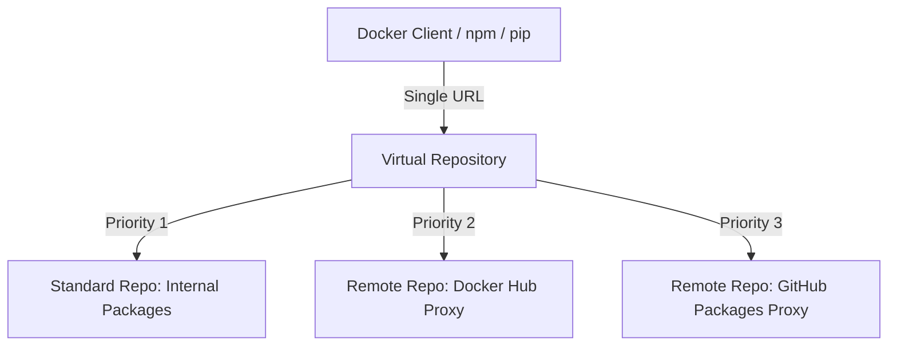

# How to Set Up Artifact Registry Virtual Repositories to Aggregate Multiple Sources

Author: [nawazdhandala](https://www.github.com/nawazdhandala)

Tags: GCP, Artifact Registry, Virtual Repository, Package Management, DevOps

Description: Learn how to create virtual repositories in Google Artifact Registry to aggregate packages from multiple standard and remote repositories into a single endpoint.

---

When your team uses packages from multiple sources - your own private packages, public registries, and maybe a third-party vendor's registry - managing multiple repository URLs in every project gets messy. Virtual repositories solve this by giving you a single URL that aggregates packages from multiple upstream repositories.

Think of a virtual repository as a router. When you request a package, it checks each upstream repository in priority order and returns the first match. Your clients only need to know about one URL.

## How Virtual Repositories Work



When a package is requested:
1. The virtual repository checks the highest-priority upstream first
2. If found, it returns that package
3. If not found, it checks the next upstream in priority order
4. This continues until the package is found or all upstreams are exhausted

## Creating a Virtual Docker Repository

Let us build a virtual repository that aggregates your private images, a Docker Hub proxy, and a custom registry proxy.

### Step 1: Create the Upstream Repositories

First, create the repositories that the virtual repository will aggregate:

```bash
# Private repository for your own images
gcloud artifacts repositories create internal-images \
  --repository-format=docker \
  --location=us-central1 \
  --description="Internal Docker images" \
  --project=my-project

# Remote repository proxying Docker Hub
gcloud artifacts repositories create dockerhub-cache \
  --repository-format=docker \
  --location=us-central1 \
  --mode=remote-repository \
  --remote-docker-repo=DOCKER-HUB \
  --description="Docker Hub cache" \
  --project=my-project

# Remote repository proxying a custom registry
gcloud artifacts repositories create vendor-images \
  --repository-format=docker \
  --location=us-central1 \
  --mode=remote-repository \
  --remote-docker-repo="https://registry.vendor.com" \
  --description="Vendor image cache" \
  --project=my-project
```

### Step 2: Create the Virtual Repository

```bash
# Create the virtual repository
gcloud artifacts repositories create docker-virtual \
  --repository-format=docker \
  --location=us-central1 \
  --mode=virtual-repository \
  --description="Aggregated Docker repository" \
  --project=my-project
```

### Step 3: Configure Upstream Policies

Define which repositories feed into the virtual repository and their priorities:

```bash
# Set the upstream policies using a JSON file
cat > upstream-policy.json << 'EOF'
[
  {
    "id": "internal-images",
    "repository": "projects/my-project/locations/us-central1/repositories/internal-images",
    "priority": 100
  },
  {
    "id": "dockerhub-cache",
    "repository": "projects/my-project/locations/us-central1/repositories/dockerhub-cache",
    "priority": 80
  },
  {
    "id": "vendor-images",
    "repository": "projects/my-project/locations/us-central1/repositories/vendor-images",
    "priority": 60
  }
]
EOF

# Apply the upstream policies
gcloud artifacts repositories update docker-virtual \
  --location=us-central1 \
  --upstream-policy-file=upstream-policy.json \
  --project=my-project
```

Higher priority numbers are checked first. In this example, internal images have the highest priority (100), followed by Docker Hub (80), then the vendor registry (60).

## Using the Virtual Repository

Configure Docker to use the virtual repository:

```bash
# Configure Docker authentication
gcloud auth configure-docker us-central1-docker.pkg.dev

# Pull an internal image - resolved from internal-images repo
docker pull us-central1-docker.pkg.dev/my-project/docker-virtual/my-app:v1.0.0

# Pull a public image - resolved from dockerhub-cache repo
docker pull us-central1-docker.pkg.dev/my-project/docker-virtual/library/nginx:latest

# Pull a vendor image - resolved from vendor-images repo
docker pull us-central1-docker.pkg.dev/my-project/docker-virtual/vendor/special-image:latest
```

All three pulls use the same base URL. The virtual repository routes each request to the correct upstream.

## Creating a Virtual npm Repository

The pattern works for npm packages too:

```bash
# Create internal npm repository
gcloud artifacts repositories create internal-npm \
  --repository-format=npm \
  --location=us-central1 \
  --description="Internal npm packages" \
  --project=my-project

# Create npm proxy for public packages
gcloud artifacts repositories create npmjs-cache \
  --repository-format=npm \
  --location=us-central1 \
  --mode=remote-repository \
  --remote-npm-repo=NPMJS \
  --description="npmjs proxy" \
  --project=my-project

# Create the virtual npm repository
gcloud artifacts repositories create npm-virtual \
  --repository-format=npm \
  --location=us-central1 \
  --mode=virtual-repository \
  --description="Aggregated npm repository" \
  --project=my-project

# Set upstream policies
cat > npm-upstream-policy.json << 'EOF'
[
  {
    "id": "internal-npm",
    "repository": "projects/my-project/locations/us-central1/repositories/internal-npm",
    "priority": 100
  },
  {
    "id": "npmjs-cache",
    "repository": "projects/my-project/locations/us-central1/repositories/npmjs-cache",
    "priority": 50
  }
]
EOF

gcloud artifacts repositories update npm-virtual \
  --location=us-central1 \
  --upstream-policy-file=npm-upstream-policy.json \
  --project=my-project
```

Configure npm to use the virtual repository:

```ini
# .npmrc - Single registry URL for all packages
registry=https://us-central1-npm.pkg.dev/my-project/npm-virtual/
//us-central1-npm.pkg.dev/my-project/npm-virtual/:always-auth=true
```

Now `npm install` checks your internal packages first, then falls back to public npmjs.

## Creating a Virtual Python Repository

Same pattern for Python:

```bash
# Internal Python repository
gcloud artifacts repositories create internal-python \
  --repository-format=python \
  --location=us-central1 \
  --project=my-project

# PyPI proxy
gcloud artifacts repositories create pypi-cache \
  --repository-format=python \
  --location=us-central1 \
  --mode=remote-repository \
  --remote-python-repo=PYPI \
  --project=my-project

# Virtual Python repository
gcloud artifacts repositories create python-virtual \
  --repository-format=python \
  --location=us-central1 \
  --mode=virtual-repository \
  --project=my-project

# Upstream policies
cat > python-upstream-policy.json << 'EOF'
[
  {
    "id": "internal-python",
    "repository": "projects/my-project/locations/us-central1/repositories/internal-python",
    "priority": 100
  },
  {
    "id": "pypi-cache",
    "repository": "projects/my-project/locations/us-central1/repositories/pypi-cache",
    "priority": 50
  }
]
EOF

gcloud artifacts repositories update python-virtual \
  --location=us-central1 \
  --upstream-policy-file=python-upstream-policy.json \
  --project=my-project
```

Configure pip:

```bash
# Install packages through the virtual repository
pip install \
  --index-url https://us-central1-python.pkg.dev/my-project/python-virtual/simple/ \
  my-internal-package requests flask
```

## Virtual Repository Priority Strategy

Getting the priority order right is important:

1. **Highest priority (100)**: Your internal/private packages. You want your own packages to take precedence over everything else.
2. **Medium priority (50-80)**: Curated or approved external packages.
3. **Lowest priority (1-30)**: Public registries as fallback.

This prevents a malicious package on a public registry from shadowing your internal package name (dependency confusion attack).

## Terraform Configuration

```hcl
# main.tf - Virtual repository with upstreams

# Internal repository
resource "google_artifact_registry_repository" "internal" {
  location      = "us-central1"
  repository_id = "internal-images"
  format        = "DOCKER"
}

# Docker Hub proxy
resource "google_artifact_registry_repository" "dockerhub" {
  location      = "us-central1"
  repository_id = "dockerhub-cache"
  format        = "DOCKER"
  mode          = "REMOTE_REPOSITORY"

  remote_repository_config {
    docker_repository {
      public_repository = "DOCKER_HUB"
    }
  }
}

# Virtual repository
resource "google_artifact_registry_repository" "virtual" {
  location      = "us-central1"
  repository_id = "docker-virtual"
  format        = "DOCKER"
  mode          = "VIRTUAL_REPOSITORY"

  virtual_repository_config {
    upstream_policies {
      id         = "internal"
      repository = google_artifact_registry_repository.internal.id
      priority   = 100
    }
    upstream_policies {
      id         = "dockerhub"
      repository = google_artifact_registry_repository.dockerhub.id
      priority   = 50
    }
  }
}
```

## Important Limitations

A few things to keep in mind:

- You cannot push images to a virtual repository directly. Push to the standard (non-virtual) repositories.
- Virtual repositories are read-only aggregation points.
- All upstream repositories must be in the same location as the virtual repository.
- All upstream repositories must have the same format (you cannot mix Docker and npm).

## Wrapping Up

Virtual repositories simplify package management by giving your team a single URL for all their dependencies. Private packages, cached public packages, and vendor packages all resolve through one endpoint. Set the priorities so internal packages take precedence, and you get a clean, secure, and easy-to-configure package resolution strategy.
