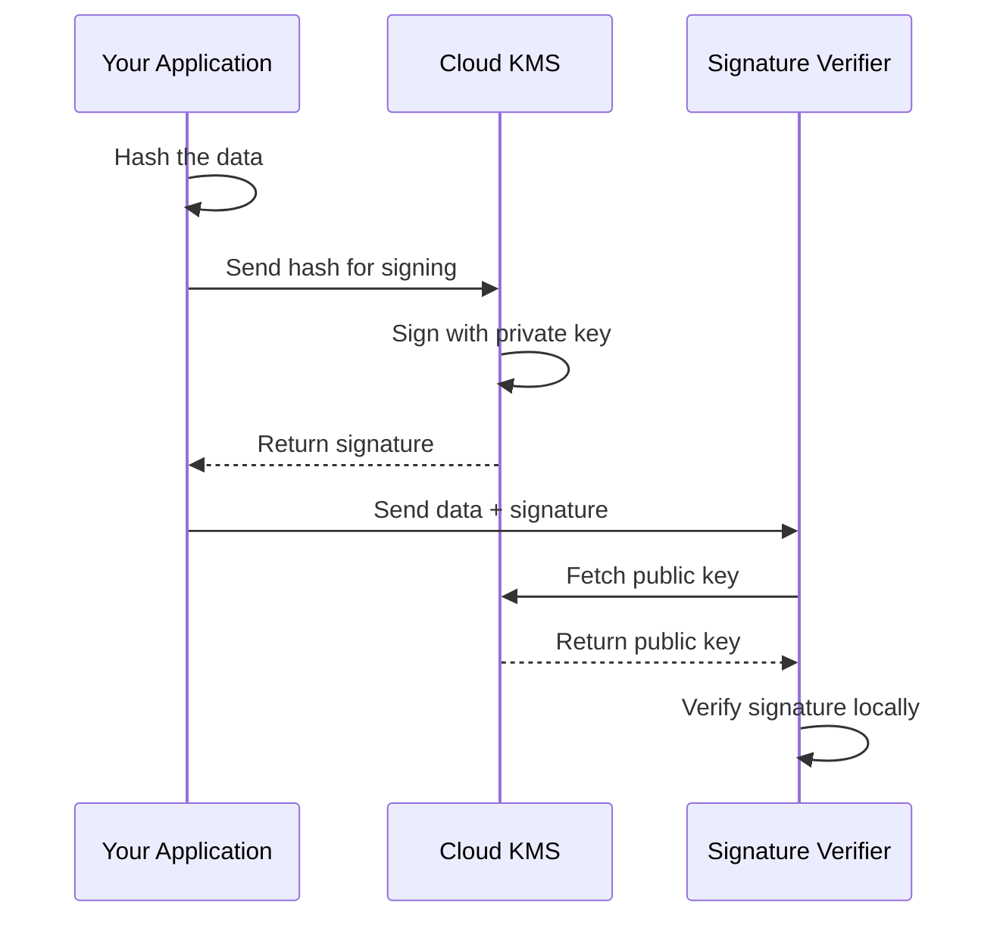

# How to Set Up Asymmetric Keys for Digital Signing with Cloud KMS in GCP

Author: [nawazdhandala](https://www.github.com/nawazdhandala)

Tags: GCP, Cloud KMS, Asymmetric Keys, Digital Signing, Cryptography, Security

Description: Step-by-step guide to creating asymmetric signing keys in Google Cloud KMS for digital signatures, including key creation, signing data, and verifying signatures.

---

Digital signatures are fundamental to verifying data integrity and authenticity. When you sign a piece of data, you prove that it came from you and has not been tampered with. Google Cloud KMS lets you create and manage asymmetric keys for this purpose without ever exposing the private key material.

The private key stays locked inside Cloud KMS. You send data to KMS to sign it, and you can distribute the public key freely for anyone to verify signatures. This is a big deal for teams that need to sign software artifacts, JWTs, certificates, or other sensitive payloads.

Let me walk through the full setup and show you how to sign and verify data.

## How Asymmetric Signing Works

With asymmetric signing, you have two keys: a private key and a public key. The private key signs data, and the public key verifies the signature. Cloud KMS holds the private key securely and never lets it leave Google's infrastructure. You get the public key to share with anyone who needs to verify signatures.

Here is the flow:



## Step 1: Create a Key Ring

If you do not already have a key ring, create one.

```bash
# Create a key ring for signing keys
gcloud kms keyrings create signing-keyring \
    --location=us-central1 \
    --project=my-project-id
```

## Step 2: Create an Asymmetric Signing Key

Create a key with the purpose set to `asymmetric-signing`. You need to choose an algorithm. Here are the common options:

- `ec-sign-p256-sha256` - ECDSA with P-256 curve (fast, compact signatures)
- `ec-sign-p384-sha384` - ECDSA with P-384 curve (stronger, slightly larger)
- `rsa-sign-pss-2048-sha256` - RSA-PSS with 2048-bit key
- `rsa-sign-pkcs1-4096-sha512` - RSA PKCS1 with 4096-bit key (most compatible)

For most use cases, ECDSA P-256 is a solid choice - it is fast and produces small signatures.

```bash
# Create an asymmetric signing key using ECDSA P-256
gcloud kms keys create my-signing-key \
    --location=us-central1 \
    --keyring=signing-keyring \
    --purpose=asymmetric-signing \
    --default-algorithm=ec-sign-p256-sha256 \
    --project=my-project-id
```

## Step 3: Get the Public Key

Retrieve the public key so you can distribute it to anyone who needs to verify signatures.

```bash
# Download the public key in PEM format
gcloud kms keys versions get-public-key 1 \
    --key=my-signing-key \
    --keyring=signing-keyring \
    --location=us-central1 \
    --output-file=public-key.pem \
    --project=my-project-id
```

The public key is safe to share. It can only verify signatures, not create them.

## Step 4: Sign Data

To sign data, you first create a digest (hash) of the data, then send it to Cloud KMS for signing.

```bash
# Create a SHA-256 digest of the file you want to sign
openssl dgst -sha256 -binary data.txt > data.txt.sha256

# Sign the digest using Cloud KMS
gcloud kms asymmetric-sign \
    --location=us-central1 \
    --keyring=signing-keyring \
    --key=my-signing-key \
    --version=1 \
    --digest-algorithm=sha256 \
    --input-file=data.txt.sha256 \
    --signature-file=data.txt.sig \
    --project=my-project-id
```

The `data.txt.sig` file now contains the digital signature.

## Step 5: Verify the Signature

Anyone with the public key can verify the signature locally without calling Cloud KMS.

```bash
# Verify the signature using the public key with OpenSSL
openssl dgst -sha256 -verify public-key.pem \
    -signature data.txt.sig data.txt
```

If the output says `Verified OK`, the signature is valid.

## Signing and Verifying with Python

Here is a practical example using the Google Cloud KMS Python client.

```python
from google.cloud import kms
import hashlib

# Initialize the KMS client
client = kms.KeyManagementServiceClient()

# Full resource path to the key version
key_version_name = client.crypto_key_version_path(
    "my-project-id",
    "us-central1",
    "signing-keyring",
    "my-signing-key",
    "1"
)

def sign_data(data: bytes) -> bytes:
    """Sign data using the Cloud KMS asymmetric key."""
    # Compute the SHA-256 digest
    digest = hashlib.sha256(data).digest()

    # Build the digest object for the API
    digest_obj = kms.Digest(sha256=digest)

    # Call Cloud KMS to sign the digest
    response = client.asymmetric_sign(
        request={
            "name": key_version_name,
            "digest": digest_obj,
        }
    )

    return response.signature

def verify_signature(data: bytes, signature: bytes) -> bool:
    """Verify a signature using the public key from Cloud KMS."""
    from cryptography.hazmat.primitives import hashes, serialization
    from cryptography.hazmat.primitives.asymmetric import ec, utils
    from cryptography.exceptions import InvalidSignature

    # Fetch the public key from Cloud KMS
    pub_key_response = client.get_public_key(
        request={"name": key_version_name}
    )

    # Parse the PEM-encoded public key
    public_key = serialization.load_pem_public_key(
        pub_key_response.pem.encode("utf-8")
    )

    # Verify the signature
    try:
        public_key.verify(
            signature,
            data,
            ec.ECDSA(utils.Prehashed(hashes.SHA256()))
        )
        return True
    except InvalidSignature:
        return False


# Example usage
message = b"This message needs to be verified"
sig = sign_data(message)
is_valid = verify_signature(message, sig)
print(f"Signature valid: {is_valid}")
```

## Signing JWTs with Cloud KMS

A common use case is signing JWTs. Here is how you can use Cloud KMS as the signing backend.

```python
import json
import base64
from google.cloud import kms
import hashlib

def base64url_encode(data: bytes) -> str:
    """URL-safe base64 encoding without padding."""
    return base64.urlsafe_b64encode(data).rstrip(b"=").decode("utf-8")

def create_signed_jwt(payload: dict, key_version_name: str) -> str:
    """Create a JWT signed with a Cloud KMS key."""
    client = kms.KeyManagementServiceClient()

    # Build the JWT header
    header = {"alg": "ES256", "typ": "JWT"}

    # Encode header and payload
    header_b64 = base64url_encode(json.dumps(header).encode())
    payload_b64 = base64url_encode(json.dumps(payload).encode())

    # Create the signing input
    signing_input = f"{header_b64}.{payload_b64}".encode()

    # Hash the signing input
    digest = hashlib.sha256(signing_input).digest()

    # Sign with Cloud KMS
    response = client.asymmetric_sign(
        request={
            "name": key_version_name,
            "digest": kms.Digest(sha256=digest),
        }
    )

    # Encode the signature
    sig_b64 = base64url_encode(response.signature)

    return f"{header_b64}.{payload_b64}.{sig_b64}"
```

## Key Version Management

Over time, you will want to rotate your signing keys. Cloud KMS does not auto-rotate asymmetric keys (unlike symmetric keys), so you manage versions manually.

```bash
# Create a new key version
gcloud kms keys versions create \
    --key=my-signing-key \
    --keyring=signing-keyring \
    --location=us-central1 \
    --project=my-project-id

# Set the new version as the primary version
gcloud kms keys update my-signing-key \
    --keyring=signing-keyring \
    --location=us-central1 \
    --primary-version=2 \
    --project=my-project-id
```

The old version remains available for verification. Anyone with the old public key can still verify signatures made with version 1.

## IAM Permissions

Control who can sign with your key by granting the `cloudkms.signer` role.

```bash
# Grant a service account permission to sign with the key
gcloud kms keys add-iam-policy-binding my-signing-key \
    --location=us-central1 \
    --keyring=signing-keyring \
    --member="serviceAccount:my-app@my-project-id.iam.gserviceaccount.com" \
    --role="roles/cloudkms.signer" \
    --project=my-project-id

# Grant read access to the public key (for verification)
gcloud kms keys add-iam-policy-binding my-signing-key \
    --location=us-central1 \
    --keyring=signing-keyring \
    --member="serviceAccount:verifier@my-project-id.iam.gserviceaccount.com" \
    --role="roles/cloudkms.publicKeyViewer" \
    --project=my-project-id
```

Notice the separation: `cloudkms.signer` can sign but not view the public key, and `cloudkms.publicKeyViewer` can read the public key but not sign. Grant each role only where needed.

## Summary

Cloud KMS asymmetric signing gives you a managed solution for digital signatures without exposing private key material. Create a key with `asymmetric-signing` purpose, sign digests through the KMS API, and distribute the public key for verification. Whether you are signing software releases, JWTs, or API payloads, the pattern is the same: hash locally, sign with KMS, verify with the public key. Key version management is manual for asymmetric keys, so build rotation into your operational procedures.
