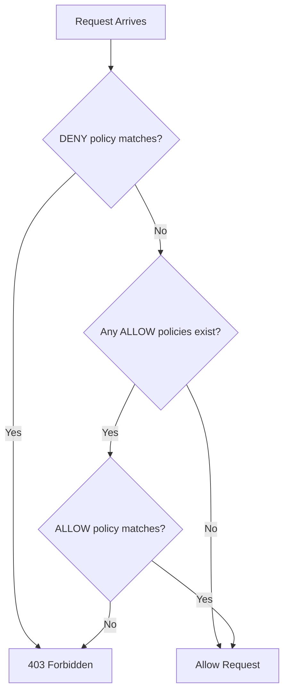

# How to Set Up Authorization Policies for Workload-Level Access Control in Istio on GKE

Author: [nawazdhandala](https://www.github.com/nawazdhandala)

Tags: GCP, Istio, Authorization Policies, GKE, Service Mesh Security

Description: Learn how to configure Istio authorization policies on GKE to enforce workload-level access control between microservices using service identities and request attributes.

---

Encryption with mTLS tells you that a connection is secure and the caller is who they claim to be. But knowing who is calling does not mean they should be allowed to call. Authorization policies in Istio let you define fine-grained access control rules that specify exactly which services can communicate with which other services, and under what conditions.

Think of it as a firewall for your microservices, but instead of IP-based rules, you write rules based on service identities, HTTP methods, paths, and headers. This guide walks through setting up authorization policies on GKE from basic deny-all rules to sophisticated attribute-based access control.

## How Istio Authorization Works

When a request arrives at a service's sidecar proxy, the proxy evaluates it against any authorization policies that apply. The evaluation follows this order:

1. If any CUSTOM action policy matches, delegate to the external authorizer
2. If any DENY policy matches, deny the request
3. If no ALLOW policies exist, allow the request (default allow)
4. If ALLOW policies exist but none match, deny the request



This means once you create your first ALLOW policy for a workload, that workload switches from default-allow to default-deny for any traffic not explicitly permitted.

## Step 1: Start with a Deny-All Policy

The safest starting point for a zero-trust architecture is to deny all traffic and then explicitly allow what is needed.

```yaml
# deny-all.yaml
# Denies all traffic in the namespace by default
apiVersion: security.istio.io/v1beta1
kind: AuthorizationPolicy
metadata:
  name: deny-all
  namespace: my-app
spec:
  {}
```

An empty spec with no rules means "match all traffic" and the implicit action is ALLOW with no rules, which effectively means no traffic is allowed because no ALLOW rules match.

```bash
# Apply the deny-all policy
kubectl apply -f deny-all.yaml

# Verify - all service-to-service calls should now fail
kubectl exec deploy/frontend -c istio-proxy -- curl -s http://backend:8080/api
# Expected: RBAC: access denied
```

## Step 2: Allow Specific Service-to-Service Communication

Now open up only the paths you need. This policy allows the frontend service to call the backend service.

```yaml
# allow-frontend-to-backend.yaml
# Allows the frontend service to call the backend on specific paths
apiVersion: security.istio.io/v1beta1
kind: AuthorizationPolicy
metadata:
  name: allow-frontend-to-backend
  namespace: my-app
spec:
  selector:
    matchLabels:
      app: backend
  action: ALLOW
  rules:
  - from:
    - source:
        # The frontend's service account identity
        principals: ["cluster.local/ns/my-app/sa/frontend"]
    to:
    - operation:
        methods: ["GET", "POST"]
        paths: ["/api/*"]
```

Let me break this down:

- **selector** - This policy applies to pods with the label `app: backend`
- **from.source.principals** - Only requests from the frontend service account are allowed
- **to.operation** - Only GET and POST requests to paths under `/api/` are allowed

The principal format is `cluster.local/ns/{namespace}/sa/{service-account}`. This identity comes from the mTLS certificate, so it cannot be spoofed.

## Step 3: Build Out Your Policy Set

For a typical microservices application, you need policies for each service. Here is an example for a three-tier architecture.

```yaml
# allow-ingress-to-frontend.yaml
# Allows the ingress gateway to reach the frontend
apiVersion: security.istio.io/v1beta1
kind: AuthorizationPolicy
metadata:
  name: allow-ingress-to-frontend
  namespace: my-app
spec:
  selector:
    matchLabels:
      app: frontend
  action: ALLOW
  rules:
  - from:
    - source:
        principals: ["cluster.local/ns/istio-system/sa/istio-ingressgateway"]
    to:
    - operation:
        methods: ["GET", "POST", "PUT", "DELETE"]
---
# allow-backend-to-database.yaml
# Allows the backend to access the database service
apiVersion: security.istio.io/v1beta1
kind: AuthorizationPolicy
metadata:
  name: allow-backend-to-database
  namespace: my-app
spec:
  selector:
    matchLabels:
      app: database-proxy
  action: ALLOW
  rules:
  - from:
    - source:
        principals: ["cluster.local/ns/my-app/sa/backend"]
    to:
    - operation:
        ports: ["5432"]
```

## Step 4: Use Namespace-Level Policies

For broader rules, you can use namespace-based source matching instead of individual service accounts.

```yaml
# allow-monitoring-namespace.yaml
# Allows any service in the monitoring namespace to scrape metrics
apiVersion: security.istio.io/v1beta1
kind: AuthorizationPolicy
metadata:
  name: allow-monitoring
  namespace: my-app
spec:
  action: ALLOW
  rules:
  - from:
    - source:
        namespaces: ["monitoring"]
    to:
    - operation:
        methods: ["GET"]
        paths: ["/metrics", "/healthz"]
```

This allows Prometheus and other monitoring tools in the monitoring namespace to scrape metrics from any service in the my-app namespace.

## Step 5: Attribute-Based Access Control

Istio authorization policies can match on a wide range of request attributes beyond just source identity and HTTP method.

### Match on HTTP Headers

```yaml
# allow-internal-api-key.yaml
# Only allows requests with a valid internal API key header
apiVersion: security.istio.io/v1beta1
kind: AuthorizationPolicy
metadata:
  name: require-api-key
  namespace: my-app
spec:
  selector:
    matchLabels:
      app: internal-api
  action: ALLOW
  rules:
  - from:
    - source:
        principals: ["cluster.local/ns/my-app/sa/*"]
    when:
    - key: request.headers[x-api-key]
      values: ["internal-secret-key-123"]
```

### Match on Source IP Range

```yaml
# allow-from-specific-cidr.yaml
# Only allows traffic from specific IP ranges
apiVersion: security.istio.io/v1beta1
kind: AuthorizationPolicy
metadata:
  name: allow-internal-ips
  namespace: my-app
spec:
  selector:
    matchLabels:
      app: admin-panel
  action: ALLOW
  rules:
  - from:
    - source:
        ipBlocks: ["10.0.0.0/8"]
    to:
    - operation:
        methods: ["GET", "POST"]
```

### Match on JWT Claims

If you use JWT authentication, you can make authorization decisions based on JWT claims.

```yaml
# allow-based-on-jwt-role.yaml
# Only allows requests where the JWT has an admin role claim
apiVersion: security.istio.io/v1beta1
kind: AuthorizationPolicy
metadata:
  name: require-admin-role
  namespace: my-app
spec:
  selector:
    matchLabels:
      app: admin-service
  action: ALLOW
  rules:
  - from:
    - source:
        principals: ["cluster.local/ns/my-app/sa/*"]
    when:
    - key: request.auth.claims[role]
      values: ["admin"]
```

## Step 6: Use DENY Policies for Explicit Blocks

DENY policies are evaluated before ALLOW policies, making them useful for blacklisting specific patterns.

```yaml
# deny-sensitive-paths.yaml
# Blocks access to debug endpoints from all sources except the SRE team
apiVersion: security.istio.io/v1beta1
kind: AuthorizationPolicy
metadata:
  name: deny-debug-endpoints
  namespace: my-app
spec:
  action: DENY
  rules:
  - to:
    - operation:
        paths: ["/debug/*", "/internal/*", "/admin/*"]
    from:
    - source:
        notPrincipals: ["cluster.local/ns/my-app/sa/sre-tools"]
```

This denies access to debug, internal, and admin paths for everyone except the SRE tools service account.

## Testing Authorization Policies

Always test your policies before relying on them in production.

### Test Allowed Paths

```bash
# From the frontend pod, call the backend (should succeed)
kubectl exec deploy/frontend -- curl -s -o /dev/null -w "%{http_code}" \
    http://backend:8080/api/data
# Expected: 200
```

### Test Denied Paths

```bash
# From the frontend pod, call the database directly (should fail)
kubectl exec deploy/frontend -- curl -s -o /dev/null -w "%{http_code}" \
    http://database-proxy:5432
# Expected: 403
```

### Test Method Restrictions

```bash
# From the frontend, try a DELETE on the backend (should fail if only GET/POST allowed)
kubectl exec deploy/frontend -- curl -s -o /dev/null -w "%{http_code}" \
    -X DELETE http://backend:8080/api/data/123
# Expected: 403
```

## Debugging Authorization Issues

When requests are denied unexpectedly, use Envoy's debug logging to understand why.

```bash
# Enable debug logging for the RBAC filter
kubectl exec deploy/backend -c istio-proxy -- \
    curl -s -X POST "localhost:15000/logging?rbac=debug"

# Make a test request and check the proxy logs
kubectl logs deploy/backend -c istio-proxy | grep rbac
```

The debug logs show which policies were evaluated and why a request was allowed or denied.

## Best Practices

**Start with permissive monitoring.** Before enforcing strict policies, use Istio's dry-run mode to see what would be denied without actually blocking traffic. Add the annotation `istio.io/dry-run: "true"` to your policies.

**Use service accounts consistently.** Every deployment should have its own Kubernetes service account. This gives you granular identity for authorization rules.

**Document your policies.** Authorization policies are effectively your application's security model. Keep them in version control with clear documentation about why each rule exists.

**Test policy changes in staging first.** A misconfigured authorization policy can take down your entire application. Always validate in a non-production environment.

Authorization policies are the access control layer that turns your service mesh from "encrypted communication" into "zero-trust networking." Combined with mTLS for identity verification, they give you precise control over which services can communicate and under what conditions.
