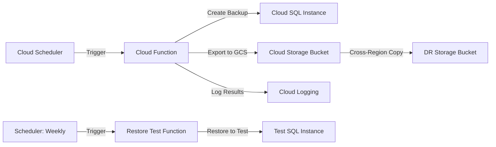

# How to Set Up Automated Backup and Restore Procedures for Cloud SQL Using Cloud Scheduler

Author: [nawazdhandala](https://www.github.com/nawazdhandala)

Tags: GCP, Cloud SQL, Cloud Scheduler, Backup, Database Management

Description: Set up automated backup and restore procedures for Google Cloud SQL databases using Cloud Scheduler for reliable disaster recovery.

---

Automated backups are not optional for production databases. While Cloud SQL provides built-in automated backups, many teams need more control - custom backup schedules, cross-region backup copies, automated restore testing, and integration with existing disaster recovery workflows.

This guide shows how to build a custom backup automation system using Cloud Scheduler to trigger backup operations, Cloud Functions to execute them, and Cloud Storage for cross-region backup storage.

## The Limitations of Built-in Backups

Cloud SQL's built-in automated backups are useful but have some constraints. They run once per day during a backup window you define. You get up to 365 backups retained. But you cannot easily copy backups to another region, trigger backups on a custom schedule (say, every 4 hours), or automatically test restores.

By building your own automation layer on top of the Cloud SQL Admin API, you get full control over when backups run, where they go, and how they are verified.



## Setting Up the Backup Function

Create a Cloud Function that handles backup creation and SQL export operations.

```python
# backup_function/main.py - Automated backup and export for Cloud SQL
import functions_framework
from googleapiclient.discovery import build
from google.cloud import storage
from datetime import datetime
import logging
import json
import time

logging.basicConfig(level=logging.INFO)
logger = logging.getLogger(__name__)

PROJECT_ID = "your-project-id"
INSTANCE_NAME = "production-db"
BACKUP_BUCKET = "your-project-sql-backups"
DR_BUCKET = "your-project-sql-backups-dr"  # In a different region


@functions_framework.http
def run_backup(request):
    """Execute a Cloud SQL backup - triggered by Cloud Scheduler."""
    request_json = request.get_json(silent=True) or {}
    backup_type = request_json.get("type", "both")  # "snapshot", "export", or "both"

    results = {}

    try:
        if backup_type in ("snapshot", "both"):
            # Create an on-demand backup (snapshot)
            results["snapshot"] = create_backup_snapshot()

        if backup_type in ("export", "both"):
            # Export to SQL dump in Cloud Storage
            results["export"] = export_to_gcs()

        logger.info(f"Backup completed: {json.dumps(results)}")
        return json.dumps({"status": "success", "results": results}), 200

    except Exception as e:
        logger.error(f"Backup failed: {e}")
        return json.dumps({"status": "error", "message": str(e)}), 500


def create_backup_snapshot():
    """Create an on-demand backup using the Cloud SQL Admin API."""
    service = build("sqladmin", "v1beta4")

    # Create the backup run
    body = {
        "kind": "sql#backupRun",
        "description": f"Automated backup - {datetime.utcnow().isoformat()}",
    }

    request = service.backupRuns().insert(
        project=PROJECT_ID,
        instance=INSTANCE_NAME,
        body=body,
    )

    response = request.execute()
    operation_id = response.get("name")

    # Wait for the backup operation to complete
    wait_for_operation(service, operation_id)

    logger.info(f"Backup snapshot created: {operation_id}")
    return {"operation_id": operation_id, "status": "completed"}


def export_to_gcs():
    """Export database to a SQL dump file in Cloud Storage."""
    service = build("sqladmin", "v1beta4")

    timestamp = datetime.utcnow().strftime("%Y%m%d-%H%M%S")
    export_uri = f"gs://{BACKUP_BUCKET}/exports/{INSTANCE_NAME}/{timestamp}.sql.gz"

    body = {
        "exportContext": {
            "kind": "sql#exportContext",
            "fileType": "SQL",
            "uri": export_uri,
            "databases": [],  # Empty means all databases
            "sqlExportOptions": {
                "schemaOnly": False,
            },
            "offload": True,  # Use serverless export to reduce instance load
        }
    }

    request = service.instances().export(
        project=PROJECT_ID,
        instance=INSTANCE_NAME,
        body=body,
    )

    response = request.execute()
    operation_id = response.get("name")

    # Wait for export to complete
    wait_for_operation(service, operation_id)

    # Copy the export to the DR bucket in another region
    copy_to_dr_bucket(export_uri)

    logger.info(f"Export completed: {export_uri}")
    return {"uri": export_uri, "operation_id": operation_id}


def copy_to_dr_bucket(source_uri):
    """Copy the backup file to a disaster recovery bucket in another region."""
    client = storage.Client()

    # Parse the source URI
    source_bucket_name = source_uri.replace("gs://", "").split("/")[0]
    source_blob_name = "/".join(source_uri.replace("gs://", "").split("/")[1:])

    source_bucket = client.bucket(source_bucket_name)
    source_blob = source_bucket.blob(source_blob_name)

    dest_bucket = client.bucket(DR_BUCKET)

    # Copy the blob to the DR bucket
    source_bucket.copy_blob(source_blob, dest_bucket, source_blob_name)
    logger.info(f"Copied backup to DR bucket: gs://{DR_BUCKET}/{source_blob_name}")


def wait_for_operation(service, operation_id, timeout=600):
    """Poll until a Cloud SQL operation completes."""
    start_time = time.time()

    while time.time() - start_time < timeout:
        result = service.operations().get(
            project=PROJECT_ID,
            operation=operation_id,
        ).execute()

        status = result.get("status")
        if status == "DONE":
            if "error" in result:
                raise Exception(f"Operation failed: {result['error']}")
            return result

        time.sleep(10)

    raise Exception(f"Operation {operation_id} timed out after {timeout}s")
```

Deploy the backup function.

```bash
# Deploy the backup Cloud Function
gcloud functions deploy sql-backup-runner \
  --gen2 \
  --runtime=python311 \
  --region=us-central1 \
  --source=./backup_function \
  --entry-point=run_backup \
  --trigger-http \
  --no-allow-unauthenticated \
  --memory=512MB \
  --timeout=540s \
  --service-account=backup-sa@YOUR_PROJECT.iam.gserviceaccount.com
```

## Setting Up Cloud Scheduler

Create scheduler jobs for different backup frequencies.

```bash
# Every 4 hours: Create a backup snapshot
gcloud scheduler jobs create http sql-backup-snapshot \
  --location=us-central1 \
  --schedule="0 */4 * * *" \
  --uri="https://us-central1-YOUR_PROJECT.cloudfunctions.net/sql-backup-runner" \
  --http-method=POST \
  --message-body='{"type": "snapshot"}' \
  --headers="Content-Type=application/json" \
  --oidc-service-account-email=scheduler-sa@YOUR_PROJECT.iam.gserviceaccount.com \
  --oidc-token-audience="https://us-central1-YOUR_PROJECT.cloudfunctions.net/sql-backup-runner"

# Daily at 2 AM: Full SQL export with cross-region copy
gcloud scheduler jobs create http sql-backup-export \
  --location=us-central1 \
  --schedule="0 2 * * *" \
  --uri="https://us-central1-YOUR_PROJECT.cloudfunctions.net/sql-backup-runner" \
  --http-method=POST \
  --message-body='{"type": "export"}' \
  --headers="Content-Type=application/json" \
  --oidc-service-account-email=scheduler-sa@YOUR_PROJECT.iam.gserviceaccount.com \
  --oidc-token-audience="https://us-central1-YOUR_PROJECT.cloudfunctions.net/sql-backup-runner"
```

## Automated Restore Testing

Backups are worthless if they cannot be restored. Set up automated restore testing that runs weekly.

```python
# restore_test/main.py - Automated restore test function
import functions_framework
from googleapiclient.discovery import build
from google.cloud import storage
import logging
import time
import json

logger = logging.getLogger(__name__)

PROJECT_ID = "your-project-id"
BACKUP_BUCKET = "your-project-sql-backups"
TEST_INSTANCE = "restore-test-instance"


@functions_framework.http
def test_restore(request):
    """Test restoring the latest backup to a test instance."""
    try:
        # Find the latest export
        latest_export = find_latest_export()

        if not latest_export:
            return json.dumps({"status": "error", "message": "No exports found"}), 500

        logger.info(f"Testing restore from: {latest_export}")

        # Import the backup into the test instance
        result = import_backup(latest_export)

        # Run validation queries
        validation = validate_restore()

        return json.dumps({
            "status": "success",
            "export_used": latest_export,
            "validation": validation,
        }), 200

    except Exception as e:
        logger.error(f"Restore test failed: {e}")
        return json.dumps({"status": "error", "message": str(e)}), 500


def find_latest_export():
    """Find the most recent SQL export in the backup bucket."""
    client = storage.Client()
    bucket = client.bucket(BACKUP_BUCKET)

    prefix = f"exports/{PROJECT_ID.split('-')[0]}-"
    blobs = list(bucket.list_blobs(prefix="exports/"))

    if not blobs:
        return None

    # Sort by name (which contains timestamp) and get the latest
    latest = sorted(blobs, key=lambda b: b.name, reverse=True)[0]
    return f"gs://{BACKUP_BUCKET}/{latest.name}"


def import_backup(export_uri):
    """Import a SQL dump into the test instance."""
    service = build("sqladmin", "v1beta4")

    body = {
        "importContext": {
            "kind": "sql#importContext",
            "fileType": "SQL",
            "uri": export_uri,
        }
    }

    request = service.instances().import_(
        project=PROJECT_ID,
        instance=TEST_INSTANCE,
        body=body,
    )

    response = request.execute()
    operation_id = response.get("name")

    # Wait for import to complete (can take a while for large databases)
    wait_for_operation(service, operation_id, timeout=3600)

    return {"operation_id": operation_id, "status": "completed"}


def validate_restore():
    """Run basic validation queries against the restored database."""
    import sqlalchemy

    # Connect to the test instance
    engine = sqlalchemy.create_engine(
        f"postgresql+psycopg2://restore-test:password@/testdb"
        f"?host=/cloudsql/{PROJECT_ID}:us-central1:{TEST_INSTANCE}"
    )

    validations = {}

    with engine.connect() as conn:
        # Check table count
        result = conn.execute(sqlalchemy.text(
            "SELECT count(*) FROM information_schema.tables WHERE table_schema = 'public'"
        ))
        validations["table_count"] = result.scalar()

        # Check row counts for critical tables
        for table in ["users", "orders", "products"]:
            try:
                result = conn.execute(sqlalchemy.text(f"SELECT count(*) FROM {table}"))
                validations[f"{table}_rows"] = result.scalar()
            except Exception:
                validations[f"{table}_rows"] = "table not found"

    logger.info(f"Restore validation: {json.dumps(validations)}")
    return validations
```

Schedule the restore test to run weekly.

```bash
# Weekly restore test every Sunday at 4 AM
gcloud scheduler jobs create http sql-restore-test \
  --location=us-central1 \
  --schedule="0 4 * * 0" \
  --uri="https://us-central1-YOUR_PROJECT.cloudfunctions.net/sql-restore-tester" \
  --http-method=POST \
  --oidc-service-account-email=scheduler-sa@YOUR_PROJECT.iam.gserviceaccount.com
```

## Backup Retention and Cleanup

Set lifecycle rules on your backup buckets to manage storage costs.

```bash
# Delete exports older than 90 days and DR copies older than 180 days
gsutil lifecycle set - gs://your-project-sql-backups <<EOF
{
  "lifecycle": {
    "rule": [
      {
        "action": {"type": "Delete"},
        "condition": {"age": 90}
      }
    ]
  }
}
EOF
```

## IAM Permissions

The service accounts need specific permissions to manage backups.

```bash
# Grant the backup service account the necessary roles
gcloud projects add-iam-policy-binding YOUR_PROJECT \
  --member="serviceAccount:backup-sa@YOUR_PROJECT.iam.gserviceaccount.com" \
  --role="roles/cloudsql.admin"

gcloud projects add-iam-policy-binding YOUR_PROJECT \
  --member="serviceAccount:backup-sa@YOUR_PROJECT.iam.gserviceaccount.com" \
  --role="roles/storage.objectAdmin"
```

## Wrapping Up

Automated backups with scheduled restore testing give you confidence that your Cloud SQL data is protected and recoverable. The combination of on-demand snapshots for quick recovery, SQL exports for cross-region portability, and weekly restore tests ensures your disaster recovery process actually works when you need it. Cloud Scheduler ties everything together with reliable scheduling, and the Cloud Functions layer gives you full control over the backup workflow.
