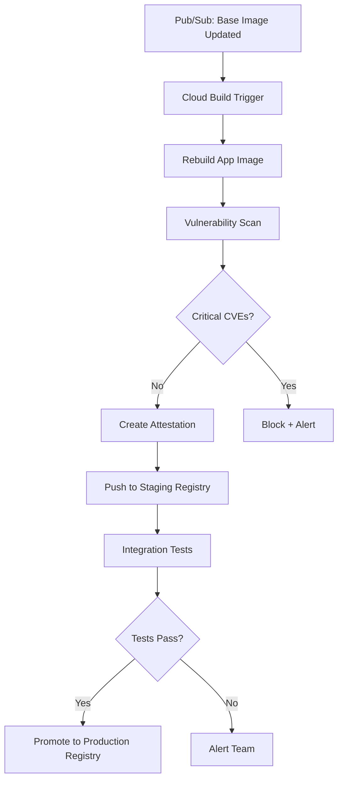

# How to Set Up Automated Container Base Image Updates with Secure Supply Chain Policies

Author: [nawazdhandala](https://www.github.com/nawazdhandala)

Tags: GCP, Container Security, Artifact Registry, Supply Chain, Automation

Description: Automate container base image updates on GCP while enforcing supply chain security policies using Artifact Registry, Cloud Build, and vulnerability scanning.

---

Keeping container base images up to date is one of those tasks that's easy to forget but has real security implications. A base image that was secure last month might have known vulnerabilities today, and every container you build on top of it inherits those vulnerabilities. Manually checking and updating base images across dozens of services doesn't scale. What you need is automation that watches for base image updates, rebuilds your application images, verifies them, and promotes them through your pipeline.

This post covers building that automation on GCP using Artifact Registry, Cloud Build, and a set of policies that ensure every image meets your security bar before it reaches production.

## The Problem with Stale Base Images

Consider a typical Node.js application. Your Dockerfile starts with `FROM node:20-alpine`. That image gets security patches regularly, but your CI pipeline only builds when your application code changes. Between deployments, the base image could accumulate multiple CVEs. By the time you deploy a code change, you're also deploying a stale base image with known vulnerabilities.

## Architecture



## Setting Up a Curated Base Image Registry

Instead of pulling base images directly from Docker Hub, maintain your own curated set in Artifact Registry:

```bash
# Create a dedicated registry for base images
gcloud artifacts repositories create base-images \
    --repository-format=docker \
    --location=us-central1 \
    --description="Curated and scanned base images"

# Create separate registries for staging and production app images
gcloud artifacts repositories create app-images-staging \
    --repository-format=docker \
    --location=us-central1

gcloud artifacts repositories create app-images-prod \
    --repository-format=docker \
    --location=us-central1
```

## Base Image Update Pipeline

This Cloud Build config pulls upstream base images, scans them, and pushes approved versions to your curated registry:

```yaml
# base-image-update.yaml
steps:
  # Pull the latest upstream base image
  - name: 'gcr.io/cloud-builders/docker'
    args: ['pull', '${_UPSTREAM_IMAGE}']
    id: 'pull-upstream'

  # Tag it for our registry
  - name: 'gcr.io/cloud-builders/docker'
    args:
      - 'tag'
      - '${_UPSTREAM_IMAGE}'
      - '${_REGISTRY}/${_IMAGE_NAME}:${_TAG}'
    id: 'tag'

  # Push to our base image registry
  - name: 'gcr.io/cloud-builders/docker'
    args: ['push', '${_REGISTRY}/${_IMAGE_NAME}:${_TAG}']
    id: 'push'

  # Wait for vulnerability scanning to complete
  - name: 'gcr.io/cloud-builders/gcloud'
    entrypoint: 'bash'
    args:
      - '-c'
      - |
        echo "Waiting for vulnerability scan to complete..."
        # Poll until scan is done (max 10 minutes)
        for i in $(seq 1 60); do
          STATUS=$(gcloud artifacts docker images describe \
            "${_REGISTRY}/${_IMAGE_NAME}:${_TAG}" \
            --show-package-vulnerability \
            --format='value(package_vulnerability_summary.count)' 2>/dev/null)

          if [ -n "$STATUS" ]; then
            echo "Scan complete."
            break
          fi
          echo "Scan in progress... attempt $i"
          sleep 10
        done
    id: 'wait-scan'

  # Check scan results against policy
  - name: 'gcr.io/cloud-builders/gcloud'
    entrypoint: 'bash'
    args:
      - '-c'
      - |
        # Get vulnerability counts by severity
        CRITICAL=$(gcloud artifacts docker images list-vulnerabilities \
          "${_REGISTRY}/${_IMAGE_NAME}:${_TAG}" \
          --format='value(vulnerability.effectiveSeverity)' \
          | grep -c CRITICAL || true)

        HIGH=$(gcloud artifacts docker images list-vulnerabilities \
          "${_REGISTRY}/${_IMAGE_NAME}:${_TAG}" \
          --format='value(vulnerability.effectiveSeverity)' \
          | grep -c HIGH || true)

        echo "Vulnerabilities found - Critical: $CRITICAL, High: $HIGH"

        # Policy: zero critical, max 5 high
        if [ "$CRITICAL" -gt 0 ]; then
          echo "BLOCKED: Image has critical vulnerabilities"
          exit 1
        fi
        if [ "$HIGH" -gt 5 ]; then
          echo "BLOCKED: Image has too many high-severity vulnerabilities"
          exit 1
        fi

        echo "Image passed vulnerability policy check"
    id: 'policy-check'

  # Notify downstream services that a new base image is available
  - name: 'gcr.io/cloud-builders/gcloud'
    args:
      - 'pubsub'
      - 'topics'
      - 'publish'
      - 'base-image-updated'
      - '--message'
      - '{"image":"${_REGISTRY}/${_IMAGE_NAME}:${_TAG}","timestamp":"$(date -u +%Y-%m-%dT%H:%M:%SZ)"}'
    id: 'notify'

substitutions:
  _REGISTRY: 'us-central1-docker.pkg.dev/YOUR_PROJECT/base-images'
  _UPSTREAM_IMAGE: 'node:20-alpine'
  _IMAGE_NAME: 'node'
  _TAG: '20-alpine'
```

## Auto-Triggering Application Rebuilds

When a base image updates, automatically rebuild all applications that depend on it. Use a Cloud Function to map base images to application build triggers:

```python
import base64
import json
from google.cloud import cloudbuild_v1

# Mapping of base images to the Cloud Build triggers that depend on them
BASE_IMAGE_DEPENDENCIES = {
    "node:20-alpine": [
        "trigger-api-service",
        "trigger-web-frontend",
        "trigger-worker-service",
    ],
    "python:3.11-slim": [
        "trigger-ml-pipeline",
        "trigger-data-processor",
    ],
    "golang:1.21-alpine": [
        "trigger-gateway-service",
    ],
}

def on_base_image_updated(event, context):
    """Trigger rebuilds of all dependent applications"""
    message = base64.b64decode(event["data"]).decode("utf-8")
    update_info = json.loads(message)
    updated_image = update_info["image"]

    # Find the short name to match against our dependency map
    image_short_name = _extract_short_name(updated_image)

    triggers_to_fire = BASE_IMAGE_DEPENDENCIES.get(image_short_name, [])

    if not triggers_to_fire:
        print(f"No dependent services for {image_short_name}")
        return

    # Trigger rebuilds for all dependent services
    client = cloudbuild_v1.CloudBuildClient()
    project_id = "your-project-id"

    for trigger_name in triggers_to_fire:
        # Look up the trigger by name
        triggers = client.list_build_triggers(
            project_id=project_id
        )
        for trigger in triggers.triggers:
            if trigger.name == trigger_name:
                # Run the trigger with the updated base image info
                client.run_build_trigger(
                    project_id=project_id,
                    trigger_id=trigger.id,
                    source=cloudbuild_v1.RepoSource(
                        branch_name="main",
                        substitutions={
                            "_BASE_IMAGE": updated_image,
                        },
                    ),
                )
                print(f"Triggered rebuild: {trigger_name}")
                break

def _extract_short_name(full_image_url):
    """Extract the original image name from the registry URL"""
    # Convert 'us-central1-docker.pkg.dev/proj/base-images/node:20-alpine'
    # to 'node:20-alpine'
    parts = full_image_url.split("/")
    return parts[-1]
```

## Application Dockerfile Best Practices

Structure your Dockerfiles to work with the automated update pipeline:

```dockerfile
# Use a build argument for the base image so it can be overridden
ARG BASE_IMAGE=us-central1-docker.pkg.dev/YOUR_PROJECT/base-images/node:20-alpine
FROM ${BASE_IMAGE}

# Pin package versions where possible
RUN apk add --no-cache \
    curl=8.5.0-r0 \
    tini=0.19.0-r1

# Copy package files first to leverage Docker layer caching
WORKDIR /app
COPY package.json package-lock.json ./
RUN npm ci --production

# Copy application code
COPY . .

# Add labels for traceability
LABEL base-image="${BASE_IMAGE}"
LABEL build-date="$(date -u +%Y-%m-%dT%H:%M:%SZ)"

EXPOSE 8080
ENTRYPOINT ["/sbin/tini", "--"]
CMD ["node", "server.js"]
```

## Supply Chain Policy Enforcement

Use Artifact Registry's remote repository feature to cache and control upstream access:

```bash
# Create a remote repository that proxies Docker Hub
gcloud artifacts repositories create dockerhub-proxy \
    --repository-format=docker \
    --location=us-central1 \
    --mode=remote-repository \
    --remote-repo-config-desc="Docker Hub proxy" \
    --remote-docker-repo=DOCKER_HUB

# Create a virtual repository that combines curated and proxied images
gcloud artifacts repositories create approved-images \
    --repository-format=docker \
    --location=us-central1 \
    --mode=virtual-repository \
    --upstream-policy-file=upstream-policy.json
```

The upstream policy prioritizes your curated images:

```json
{
  "upstreamPolicies": [
    {
      "id": "curated-first",
      "repository": "projects/YOUR_PROJECT/locations/us-central1/repositories/base-images",
      "priority": 100
    },
    {
      "id": "dockerhub-fallback",
      "repository": "projects/YOUR_PROJECT/locations/us-central1/repositories/dockerhub-proxy",
      "priority": 200
    }
  ]
}
```

## Scheduling Regular Base Image Updates

Set up a Cloud Scheduler job to check for base image updates daily:

```bash
# Schedule base image update checks
gcloud scheduler jobs create http base-image-check \
    --schedule="0 4 * * *" \
    --uri="https://cloudbuild.googleapis.com/v1/projects/YOUR_PROJECT/triggers/base-image-update:run" \
    --http-method=POST \
    --oauth-service-account-email=build-sa@YOUR_PROJECT.iam.gserviceaccount.com
```

## Rollback Strategy

If an updated base image causes issues, you need a quick rollback path:

```bash
# List previous versions of a base image
gcloud artifacts docker tags list \
    us-central1-docker.pkg.dev/YOUR_PROJECT/base-images/node

# Retag a known-good version
gcloud artifacts docker tags add \
    us-central1-docker.pkg.dev/YOUR_PROJECT/base-images/node:20-alpine-previous \
    us-central1-docker.pkg.dev/YOUR_PROJECT/base-images/node:20-alpine
```

## Wrapping Up

Automating base image updates removes one of the biggest sources of unpatched vulnerabilities in containerized applications. The key is building a pipeline that updates images proactively, scans them before they're used, and rebuilds all dependent applications automatically. Combined with vulnerability scanning policies that block images with critical CVEs, you get a supply chain that's both current and secure. Start with your most critical services and expand from there - even automating the update of a single base image is better than letting them all go stale.
