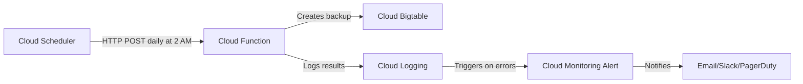

# How to Set Up Automated Daily Backups for Cloud Bigtable Tables

Author: [nawazdhandala](https://www.github.com/nawazdhandala)

Tags: GCP, Cloud Bigtable, Backups, Automation, Cloud Scheduler

Description: Learn how to configure automated daily backups for your Cloud Bigtable tables using Cloud Functions, Cloud Scheduler, and the Bigtable Admin API to protect your data.

---

If you are running production workloads on Cloud Bigtable, you need a solid backup strategy. Bigtable stores massive amounts of data - time-series metrics, user activity logs, financial records - and losing any of it could be catastrophic. While Bigtable replicates data across nodes within a cluster, that does not protect you from accidental deletions, application bugs that corrupt data, or compliance requirements that mandate point-in-time recovery.

Google Cloud introduced native backup support for Bigtable, which lets you create snapshots of your tables that you can restore later. But clicking through the console every day is not a real backup strategy. You need automation. In this post, I will walk you through setting up automated daily backups using Cloud Scheduler and Cloud Functions.

## Understanding Bigtable Backups

Bigtable backups are cluster-level snapshots of a table. When you create a backup, Bigtable captures the state of the table at that point in time. A few things to keep in mind:

- Backups are stored in the same cluster as the source table
- Each backup has an expiration date (maximum 90 days)
- You can restore a backup to a new table in the same instance
- Backups are billed based on storage used

The backup process is non-blocking, meaning your table continues to serve reads and writes while the backup is being created.

## Prerequisites

Before you begin, make sure you have:

- A GCP project with billing enabled
- Cloud Bigtable instance with at least one table
- The `gcloud` CLI installed and configured
- Cloud Functions API, Cloud Scheduler API, and Cloud Build API enabled

Enable the required APIs with a single command:

```bash
# Enable all required APIs for the backup automation pipeline
gcloud services enable \
  cloudfunctions.googleapis.com \
  cloudscheduler.googleapis.com \
  cloudbuild.googleapis.com \
  bigtableadmin.googleapis.com
```

## Step 1: Create a Service Account

First, create a dedicated service account for the backup function. Using a dedicated account follows the principle of least privilege.

```bash
# Create a service account specifically for Bigtable backups
gcloud iam service-accounts create bigtable-backup-sa \
  --display-name="Bigtable Backup Service Account"

# Grant the service account permission to manage Bigtable backups
gcloud projects add-iam-policy-binding YOUR_PROJECT_ID \
  --member="serviceAccount:bigtable-backup-sa@YOUR_PROJECT_ID.iam.gserviceaccount.com" \
  --role="roles/bigtable.admin"
```

## Step 2: Write the Cloud Function

Create a new directory for your Cloud Function and add the following files.

Here is the `main.py` file that handles the backup logic:

```python
# main.py - Cloud Function to create Bigtable table backups
import datetime
import os
from google.cloud import bigtable
from google.cloud.bigtable import admin_v2

def create_bigtable_backup(request):
    """Creates a backup of specified Bigtable tables."""

    # Configuration - pull from environment variables
    project_id = os.environ.get("GCP_PROJECT_ID")
    instance_id = os.environ.get("BIGTABLE_INSTANCE_ID")
    cluster_id = os.environ.get("BIGTABLE_CLUSTER_ID")
    # Comma-separated list of table IDs to back up
    table_ids = os.environ.get("BIGTABLE_TABLE_IDS", "").split(",")

    # Set backup expiration to 30 days from now
    expire_time = datetime.datetime.now(datetime.timezone.utc) + datetime.timedelta(days=30)

    # Generate a unique backup ID using the current timestamp
    timestamp = datetime.datetime.now().strftime("%Y%m%d-%H%M%S")

    client = bigtable.Client(project=project_id, admin=True)
    instance = client.instance(instance_id)
    cluster = instance.cluster(cluster_id)

    results = []

    for table_id in table_ids:
        table_id = table_id.strip()
        if not table_id:
            continue

        backup_id = f"{table_id}-backup-{timestamp}"

        try:
            # Create the backup using the Bigtable Admin API
            backup = cluster.backup(backup_id)
            backup.create(
                table_id=table_id,
                expire_time=expire_time
            )
            results.append(f"Backup {backup_id} created for table {table_id}")
            print(f"Successfully created backup: {backup_id}")
        except Exception as e:
            error_msg = f"Failed to backup table {table_id}: {str(e)}"
            results.append(error_msg)
            print(error_msg)

    return "\n".join(results), 200
```

And here is the `requirements.txt`:

```
google-cloud-bigtable>=2.0.0
```

## Step 3: Deploy the Cloud Function

Deploy the function with the necessary environment variables:

```bash
# Deploy the backup Cloud Function with environment variables
gcloud functions deploy bigtable-daily-backup \
  --runtime python310 \
  --trigger-http \
  --entry-point create_bigtable_backup \
  --service-account bigtable-backup-sa@YOUR_PROJECT_ID.iam.gserviceaccount.com \
  --set-env-vars GCP_PROJECT_ID=YOUR_PROJECT_ID,BIGTABLE_INSTANCE_ID=my-instance,BIGTABLE_CLUSTER_ID=my-cluster,BIGTABLE_TABLE_IDS="table1,table2,table3" \
  --region us-central1 \
  --timeout 540s \
  --memory 256MB
```

The timeout is set to 540 seconds because large tables can take a while to initiate backups. Adjust this based on the number and size of your tables.

## Step 4: Set Up Cloud Scheduler

Now create a Cloud Scheduler job that triggers the backup function every day at 2 AM:

```bash
# Create a scheduler job that runs the backup function daily at 2 AM UTC
gcloud scheduler jobs create http bigtable-daily-backup-job \
  --schedule="0 2 * * *" \
  --uri="https://us-central1-YOUR_PROJECT_ID.cloudfunctions.net/bigtable-daily-backup" \
  --http-method=POST \
  --oidc-service-account-email=bigtable-backup-sa@YOUR_PROJECT_ID.iam.gserviceaccount.com \
  --time-zone="UTC" \
  --attempt-deadline=600s
```

The `--oidc-service-account-email` flag ensures the scheduler authenticates properly when calling the Cloud Function.

## Step 5: Add Backup Cleanup

Old backups accumulate and cost money. Add a cleanup function that removes backups older than your retention period.

```python
# cleanup.py - Remove expired Bigtable backups beyond retention period
import datetime
import os
from google.cloud import bigtable

def cleanup_old_backups(request):
    """Deletes backups older than the retention period."""

    project_id = os.environ.get("GCP_PROJECT_ID")
    instance_id = os.environ.get("BIGTABLE_INSTANCE_ID")
    cluster_id = os.environ.get("BIGTABLE_CLUSTER_ID")
    # Number of days to keep backups
    retention_days = int(os.environ.get("RETENTION_DAYS", "30"))

    client = bigtable.Client(project=project_id, admin=True)
    instance = client.instance(instance_id)
    cluster = instance.cluster(cluster_id)

    cutoff = datetime.datetime.now(datetime.timezone.utc) - datetime.timedelta(days=retention_days)

    # List all backups in the cluster and delete old ones
    backups = cluster.list_backups()
    deleted_count = 0

    for backup in backups:
        if backup.start_time < cutoff:
            backup.delete()
            deleted_count += 1
            print(f"Deleted old backup: {backup.backup_id}")

    return f"Cleaned up {deleted_count} old backups", 200
```

## Step 6: Set Up Monitoring and Alerts

You want to know if your backups fail. Create a log-based alert using Cloud Monitoring:

```bash
# Create a log-based metric that tracks backup failures
gcloud logging metrics create bigtable-backup-failures \
  --description="Counts failed Bigtable backup attempts" \
  --log-filter='resource.type="cloud_function" AND resource.labels.function_name="bigtable-daily-backup" AND severity>=ERROR'
```

Then create an alerting policy in Cloud Monitoring that notifies you whenever this metric exceeds zero.

## Testing Your Setup

Before relying on the automation, test everything manually:

```bash
# Trigger the scheduler job manually to verify it works
gcloud scheduler jobs run bigtable-daily-backup-job

# Check the function logs to see if the backup succeeded
gcloud functions logs read bigtable-daily-backup --limit=20

# List backups to confirm they were created
cbt -instance=my-instance listbackups my-cluster
```

## Architecture Overview

Here is how all the pieces fit together:



## Best Practices

**Choose off-peak hours.** Schedule backups during your lowest traffic window. While backups do not block reads or writes, they do consume some cluster resources.

**Use meaningful backup IDs.** Include the table name and timestamp in your backup IDs so you can quickly identify which backup to restore from.

**Monitor backup sizes.** Track how much storage your backups consume over time. Bigtable backup storage is billed separately from table storage.

**Test restores regularly.** A backup is only useful if you can restore from it. Schedule periodic restore tests to verify your backups are intact.

**Consider cross-region replication.** Bigtable backups are cluster-level, meaning they live in the same region as the cluster. For disaster recovery across regions, consider using Bigtable replication instead of or in addition to backups.

## Wrapping Up

Setting up automated backups for Cloud Bigtable is straightforward once you connect Cloud Scheduler, Cloud Functions, and the Bigtable Admin API. The key is to treat this like any other production infrastructure - monitor it, test it, and keep it maintained. With this setup in place, you can recover from data loss scenarios without breaking a sweat.
