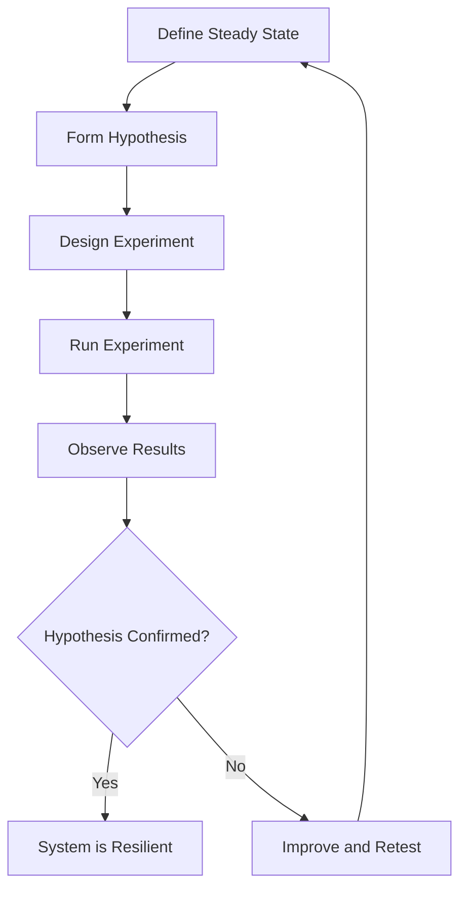

# How to Set Up Automated Disaster Recovery Testing for GCP Workloads Using Chaos Engineering

Author: [nawazdhandala](https://www.github.com/nawazdhandala)

Tags: GCP, Chaos Engineering, Disaster Recovery, Resilience Testing, GKE, Reliability

Description: Implement automated disaster recovery testing for Google Cloud workloads using chaos engineering principles to validate your recovery procedures before real outages happen.

---

A disaster recovery plan that has never been tested is just a hope. Most teams write DR runbooks, set up backups, and configure replicas, but never actually validate that recovery works end to end. When a real disaster hits, they discover that the backup is corrupted, the failover script has a typo, or the recovery takes three times longer than expected. Chaos engineering flips this by proactively injecting failures to test your recovery procedures before you need them.

In this post, I will show you how to set up automated chaos experiments on GCP that test different failure scenarios, measure your actual RTO and RPO, and build confidence in your disaster recovery posture.

## Chaos Engineering Principles

Chaos engineering is not about breaking things randomly. It follows a disciplined process: form a hypothesis about how your system should behave during failure, design an experiment to test that hypothesis, run it in a controlled way, and learn from the results.



## Setting Up the Chaos Framework

I will use Litmus Chaos for GKE workloads and custom scripts for GCP-managed services. Start by installing Litmus on your GKE cluster.

```bash
# Install Litmus Chaos on GKE
kubectl apply -f https://litmuschaos.github.io/litmus/3.0.0/litmus-3.0.0.yaml

# Verify the installation
kubectl get pods -n litmus

# Install the chaos experiments library
kubectl apply -f https://hub.litmuschaos.io/api/chaos/3.0.0?file=charts/generic/experiments.yaml -n litmus
```

## Experiment 1: Database Failover Test

Test that your Cloud SQL failover works within your RTO target.

```python
# experiments/database_failover.py
import os
import time
import json
from google.cloud import sqladmin_v1beta4
from google.cloud import monitoring_v3
import requests

class DatabaseFailoverExperiment:
    """Chaos experiment: Test Cloud SQL automatic failover."""

    def __init__(self, project_id, instance_name, app_endpoint):
        self.project_id = project_id
        self.instance_name = instance_name
        self.app_endpoint = app_endpoint
        self.sql_client = sqladmin_v1beta4.SqlAdminServiceClient()
        self.results = {
            'experiment': 'database_failover',
            'started_at': None,
            'completed_at': None,
            'downtime_seconds': 0,
            'data_loss_detected': False,
            'hypothesis_confirmed': False,
        }

    def define_steady_state(self):
        """Verify the system is healthy before starting."""
        print('Checking steady state...')

        # Verify the app is responding
        response = requests.get(f'{self.app_endpoint}/health', timeout=10)
        assert response.status_code == 200, 'App is not healthy'

        # Verify the database is available
        instance = self.sql_client.get(
            project=self.project_id,
            instance=self.instance_name,
        )
        assert instance.state == 'RUNNABLE', 'Database is not running'

        # Write a marker record for data loss detection
        marker_id = f'chaos-marker-{int(time.time())}'
        requests.post(
            f'{self.app_endpoint}/api/chaos-markers',
            json={'id': marker_id, 'timestamp': time.time()},
            timeout=10,
        )
        self.results['marker_id'] = marker_id

        print('Steady state confirmed')
        return True

    def run_experiment(self):
        """Trigger the failover and measure recovery."""
        print('Triggering database failover...')
        self.results['started_at'] = time.time()

        # Trigger a manual failover
        self.sql_client.failover(
            project=self.project_id,
            instance=self.instance_name,
            body=sqladmin_v1beta4.InstancesFailoverRequest(
                failover_context=sqladmin_v1beta4.FailoverContext(
                    kind='sql#failoverContext',
                )
            ),
        )

        # Monitor the app health during failover
        downtime_start = None
        downtime_total = 0
        check_interval = 2  # Check every 2 seconds

        for i in range(180):  # Monitor for up to 6 minutes
            try:
                response = requests.get(
                    f'{self.app_endpoint}/health',
                    timeout=5,
                )
                if response.status_code == 200:
                    if downtime_start is not None:
                        # App recovered
                        downtime_total += time.time() - downtime_start
                        downtime_start = None
                        print(f'  App recovered after {downtime_total:.1f}s')
                else:
                    if downtime_start is None:
                        downtime_start = time.time()
                        print(f'  App returned {response.status_code}')
            except Exception:
                if downtime_start is None:
                    downtime_start = time.time()
                    print(f'  App unreachable at {i * check_interval}s')

            time.sleep(check_interval)

            # If the app has recovered and been stable for 30 seconds, we are done
            if downtime_start is None and downtime_total > 0 and i > 15:
                break

        if downtime_start is not None:
            downtime_total += time.time() - downtime_start

        self.results['downtime_seconds'] = downtime_total
        self.results['completed_at'] = time.time()
        print(f'Experiment complete. Total downtime: {downtime_total:.1f}s')

    def verify_data_integrity(self):
        """Check that no data was lost during the failover."""
        marker_id = self.results.get('marker_id')
        if not marker_id:
            return

        try:
            response = requests.get(
                f'{self.app_endpoint}/api/chaos-markers/{marker_id}',
                timeout=10,
            )
            if response.status_code == 200:
                self.results['data_loss_detected'] = False
                print('Data integrity check PASSED')
            else:
                self.results['data_loss_detected'] = True
                print('Data integrity check FAILED - marker record missing')
        except Exception as e:
            self.results['data_loss_detected'] = True
            print(f'Data integrity check FAILED: {e}')

    def evaluate_hypothesis(self, target_rto_seconds=120):
        """Evaluate whether the experiment met the RTO target."""
        downtime = self.results['downtime_seconds']
        data_ok = not self.results['data_loss_detected']

        self.results['hypothesis_confirmed'] = (
            downtime <= target_rto_seconds and data_ok
        )

        print(f'\n=== Experiment Results ===')
        print(f'Downtime: {downtime:.1f}s (target: {target_rto_seconds}s)')
        print(f'Data loss: {"Yes" if self.results["data_loss_detected"] else "No"}')
        print(f'Hypothesis: {"CONFIRMED" if self.results["hypothesis_confirmed"] else "FAILED"}')

        return self.results

    def run(self, target_rto_seconds=120):
        """Execute the full chaos experiment."""
        try:
            self.define_steady_state()
            self.run_experiment()
            self.verify_data_integrity()
            return self.evaluate_hypothesis(target_rto_seconds)
        except Exception as e:
            self.results['error'] = str(e)
            print(f'Experiment failed with error: {e}')
            return self.results
```

## Experiment 2: Pod Failure in GKE

Test that your Kubernetes workloads recover from pod failures.

```yaml
# experiments/pod-kill-experiment.yaml
apiVersion: litmuschaos.io/v1alpha1
kind: ChaosEngine
metadata:
  name: pod-kill-experiment
  namespace: production
spec:
  engineState: 'active'
  appinfo:
    appns: 'production'
    applabel: 'app=payment-service'
    appkind: 'deployment'
  chaosServiceAccount: litmus-admin
  experiments:
    - name: pod-delete
      spec:
        components:
          env:
            # Kill 2 out of 3 pods
            - name: TOTAL_CHAOS_DURATION
              value: '60'
            - name: CHAOS_INTERVAL
              value: '10'
            - name: FORCE
              value: 'true'
            - name: PODS_AFFECTED_PERC
              value: '66'
```

Wrap this in a test that measures the impact.

```python
# experiments/pod_failure_test.py
import subprocess
import time
import requests

def run_pod_failure_experiment(app_url, namespace, deployment):
    """Test pod failure resilience and measure impact."""
    print(f'Testing pod failure for {deployment} in {namespace}')

    # Record steady state
    response_times = []
    error_count = 0
    total_requests = 0

    # Start the chaos experiment
    subprocess.run([
        'kubectl', 'apply', '-f', 'experiments/pod-kill-experiment.yaml'
    ])

    # Monitor the application for 3 minutes
    start = time.time()
    while time.time() - start < 180:
        total_requests += 1
        try:
            req_start = time.time()
            response = requests.get(f'{app_url}/health', timeout=5)
            req_duration = time.time() - req_start
            response_times.append(req_duration)

            if response.status_code != 200:
                error_count += 1
        except Exception:
            error_count += 1
            response_times.append(5.0)  # Timeout duration

        time.sleep(1)

    # Calculate results
    avg_response_time = sum(response_times) / len(response_times) if response_times else 0
    error_rate = (error_count / total_requests) * 100 if total_requests else 100

    results = {
        'total_requests': total_requests,
        'error_count': error_count,
        'error_rate_percent': error_rate,
        'avg_response_time_ms': avg_response_time * 1000,
        'max_response_time_ms': max(response_times) * 1000 if response_times else 0,
    }

    print(f'Results: {error_rate:.1f}% error rate, {avg_response_time*1000:.0f}ms avg response')

    # Clean up
    subprocess.run([
        'kubectl', 'delete', '-f', 'experiments/pod-kill-experiment.yaml'
    ])

    return results
```

## Experiment 3: Network Partition

Simulate a network partition between services to test circuit breaker behavior.

```yaml
# experiments/network-partition.yaml
apiVersion: litmuschaos.io/v1alpha1
kind: ChaosEngine
metadata:
  name: network-loss-experiment
  namespace: production
spec:
  engineState: 'active'
  appinfo:
    appns: 'production'
    applabel: 'app=order-service'
    appkind: 'deployment'
  chaosServiceAccount: litmus-admin
  experiments:
    - name: pod-network-loss
      spec:
        components:
          env:
            # Drop 100% of traffic to the payment service
            - name: TOTAL_CHAOS_DURATION
              value: '120'
            - name: NETWORK_INTERFACE
              value: 'eth0'
            - name: NETWORK_PACKET_LOSS_PERCENTAGE
              value: '100'
            - name: DESTINATION_IPS
              value: 'payment-service.production.svc.cluster.local'
```

## Experiment 4: Region Evacuation

Test your ability to evacuate traffic from an entire region.

```python
# experiments/region_evacuation.py
import time
import requests
from google.cloud import compute_v1

def test_region_evacuation(project_id, backend_service, primary_neg, secondary_neg):
    """Simulate evacuating traffic from the primary region."""
    client = compute_v1.BackendServicesClient()

    print('Step 1: Verify both backends are healthy')
    check_endpoints(project_id, backend_service)

    print('Step 2: Start draining traffic from primary')
    start_time = time.time()

    # Set primary capacity to 0 (simulating region evacuation)
    # This is the gcloud equivalent in Python
    import subprocess
    subprocess.run([
        'gcloud', 'compute', 'backend-services', 'update-backend',
        backend_service, '--global',
        f'--network-endpoint-group={primary_neg}',
        f'--network-endpoint-group-region=us-central1',
        '--capacity-scaler=0.0',
    ])

    print('Step 3: Monitor application availability during evacuation')
    errors = 0
    checks = 0
    while time.time() - start_time < 120:
        checks += 1
        try:
            r = requests.get('https://app.example.com/health', timeout=5)
            if r.status_code != 200:
                errors += 1
        except Exception:
            errors += 1
        time.sleep(1)

    evacuation_time = time.time() - start_time
    availability = ((checks - errors) / checks) * 100

    print(f'Evacuation completed in {evacuation_time:.0f}s')
    print(f'Availability during evacuation: {availability:.1f}%')

    # Step 4: Restore primary
    subprocess.run([
        'gcloud', 'compute', 'backend-services', 'update-backend',
        backend_service, '--global',
        f'--network-endpoint-group={primary_neg}',
        f'--network-endpoint-group-region=us-central1',
        '--capacity-scaler=1.0',
    ])

    return {
        'evacuation_time_seconds': evacuation_time,
        'availability_percent': availability,
        'errors': errors,
    }
```

## Scheduling Regular Chaos Tests

Run chaos experiments on a schedule to continuously validate your DR readiness.

```yaml
# chaos-schedule.yaml - Run experiments on a recurring schedule
apiVersion: batch/v1
kind: CronJob
metadata:
  name: weekly-chaos-tests
  namespace: litmus
spec:
  schedule: "0 10 * * 3"  # Every Wednesday at 10 AM
  jobTemplate:
    spec:
      template:
        spec:
          containers:
            - name: chaos-runner
              image: gcr.io/my-project/chaos-runner:latest
              env:
                - name: PROJECT_ID
                  value: "my-project"
                - name: APP_URL
                  value: "https://app.example.com"
                - name: SLACK_WEBHOOK
                  value: "https://hooks.slack.com/services/xxx"
              command:
                - python
                - run_experiments.py
          restartPolicy: OnFailure
```

```python
# run_experiments.py - Orchestrate multiple chaos experiments
import json
import requests
from experiments.database_failover import DatabaseFailoverExperiment
from experiments.pod_failure_test import run_pod_failure_experiment

def run_all_experiments():
    results = {}

    # Experiment 1: Database failover
    print('\n=== Running Database Failover Experiment ===')
    db_exp = DatabaseFailoverExperiment(
        project_id='my-project',
        instance_name='primary-db',
        app_endpoint='https://app.example.com',
    )
    results['database_failover'] = db_exp.run(target_rto_seconds=120)

    # Experiment 2: Pod failure
    print('\n=== Running Pod Failure Experiment ===')
    results['pod_failure'] = run_pod_failure_experiment(
        app_url='https://app.example.com',
        namespace='production',
        deployment='payment-service',
    )

    # Report results
    report_results(results)
    return results

def report_results(results):
    """Send experiment results to Slack and store for tracking."""
    summary = []
    all_passed = True

    for name, result in results.items():
        passed = result.get('hypothesis_confirmed', True)
        if not passed:
            all_passed = False
        status = 'PASSED' if passed else 'FAILED'
        summary.append(f'{name}: {status}')

    message = f'Weekly Chaos Tests: {"ALL PASSED" if all_passed else "SOME FAILED"}\n'
    message += '\n'.join(summary)

    # Post to Slack
    webhook_url = os.environ.get('SLACK_WEBHOOK')
    if webhook_url:
        requests.post(webhook_url, json={'text': message})

    print(message)

if __name__ == '__main__':
    run_all_experiments()
```

## Tracking DR Readiness Over Time

Store experiment results to track your DR readiness trends.

```python
# Store results in Firestore for trending
from google.cloud import firestore

db = firestore.Client()

def store_experiment_results(results):
    """Store chaos experiment results for historical tracking."""
    doc_ref = db.collection('chaos_experiments').document()
    doc_ref.set({
        'timestamp': firestore.SERVER_TIMESTAMP,
        'results': results,
        'all_passed': all(
            r.get('hypothesis_confirmed', True)
            for r in results.values()
        ),
    })
```

## Summary

Chaos engineering transforms disaster recovery from hope into confidence. By regularly testing failure scenarios, you discover weaknesses before real outages expose them. Start small with pod kills and database failovers, then work up to full region evacuations. Automate the experiments so they run on a schedule without human intervention. And track your results over time to see whether your DR posture is improving or degrading.

OneUptime provides the monitoring foundation for chaos engineering. During experiments, it tracks the real user impact of injected failures, measuring actual downtime and error rates from the user's perspective. Between experiments, it continuously monitors your services so you catch degradation that might affect your next recovery event.
