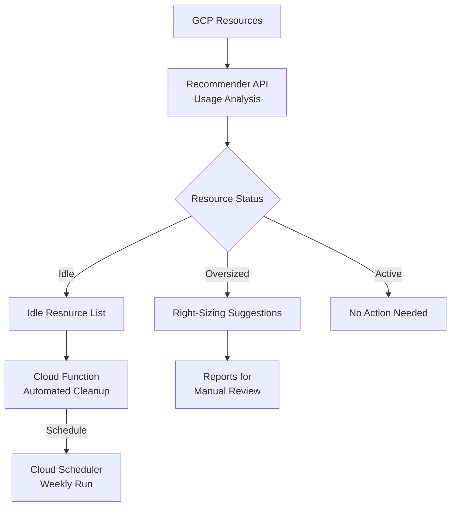

# How to Set Up Automated Idle Resource Detection and Cleanup on GCP Using Recommender and Cloud Scheduler

Author: [nawazdhandala](https://www.github.com/nawazdhandala)

Tags: GCP, Recommender, Cloud Scheduler, Cost Optimization, Automation, Cloud Functions, FinOps

Description: Learn how to automatically detect and clean up idle GCP resources using the Recommender API with Cloud Scheduler and Cloud Functions to reduce wasted cloud spending.

---

Every GCP project accumulates idle resources over time. Someone spins up a VM for testing and forgets about it. A developer creates a persistent disk for a proof of concept that ended months ago. An old load balancer sits unused after a service migration. These idle resources quietly add up to significant wasted spending. The GCP Recommender API identifies these resources automatically, and with Cloud Functions and Cloud Scheduler, you can automate the cleanup. Here is how.

## What the Recommender API Finds

GCP's Recommender analyzes your resource usage patterns and generates recommendations in several categories:

- Idle VMs (running but with near-zero CPU utilization)
- Idle persistent disks (not attached to any VM)
- Idle IP addresses (allocated but not in use)
- Oversized VMs (using far less CPU/memory than provisioned)
- Idle Cloud SQL instances
- Unattached snapshots past their retention period



## Step 1: Enable the Recommender API

```bash
# Enable the Recommender API
gcloud services enable recommender.googleapis.com

# Also enable the services we will manage
gcloud services enable compute.googleapis.com
gcloud services enable sqladmin.googleapis.com
```

## Step 2: Query Recommendations Manually

Before automating anything, look at what the Recommender API finds:

```bash
# Get idle VM recommendations
gcloud recommender recommendations list \
  --project=my-project \
  --location=us-central1-a \
  --recommender=google.compute.instance.IdleResourceRecommender

# Get idle persistent disk recommendations
gcloud recommender recommendations list \
  --project=my-project \
  --location=us-central1-a \
  --recommender=google.compute.disk.IdleResourceRecommender

# Get idle IP address recommendations
gcloud recommender recommendations list \
  --project=my-project \
  --location=us-central1 \
  --recommender=google.compute.address.IdleResourceRecommender

# Get VM right-sizing recommendations
gcloud recommender recommendations list \
  --project=my-project \
  --location=us-central1-a \
  --recommender=google.compute.instance.MachineTypeRecommender
```

## Step 3: Build the Automated Cleanup Function

Create a Cloud Function that processes recommendations and takes action:

```python
# idle_cleanup/main.py - Automated idle resource cleanup
import functions_framework
from google.cloud import recommender_v1
from google.cloud import compute_v1
import logging
import requests
from datetime import datetime

PROJECT_ID = "my-project"
SLACK_WEBHOOK = "https://hooks.slack.com/services/YOUR/WEBHOOK/URL"

# Safety configuration
DRY_RUN = False  # Set to True to preview without taking action
PROTECTED_LABELS = ["production", "prod", "critical", "do-not-delete"]
MIN_IDLE_DAYS = 14  # Only clean up resources idle for at least 2 weeks


@functions_framework.http
def cleanup_idle_resources(request):
    """Main handler: find and clean up idle resources."""
    results = {
        "idle_vms": process_idle_vms(),
        "idle_disks": process_idle_disks(),
        "idle_ips": process_idle_ips(),
    }

    # Send summary to Slack
    send_summary(results)

    return results, 200


def is_protected(labels):
    """Check if a resource is protected from automatic cleanup."""
    if not labels:
        return False  # Unlabeled resources are candidates for cleanup
    for key, value in labels.items():
        if value.lower() in PROTECTED_LABELS:
            return True
        if key == "no-auto-cleanup" and value.lower() == "true":
            return True
    return False


def process_idle_vms():
    """Find and stop idle VM instances."""
    client = recommender_v1.RecommenderClient()
    compute_client = compute_v1.InstancesClient()
    zones_client = compute_v1.ZonesClient()

    stopped_vms = []
    skipped_vms = []

    # Iterate through all zones
    for zone in zones_client.list(project=PROJECT_ID):
        parent = (
            f"projects/{PROJECT_ID}/locations/{zone.name}/"
            f"recommenders/google.compute.instance.IdleResourceRecommender"
        )

        try:
            recommendations = client.list_recommendations(parent=parent)
        except Exception as e:
            logging.warning(f"Could not get recommendations for {zone.name}: {e}")
            continue

        for rec in recommendations:
            if rec.state_info.state != recommender_v1.RecommendationStateInfo.State.ACTIVE:
                continue

            # Extract the instance name from the recommendation
            for group in rec.content.operation_groups:
                for op in group.operations:
                    if op.resource_type == "compute.googleapis.com/Instance":
                        instance_name = op.resource.split("/")[-1]

                        try:
                            instance = compute_client.get(
                                project=PROJECT_ID,
                                zone=zone.name,
                                instance=instance_name,
                            )
                        except Exception:
                            continue

                        # Check if the instance is protected
                        if is_protected(dict(instance.labels or {})):
                            skipped_vms.append({
                                "name": instance_name,
                                "zone": zone.name,
                                "reason": "protected by label",
                            })
                            continue

                        if DRY_RUN:
                            logging.info(f"[DRY RUN] Would stop {instance_name}")
                            stopped_vms.append({
                                "name": instance_name,
                                "zone": zone.name,
                                "status": "dry_run",
                            })
                        else:
                            logging.info(f"Stopping idle VM: {instance_name}")
                            compute_client.stop(
                                project=PROJECT_ID,
                                zone=zone.name,
                                instance=instance_name,
                            )
                            stopped_vms.append({
                                "name": instance_name,
                                "zone": zone.name,
                                "status": "stopped",
                            })

                            # Mark the recommendation as claimed
                            client.mark_recommendation_claimed(
                                name=rec.name,
                                state_metadata={"action": "stopped_by_automation"},
                                etag=rec.etag,
                            )

    return {"stopped": stopped_vms, "skipped": skipped_vms}


def process_idle_disks():
    """Find and snapshot/delete idle persistent disks."""
    client = recommender_v1.RecommenderClient()
    compute_client = compute_v1.DisksClient()
    zones_client = compute_v1.ZonesClient()

    cleaned_disks = []

    for zone in zones_client.list(project=PROJECT_ID):
        parent = (
            f"projects/{PROJECT_ID}/locations/{zone.name}/"
            f"recommenders/google.compute.disk.IdleResourceRecommender"
        )

        try:
            recommendations = client.list_recommendations(parent=parent)
        except Exception:
            continue

        for rec in recommendations:
            if rec.state_info.state != recommender_v1.RecommendationStateInfo.State.ACTIVE:
                continue

            for group in rec.content.operation_groups:
                for op in group.operations:
                    if op.resource_type == "compute.googleapis.com/Disk":
                        disk_name = op.resource.split("/")[-1]

                        try:
                            disk = compute_client.get(
                                project=PROJECT_ID,
                                zone=zone.name,
                                disk=disk_name,
                            )
                        except Exception:
                            continue

                        if is_protected(dict(disk.labels or {})):
                            continue

                        if DRY_RUN:
                            logging.info(f"[DRY RUN] Would snapshot and delete {disk_name}")
                        else:
                            # Create a snapshot before deleting
                            snapshot_name = f"auto-backup-{disk_name}-{datetime.now().strftime('%Y%m%d')}"
                            logging.info(f"Creating snapshot {snapshot_name} of {disk_name}")

                            snapshot_client = compute_v1.SnapshotsClient()
                            snapshot_resource = compute_v1.Snapshot()
                            snapshot_resource.name = snapshot_name
                            snapshot_resource.source_disk = disk.self_link
                            snapshot_resource.labels = {
                                "created-by": "idle-cleanup-automation",
                                "original-disk": disk_name,
                            }

                            snapshot_client.insert(
                                project=PROJECT_ID,
                                snapshot_resource=snapshot_resource,
                            )

                            # Delete the disk after snapshot
                            compute_client.delete(
                                project=PROJECT_ID,
                                zone=zone.name,
                                disk=disk_name,
                            )

                        cleaned_disks.append({
                            "name": disk_name,
                            "zone": zone.name,
                            "size_gb": disk.size_gb,
                            "status": "dry_run" if DRY_RUN else "deleted",
                        })

    return cleaned_disks


def process_idle_ips():
    """Release idle static IP addresses."""
    client = recommender_v1.RecommenderClient()
    address_client = compute_v1.AddressesClient()

    released_ips = []

    # Check each region for idle IPs
    for region in ["us-central1", "us-east1", "us-west1", "europe-west1"]:
        parent = (
            f"projects/{PROJECT_ID}/locations/{region}/"
            f"recommenders/google.compute.address.IdleResourceRecommender"
        )

        try:
            recommendations = client.list_recommendations(parent=parent)
        except Exception:
            continue

        for rec in recommendations:
            if rec.state_info.state != recommender_v1.RecommendationStateInfo.State.ACTIVE:
                continue

            for group in rec.content.operation_groups:
                for op in group.operations:
                    if op.resource_type == "compute.googleapis.com/Address":
                        address_name = op.resource.split("/")[-1]

                        if DRY_RUN:
                            logging.info(f"[DRY RUN] Would release IP: {address_name}")
                        else:
                            logging.info(f"Releasing idle IP: {address_name}")
                            address_client.delete(
                                project=PROJECT_ID,
                                region=region,
                                address=address_name,
                            )

                        released_ips.append({
                            "name": address_name,
                            "region": region,
                            "status": "dry_run" if DRY_RUN else "released",
                        })

    return released_ips


def send_summary(results):
    """Send a summary of cleanup actions to Slack."""
    stopped_vms = results["idle_vms"].get("stopped", [])
    cleaned_disks = results["idle_disks"]
    released_ips = results["idle_ips"]

    mode = "[DRY RUN] " if DRY_RUN else ""
    message = f"*{mode}Weekly Idle Resource Cleanup Summary*\n\n"

    if stopped_vms:
        message += f"*Stopped {len(stopped_vms)} idle VMs:*\n"
        for vm in stopped_vms:
            message += f"  - {vm['name']} ({vm['zone']})\n"
    else:
        message += "No idle VMs found.\n"

    if cleaned_disks:
        total_gb = sum(d.get("size_gb", 0) for d in cleaned_disks)
        message += f"\n*Cleaned up {len(cleaned_disks)} idle disks ({total_gb} GB):*\n"
        for disk in cleaned_disks:
            message += f"  - {disk['name']} ({disk.get('size_gb', '?')} GB)\n"
    else:
        message += "\nNo idle disks found.\n"

    if released_ips:
        message += f"\n*Released {len(released_ips)} idle IP addresses:*\n"
        for ip in released_ips:
            message += f"  - {ip['name']} ({ip['region']})\n"
    else:
        message += "\nNo idle IP addresses found.\n"

    requests.post(SLACK_WEBHOOK, json={"text": message})
```

## Step 4: Deploy the Function

```bash
# Deploy the cleanup function
gcloud functions deploy idle-resource-cleanup \
  --runtime=python311 \
  --trigger-http \
  --source=idle_cleanup/ \
  --entry-point=cleanup_idle_resources \
  --region=us-central1 \
  --timeout=540 \
  --memory=512MB \
  --service-account=resource-cleanup-sa@my-project.iam.gserviceaccount.com \
  --no-allow-unauthenticated
```

Grant the necessary permissions:

```bash
# Create the service account
gcloud iam service-accounts create resource-cleanup-sa \
  --display-name="Resource Cleanup Automation"

# Grant permissions
gcloud projects add-iam-policy-binding my-project \
  --member="serviceAccount:resource-cleanup-sa@my-project.iam.gserviceaccount.com" \
  --role="roles/compute.instanceAdmin.v1"

gcloud projects add-iam-policy-binding my-project \
  --member="serviceAccount:resource-cleanup-sa@my-project.iam.gserviceaccount.com" \
  --role="roles/recommender.viewer"

gcloud projects add-iam-policy-binding my-project \
  --member="serviceAccount:resource-cleanup-sa@my-project.iam.gserviceaccount.com" \
  --role="roles/compute.storageAdmin"
```

## Step 5: Schedule Weekly Cleanup

Use Cloud Scheduler to run the cleanup automatically:

```bash
# Schedule weekly cleanup every Monday at 6 AM
gcloud scheduler jobs create http weekly-idle-cleanup \
  --schedule="0 6 * * 1" \
  --uri="https://us-central1-my-project.cloudfunctions.net/idle-resource-cleanup" \
  --http-method=GET \
  --oidc-service-account-email=resource-cleanup-sa@my-project.iam.gserviceaccount.com \
  --oidc-token-audience="https://us-central1-my-project.cloudfunctions.net/idle-resource-cleanup"
```

## Step 6: Generate Savings Reports

Track the impact of automated cleanup:

```sql
-- Track cleanup savings over time
CREATE TABLE IF NOT EXISTS `my-project.finops.cleanup_savings`
(
  cleanup_date DATE,
  resource_type STRING,
  resource_name STRING,
  estimated_monthly_savings NUMERIC,
  action_taken STRING
);

-- Query cleanup history
SELECT
  DATE_TRUNC(cleanup_date, MONTH) AS month,
  resource_type,
  COUNT(*) AS resources_cleaned,
  SUM(estimated_monthly_savings) AS total_monthly_savings
FROM `my-project.finops.cleanup_savings`
GROUP BY 1, 2
ORDER BY month DESC;
```

## Step 7: Right-Sizing Recommendations Report

Some resources should not be deleted, just resized. Generate a weekly report:

```python
# right_sizing_report.py - Generate right-sizing recommendations
import functions_framework
from google.cloud import recommender_v1

@functions_framework.http
def generate_rightsizing_report(request):
    """Generate a report of VMs that should be resized."""
    client = recommender_v1.RecommenderClient()
    zones_client = compute_v1.ZonesClient()

    report = []

    for zone in zones_client.list(project=PROJECT_ID):
        parent = (
            f"projects/{PROJECT_ID}/locations/{zone.name}/"
            f"recommenders/google.compute.instance.MachineTypeRecommender"
        )

        try:
            for rec in client.list_recommendations(parent=parent):
                if rec.state_info.state != recommender_v1.RecommendationStateInfo.State.ACTIVE:
                    continue

                # Extract current and recommended machine types
                description = rec.description
                impact = rec.primary_impact

                report.append({
                    "zone": zone.name,
                    "description": description,
                    "priority": rec.priority.name,
                    "estimated_savings": (
                        impact.cost_projection.cost.units
                        if impact.cost_projection
                        else 0
                    ),
                })
        except Exception:
            continue

    # Sort by potential savings
    report.sort(key=lambda x: x.get("estimated_savings", 0), reverse=True)

    # Send top 20 to Slack
    if report:
        message = "*Weekly Right-Sizing Recommendations*\n\n"
        for item in report[:20]:
            message += (
                f"- {item['description']} "
                f"(~${abs(item.get('estimated_savings', 0))}/month savings)\n"
            )
        send_slack(message)

    return {"recommendations": len(report)}, 200
```

## Safety Best Practices

1. Always start with DRY_RUN=True. Run the cleanup function in dry-run mode for at least two weeks before enabling actual deletion. Review the reports to make sure nothing critical would be affected.

2. Snapshot disks before deleting them. The small cost of keeping a snapshot is worth the peace of mind if someone realizes they needed that data.

3. Stop VMs instead of deleting them. A stopped VM costs nothing for compute (you still pay for the disk), and it is much easier to restart than recreate.

4. Use label-based protection. Any resource labeled with "no-auto-cleanup=true" or "environment=production" should be automatically excluded.

5. Send notifications before taking action. Give teams 48 hours to claim resources before they are cleaned up. The weekly schedule gives people time to respond.

6. Keep an audit log. Record every action the automation takes, so you can trace back if something goes wrong.

Idle resource cleanup is one of the highest-ROI automation projects you can do for cloud cost management. The Recommender API does the hard work of identifying waste, and Cloud Functions automates the cleanup. Start with reporting, build confidence in the recommendations, then gradually automate the remediation.
