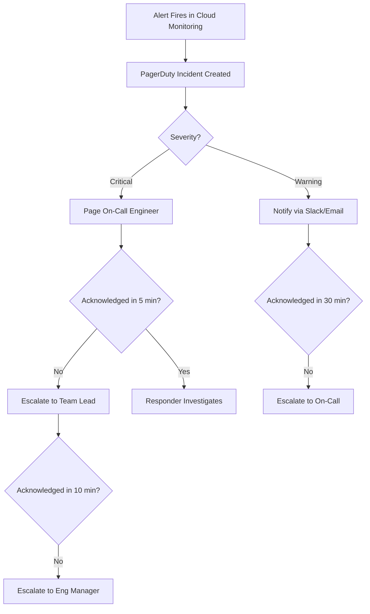

# How to Set Up Automated Incident Escalation with Google Cloud Alerting and PagerDuty

Author: [nawazdhandala](https://www.github.com/nawazdhandala)

Tags: GCP, PagerDuty, Incident Escalation, Google Cloud Monitoring, Alerting, On-Call

Description: Step-by-step guide to integrating Google Cloud Alerting with PagerDuty for automated incident escalation, including severity routing and escalation policies.

---

One of the worst things that can happen during an outage is a missed page. Your monitoring detects the problem, fires an alert, but nobody responds because the notification got lost in a noisy Slack channel or the on-call engineer was asleep and there was no escalation. Automated incident escalation solves this by ensuring that if the first responder does not acknowledge an incident within a defined time window, it automatically escalates to the next person or team.

Google Cloud Alerting and PagerDuty work well together for this. Cloud Alerting handles the detection side - defining what conditions trigger an alert and what metadata gets included. PagerDuty handles the response side - routing incidents to the right person, tracking acknowledgment, and escalating when needed.

In this guide, I will walk through setting up the full pipeline from a Cloud Monitoring alert to a PagerDuty escalation chain.

## Prerequisites

Before starting, you will need a Google Cloud project with Cloud Monitoring enabled, a PagerDuty account with admin access, and the gcloud CLI installed. You should also have at least one service running on GCP that you want to monitor.

## Step 1: Create a PagerDuty Service

In PagerDuty, a service represents a component of your infrastructure. Each service has its own escalation policy, which defines who gets paged and in what order.

First, create an escalation policy in PagerDuty:

1. Go to People, then Escalation Policies, and click New Escalation Policy.
2. Name it something descriptive like "Backend Team Escalation."
3. Add your escalation rules:
   - Level 1: On-call engineer (5-minute timeout)
   - Level 2: Team lead (10-minute timeout)
   - Level 3: Engineering manager (15-minute timeout)

Then create a service:

1. Go to Services, then Service Directory, and click New Service.
2. Name it to match your GCP service, for example "Payment Service - Production."
3. Select the escalation policy you just created.
4. Under Integrations, select "Google Cloud Monitoring" as the integration type.
5. Copy the Integration Key - you will need it for the Cloud Monitoring notification channel.

## Step 2: Create the PagerDuty Notification Channel in Cloud Monitoring

Back in GCP, create a notification channel that connects to your PagerDuty service:

```bash
# Create a PagerDuty notification channel
gcloud alpha monitoring channels create \
  --display-name="PagerDuty - Payment Service" \
  --type=pagerduty \
  --channel-labels=service_key=YOUR_PAGERDUTY_INTEGRATION_KEY \
  --project=my-project-id
```

You can also set this up through the Cloud Console. Navigate to Monitoring, then Alerting, then Edit Notification Channels, and add a PagerDuty channel.

To verify the channel was created, list your channels:

```bash
# List all notification channels to find the channel ID
gcloud alpha monitoring channels list \
  --project=my-project-id \
  --format="table(name, displayName, type)"
```

Note the channel name (it looks like `projects/my-project-id/notificationChannels/12345678`) because you will need it when creating alerting policies.

## Step 3: Create Alerting Policies with Severity Levels

The key to good escalation is routing incidents by severity. You do not want to page the engineering manager at 3 AM for a warning-level alert. Create separate alerting policies for different severity levels and route them to different PagerDuty services.

Here is a critical-severity alert for a complete service outage:

```bash
# Critical alert: service is completely down
gcloud alpha monitoring policies create \
  --display-name="CRITICAL - Payment Service Down" \
  --condition-display-name="Zero successful requests for 5 minutes" \
  --condition-filter='resource.type="cloud_run_revision" AND resource.labels.service_name="payment-service" AND metric.type="run.googleapis.com/request_count" AND metric.labels.response_code_class="2xx"' \
  --condition-threshold-value=0 \
  --condition-threshold-comparison=COMPARISON_LT \
  --condition-threshold-duration=300s \
  --condition-threshold-aggregation-alignment-period=60s \
  --condition-threshold-aggregation-per-series-aligner=ALIGN_RATE \
  --notification-channels=projects/my-project-id/notificationChannels/CRITICAL_CHANNEL_ID \
  --documentation-content="CRITICAL: Payment service is down. Runbook: https://wiki/runbooks/payment-down" \
  --severity=CRITICAL
```

And a warning-level alert for degraded performance:

```bash
# Warning alert: elevated error rate
gcloud alpha monitoring policies create \
  --display-name="WARNING - Payment Service Error Rate High" \
  --condition-display-name="Error rate > 5% for 10 minutes" \
  --condition-filter='resource.type="cloud_run_revision" AND resource.labels.service_name="payment-service" AND metric.type="run.googleapis.com/request_count" AND metric.labels.response_code_class="5xx"' \
  --condition-threshold-value=0.05 \
  --condition-threshold-comparison=COMPARISON_GT \
  --condition-threshold-duration=600s \
  --notification-channels=projects/my-project-id/notificationChannels/WARNING_CHANNEL_ID \
  --documentation-content="WARNING: Payment service error rate elevated. Check logs." \
  --severity=WARNING
```

## Step 4: Configure PagerDuty Escalation Rules

Now configure PagerDuty to handle the escalation based on the severity of the incoming alert. PagerDuty supports event rules that can route incidents differently based on their payload.

In PagerDuty, go to your service and set up Event Orchestration rules:

```json
{
  "orchestration_path": {
    "sets": [
      {
        "id": "start",
        "rules": [
          {
            "label": "Critical Severity",
            "conditions": [
              {
                "expression": "event.custom_details.severity matches 'CRITICAL'"
              }
            ],
            "actions": {
              "severity": "critical",
              "escalation_policy": {
                "id": "P_CRITICAL_ESCALATION"
              }
            }
          },
          {
            "label": "Warning Severity",
            "conditions": [
              {
                "expression": "event.custom_details.severity matches 'WARNING'"
              }
            ],
            "actions": {
              "severity": "warning",
              "suppress": false,
              "escalation_policy": {
                "id": "P_WARNING_ESCALATION"
              }
            }
          }
        ]
      }
    ]
  }
}
```

## Step 5: Set Up Escalation Timeouts

The escalation timeout is how long PagerDuty waits for an acknowledgment before escalating. For critical incidents, keep this short. For warnings, you can be more generous.

A recommended configuration:



## Step 6: Test the Integration

Before relying on this setup in production, test it end to end. Cloud Monitoring does not have a built-in "test alert" feature for custom policies, but you can trigger a real alert by temporarily lowering the threshold.

Alternatively, use PagerDuty's Events API to send a test event:

```bash
# Send a test event to PagerDuty to verify the integration
curl -X POST https://events.pagerduty.com/v2/enqueue \
  -H "Content-Type: application/json" \
  -d '{
    "routing_key": "YOUR_PAGERDUTY_INTEGRATION_KEY",
    "event_action": "trigger",
    "payload": {
      "summary": "TEST: Cloud Monitoring Integration Test",
      "severity": "critical",
      "source": "test-script",
      "component": "payment-service",
      "custom_details": {
        "project": "my-project-id",
        "policy_name": "TEST ALERT"
      }
    }
  }'
```

Verify that the incident appears in PagerDuty, gets routed to the correct on-call person, and escalates if not acknowledged within the timeout window.

## Step 7: Add Auto-Resolution

Configure your alerts to automatically resolve PagerDuty incidents when the condition clears. Cloud Monitoring does this by default - when the alerting policy condition is no longer met, it sends a resolution notification to PagerDuty. Make sure your PagerDuty service is configured to auto-resolve when it receives recovery events from Google Cloud Monitoring.

In PagerDuty, go to your service settings and ensure "Auto-resolve" is enabled. Set a reasonable auto-resolution timeout (for example, 4 hours) as a safety net in case the recovery event is not received.

## Summary

Automated incident escalation removes the guesswork from incident response. Google Cloud Alerting detects the problem and categorizes it by severity. PagerDuty receives the alert, routes it to the right person, and escalates if nobody responds. The combination ensures that critical issues always get human attention, even at 3 AM on a Saturday. Set up the integration, test it thoroughly, and your on-call team will sleep a little better knowing the escalation chain has their back.
