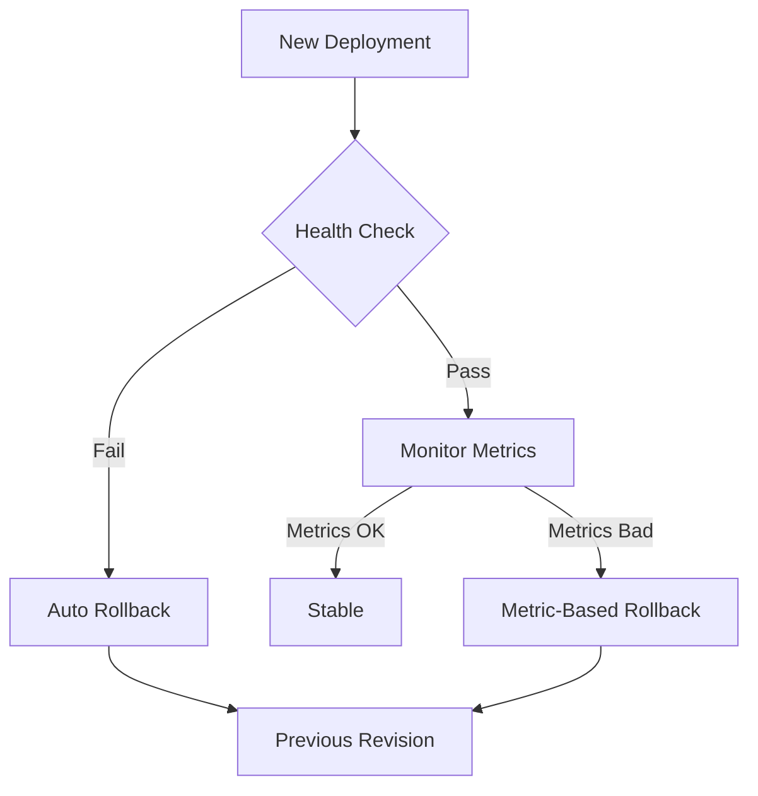

# How to Set Up Automated Rollback Strategies for Failed Deployments on GKE Using Cloud Deploy

Author: [nawazdhandala](https://www.github.com/nawazdhandala)

Tags: GCP, Cloud Deploy, GKE, Rollback, Deployment Safety

Description: Learn how to configure automated rollback strategies for GKE deployments using Google Cloud Deploy to recover from failed releases quickly and safely.

---

Deployments fail. No matter how thorough your testing is, sometimes a release breaks in production. When that happens, the speed of your rollback determines how long your users are affected. Manual rollbacks under pressure are error-prone and slow. Automated rollbacks triggered by health checks and metrics give you recovery in seconds, not minutes.

In this post, I will show you how to set up automated rollback strategies for GKE using Cloud Deploy, including health-based rollbacks, metrics-based rollbacks, and manual rollback workflows.

## Types of Rollback Strategies

There are three main approaches to rollback on GKE:

1. **Kubernetes-native rollback** - using deployment revision history
2. **Cloud Deploy rollback** - rolling back to a previous release
3. **Automated rollback** - triggered by health checks or metric thresholds



## Step 1: Configure Kubernetes Rollback Basics

Start with proper deployment configuration that supports rollback:

```yaml
# k8s/deployment.yaml
apiVersion: apps/v1
kind: Deployment
metadata:
  name: my-app
  namespace: production
  annotations:
    # Keep the last 10 revisions for rollback
    deployment.kubernetes.io/revision: "1"
spec:
  replicas: 5
  # Keep 10 revisions in history
  revisionHistoryLimit: 10
  strategy:
    type: RollingUpdate
    rollingUpdate:
      # Allow at most 1 extra pod during update
      maxSurge: 1
      # Ensure at least 4 pods are always available
      maxUnavailable: 0
  selector:
    matchLabels:
      app: my-app
  template:
    metadata:
      labels:
        app: my-app
    spec:
      containers:
        - name: my-app
          image: gcr.io/my-project/my-app:v1.0.0
          ports:
            - containerPort: 8080
          # Readiness probe - prevents traffic to unhealthy pods
          readinessProbe:
            httpGet:
              path: /health
              port: 8080
            initialDelaySeconds: 5
            periodSeconds: 5
            failureThreshold: 3
          # Liveness probe - restarts unhealthy pods
          livenessProbe:
            httpGet:
              path: /health
              port: 8080
            initialDelaySeconds: 15
            periodSeconds: 10
            failureThreshold: 3
          # Startup probe - gives the app time to start
          startupProbe:
            httpGet:
              path: /health
              port: 8080
            failureThreshold: 30
            periodSeconds: 10
          resources:
            requests:
              cpu: 250m
              memory: 256Mi
            limits:
              cpu: 500m
              memory: 512Mi
  # Minimum time a pod must be ready before considering it available
  minReadySeconds: 30
  # Deadline for the deployment to complete before considered failed
  progressDeadlineSeconds: 300
```

The `progressDeadlineSeconds` is critical for automated rollback. If the deployment does not complete within this time (because pods keep failing health checks), Kubernetes marks it as failed.

## Step 2: Set Up Cloud Deploy Pipeline with Rollback

Configure Cloud Deploy with verification steps that trigger rollback on failure:

```yaml
# clouddeploy.yaml
apiVersion: deploy.cloud.google.com/v1
kind: DeliveryPipeline
metadata:
  name: my-app-pipeline
description: Delivery pipeline with automated rollback
serialPipeline:
  stages:
    - targetId: staging
      profiles: [staging]
      strategy:
        standard:
          verify: true
    - targetId: production
      profiles: [production]
      strategy:
        canary:
          runtimeConfig:
            kubernetes:
              serviceNetworking:
                service: my-app-service
                deployment: my-app
          canaryDeployment:
            percentages: [10, 50]
            verify: true
            postdeploy:
              actions: ["verify-deployment"]
---
apiVersion: deploy.cloud.google.com/v1
kind: Target
metadata:
  name: staging
gke:
  cluster: projects/my-project/locations/us-central1/clusters/staging
---
apiVersion: deploy.cloud.google.com/v1
kind: Target
metadata:
  name: production
gke:
  cluster: projects/my-project/locations/us-central1/clusters/production
```

## Step 3: Create Verification Jobs

Build verification jobs that run after each deployment phase. If they fail, Cloud Deploy automatically rolls back:

```yaml
# k8s/verify-job.yaml
apiVersion: batch/v1
kind: Job
metadata:
  name: deployment-verify
  annotations:
    deploy.cloud.google.com/verify: "true"
spec:
  backoffLimit: 0
  activeDeadlineSeconds: 600
  template:
    spec:
      containers:
        - name: verifier
          image: gcr.io/my-project/deployment-verifier:latest
          env:
            - name: SERVICE_URL
              value: "http://my-app-service.production.svc.cluster.local"
            - name: EXPECTED_VERSION
              valueFrom:
                fieldRef:
                  fieldPath: metadata.labels['app.kubernetes.io/version']
          command: ["/bin/sh", "-c"]
          args:
            - |
              echo "Starting deployment verification..."

              # Check 1: Health endpoint returns 200
              for i in $(seq 1 30); do
                HTTP_CODE=$(curl -s -o /dev/null -w "%{http_code}" "$SERVICE_URL/health")
                if [ "$HTTP_CODE" = "200" ]; then
                  echo "Health check passed"
                  break
                fi
                echo "Health check attempt $i: HTTP $HTTP_CODE"
                sleep 10
              done

              if [ "$HTTP_CODE" != "200" ]; then
                echo "FAIL: Health check never passed"
                exit 1
              fi

              # Check 2: Error rate is below threshold
              ERROR_COUNT=0
              TOTAL_REQUESTS=100

              for i in $(seq 1 $TOTAL_REQUESTS); do
                HTTP_CODE=$(curl -s -o /dev/null -w "%{http_code}" "$SERVICE_URL/api/status")
                if [ "$HTTP_CODE" -ge 500 ]; then
                  ERROR_COUNT=$((ERROR_COUNT + 1))
                fi
              done

              ERROR_RATE=$(echo "scale=2; $ERROR_COUNT / $TOTAL_REQUESTS * 100" | bc)
              echo "Error rate: $ERROR_RATE% ($ERROR_COUNT/$TOTAL_REQUESTS)"

              if [ "$ERROR_COUNT" -gt 5 ]; then
                echo "FAIL: Error rate ${ERROR_RATE}% exceeds 5% threshold"
                exit 1
              fi

              # Check 3: Response time is acceptable
              TOTAL_TIME=$(curl -s -o /dev/null -w "%{time_total}" "$SERVICE_URL/api/status")
              echo "Response time: ${TOTAL_TIME}s"

              THRESHOLD="2.0"
              if [ $(echo "$TOTAL_TIME > $THRESHOLD" | bc) -eq 1 ]; then
                echo "FAIL: Response time ${TOTAL_TIME}s exceeds ${THRESHOLD}s threshold"
                exit 1
              fi

              echo "All verification checks passed"
      restartPolicy: Never
```

## Step 4: Automated Metrics-Based Rollback

Create a monitoring system that watches key metrics and triggers rollback when they degrade. Use a Cloud Function connected to Cloud Monitoring alerts:

```python
# rollback_controller.py - Cloud Function for automated rollback
import os
import json
import subprocess
from google.cloud import deploy_v1
from google.cloud import container_v1

PROJECT_ID = os.environ['PROJECT_ID']
REGION = os.environ.get('REGION', 'us-central1')
PIPELINE_NAME = os.environ.get('PIPELINE_NAME', 'my-app-pipeline')

deploy_client = deploy_v1.CloudDeployClient()

def handle_alert(event, context):
    """
    Triggered by a Cloud Monitoring alert via Pub/Sub.
    Automatically rolls back the production deployment if metrics are degraded.
    """
    alert_data = json.loads(event['data'].decode('utf-8'))

    incident_state = alert_data.get('incident', {}).get('state', '')
    policy_name = alert_data.get('incident', {}).get('policy_name', '')

    print(f"Alert received: {policy_name}, state: {incident_state}")

    if incident_state != 'open':
        print("Incident not open, skipping")
        return

    # Determine if this is a rollback-worthy alert
    rollback_policies = [
        'High Error Rate - Production',
        'Latency Spike - Production',
        'Pod Crash Loop - Production'
    ]

    if policy_name not in rollback_policies:
        print(f"Policy '{policy_name}' is not configured for auto-rollback")
        return

    print(f"Initiating automated rollback for policy: {policy_name}")

    # Get the current rollout
    pipeline_path = f'projects/{PROJECT_ID}/locations/{REGION}/deliveryPipelines/{PIPELINE_NAME}'

    try:
        # List recent rollouts for the production target
        rollouts = deploy_client.list_rollouts(
            request={
                'parent': f'{pipeline_path}/releases/-'
            }
        )

        # Find the current active rollout
        current_rollout = None
        for rollout in rollouts:
            if rollout.state == deploy_v1.Rollout.State.SUCCEEDED:
                current_rollout = rollout
                break

        if current_rollout:
            # Trigger rollback using Cloud Deploy
            print(f"Rolling back from: {current_rollout.name}")

            # Use kubectl to perform immediate rollback
            perform_kubectl_rollback()

            print("Rollback initiated successfully")
        else:
            print("No active rollout found to roll back")

    except Exception as e:
        print(f"Error during rollback: {e}")
        raise

def perform_kubectl_rollback():
    """Use kubectl to roll back the deployment immediately."""
    # Get cluster credentials
    subprocess.run([
        'gcloud', 'container', 'clusters', 'get-credentials',
        'production', '--region', REGION, '--project', PROJECT_ID
    ], check=True)

    # Roll back to previous revision
    result = subprocess.run([
        'kubectl', 'rollout', 'undo',
        'deployment/my-app', '-n', 'production'
    ], capture_output=True, text=True)

    print(f"Kubectl rollback output: {result.stdout}")
    if result.returncode != 0:
        print(f"Kubectl rollback error: {result.stderr}")
        raise Exception(f"Rollback failed: {result.stderr}")
```

## Step 5: Set Up Alerting Policies That Trigger Rollback

Create monitoring alerts that feed into the rollback controller:

```bash
# Create a Pub/Sub topic for rollback alerts
gcloud pubsub topics create deployment-rollback-alerts

# Create alert for high error rate
gcloud alpha monitoring policies create \
  --display-name="High Error Rate - Production" \
  --condition-display-name="5xx error rate above 5%" \
  --condition-filter='resource.type="k8s_container" AND metric.type="custom.googleapis.com/http/error_rate" AND resource.labels.namespace_name="production"' \
  --condition-threshold-value=0.05 \
  --condition-threshold-comparison=COMPARISON_GT \
  --condition-threshold-duration=120s \
  --notification-channels=projects/my-project/notificationChannels/rollback-pubsub

# Create alert for latency spike
gcloud alpha monitoring policies create \
  --display-name="Latency Spike - Production" \
  --condition-display-name="P99 latency above 5 seconds" \
  --condition-filter='resource.type="k8s_container" AND metric.type="custom.googleapis.com/http/latency_p99" AND resource.labels.namespace_name="production"' \
  --condition-threshold-value=5000 \
  --condition-threshold-comparison=COMPARISON_GT \
  --condition-threshold-duration=120s \
  --notification-channels=projects/my-project/notificationChannels/rollback-pubsub

# Create alert for pod crash loops
gcloud alpha monitoring policies create \
  --display-name="Pod Crash Loop - Production" \
  --condition-display-name="Pods restarting repeatedly" \
  --condition-filter='resource.type="k8s_container" AND metric.type="kubernetes.io/container/restart_count" AND resource.labels.namespace_name="production"' \
  --condition-threshold-value=5 \
  --condition-threshold-comparison=COMPARISON_GT \
  --condition-threshold-duration=300s \
  --notification-channels=projects/my-project/notificationChannels/rollback-pubsub
```

## Step 6: Manual Rollback Commands

Sometimes you need to roll back manually. Here are the commands for different scenarios:

```bash
# Kubernetes-native rollback (fastest)
kubectl rollout undo deployment/my-app -n production

# Roll back to a specific revision
kubectl rollout history deployment/my-app -n production
kubectl rollout undo deployment/my-app -n production --to-revision=3

# Cloud Deploy rollback to a previous release
gcloud deploy targets rollback production \
  --delivery-pipeline=my-app-pipeline \
  --region=us-central1

# Roll back by redeploying a specific release
gcloud deploy releases promote \
  --release=release-v1-2-0 \
  --delivery-pipeline=my-app-pipeline \
  --region=us-central1
```

## Step 7: Post-Rollback Verification

After a rollback, verify that the system has recovered:

```bash
#!/bin/bash
# post-rollback-verify.sh - Run after any rollback

echo "Verifying rollback success..."

# Check deployment status
kubectl rollout status deployment/my-app -n production --timeout=120s

# Check pod health
READY_PODS=$(kubectl get pods -n production -l app=my-app \
  --field-selector=status.phase=Running -o name | wc -l)

DESIRED_PODS=$(kubectl get deployment my-app -n production \
  -o jsonpath='{.spec.replicas}')

echo "Pods ready: $READY_PODS / $DESIRED_PODS"

if [ "$READY_PODS" -lt "$DESIRED_PODS" ]; then
  echo "WARNING: Not all pods are ready after rollback"
  exit 1
fi

# Check error rate
sleep 60  # Wait for metrics to stabilize
echo "Checking error rate post-rollback..."

# Run a batch of requests
ERROR_COUNT=0
for i in $(seq 1 50); do
  HTTP_CODE=$(curl -s -o /dev/null -w "%{http_code}" "https://api.example.com/health")
  if [ "$HTTP_CODE" -ge 500 ]; then
    ERROR_COUNT=$((ERROR_COUNT + 1))
  fi
done

echo "Post-rollback error count: $ERROR_COUNT / 50"

if [ "$ERROR_COUNT" -gt 2 ]; then
  echo "ERROR: Rollback may not have resolved the issue"
  exit 1
fi

echo "Rollback verification passed"
```

## Rollback Decision Matrix

Not every issue warrants an automated rollback. Here is a framework for deciding:

| Condition | Action | Automation |
|-----------|--------|------------|
| Error rate > 5% for 2 min | Automatic rollback | Yes |
| P99 latency > 5s for 2 min | Automatic rollback | Yes |
| Pod crash loops > 5 in 5 min | Automatic rollback | Yes |
| Error rate 1-5% | Alert on-call | Semi-auto |
| Latency increase 50% | Alert on-call | Manual |
| Feature bug (no errors) | Manual assessment | Manual |

## Wrapping Up

Automated rollback strategies on GKE turn deployment failures from incidents into non-events. By combining Kubernetes-native health checks, Cloud Deploy verification steps, and metrics-based alerting with automated rollback controllers, you can recover from most deployment failures before your users even notice.

The most important thing is setting up proper health checks and readiness probes on your pods. Without these, Kubernetes cannot detect a bad deployment, and no amount of rollback automation will help. Get the probes right first, then layer on the automated rollback logic.
