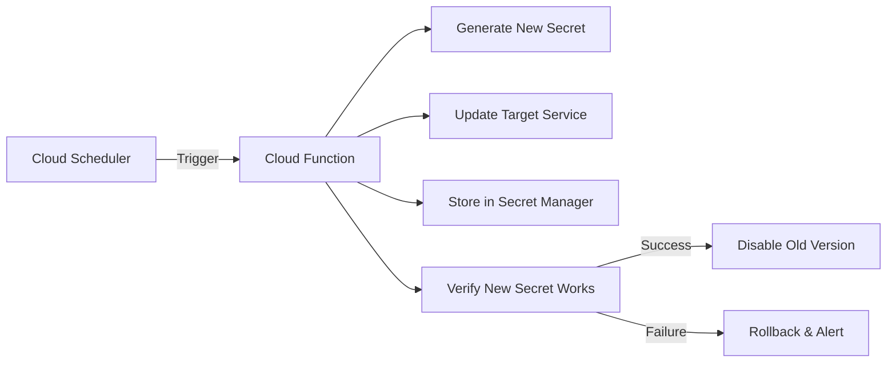

# How to Set Up Automated Secret Rotation with Google Cloud Secret Manager and Cloud Functions

Author: [nawazdhandala](https://www.github.com/nawazdhandala)

Tags: GCP, Secret Manager, Secret Rotation, Cloud Functions, Google Cloud Security

Description: Learn how to set up automated secret rotation on Google Cloud using Secret Manager and Cloud Functions to keep credentials fresh without manual intervention.

---

Static secrets are a security risk. The longer a database password, API key, or service credential sits unchanged, the more time an attacker has to find and exploit it. Most compliance frameworks require regular credential rotation, but doing it manually is painful and error-prone. Automated secret rotation with Google Cloud Secret Manager and Cloud Functions solves this by rotating secrets on a schedule and updating all dependent services automatically.

This guide walks through building a complete automated secret rotation pipeline.

## The Rotation Architecture



The rotation process follows these steps:
1. Cloud Scheduler triggers the rotation function on a schedule
2. The function generates a new credential
3. It updates the target service (database, API, etc.) with the new credential
4. It stores the new credential in Secret Manager as a new version
5. It verifies the new credential works
6. If successful, it disables the old version

## Step 1: Set Up Secret Manager

```bash
# Enable the Secret Manager API
gcloud services enable secretmanager.googleapis.com

# Create a secret for a database password
gcloud secrets create db-password \
    --replication-policy=automatic \
    --labels="service=postgres,rotation=automated" \
    --project=my-project

# Add the initial secret version
echo -n "initial-password-value" | \
    gcloud secrets versions add db-password --data-file=- --project=my-project

# Set rotation metadata using annotations
gcloud secrets update db-password \
    --update-annotations="rotation-period=30d,last-rotated=$(date -u +%Y-%m-%dT%H:%M:%SZ)" \
    --project=my-project
```

Create secrets for different services:

```bash
# API key secret
gcloud secrets create stripe-api-key \
    --replication-policy=automatic \
    --labels="service=stripe,rotation=automated" \
    --project=my-project

# Service account key (for external services that require keys)
gcloud secrets create external-service-key \
    --replication-policy=automatic \
    --labels="service=external-api,rotation=automated" \
    --project=my-project
```

## Step 2: Create the Rotation Cloud Function

```python
# secret_rotator.py
# Cloud Function that automatically rotates secrets on a schedule
# Supports database passwords, API keys, and service credentials

import functions_framework
from google.cloud import secretmanager
from google.cloud import sql_v1beta4
import psycopg2
import secrets
import string
import json
import logging
from datetime import datetime

logger = logging.getLogger(__name__)

sm_client = secretmanager.SecretManagerServiceClient()
PROJECT_ID = "my-project"


def generate_secure_password(length=32):
    """Generate a cryptographically secure password."""
    # Use a mix of characters suitable for database passwords
    alphabet = string.ascii_letters + string.digits + "!@#$%^&*"
    password = ''.join(secrets.choice(alphabet) for _ in range(length))
    return password


def generate_api_key(length=64):
    """Generate a cryptographically secure API key."""
    return secrets.token_urlsafe(length)


@functions_framework.http
def rotate_secret(request):
    """Main entry point for secret rotation."""

    request_json = request.get_json(silent=True)
    if not request_json:
        return json.dumps({'error': 'Request body required'}), 400

    secret_id = request_json.get('secret_id')
    secret_type = request_json.get('type', 'database_password')

    if not secret_id:
        return json.dumps({'error': 'secret_id required'}), 400

    try:
        if secret_type == 'database_password':
            result = rotate_database_password(secret_id, request_json)
        elif secret_type == 'api_key':
            result = rotate_api_key(secret_id, request_json)
        else:
            return json.dumps({'error': f'Unknown secret type: {secret_type}'}), 400

        return json.dumps(result)

    except Exception as e:
        logger.error(f"Rotation failed for {secret_id}: {e}")
        return json.dumps({'error': str(e), 'secret_id': secret_id}), 500


def rotate_database_password(secret_id, config):
    """Rotate a Cloud SQL database password."""

    instance_name = config.get('instance_name')
    database = config.get('database')
    username = config.get('username')

    # Step 1: Get the current password
    current_version = sm_client.access_secret_version(
        request={"name": f"projects/{PROJECT_ID}/secrets/{secret_id}/versions/latest"}
    )
    current_password = current_version.payload.data.decode('UTF-8')

    # Step 2: Generate a new password
    new_password = generate_secure_password()

    # Step 3: Update the database user password
    # Connect with the current password and change it
    try:
        conn = psycopg2.connect(
            host=f'/cloudsql/{PROJECT_ID}:us-central1:{instance_name}',
            database=database,
            user=username,
            password=current_password
        )
        conn.autocommit = True
        cursor = conn.cursor()

        # Change the password using SQL
        cursor.execute(
            "ALTER USER %s WITH PASSWORD %s",
            (username, new_password)
        )
        cursor.close()
        conn.close()
        logger.info(f"Database password updated for {username}@{instance_name}")

    except psycopg2.OperationalError:
        # If we cannot connect with current password, try using Cloud SQL Admin API
        logger.warning("Cannot connect with current password, using Admin API")
        update_password_via_admin_api(instance_name, username, new_password)

    # Step 4: Store the new password in Secret Manager
    sm_client.add_secret_version(
        request={
            "parent": f"projects/{PROJECT_ID}/secrets/{secret_id}",
            "payload": {"data": new_password.encode("UTF-8")},
        }
    )

    # Step 5: Verify the new password works
    try:
        verify_conn = psycopg2.connect(
            host=f'/cloudsql/{PROJECT_ID}:us-central1:{instance_name}',
            database=database,
            user=username,
            password=new_password
        )
        verify_conn.close()
        logger.info("New password verified successfully")
    except Exception as e:
        # Rollback: Restore the old password
        logger.error(f"New password verification failed: {e}")
        update_password_via_admin_api(instance_name, username, current_password)
        raise RuntimeError(f"Password rotation failed, rolled back: {e}")

    # Step 6: Disable the old version
    disable_old_versions(secret_id)

    return {
        'status': 'success',
        'secret_id': secret_id,
        'rotated_at': datetime.utcnow().isoformat(),
        'instance': instance_name
    }


def rotate_api_key(secret_id, config):
    """Rotate an API key by generating a new one."""

    # Step 1: Generate new API key
    new_key = generate_api_key()

    # Step 2: Store in Secret Manager
    sm_client.add_secret_version(
        request={
            "parent": f"projects/{PROJECT_ID}/secrets/{secret_id}",
            "payload": {"data": new_key.encode("UTF-8")},
        }
    )

    # Step 3: Disable old versions
    disable_old_versions(secret_id)

    return {
        'status': 'success',
        'secret_id': secret_id,
        'rotated_at': datetime.utcnow().isoformat()
    }


def update_password_via_admin_api(instance_name, username, password):
    """Update a Cloud SQL user password via the Admin API."""
    sqladmin = sql_v1beta4.SqlUsersServiceClient()
    request = sql_v1beta4.SqlUsersUpdateRequest(
        project=PROJECT_ID,
        instance=instance_name,
        name=username,
        body=sql_v1beta4.User(password=password)
    )
    sqladmin.update(request=request)


def disable_old_versions(secret_id):
    """Disable all secret versions except the latest."""
    parent = f"projects/{PROJECT_ID}/secrets/{secret_id}"

    # List all enabled versions
    versions = sm_client.list_secret_versions(request={"parent": parent})

    version_list = []
    for version in versions:
        if version.state == secretmanager.SecretVersion.State.ENABLED:
            version_list.append(version)

    # Sort by creation time, keep only the latest enabled
    version_list.sort(key=lambda v: v.create_time, reverse=True)

    # Disable all but the latest version
    for old_version in version_list[1:]:
        sm_client.disable_secret_version(
            request={"name": old_version.name}
        )
        logger.info(f"Disabled old version: {old_version.name}")
```

## Step 3: Deploy the Function

```bash
# Deploy the secret rotation Cloud Function
gcloud functions deploy secret-rotator \
    --runtime=python311 \
    --trigger-http \
    --entry-point=rotate_secret \
    --region=us-central1 \
    --service-account=secret-rotator@my-project.iam.gserviceaccount.com \
    --memory=256MB \
    --timeout=120s \
    --no-allow-unauthenticated \
    --project=my-project

# Grant the service account necessary permissions
gcloud projects add-iam-policy-binding my-project \
    --role=roles/secretmanager.admin \
    --member="serviceAccount:secret-rotator@my-project.iam.gserviceaccount.com"

gcloud projects add-iam-policy-binding my-project \
    --role=roles/cloudsql.admin \
    --member="serviceAccount:secret-rotator@my-project.iam.gserviceaccount.com"
```

## Step 4: Schedule Rotation with Cloud Scheduler

```bash
# Rotate database password every 30 days
gcloud scheduler jobs create http rotate-db-password \
    --schedule="0 3 1 * *" \
    --uri="https://us-central1-my-project.cloudfunctions.net/secret-rotator" \
    --http-method=POST \
    --headers="Content-Type=application/json" \
    --message-body='{"secret_id": "db-password", "type": "database_password", "instance_name": "my-db-instance", "database": "myapp", "username": "app_user"}' \
    --oidc-service-account-email=secret-rotator@my-project.iam.gserviceaccount.com \
    --project=my-project

# Rotate API key every 90 days
gcloud scheduler jobs create http rotate-api-key \
    --schedule="0 3 1 */3 *" \
    --uri="https://us-central1-my-project.cloudfunctions.net/secret-rotator" \
    --http-method=POST \
    --headers="Content-Type=application/json" \
    --message-body='{"secret_id": "stripe-api-key", "type": "api_key"}' \
    --oidc-service-account-email=secret-rotator@my-project.iam.gserviceaccount.com \
    --project=my-project
```

## Step 5: Configure Applications to Use Latest Secrets

Your applications should always read the latest version of a secret:

```python
# app_config.py
# Application code that reads secrets from Secret Manager
# Always fetches the latest version to work with rotation

from google.cloud import secretmanager

sm_client = secretmanager.SecretManagerServiceClient()

def get_secret(secret_id, project_id="my-project"):
    """Get the latest version of a secret."""
    name = f"projects/{project_id}/secrets/{secret_id}/versions/latest"
    response = sm_client.access_secret_version(request={"name": name})
    return response.payload.data.decode("UTF-8")

# Use in database connection
import psycopg2

def get_db_connection():
    """Get a database connection using the latest rotated password."""
    password = get_secret("db-password")
    return psycopg2.connect(
        host="db-host",
        database="myapp",
        user="app_user",
        password=password
    )
```

For applications that cache connections, implement a reconnection strategy:

```python
# connection_pool.py
# Database connection pool that handles secret rotation gracefully

import psycopg2.pool
from google.cloud import secretmanager
import time

class RotationAwareConnectionPool:
    """Connection pool that automatically refreshes when secrets rotate."""

    def __init__(self, secret_id, host, database, user, min_conn=2, max_conn=10):
        self.secret_id = secret_id
        self.host = host
        self.database = database
        self.user = user
        self.min_conn = min_conn
        self.max_conn = max_conn
        self.sm_client = secretmanager.SecretManagerServiceClient()
        self._pool = None
        self._last_refresh = 0
        self._refresh_interval = 3600  # Refresh pool every hour
        self._create_pool()

    def _get_password(self):
        """Fetch the latest password from Secret Manager."""
        name = f"projects/my-project/secrets/{self.secret_id}/versions/latest"
        response = self.sm_client.access_secret_version(request={"name": name})
        return response.payload.data.decode("UTF-8")

    def _create_pool(self):
        """Create a new connection pool with the latest password."""
        password = self._get_password()
        self._pool = psycopg2.pool.ThreadedConnectionPool(
            self.min_conn,
            self.max_conn,
            host=self.host,
            database=self.database,
            user=self.user,
            password=password
        )
        self._last_refresh = time.time()

    def get_connection(self):
        """Get a connection, refreshing the pool if needed."""
        # Periodically refresh the pool to pick up rotated secrets
        if time.time() - self._last_refresh > self._refresh_interval:
            self._create_pool()

        try:
            return self._pool.getconn()
        except psycopg2.OperationalError:
            # Connection failed, likely due to password rotation
            # Refresh the pool and try again
            self._create_pool()
            return self._pool.getconn()

    def return_connection(self, conn):
        """Return a connection to the pool."""
        self._pool.putconn(conn)
```

## Terraform Configuration

```hcl
# Secret Manager secrets
resource "google_secret_manager_secret" "db_password" {
  secret_id = "db-password"
  project   = "my-project"

  labels = {
    service  = "postgres"
    rotation = "automated"
  }

  replication {
    auto {}
  }
}

# Cloud Scheduler job for rotation
resource "google_cloud_scheduler_job" "rotate_db" {
  name     = "rotate-db-password"
  schedule = "0 3 1 * *"
  project  = "my-project"
  region   = "us-central1"

  http_target {
    http_method = "POST"
    uri         = google_cloudfunctions2_function.rotator.url

    body = base64encode(jsonencode({
      secret_id     = "db-password"
      type          = "database_password"
      instance_name = "my-db-instance"
      database      = "myapp"
      username      = "app_user"
    }))

    headers = {
      "Content-Type" = "application/json"
    }

    oidc_token {
      service_account_email = google_service_account.rotator.email
    }
  }
}
```

## Monitoring Rotation Health

```bash
# Create a metric for successful rotations
gcloud logging metrics create secret-rotation-success \
    --project=my-project \
    --description="Successful secret rotations" \
    --log-filter='resource.type="cloud_function" AND textPayload:"rotation successful"'

# Alert when rotation fails
gcloud monitoring policies create \
    --display-name="Secret Rotation Failure" \
    --condition-display-name="Rotation function error" \
    --condition-filter='resource.type="cloud_function" AND resource.labels.function_name="secret-rotator" AND metric.type="cloudfunctions.googleapis.com/function/execution_count" AND metric.labels.status="error"' \
    --condition-threshold-value=0 \
    --condition-threshold-comparison=COMPARISON_GT \
    --notification-channels=projects/my-project/notificationChannels/CHANNEL_ID
```

## Summary

Automated secret rotation eliminates one of the most common security gaps in cloud environments. The key pieces are: store secrets in Secret Manager, write rotation logic in Cloud Functions that handles the generate-update-verify-cleanup cycle, schedule rotations with Cloud Scheduler, and make sure your applications always read the latest version. Build in verification and rollback from the start, because a failed rotation that locks out your application is worse than not rotating at all.
