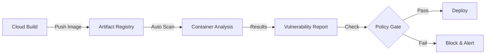

# How to Set Up Automated Security Scanning in CI/CD Pipelines Using Cloud Build and Container Analysis

Author: [nawazdhandala](https://www.github.com/nawazdhandala)

Tags: GCP, Cloud Build, Container Analysis, Security Scanning, CI/CD

Description: Learn how to integrate automated security scanning into your CI/CD pipelines on GCP using Cloud Build and Container Analysis to catch vulnerabilities early.

---

Finding a critical vulnerability in production is expensive - in engineering time, in incident response, and sometimes in customer trust. Finding it during your CI/CD pipeline costs almost nothing. Container Analysis on GCP automatically scans your container images for known vulnerabilities, and when you integrate it into Cloud Build, every image gets scanned before it can reach production.

In this post, I will show you how to set up automated security scanning that catches vulnerabilities early, enforces policies on severity thresholds, and gives your team visibility into your security posture.

## How Container Analysis Works

When you push a container image to Artifact Registry or Container Registry, Container Analysis automatically scans it for known vulnerabilities by checking the OS packages and language dependencies against public vulnerability databases (CVE). The scan results are stored as occurrences that you can query programmatically.



## Step 1: Enable Container Analysis

Enable the required APIs:

```bash
# Enable Container Analysis and related APIs
gcloud services enable \
  containeranalysis.googleapis.com \
  containerscanning.googleapis.com \
  artifactregistry.googleapis.com

# Verify scanning is active
gcloud artifacts settings describe --project=my-project
```

Container scanning is enabled by default for Artifact Registry. If you need to explicitly enable it:

```bash
# Enable vulnerability scanning for Artifact Registry
gcloud artifacts settings update \
  --project=my-project \
  --scanning=on \
  --scanning-level=STANDARD
```

## Step 2: Create a Cloud Build Pipeline with Security Gates

Here is a Cloud Build configuration that builds an image, waits for the vulnerability scan, and enforces a security policy before deployment:

```yaml
# cloudbuild.yaml
steps:
  # Step 1: Run SAST (Static Application Security Testing)
  - name: 'node:20'
    entrypoint: 'bash'
    args:
      - '-c'
      - |
        npm ci
        # Run ESLint security plugin
        npx eslint --no-eslintrc -c .eslintrc.security.json src/ || true
        # Run npm audit
        npm audit --audit-level=critical
    id: 'sast'

  # Step 2: Check for secrets in source code
  - name: 'gcr.io/cloud-builders/git'
    entrypoint: 'bash'
    args:
      - '-c'
      - |
        # Install and run gitleaks for secret detection
        apt-get update && apt-get install -y wget
        wget -q https://github.com/gitleaks/gitleaks/releases/download/v8.18.0/gitleaks_8.18.0_linux_x64.tar.gz
        tar -xzf gitleaks_8.18.0_linux_x64.tar.gz

        echo "Scanning for secrets in source code..."
        ./gitleaks detect --source=. --verbose --exit-code=1

        if [ $? -eq 0 ]; then
          echo "No secrets detected"
        else
          echo "BLOCKED: Secrets detected in source code"
          exit 1
        fi
    id: 'secret-scan'

  # Step 3: Build the container image
  - name: 'gcr.io/cloud-builders/docker'
    args:
      - 'build'
      - '-t'
      - '$_REGISTRY/$PROJECT_ID/app-images/my-app:$SHORT_SHA'
      - '.'
    id: 'build'
    waitFor: ['sast', 'secret-scan']

  # Step 4: Push to Artifact Registry (triggers automatic scanning)
  - name: 'gcr.io/cloud-builders/docker'
    args:
      - 'push'
      - '$_REGISTRY/$PROJECT_ID/app-images/my-app:$SHORT_SHA'
    id: 'push'
    waitFor: ['build']

  # Step 5: Wait for vulnerability scan to complete
  - name: 'gcr.io/cloud-builders/gcloud'
    entrypoint: 'bash'
    args:
      - '-c'
      - |
        IMAGE="$_REGISTRY/$PROJECT_ID/app-images/my-app:$SHORT_SHA"
        echo "Waiting for vulnerability scan on $IMAGE"

        MAX_ATTEMPTS=30
        ATTEMPT=0

        while [ $ATTEMPT -lt $MAX_ATTEMPTS ]; do
          ATTEMPT=$((ATTEMPT + 1))
          echo "Check $ATTEMPT of $MAX_ATTEMPTS..."

          # Try to get scan results
          RESULT=$(gcloud artifacts docker images describe $IMAGE \
            --format='json(image_summary.vulnerabilities)' 2>/dev/null)

          if [ $? -eq 0 ] && [ -n "$RESULT" ]; then
            echo "Scan complete"
            echo "$RESULT" | jq .
            break
          fi

          sleep 10
        done

        if [ $ATTEMPT -eq $MAX_ATTEMPTS ]; then
          echo "WARNING: Scan did not complete within timeout"
          # Decide whether to fail or proceed with a warning
        fi
    id: 'wait-scan'
    waitFor: ['push']

  # Step 6: Enforce vulnerability policy
  - name: 'gcr.io/cloud-builders/gcloud'
    entrypoint: 'bash'
    args:
      - '-c'
      - |
        IMAGE="$_REGISTRY/$PROJECT_ID/app-images/my-app:$SHORT_SHA"

        # Get the image digest
        DIGEST=$(gcloud artifacts docker images describe $IMAGE \
          --format='value(image_summary.digest)')

        FULL_IMAGE="$_REGISTRY/$PROJECT_ID/app-images/my-app@$DIGEST"

        echo "Checking vulnerabilities for: $FULL_IMAGE"

        # Query vulnerability occurrences
        VULNS=$(gcloud artifacts docker images describe $IMAGE \
          --show-package-vulnerability \
          --format=json 2>/dev/null)

        # Count by severity
        CRITICAL=$(echo "$VULNS" | jq '[.package_vulnerability[]? | select(.vulnerability.effectiveSeverity == "CRITICAL")] | length')
        HIGH=$(echo "$VULNS" | jq '[.package_vulnerability[]? | select(.vulnerability.effectiveSeverity == "HIGH")] | length')
        MEDIUM=$(echo "$VULNS" | jq '[.package_vulnerability[]? | select(.vulnerability.effectiveSeverity == "MEDIUM")] | length')

        echo "Vulnerability Summary:"
        echo "  Critical: $CRITICAL"
        echo "  High:     $HIGH"
        echo "  Medium:   $MEDIUM"

        # Enforce policy: block on critical, warn on high
        if [ "$CRITICAL" -gt 0 ]; then
          echo ""
          echo "BLOCKED: Found $CRITICAL critical vulnerabilities"
          echo "Critical vulnerabilities must be fixed before deployment"

          # List the critical vulnerabilities
          echo "$VULNS" | jq -r '.package_vulnerability[] | select(.vulnerability.effectiveSeverity == "CRITICAL") | "  - \(.vulnerability.shortDescription // "Unknown") in \(.vulnerability.packageIssue[0].affectedPackage // "unknown package")"'

          exit 1
        fi

        if [ "$HIGH" -gt 10 ]; then
          echo ""
          echo "BLOCKED: Found $HIGH high vulnerabilities (threshold: 10)"
          exit 1
        fi

        echo ""
        echo "Security gate passed"
    id: 'security-gate'
    waitFor: ['wait-scan']

  # Step 7: Deploy only if security gate passes
  - name: 'gcr.io/cloud-builders/gcloud'
    args:
      - 'run'
      - 'deploy'
      - 'my-app'
      - '--image=$_REGISTRY/$PROJECT_ID/app-images/my-app:$SHORT_SHA'
      - '--region=us-central1'
      - '--platform=managed'
    id: 'deploy'
    waitFor: ['security-gate']

substitutions:
  _REGISTRY: us-central1-docker.pkg.dev

options:
  machineType: 'E2_HIGHCPU_8'
```

## Step 3: Add Dockerfile Security Best Practices

Your Dockerfile itself should follow security best practices. Here is a scan-friendly Dockerfile:

```dockerfile
# Use a specific version, not "latest" - this helps track vulnerabilities
FROM node:20.11.0-slim AS builder

# Create a non-root user
RUN groupadd -r appuser && useradd -r -g appuser appuser

WORKDIR /app

# Copy dependency files first (for layer caching)
COPY package*.json ./

# Install only production dependencies
RUN npm ci --only=production && npm cache clean --force

# Copy application code
COPY src/ ./src/

# Final stage - minimal runtime image
FROM node:20.11.0-slim

# Import the non-root user from builder
RUN groupadd -r appuser && useradd -r -g appuser appuser

WORKDIR /app

# Copy only what is needed from the builder
COPY --from=builder /app/node_modules ./node_modules
COPY --from=builder /app/src ./src
COPY package.json ./

# Run as non-root user
USER appuser

# Health check
HEALTHCHECK --interval=30s --timeout=3s \
  CMD curl -f http://localhost:8080/health || exit 1

EXPOSE 8080
CMD ["node", "src/server.js"]
```

## Step 4: Set Up Continuous Monitoring

Vulnerability databases are updated constantly. An image that was clean last week might have new vulnerabilities today. Set up continuous monitoring:

```python
# scan_monitor.py - Cloud Function that checks for new vulnerabilities
# Triggered on a daily schedule

from google.cloud import artifactregistry_v1
from google.cloud import monitoring_v3
import json

def check_vulnerabilities(request):
    """
    Daily check for new vulnerabilities in deployed images.
    Reports metrics and alerts on new critical findings.
    """
    client = artifactregistry_v1.ArtifactRegistryClient()
    project = 'my-project'
    location = 'us-central1'
    repository = 'app-images'

    # List all images in the repository
    parent = f'projects/{project}/locations/{location}/repositories/{repository}'

    images = client.list_docker_images(request={'parent': parent})

    results = []
    for image in images:
        # Get vulnerability scan results for each image
        vulns = get_vulnerabilities(image.uri)

        critical_count = sum(
            1 for v in vulns
            if v.get('severity') == 'CRITICAL'
        )

        if critical_count > 0:
            results.append({
                'image': image.uri,
                'critical_vulns': critical_count,
                'total_vulns': len(vulns)
            })

    if results:
        # Send alert for images with new critical vulnerabilities
        send_alert(results)

    return json.dumps({'scanned': len(list(images)), 'alerts': len(results)})
```

Schedule this function to run daily:

```bash
# Create a Cloud Scheduler job for daily vulnerability checks
gcloud scheduler jobs create http daily-vuln-scan \
  --schedule="0 6 * * *" \
  --uri="https://us-central1-my-project.cloudfunctions.net/check_vulnerabilities" \
  --http-method=POST \
  --oidc-service-account-email=vuln-scanner@my-project.iam.gserviceaccount.com
```

## Step 5: Create a Security Dashboard

Build a dashboard to track your security posture over time:

```bash
# Create a Cloud Monitoring dashboard for security metrics
gcloud monitoring dashboards create --config-from-file=- << 'EOF'
{
  "displayName": "Container Security",
  "mosaicLayout": {
    "tiles": [
      {
        "width": 6,
        "height": 4,
        "widget": {
          "title": "Critical Vulnerabilities Over Time",
          "xyChart": {
            "dataSets": [{
              "timeSeriesQuery": {
                "timeSeriesFilter": {
                  "filter": "metric.type=\"custom.googleapis.com/container/vulnerabilities\" AND metric.labels.severity=\"CRITICAL\""
                }
              }
            }]
          }
        }
      },
      {
        "width": 6,
        "height": 4,
        "widget": {
          "title": "Build Security Gate Results",
          "xyChart": {
            "dataSets": [{
              "timeSeriesQuery": {
                "timeSeriesFilter": {
                  "filter": "metric.type=\"custom.googleapis.com/build/security_gate\" AND metric.labels.result=\"blocked\""
                }
              }
            }]
          }
        }
      }
    ]
  }
}
EOF
```

## Step 6: Handle Exceptions and Waivers

Sometimes you need to deploy despite known vulnerabilities (with an accepted risk). Create a waiver mechanism:

```yaml
# security-waivers.yaml - Track accepted risks
waivers:
  - cve: CVE-2024-12345
    package: libssl
    reason: "No exploitable path in our application"
    approved_by: security-team@example.com
    expires: 2026-03-15
  - cve: CVE-2024-67890
    package: zlib
    reason: "Patch not yet available, monitoring upstream"
    approved_by: security-team@example.com
    expires: 2026-02-28
```

Integrate waiver checking into the security gate:

```bash
# In the security gate step, check waivers before blocking
WAIVED_CVES=$(cat security-waivers.yaml | yq '.waivers[].cve')

# Filter out waived CVEs from the vulnerability count
UNWAIVED_CRITICAL=$(echo "$VULNS" | jq --argjson waivers "$(echo $WAIVED_CVES | jq -R -s 'split("\n") | map(select(length > 0))')" \
  '[.package_vulnerability[] | select(.vulnerability.effectiveSeverity == "CRITICAL") | select(.vulnerability.shortDescription as $cve | $waivers | index($cve) | not)] | length')
```

## Wrapping Up

Automated security scanning in your CI/CD pipeline is one of the highest-value security investments you can make. By integrating Container Analysis with Cloud Build, you get automatic vulnerability scanning on every image, policy enforcement before deployment, and continuous monitoring for new vulnerabilities in deployed images.

The key is making security gates non-negotiable while providing escape hatches (waivers) for legitimate exceptions. Block on critical vulnerabilities always, set reasonable thresholds for high severity, and track everything for audit purposes.
