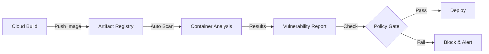

# How to Set Up Automated Security Scanning in CI/CD Pipelines Using Cloud Build

Author: [nawazdhandala](https://www.github.com/nawazdhandala)

Tags: GCP, Cloud Build, Container Analysis, Security Scanning, CI/CD

Description: Learn how to integrate automated security scanning into your CI/CD pipelines on GCP using Cloud Build and Container Analysis to catch vulnerabilities early.

---

Finding a critical vulnerability in production is expensive - in engineering time, in incident response, and sometimes in customer trust. Finding it during your CI/CD pipeline costs almost nothing. Artifact Analysis on GCP automatically scans your container images for known vulnerabilities, and when you integrate it into Cloud Build, every image gets scanned before it can reach production.

In this post, I will show you how to set up automated security scanning that catches vulnerabilities early, enforces policies on severity thresholds, and gives your team visibility into your security posture.

## How Container Analysis Works

When you push a container image to Artifact Registry, Artifact Analysis automatically scans it for known vulnerabilities by checking the OS packages and language dependencies against public vulnerability databases (CVE). The scan results are stored as occurrences that you can query programmatically.


```mermaid
graph LR
    CB[Cloud Build] -->|Push Image| AR[Artifact Registry]
    AR -->|Auto Scan| CA[Container Analysis]
    CA -->|Results| VULN[Vulnerability Report]
    VULN -->|Check| GATE{Policy Gate}
    GATE -->|Pass| DEPLOY[Deploy]
    GATE -->|Fail| BLOCK[Block & Alert]
```

## Step 1: Enable Container Analysis

Enable the required APIs:

```bash
# Enable Container Analysis and related APIs

gcloud services enable \
  cloudbuild.googleapis.com \
  containeranalysis.googleapis.com \
  containerscanning.googleapis.com \
  ondemandscanning.googleapis.com \
  artifactregistry.googleapis.com

# Verify scanning is active
gcloud artifacts settings describe --project=my-project
```

The Cloud Build service account needs the On-Demand Scanning Admin role (`roles/ondemandscanning.admin`) and Artifact Registry Writer role (`roles/artifactregistry.writer`) to run the scan and push the image.

Container scanning is enabled by default for Docker repositories in Artifact Registry after you enable the Container Scanning API. If you disabled scanning on a repository and need to allow it again:

```bash
# Allow vulnerability scanning on an Artifact Registry repository
gcloud artifacts repositories update app-images \
  --project=my-project \
  --location=us-central1 \
  --allow-vulnerability-scanning
```

## Step 2: Create a Cloud Build Pipeline with Security Gates

Here is a Cloud Build configuration that builds an image, runs a vulnerability scan, and enforces a security policy before deployment:

```yaml
# cloudbuild.yaml
steps:
  # Step 1: Run SAST (Static Application Security Testing)
  - name: 'node:24'
    entrypoint: 'bash'
    args:
      - '-c'
      - |
        npm ci
        # Run ESLint security plugin
        npx eslint --no-eslintrc -c .eslintrc.security.json src/ || true
        # Run npm audit
        npm audit --audit-level=critical
    id: 'sast'

  # Step 2: Check for secrets in source code
  - name: 'gcr.io/cloud-builders/git'
    entrypoint: 'bash'
    args:
      - '-c'
      - |
        # Install and run gitleaks for secret detection
        apt-get update && apt-get install -y wget
        wget -q https://github.com/gitleaks/gitleaks/releases/download/v8.30.1/gitleaks_8.30.1_linux_x64.tar.gz
        tar -xzf gitleaks_8.30.1_linux_x64.tar.gz

        echo "Scanning for secrets in source code..."
        ./gitleaks detect --source=. --verbose --exit-code=1

        if [ $? -eq 0 ]; then
          echo "No secrets detected"
        else
          echo "BLOCKED: Secrets detected in source code"
          exit 1
        fi
    id: 'secret-scan'

  # Step 3: Build the container image
  - name: 'gcr.io/cloud-builders/docker'
    args:
      - 'build'
      - '-t'
      - '$_REGISTRY/$PROJECT_ID/app-images/my-app:$SHORT_SHA'
      - '.'
    id: 'build'
    waitFor: ['sast', 'secret-scan']

  # Step 4: Push to Artifact Registry (triggers automatic scanning)
  - name: 'gcr.io/cloud-builders/docker'
    args:
      - 'push'
      - '$_REGISTRY/$PROJECT_ID/app-images/my-app:$SHORT_SHA'
    id: 'push'
    waitFor: ['build']

  # Step 5: Run an on-demand vulnerability scan
  - name: 'gcr.io/google.com/cloudsdktool/cloud-sdk'
    entrypoint: 'bash'
    args:
      - '-c'
      - |
        IMAGE="$_REGISTRY/$PROJECT_ID/app-images/my-app:$SHORT_SHA"
        echo "Running vulnerability scan on $IMAGE"

        gcloud artifacts docker images scan "$IMAGE" \
          --remote \
          --location=$_SCAN_LOCATION \
          --format='value(response.scan)' > /workspace/scan_id.txt
    id: 'scan'
    waitFor: ['push']

  # Step 6: Enforce vulnerability policy
  - name: 'gcr.io/google.com/cloudsdktool/cloud-sdk'
    entrypoint: 'bash'
    args:
      - '-c'
      - |
        apt-get update && apt-get install -y jq

        SCAN_ID=$(cat /workspace/scan_id.txt)
        echo "Checking vulnerabilities from scan: $SCAN_ID"

        # Query on-demand scan vulnerability occurrences
        VULNS=$(gcloud artifacts docker images list-vulnerabilities "$SCAN_ID" \
          --location=$_SCAN_LOCATION \
          --format=json 2>/dev/null)

        # Count by severity
        CRITICAL=$(echo "$VULNS" | jq '[.[]? | select(.vulnerability.effectiveSeverity == "CRITICAL")] | length')
        HIGH=$(echo "$VULNS" | jq '[.[]? | select(.vulnerability.effectiveSeverity == "HIGH")] | length')
        MEDIUM=$(echo "$VULNS" | jq '[.[]? | select(.vulnerability.effectiveSeverity == "MEDIUM")] | length')

        echo "Vulnerability Summary:"
        echo "  Critical: $CRITICAL"
        echo "  High:     $HIGH"
        echo "  Medium:   $MEDIUM"

        # Enforce policy: block on critical, warn on high
        if [ "$CRITICAL" -gt 0 ]; then
          echo ""
          echo "BLOCKED: Found $CRITICAL critical vulnerabilities"
          echo "Critical vulnerabilities must be fixed before deployment"

          # List the critical vulnerabilities
          echo "$VULNS" | jq -r '.[] | select(.vulnerability.effectiveSeverity == "CRITICAL") | "  - \(.vulnerability.shortDescription // "Unknown") in \(.vulnerability.packageIssue[0].affectedPackage // "unknown package")"'

          exit 1
        fi

        if [ "$HIGH" -gt 10 ]; then
          echo ""
          echo "BLOCKED: Found $HIGH high vulnerabilities (threshold: 10)"
          exit 1
        fi

        echo ""
        echo "Security gate passed"
    id: 'security-gate'
    waitFor: ['scan']

  # Step 7: Deploy only if security gate passes
  - name: 'gcr.io/cloud-builders/gcloud'
    args:
      - 'run'
      - 'deploy'
      - 'my-app'
      - '--image=$_REGISTRY/$PROJECT_ID/app-images/my-app:$SHORT_SHA'
      - '--region=us-central1'
      - '--platform=managed'
    id: 'deploy'
    waitFor: ['security-gate']

substitutions:
  _REGISTRY: us-central1-docker.pkg.dev
  _SCAN_LOCATION: us

options:
  machineType: 'E2_HIGHCPU_8'
```

## Step 3: Add Dockerfile Security Best Practices

Your Dockerfile itself should follow security best practices. Here is a scan-friendly Dockerfile:

```dockerfile
# Use a specific version, not "latest" - this helps track vulnerabilities
FROM node:24.14.0-slim AS builder

# Create a non-root user
RUN groupadd -r appuser && useradd -r -g appuser appuser

WORKDIR /app

# Copy dependency files first (for layer caching)
COPY package*.json ./

# Install only production dependencies
RUN npm ci --omit=dev && npm cache clean --force

# Copy application code
COPY src/ ./src/

# Final stage - minimal runtime image
FROM node:24.14.0-slim

# Import the non-root user from builder
RUN groupadd -r appuser && useradd -r -g appuser appuser

WORKDIR /app

# Copy only what is needed from the builder
COPY --from=builder /app/node_modules ./node_modules
COPY --from=builder /app/src ./src
COPY package.json ./

# Run as non-root user
USER appuser

# Health check
HEALTHCHECK --interval=30s --timeout=3s \
  CMD node -e "require('http').get('http://127.0.0.1:8080/health', res => process.exit(res.statusCode < 400 ? 0 : 1)).on('error', () => process.exit(1))"

EXPOSE 8080
CMD ["node", "src/server.js"]
```

## Step 4: Set Up Continuous Monitoring

Vulnerability databases are updated constantly. An image that was clean last week might have new vulnerabilities today. Set up continuous monitoring:

```python
# scan_monitor.py - Cloud Function that checks for new vulnerabilities
# Triggered on a daily schedule

from google.cloud import artifactregistry_v1
from google.cloud.devtools import containeranalysis_v1
import json

def check_vulnerabilities(request):
    """
    Daily check for new vulnerabilities in deployed images.
    Reports metrics and alerts on new critical findings.
    """
    artifact_client = artifactregistry_v1.ArtifactRegistryClient()
    analysis_client = containeranalysis_v1.ContainerAnalysisClient()
    project = 'my-project'
    location = 'us-central1'
    repository = 'app-images'

    # List all images in the repository
    parent = f'projects/{project}/locations/{location}/repositories/{repository}'

    images = list(artifact_client.list_docker_images(request={'parent': parent}))

    results = []
    for image in images:
        # Get vulnerability scan results for each image
        resource_url = f'https://{image.uri}'
        filter_expression = f'kind="VULNERABILITY" AND resourceUrl="{resource_url}"'
        vulns = list(analysis_client.get_grafeas_client().list_occurrences(
            request={
                'parent': f'projects/{project}',
                'filter': filter_expression
            }
        ))

        critical_count = sum(
            1 for v in vulns
            if v.vulnerability.effective_severity.name == 'CRITICAL'
        )

        if critical_count > 0:
            results.append({
                'image': image.uri,
                'critical_vulns': critical_count,
                'total_vulns': len(vulns)
            })

    if results:
        # Publish these results to Cloud Monitoring, Pub/Sub, or your alerting system.
        print(json.dumps(results))

    return json.dumps({'scanned': len(images), 'alerts': len(results)})
```

Schedule this function to run daily:

```bash
# Create a Cloud Scheduler job for daily vulnerability checks
gcloud scheduler jobs create http daily-vuln-scan \
  --schedule="0 6 * * *" \
  --uri="https://us-central1-my-project.cloudfunctions.net/check_vulnerabilities" \
  --http-method=POST \
  --oidc-service-account-email=vuln-scanner@my-project.iam.gserviceaccount.com
```

## Step 5: Create a Security Dashboard

Build a dashboard to track your security posture over time:

```bash
# Create a Cloud Monitoring dashboard for security metrics
gcloud monitoring dashboards create --config-from-file=- << 'EOF'
{
  "displayName": "Container Security",
  "mosaicLayout": {
    "tiles": [
      {
        "width": 6,
        "height": 4,
        "widget": {
          "title": "Critical Vulnerabilities Over Time",
          "xyChart": {
            "dataSets": [{
              "timeSeriesQuery": {
                "timeSeriesFilter": {
                  "filter": "metric.type=\"custom.googleapis.com/container/vulnerabilities\" AND metric.labels.severity=\"CRITICAL\""
                }
              }
            }]
          }
        }
      },
      {
        "width": 6,
        "height": 4,
        "widget": {
          "title": "Build Security Gate Results",
          "xyChart": {
            "dataSets": [{
              "timeSeriesQuery": {
                "timeSeriesFilter": {
                  "filter": "metric.type=\"custom.googleapis.com/build/security_gate\" AND metric.labels.result=\"blocked\""
                }
              }
            }]
          }
        }
      }
    ]
  }
}
EOF
```

## Step 6: Handle Exceptions and Waivers

Sometimes you need to deploy despite known vulnerabilities (with an accepted risk). Create a waiver mechanism:

```yaml
# security-waivers.yaml - Track accepted risks
waivers:
  - cve: CVE-2024-12345
    package: libssl
    reason: "No exploitable path in our application"
    approved_by: security-team@example.com
    expires: 2026-03-15
  - cve: CVE-2024-67890
    package: zlib
    reason: "Patch not yet available, monitoring upstream"
    approved_by: security-team@example.com
    expires: 2026-02-28
```

Integrate waiver checking into the security gate:

```bash
# In the security gate step, check waivers before blocking
WAIVED_CVES=$(cat security-waivers.yaml | yq '.waivers[].cve')

# Filter out waived CVEs from the vulnerability count
UNWAIVED_CRITICAL=$(echo "$VULNS" | jq --argjson waivers "$(printf '%s\n' "$WAIVED_CVES" | jq -R -s 'split("\n") | map(select(length > 0))')" \
  '[.[] | select(.vulnerability.effectiveSeverity == "CRITICAL") | select(.vulnerability.shortDescription as $cve | $waivers | index($cve) | not)] | length')
```

## Wrapping Up

Automated security scanning in your CI/CD pipeline is one of the highest-value security investments you can make. By integrating Container Analysis with Cloud Build, you get automatic vulnerability scanning on every image, policy enforcement before deployment, and continuous monitoring for new vulnerabilities in deployed images.

The key is making security gates non-negotiable while providing escape hatches (waivers) for legitimate exceptions. Block on critical vulnerabilities always, set reasonable thresholds for high severity, and track everything for audit purposes.
