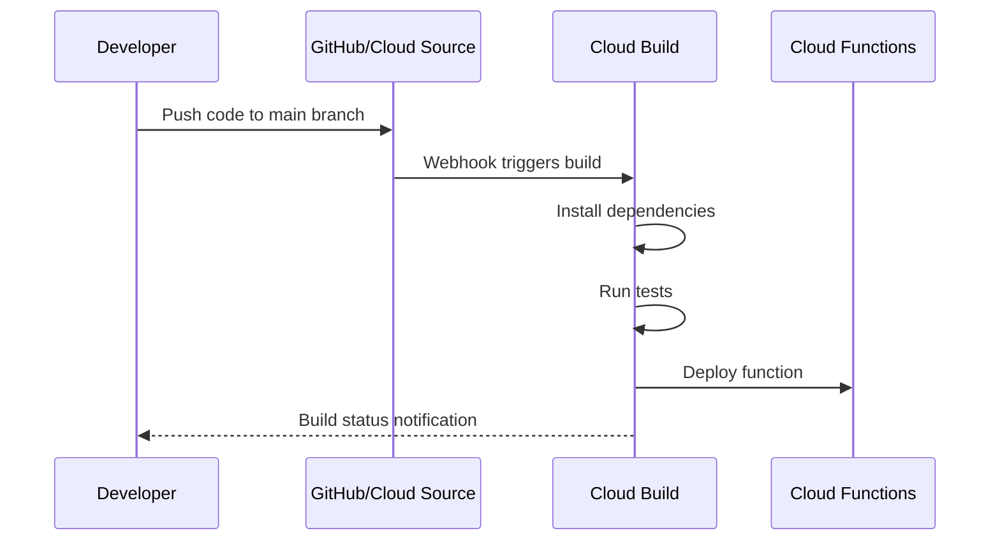

# How to Set Up Automatic Deployment of Cloud Functions from a Git Repository Using Cloud Build

Author: [nawazdhandala](https://www.github.com/nawazdhandala)

Tags: GCP, Cloud Functions, Cloud Build, CI/CD, DevOps

Description: A complete walkthrough on setting up automatic deployments for Google Cloud Functions from a Git repository using Cloud Build triggers and custom build configurations.

---

Deploying Cloud Functions manually with `gcloud functions deploy` works fine when you are prototyping. But once you have a team pushing changes, you need automated deployments - push to main, tests run, function deploys. Cloud Build makes this easy to set up, and you do not need any external CI/CD tools.

I have set this up across several projects, and the pattern is consistent enough that I can walk through it from scratch in this post. By the end, you will have a pipeline where a git push to your repository automatically tests and deploys your Cloud Functions.

## Overview of the Setup

The workflow is straightforward:



## Prerequisites

You need:

- A GCP project with Cloud Build and Cloud Functions APIs enabled
- A Git repository (GitHub, GitLab, Bitbucket, or Cloud Source Repositories)
- Your Cloud Function code in the repository

```bash
# Enable the required APIs
gcloud services enable \
  cloudbuild.googleapis.com \
  cloudfunctions.googleapis.com \
  secretmanager.googleapis.com
```

## Repository Structure

A clean repo structure makes the Cloud Build configuration easier. Here is what I typically use when a repository contains multiple functions.

```
my-functions-repo/
  functions/
    processOrders/
      index.js
      package.json
      test/
        index.test.js
    sendNotifications/
      index.js
      package.json
      test/
        index.test.js
  cloudbuild.yaml
```

## The Cloud Build Configuration

The `cloudbuild.yaml` file defines your build steps. Each step runs in a container, and you can use Google-provided builder images or your own.

```yaml
# cloudbuild.yaml - Automated deployment pipeline for Cloud Functions
steps:
  # Step 1: Install dependencies for the processOrders function
  - name: "node:18"
    entrypoint: "npm"
    args: ["ci"]
    dir: "functions/processOrders"
    id: "install-processOrders"

  # Step 2: Run tests for processOrders
  - name: "node:18"
    entrypoint: "npm"
    args: ["test"]
    dir: "functions/processOrders"
    id: "test-processOrders"
    waitFor: ["install-processOrders"]

  # Step 3: Deploy processOrders function
  - name: "gcr.io/google.com/cloudsdktool/cloud-sdk"
    args:
      - gcloud
      - functions
      - deploy
      - processOrders
      - --runtime=nodejs18
      - --trigger-topic=new-orders
      - --region=us-central1
      - --service-account=order-processor-sa@${PROJECT_ID}.iam.gserviceaccount.com
      - --source=functions/processOrders
    id: "deploy-processOrders"
    waitFor: ["test-processOrders"]

  # Step 4: Install dependencies for sendNotifications
  - name: "node:18"
    entrypoint: "npm"
    args: ["ci"]
    dir: "functions/sendNotifications"
    id: "install-sendNotifications"

  # Step 5: Run tests for sendNotifications
  - name: "node:18"
    entrypoint: "npm"
    args: ["test"]
    dir: "functions/sendNotifications"
    id: "test-sendNotifications"
    waitFor: ["install-sendNotifications"]

  # Step 6: Deploy sendNotifications function
  - name: "gcr.io/google.com/cloudsdktool/cloud-sdk"
    args:
      - gcloud
      - functions
      - deploy
      - sendNotifications
      - --runtime=nodejs18
      - --trigger-topic=notifications
      - --region=us-central1
      - --service-account=notifier-sa@${PROJECT_ID}.iam.gserviceaccount.com
      - --source=functions/sendNotifications
    id: "deploy-sendNotifications"
    waitFor: ["test-sendNotifications"]

# Set a reasonable timeout for the entire build
timeout: "600s"

# Build options
options:
  logging: CLOUD_LOGGING_ONLY
```

Notice how `install-processOrders` and `install-sendNotifications` do not depend on each other, so Cloud Build runs them in parallel. The `waitFor` field controls the dependency graph.

## Connecting Your Repository

### For GitHub Repositories

Connect GitHub to Cloud Build through the Google Cloud Console or using the CLI.

```bash
# Install the Cloud Build GitHub app (this opens a browser)
# Navigate to: Console > Cloud Build > Triggers > Connect Repository

# Or use gcloud to create a connection
gcloud builds connections create github my-github-connection \
  --region us-central1
```

### For Cloud Source Repositories

If you use Cloud Source Repositories, the connection is automatic since it is already in GCP.

```bash
# Mirror a GitHub repo to Cloud Source Repositories
gcloud source repos create my-functions-repo

# Then push or mirror your code there
```

## Creating the Build Trigger

A trigger tells Cloud Build when to start a build. The most common setup is triggering on pushes to the main branch.

```bash
# Create a trigger that fires on pushes to the main branch
gcloud builds triggers create github \
  --name "deploy-functions-on-push" \
  --repository "projects/YOUR_PROJECT/locations/us-central1/connections/my-github-connection/repositories/my-functions-repo" \
  --branch-pattern "^main$" \
  --build-config "cloudbuild.yaml" \
  --description "Deploy Cloud Functions when code is pushed to main"
```

You can also create triggers for pull requests to run tests without deploying.

```bash
# Create a trigger for PR validation (tests only, no deployment)
gcloud builds triggers create github \
  --name "test-functions-on-pr" \
  --repository "projects/YOUR_PROJECT/locations/us-central1/connections/my-github-connection/repositories/my-functions-repo" \
  --pull-request-pattern "^main$" \
  --build-config "cloudbuild-test-only.yaml" \
  --description "Run tests on pull requests"
```

## Granting Cloud Build Permissions

Cloud Build needs permission to deploy Cloud Functions. Grant the Cloud Build service account the necessary roles.

```bash
# Get your project number
PROJECT_NUMBER=$(gcloud projects describe YOUR_PROJECT_ID --format="value(projectNumber)")

# Grant Cloud Build permission to deploy Cloud Functions
gcloud projects add-iam-policy-binding YOUR_PROJECT_ID \
  --member "serviceAccount:${PROJECT_NUMBER}@cloudbuild.gserviceaccount.com" \
  --role "roles/cloudfunctions.developer"

# Grant Cloud Build permission to act as the function's service account
gcloud iam service-accounts add-iam-policy-binding \
  order-processor-sa@YOUR_PROJECT_ID.iam.gserviceaccount.com \
  --member "serviceAccount:${PROJECT_NUMBER}@cloudbuild.gserviceaccount.com" \
  --role "roles/iam.serviceAccountUser"
```

## Using Substitution Variables

Cloud Build supports substitution variables for making your config reusable across environments.

```yaml
# cloudbuild.yaml with substitution variables
steps:
  - name: "gcr.io/google.com/cloudsdktool/cloud-sdk"
    args:
      - gcloud
      - functions
      - deploy
      - processOrders
      - --runtime=nodejs18
      - --trigger-topic=${_TOPIC_NAME}
      - --region=${_REGION}
      - --source=functions/processOrders

substitutions:
  _REGION: us-central1
  _TOPIC_NAME: new-orders
```

Override substitutions per trigger to deploy to different environments.

```bash
# Create a staging trigger with different substitutions
gcloud builds triggers create github \
  --name "deploy-functions-staging" \
  --repository "projects/YOUR_PROJECT/locations/us-central1/connections/my-github-connection/repositories/my-functions-repo" \
  --branch-pattern "^staging$" \
  --build-config "cloudbuild.yaml" \
  --substitutions "_REGION=us-east1,_TOPIC_NAME=new-orders-staging"
```

## Handling Secrets

If your functions need secrets (API keys, database passwords), use Secret Manager with Cloud Build.

```yaml
# Reference secrets in your build steps
steps:
  - name: "gcr.io/google.com/cloudsdktool/cloud-sdk"
    entrypoint: "bash"
    args:
      - "-c"
      - |
        gcloud functions deploy processOrders \
          --runtime nodejs18 \
          --trigger-topic new-orders \
          --region us-central1 \
          --set-secrets "API_KEY=api-key-secret:latest" \
          --source functions/processOrders

availableSecrets:
  secretManager:
    - versionName: "projects/YOUR_PROJECT/secrets/api-key-secret/versions/latest"
      env: "API_KEY"
```

## Selective Deployments

When you have many functions in one repo, you probably do not want to redeploy all of them on every push. Use Cloud Build's `_CHANGED_FILES` or write a custom script that checks which directories changed.

```yaml
# Deploy only functions that changed
steps:
  - name: "gcr.io/google.com/cloudsdktool/cloud-sdk"
    entrypoint: "bash"
    args:
      - "-c"
      - |
        # Get list of changed files compared to previous commit
        CHANGED=$(git diff --name-only HEAD~1 HEAD)

        # Deploy processOrders only if its directory changed
        if echo "$CHANGED" | grep -q "functions/processOrders/"; then
          echo "Deploying processOrders..."
          gcloud functions deploy processOrders \
            --runtime nodejs18 \
            --trigger-topic new-orders \
            --region us-central1 \
            --source functions/processOrders
        else
          echo "processOrders unchanged, skipping."
        fi
```

## Monitoring Build Status

Check build status from the CLI or set up notifications.

```bash
# List recent builds
gcloud builds list --limit 10

# View a specific build's logs
gcloud builds log BUILD_ID

# Stream logs from a running build
gcloud builds log --stream BUILD_ID
```

## Wrapping Up

Automated deployments through Cloud Build remove the friction of manual deploys and ensure that every change goes through your test suite before reaching production. The setup is a one-time investment - create the `cloudbuild.yaml`, connect your repo, create the trigger, grant the permissions - and then every push to main flows through the pipeline automatically. For teams with multiple Cloud Functions, add selective deployment logic to only redeploy what changed, and use substitution variables to manage staging and production environments from a single build config.
