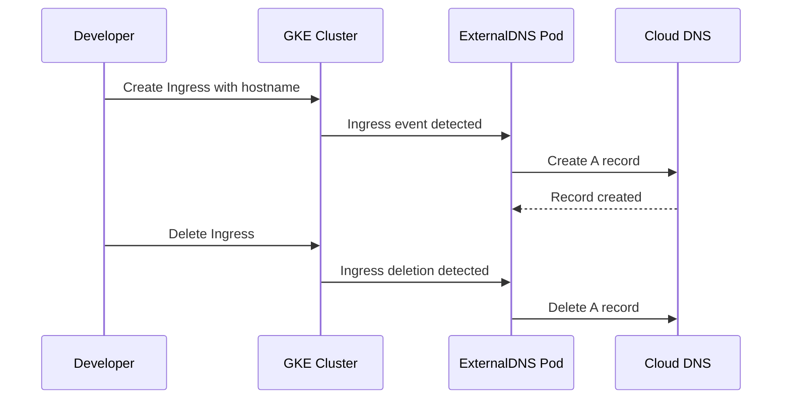

# How to Set Up Automatic DNS Records for GKE Ingress Resources Using Cloud DNS in GCP

Author: [nawazdhandala](https://www.github.com/nawazdhandala)

Tags: GCP, GKE, Cloud DNS, Kubernetes, Ingress, ExternalDNS

Description: Learn how to automatically create and update Cloud DNS records when Kubernetes Ingress resources are created in GKE using ExternalDNS.

---

Managing DNS records manually every time you deploy a new service to GKE gets old fast. When you create an Ingress resource, you get an external IP, and then you have to go update Cloud DNS with the right A record. Miss a step and your service is unreachable by its domain name.

ExternalDNS solves this by watching your Kubernetes Ingress (and Service) resources and automatically creating, updating, and deleting DNS records in Cloud DNS. In this guide, I will set up ExternalDNS on GKE with Cloud DNS so that DNS records are managed automatically.

## How It Works

ExternalDNS runs as a pod in your GKE cluster. It watches for Ingress resources (and optionally Services of type LoadBalancer) that have hostname annotations. When it finds one, it creates the corresponding DNS record in Cloud DNS. When the Ingress is deleted, ExternalDNS removes the DNS record.



## Prerequisites

- A GKE cluster (standard or Autopilot)
- A Cloud DNS managed zone for your domain
- Workload Identity enabled on the cluster (recommended)
- kubectl configured to access the cluster
- Helm v3 installed

## Step 1: Create a Cloud DNS Managed Zone

If you do not already have a managed zone, create one.

```bash
# Create a public managed zone for your domain
gcloud dns managed-zones create my-domain-zone \
    --dns-name=example.com. \
    --description="DNS zone for automated GKE records" \
    --visibility=public \
    --project=my-project
```

## Step 2: Set Up IAM for ExternalDNS

ExternalDNS needs permission to read and write Cloud DNS records. The recommended approach is to use Workload Identity, which maps a Kubernetes service account to a Google service account.

```bash
# Create a Google service account for ExternalDNS
gcloud iam service-accounts create external-dns \
    --display-name="ExternalDNS for GKE" \
    --project=my-project

# Grant the DNS admin role to the service account
gcloud projects add-iam-policy-binding my-project \
    --member="serviceAccount:external-dns@my-project.iam.gserviceaccount.com" \
    --role="roles/dns.admin"

# Allow the Kubernetes service account to impersonate the Google service account
gcloud iam service-accounts add-iam-policy-binding \
    external-dns@my-project.iam.gserviceaccount.com \
    --member="serviceAccount:my-project.svc.id.goog[external-dns/external-dns]" \
    --role="roles/iam.workloadIdentityUser"
```

## Step 3: Install ExternalDNS with Helm

Create a namespace and install ExternalDNS using the Helm chart.

```bash
# Create the namespace for ExternalDNS
kubectl create namespace external-dns
```

Create a values file for the Helm chart.

```yaml
# external-dns-values.yaml - Helm values for ExternalDNS on GKE with Cloud DNS
provider: google

google:
  project: my-project

domainFilters:
  - example.com

policy: sync  # sync deletes records when Ingress is removed; use 'upsert-only' to be safe

sources:
  - ingress
  - service

txtOwnerId: my-gke-cluster

serviceAccount:
  create: true
  name: external-dns
  annotations:
    iam.gke.io/gcp-service-account: external-dns@my-project.iam.gserviceaccount.com

resources:
  requests:
    cpu: 50m
    memory: 64Mi
  limits:
    cpu: 100m
    memory: 128Mi

logLevel: info
```

Now install ExternalDNS.

```bash
# Add the ExternalDNS Helm repository
helm repo add external-dns https://kubernetes-sigs.github.io/external-dns/
helm repo update

# Install ExternalDNS with the custom values
helm install external-dns external-dns/external-dns \
    --namespace external-dns \
    --values external-dns-values.yaml
```

## Step 4: Verify ExternalDNS Is Running

Check that the pod is healthy and can connect to Cloud DNS.

```bash
# Check the pod status
kubectl get pods -n external-dns

# Check the logs for successful startup and zone discovery
kubectl logs -n external-dns -l app.kubernetes.io/name=external-dns --tail=50
```

In the logs, you should see ExternalDNS discovering your Cloud DNS zone. Look for lines like "All records are already up to date" which indicate successful connectivity.

## Step 5: Create an Ingress with DNS Annotation

Now deploy a sample application and create an Ingress resource that ExternalDNS will pick up.

```yaml
# sample-app.yaml - A simple deployment and service
apiVersion: apps/v1
kind: Deployment
metadata:
  name: hello-app
  namespace: default
spec:
  replicas: 2
  selector:
    matchLabels:
      app: hello-app
  template:
    metadata:
      labels:
        app: hello-app
    spec:
      containers:
        - name: hello
          image: gcr.io/google-samples/hello-app:1.0
          ports:
            - containerPort: 8080
---
apiVersion: v1
kind: Service
metadata:
  name: hello-app
  namespace: default
spec:
  type: ClusterIP
  selector:
    app: hello-app
  ports:
    - port: 80
      targetPort: 8080
```

Apply the deployment.

```bash
# Deploy the sample application
kubectl apply -f sample-app.yaml
```

Now create the Ingress resource. The `external-dns.alpha.kubernetes.io/hostname` annotation tells ExternalDNS which DNS name to create.

```yaml
# ingress.yaml - Ingress with ExternalDNS annotation for automatic DNS
apiVersion: networking.k8s.io/v1
kind: Ingress
metadata:
  name: hello-app-ingress
  namespace: default
  annotations:
    # ExternalDNS will create a DNS record for this hostname
    external-dns.alpha.kubernetes.io/hostname: hello.example.com
    # Optional: set a custom TTL for the DNS record
    external-dns.alpha.kubernetes.io/ttl: "300"
spec:
  defaultBackend:
    service:
      name: hello-app
      port:
        number: 80
```

Apply the Ingress.

```bash
# Create the Ingress resource
kubectl apply -f ingress.yaml

# Wait for the Ingress to get an external IP
kubectl get ingress hello-app-ingress -w
```

## Step 6: Verify DNS Record Creation

After a minute or two, ExternalDNS should detect the Ingress and create the DNS record.

```bash
# Check ExternalDNS logs for record creation
kubectl logs -n external-dns -l app.kubernetes.io/name=external-dns --tail=20

# Verify the record exists in Cloud DNS
gcloud dns record-sets list \
    --zone=my-domain-zone \
    --filter="name=hello.example.com." \
    --project=my-project

# Test DNS resolution
dig hello.example.com
```

You should see an A record pointing to the Ingress's external IP address.

## Step 7: Handle Multiple Hosts and TLS

For production setups, you typically have multiple hosts and TLS certificates. ExternalDNS works with both.

```yaml
# production-ingress.yaml - Multi-host Ingress with TLS
apiVersion: networking.k8s.io/v1
kind: Ingress
metadata:
  name: production-ingress
  namespace: default
  annotations:
    # Multiple hostnames - ExternalDNS creates records for all of them
    external-dns.alpha.kubernetes.io/hostname: "api.example.com,app.example.com"
spec:
  tls:
    - hosts:
        - api.example.com
        - app.example.com
      secretName: tls-cert
  rules:
    - host: api.example.com
      http:
        paths:
          - path: /
            pathType: Prefix
            backend:
              service:
                name: api-service
                port:
                  number: 80
    - host: app.example.com
      http:
        paths:
          - path: /
            pathType: Prefix
            backend:
              service:
                name: app-service
                port:
                  number: 80
```

ExternalDNS will create separate A records for both `api.example.com` and `app.example.com`, both pointing to the same Ingress IP.

## Step 8: Using with GKE Gateway API

If you are using the Gateway API instead of traditional Ingress, ExternalDNS supports that too.

```yaml
# gateway-httproute.yaml - HTTPRoute with ExternalDNS annotation
apiVersion: gateway.networking.k8s.io/v1beta1
kind: HTTPRoute
metadata:
  name: hello-route
  namespace: default
  annotations:
    external-dns.alpha.kubernetes.io/hostname: hello-gw.example.com
spec:
  parentRefs:
    - name: external-gateway
      namespace: default
  hostnames:
    - hello-gw.example.com
  rules:
    - backendRefs:
        - name: hello-app
          port: 80
```

Update your ExternalDNS values to include the gateway sources.

```yaml
# Add gateway sources to ExternalDNS configuration
sources:
  - ingress
  - service
  - gateway-httproute
  - gateway-grpcroute
```

## Troubleshooting

**Records not being created**: Check ExternalDNS logs first. Common issues are permission errors (Workload Identity misconfigured), domain filter not matching, or the zone not being found.

```bash
# Detailed ExternalDNS logs
kubectl logs -n external-dns -l app.kubernetes.io/name=external-dns -f
```

**Records not being deleted**: Make sure the `policy` is set to `sync`. With `upsert-only`, records are created but never deleted.

**Wrong IP in DNS record**: The Ingress must have an external IP assigned. Check `kubectl get ingress` and make sure the ADDRESS column has a value.

**TXT record conflicts**: ExternalDNS uses TXT records to track ownership. If you manually created records with the same name, ExternalDNS might skip them. Delete the manual records and let ExternalDNS manage them.

## Wrapping Up

ExternalDNS bridges the gap between Kubernetes and Cloud DNS, turning what would be a manual and error-prone process into a fully automated one. Once it is set up, you never have to think about DNS records for your GKE services again - just add the annotation to your Ingress or HTTPRoute and ExternalDNS handles the rest. The Workload Identity integration makes the IAM setup clean and secure, and the sync policy ensures stale records get cleaned up when services are removed.
