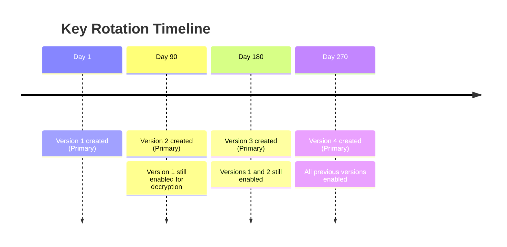

# How to Set Up Automatic Key Rotation for Cloud KMS Keys in GCP

Author: [nawazdhandala](https://www.github.com/nawazdhandala)

Tags: GCP, Cloud KMS, Key Rotation, Encryption, Security

Description: A step-by-step guide to configuring automatic key rotation for Cloud KMS symmetric keys in GCP, including rotation schedules, version management, and re-encryption strategies.

---

Key rotation is a fundamental security practice. Even if a key has not been compromised, rotating it limits the amount of data encrypted under any single key version and reduces the window of exposure if the key is eventually compromised. Most compliance frameworks - PCI DSS, HIPAA, SOC 2 - require regular key rotation.

Cloud KMS makes rotation straightforward for symmetric encryption keys. You set a rotation schedule, and KMS automatically creates new key versions on that schedule. The new version becomes the primary version used for all new encryption operations. Old versions remain available for decryption, so existing ciphertext continues to work without any changes to your application.

## How Automatic Rotation Works

When Cloud KMS rotates a symmetric key, it:

1. Creates a new key version with fresh key material
2. Sets the new version as the primary version
3. Keeps all previous versions in the ENABLED state

New encrypt operations automatically use the primary (newest) version. Decrypt operations use whichever version was used to encrypt the data - Cloud KMS determines this from metadata embedded in the ciphertext.



Your application code does not need to change. Encryption calls always use the primary version, and decryption calls automatically select the correct version based on the ciphertext.

## Setting Up Rotation on a New Key

Create a new key with rotation configured from the start:

```bash
# Create a symmetric key with 90-day rotation
gcloud kms keys create app-encryption-key \
  --keyring=my-app-keyring \
  --location=us-central1 \
  --purpose=encryption \
  --rotation-period=7776000s \
  --next-rotation-time="2026-05-17T00:00:00Z" \
  --project=my-project-id
```

Parameters:
- `rotation-period` - how often to rotate, in seconds (minimum 1 day = 86400s)
- `next-rotation-time` - when the first automatic rotation should happen (ISO 8601 format)

Common rotation periods:
- 30 days: `2592000s`
- 90 days: `7776000s`
- 180 days: `15552000s`
- 365 days: `31536000s`

## Adding Rotation to an Existing Key

If you have a key without rotation configured, add it:

```bash
# Add automatic rotation to an existing key
gcloud kms keys update app-encryption-key \
  --keyring=my-app-keyring \
  --location=us-central1 \
  --rotation-period=7776000s \
  --next-rotation-time="2026-03-17T00:00:00Z" \
  --project=my-project-id
```

## Terraform Configuration

```hcl
# Symmetric key with automatic rotation
resource "google_kms_crypto_key" "app_key" {
  name            = "app-encryption-key"
  key_ring        = google_kms_key_ring.app_keyring.id
  purpose         = "ENCRYPT_DECRYPT"

  # Rotate every 90 days
  rotation_period = "7776000s"

  version_template {
    algorithm        = "GOOGLE_SYMMETRIC_ENCRYPTION"
    protection_level = "SOFTWARE"
  }

  lifecycle {
    prevent_destroy = true
  }
}
```

## Manually Rotating a Key

You can trigger an immediate rotation without waiting for the schedule:

```bash
# Create a new key version and make it primary immediately
gcloud kms keys versions create \
  --key=app-encryption-key \
  --keyring=my-app-keyring \
  --location=us-central1 \
  --primary \
  --project=my-project-id
```

This is useful after a suspected compromise or when you need to comply with an immediate rotation request.

## Checking Rotation Status

View the current key versions and identify the primary:

```bash
# List all versions of a key
gcloud kms keys versions list \
  --key=app-encryption-key \
  --keyring=my-app-keyring \
  --location=us-central1 \
  --project=my-project-id \
  --format="table(name, state, createTime, protectionLevel)"
```

Check the key's rotation configuration:

```bash
# View key details including rotation schedule
gcloud kms keys describe app-encryption-key \
  --keyring=my-app-keyring \
  --location=us-central1 \
  --project=my-project-id \
  --format="yaml(rotationPeriod, nextRotationTime, primary)"
```

## Managing Old Key Versions

After rotation, old key versions remain enabled for decryption. Over time, you should manage these versions:

### Disabling Old Versions

If you have re-encrypted all data with the latest version, you can disable old versions. Disabled versions cannot be used for encryption or decryption but can be re-enabled if needed:

```bash
# Disable an old key version
gcloud kms keys versions disable 1 \
  --key=app-encryption-key \
  --keyring=my-app-keyring \
  --location=us-central1 \
  --project=my-project-id
```

### Scheduling Version Destruction

For versions you are certain will never be needed again, schedule them for destruction. There is a mandatory 24-hour waiting period before the destruction is final:

```bash
# Schedule a key version for destruction (24-hour grace period)
gcloud kms keys versions destroy 1 \
  --key=app-encryption-key \
  --keyring=my-app-keyring \
  --location=us-central1 \
  --project=my-project-id
```

During the 24-hour window, you can restore the version:

```bash
# Cancel destruction during the grace period
gcloud kms keys versions restore 1 \
  --key=app-encryption-key \
  --keyring=my-app-keyring \
  --location=us-central1 \
  --project=my-project-id
```

## Re-Encrypting Data with the Latest Key Version

Rotation alone does not re-encrypt existing data. Old ciphertext still uses old key versions. For maximum security, periodically re-encrypt your data with the current primary version.

Here is a Python script that re-encrypts data:

```python
# Re-encrypt data using the latest key version
from google.cloud import kms
import base64

def reencrypt_data(project_id, location, keyring, key_name, ciphertext_b64):
    """Decrypt data with old version and re-encrypt with current primary."""
    client = kms.KeyManagementServiceClient()
    key_path = client.crypto_key_path(project_id, location, keyring, key_name)

    # Decode the old ciphertext
    ciphertext = base64.b64decode(ciphertext_b64)

    # Decrypt (uses whichever version encrypted it)
    decrypt_response = client.decrypt(
        request={"name": key_path, "ciphertext": ciphertext}
    )

    # Re-encrypt (uses the current primary version)
    encrypt_response = client.encrypt(
        request={"name": key_path, "plaintext": decrypt_response.plaintext}
    )

    # Return the new ciphertext
    return base64.b64encode(encrypt_response.ciphertext).decode("utf-8")

# Usage
old_ciphertext = "base64-encoded-old-ciphertext..."
new_ciphertext = reencrypt_data(
    "my-project-id", "us-central1", "my-app-keyring", "app-encryption-key",
    old_ciphertext
)
```

For large-scale re-encryption (like a database full of encrypted fields), batch the operations and run them during off-peak hours.

## Rotation for CMEK-Integrated Services

Many GCP services support CMEK (Customer-Managed Encryption Keys). When you rotate the KMS key used by these services, the behavior varies:

- **Cloud Storage**: Objects encrypted with old versions can still be read. New objects use the new version. You can re-encrypt by rewriting objects.
- **BigQuery**: Tables encrypted with old versions continue working. New writes use the new version.
- **Cloud SQL**: Existing backups remain encrypted with old versions. The instance uses the new version for new encryptions.
- **Secret Manager**: Existing secret versions remain encrypted with their original key version. New versions use the primary.

## Monitoring Key Rotation

Set up alerts to ensure rotation is happening on schedule:

```bash
# Check when the last rotation happened
gcloud kms keys versions list \
  --key=app-encryption-key \
  --keyring=my-app-keyring \
  --location=us-central1 \
  --project=my-project-id \
  --filter="state=ENABLED" \
  --sort-by=~createTime \
  --limit=3 \
  --format="table(name, createTime)"
```

Create a Cloud Monitoring alert for key age. If no new version has been created within your expected rotation period plus a buffer, something may be wrong with the rotation schedule.

## Compliance Considerations

Different compliance frameworks have different rotation requirements:

- **PCI DSS**: Requires annual cryptographic key rotation at minimum
- **NIST**: Recommends rotation based on the amount of data encrypted, typically annually
- **HIPAA**: Requires a key management process but does not specify a period
- **SOC 2**: Requires documented key management procedures including rotation

Cloud KMS rotation provides an auditable record of when keys were rotated, which satisfies the documentation requirements of these frameworks. The automatic nature of the rotation means you do not have to rely on manual processes that might be forgotten.

## Best Practices

Set rotation periods that match your compliance requirements. If you are subject to PCI DSS, rotate at least annually. For sensitive data, consider 90-day rotation.

Never destroy key versions until you are absolutely certain no data encrypted with that version still exists. If in doubt, disable the version instead of destroying it.

Implement re-encryption as part of your regular maintenance. Even though old versions continue to work, re-encrypting ensures all data benefits from the latest key material.

Monitor the count of enabled key versions. If it keeps growing without cleanup, you are accumulating technical debt that makes key management harder over time.

Automatic key rotation is one of those security controls that, once configured, just works. Set it up once, verify it is working, and your keys stay fresh without any ongoing effort.
