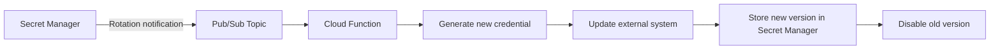

# How to Set Up Automatic Secret Rotation Using Pub/Sub and Cloud Functions in GCP

Author: [nawazdhandala](https://www.github.com/nawazdhandala)

Tags: GCP, Secret Manager, Secret Rotation, Cloud Functions, Pub/Sub

Description: Build an automated secret rotation pipeline using GCP Secret Manager notifications, Pub/Sub, and Cloud Functions to keep credentials fresh without manual intervention.

---

Secrets that never change are secrets waiting to be exploited. A database password that has been the same for two years has had two years of opportunities to be leaked - through logs, screenshots, chat messages, or compromised backups. Automatic rotation limits the blast radius of any single credential leak by ensuring that stolen secrets expire before an attacker can make meaningful use of them.

Google Cloud Secret Manager supports rotation notifications out of the box. You configure a rotation schedule on a secret, and Secret Manager publishes a message to a Pub/Sub topic when it is time to rotate. A Cloud Function subscribes to that topic, generates a new credential, updates the external system, and stores the new value as a new secret version. The whole pipeline runs without human intervention.

## Architecture Overview



The rotation function needs to handle the full lifecycle: generate a new secret, apply it to the target system (database, API, etc.), store the new value, and clean up the old one. The exact steps depend on what kind of secret you are rotating.

## Prerequisites

- A GCP project with Secret Manager, Cloud Functions, and Pub/Sub APIs enabled
- A secret that needs rotation (we will use a Cloud SQL database password as the example)
- A service account for the rotation function with appropriate roles

```bash
# Enable required APIs
gcloud services enable \
  secretmanager.googleapis.com \
  cloudfunctions.googleapis.com \
  pubsub.googleapis.com \
  sqladmin.googleapis.com \
  --project=my-project-id
```

## Step 1 - Create the Pub/Sub Topic

Create a topic that will receive rotation notifications from Secret Manager:

```bash
# Create the Pub/Sub topic for rotation events
gcloud pubsub topics create secret-rotation-events \
  --project=my-project-id
```

## Step 2 - Create the Secret with Rotation Configuration

Create the secret and configure its rotation schedule. The rotation period determines how often Secret Manager sends a notification:

```bash
# Create the secret with a rotation schedule
gcloud secrets create db-password \
  --replication-policy="automatic" \
  --topics="projects/my-project-id/topics/secret-rotation-events" \
  --rotation-period="2592000s" \
  --next-rotation-time="2026-03-01T00:00:00Z" \
  --project=my-project-id

# Add the initial password value
echo -n "initial-password-123" | gcloud secrets versions add db-password \
  --data-file=- \
  --project=my-project-id
```

The `rotation-period` is in seconds. 2592000 seconds equals 30 days. The `next-rotation-time` sets when the first rotation notification will fire.

The `topics` parameter tells Secret Manager to publish event notifications to the specified Pub/Sub topic. This includes rotation events, but also version creation and destruction events.

## Step 3 - Create the Rotation Service Account

The Cloud Function needs a service account with permissions to manage the secret and update the target system:

```bash
# Create the rotation service account
gcloud iam service-accounts create secret-rotator \
  --display-name="Secret Rotation Function" \
  --project=my-project-id

# Grant permission to manage the specific secret
gcloud secrets add-iam-policy-binding db-password \
  --member="serviceAccount:secret-rotator@my-project-id.iam.gserviceaccount.com" \
  --role="roles/secretmanager.secretVersionManager" \
  --project=my-project-id

# Grant permission to update Cloud SQL users
gcloud projects add-iam-policy-binding my-project-id \
  --member="serviceAccount:secret-rotator@my-project-id.iam.gserviceaccount.com" \
  --role="roles/cloudsql.admin"
```

## Step 4 - Write the Cloud Function

Here is a Cloud Function that rotates a Cloud SQL database password. The function generates a new random password, updates it in Cloud SQL, and stores the new value in Secret Manager:

```python
# main.py - Secret rotation function for Cloud SQL passwords
import json
import os
import secrets
import string
import base64

from google.cloud import secretmanager
from googleapiclient import discovery
import functions_framework

PROJECT_ID = os.environ.get("GCP_PROJECT")
SQL_INSTANCE = os.environ.get("SQL_INSTANCE", "my-sql-instance")
SQL_USER = os.environ.get("SQL_USER", "app-user")
SECRET_ID = os.environ.get("SECRET_ID", "db-password")

def generate_password(length=32):
    """Generate a random password with mixed characters."""
    alphabet = string.ascii_letters + string.digits + "!@#$%^&*"
    return "".join(secrets.choice(alphabet) for _ in range(length))

def update_cloud_sql_password(new_password):
    """Update the password for a Cloud SQL user."""
    service = discovery.build("sqladmin", "v1beta4")

    # Build the request body with the new password
    body = {
        "password": new_password,
    }

    # Execute the update
    request = service.users().update(
        project=PROJECT_ID,
        instance=SQL_INSTANCE,
        name=SQL_USER,
        body=body,
    )
    response = request.execute()
    print(f"Updated Cloud SQL user password: {response.get('status', 'unknown')}")

def store_new_secret_version(new_password):
    """Store the new password as a new version in Secret Manager."""
    client = secretmanager.SecretManagerServiceClient()
    parent = f"projects/{PROJECT_ID}/secrets/{SECRET_ID}"

    # Add the new version
    response = client.add_secret_version(
        request={
            "parent": parent,
            "payload": {"data": new_password.encode("UTF-8")},
        }
    )
    print(f"Created new secret version: {response.name}")
    return response.name

def disable_old_versions():
    """Disable all versions except the latest."""
    client = secretmanager.SecretManagerServiceClient()
    parent = f"projects/{PROJECT_ID}/secrets/{SECRET_ID}"

    # List all enabled versions
    versions = client.list_secret_versions(
        request={"parent": parent, "filter": "state:ENABLED"}
    )

    version_list = sorted(
        versions,
        key=lambda v: int(v.name.split("/")[-1]),
        reverse=True,
    )

    # Skip the latest, disable the rest
    for version in version_list[1:]:
        client.disable_secret_version(request={"name": version.name})
        print(f"Disabled old version: {version.name}")

@functions_framework.cloud_event
def rotate_secret(cloud_event):
    """Handle the rotation event from Pub/Sub."""
    # Parse the Pub/Sub message
    data = base64.b64decode(cloud_event.data.get("message", {}).get("data", ""))
    message = json.loads(data) if data else {}

    event_type = message.get("eventType", "")
    secret_name = message.get("name", "")

    # Only process SECRET_ROTATE events for our secret
    if "SECRET_ROTATE" not in event_type:
        print(f"Ignoring event type: {event_type}")
        return "Skipped"

    print(f"Processing rotation for: {secret_name}")

    # Generate a new password
    new_password = generate_password()

    # Update the password in Cloud SQL first
    # (if this fails, the old password still works)
    update_cloud_sql_password(new_password)

    # Store the new password in Secret Manager
    store_new_secret_version(new_password)

    # Disable old versions
    disable_old_versions()

    print("Rotation completed successfully")
    return "OK"
```

Create the requirements file:

```
# requirements.txt
functions-framework==3.*
google-cloud-secret-manager==2.*
google-api-python-client==2.*
google-auth==2.*
```

## Step 5 - Deploy the Function

```bash
# Deploy the rotation Cloud Function
gcloud functions deploy rotate-db-password \
  --gen2 \
  --runtime=python311 \
  --region=us-central1 \
  --source=./rotation-function/ \
  --entry-point=rotate_secret \
  --trigger-topic=secret-rotation-events \
  --service-account=secret-rotator@my-project-id.iam.gserviceaccount.com \
  --set-env-vars="GCP_PROJECT=my-project-id,SQL_INSTANCE=my-sql-instance,SQL_USER=app-user,SECRET_ID=db-password" \
  --project=my-project-id
```

## Step 6 - Test the Rotation

You can trigger a test rotation manually by publishing a message to the Pub/Sub topic:

```bash
# Simulate a rotation event by publishing to the topic
gcloud pubsub topics publish secret-rotation-events \
  --message='{"eventType":"SECRET_ROTATE","name":"projects/my-project-id/secrets/db-password"}' \
  --project=my-project-id

# Check the function logs
gcloud functions logs read rotate-db-password \
  --gen2 \
  --region=us-central1 \
  --project=my-project-id \
  --limit=20
```

Verify the new version was created:

```bash
# List versions of the secret
gcloud secrets versions list db-password --project=my-project-id
```

## Handling Application Reconnection

After rotation, applications using the old password need to reconnect with the new one. There are several strategies:

**Connection pooler with refresh**: If you use a connection pooler like PgBouncer or the Cloud SQL Auth Proxy, configure it to refresh credentials from Secret Manager periodically.

**Application-level retry**: Build retry logic into your application that fetches the latest secret on authentication failure:

```python
# Python pattern for handling credential refresh on auth failure
from google.cloud import secretmanager
import psycopg2

def get_db_connection():
    """Get a database connection, refreshing credentials on auth failure."""
    client = secretmanager.SecretManagerServiceClient()
    secret_name = "projects/my-project-id/secrets/db-password/versions/latest"

    # Fetch the current password
    response = client.access_secret_version(request={"name": secret_name})
    password = response.payload.data.decode("UTF-8")

    try:
        conn = psycopg2.connect(
            host="db-host",
            user="app-user",
            password=password,
            dbname="mydb"
        )
        return conn
    except psycopg2.OperationalError as e:
        if "authentication failed" in str(e).lower():
            # Password might have just rotated - retry with fresh credential
            response = client.access_secret_version(request={"name": secret_name})
            password = response.payload.data.decode("UTF-8")
            return psycopg2.connect(
                host="db-host",
                user="app-user",
                password=password,
                dbname="mydb"
            )
        raise
```

## Monitoring and Alerting

Set up alerts for rotation failures. If a rotation fails, the old password keeps working, but your rotation cadence is broken:

```bash
# Create a log-based alert for rotation errors
gcloud logging read 'resource.type="cloud_function" AND resource.labels.function_name="rotate-db-password" AND severity>=ERROR' \
  --project=my-project-id \
  --limit=5
```

Also monitor the age of your secret versions. If the latest version is older than your rotation period plus a buffer, something went wrong.

Automatic rotation is one of those investments that pays for itself the first time a credential is accidentally exposed. Instead of a fire drill to rotate the compromised secret, you know it will be replaced within hours or days automatically. Build rotation pipelines early, even if the rotation period is generous. It is much easier to shorten the interval later than to build the pipeline under pressure during an incident.
