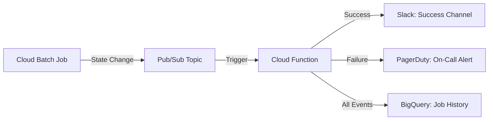

# How to Set Up Batch Job Notifications Using Pub/Sub and Cloud Functions on Google Cloud

Author: [nawazdhandala](https://www.github.com/nawazdhandala)

Tags: GCP, Cloud Batch, Pub/Sub, Cloud Functions, Notifications

Description: Set up automated notifications for Google Cloud Batch job events using Pub/Sub and Cloud Functions to track job completion and failures.

---

When you run batch jobs in production, you need to know when they finish and especially when they fail. Manually checking job status is not practical, especially for jobs that run on schedules or are triggered by upstream events. By connecting Google Cloud Batch to Pub/Sub and Cloud Functions, you can build an automated notification system that alerts your team through Slack, email, PagerDuty, or any other channel.

This guide covers setting up the notification pipeline from Batch job state changes through to actionable alerts.

## Architecture

Cloud Batch publishes job state change notifications to Pub/Sub. A Cloud Function subscribes to these notifications, processes the event, and sends alerts through your preferred channels.



## Setting Up the Pub/Sub Topic

Create a Pub/Sub topic to receive Batch job notifications.

```bash
# Create the topic for batch job notifications
gcloud pubsub topics create batch-job-notifications

# Create a subscription for the Cloud Function
gcloud pubsub subscriptions create batch-notifications-sub \
  --topic=batch-job-notifications \
  --ack-deadline=60
```

## Configuring Batch Jobs to Send Notifications

When creating Batch jobs, configure them to publish state changes to your Pub/Sub topic.

```python
# create_job_with_notifications.py - Batch job that sends notifications
from google.cloud import batch_v1

def create_notifying_batch_job(project_id, region, job_id):
    """Create a Batch job that publishes state changes to Pub/Sub."""
    client = batch_v1.BatchServiceClient()
    parent = f"projects/{project_id}/locations/{region}"

    job = batch_v1.Job()

    # Define the task
    task_spec = batch_v1.TaskSpec()
    runnable = batch_v1.Runnable()
    container = batch_v1.Runnable.Container()
    container.image_uri = "us-central1-docker.pkg.dev/YOUR_PROJECT/batch/processor:latest"
    runnable.container = container
    task_spec.runnables = [runnable]

    resources = batch_v1.ComputeResource()
    resources.cpu_milli = 4000
    resources.memory_mib = 8192
    task_spec.compute_resource = resources

    task_group = batch_v1.TaskGroup()
    task_group.task_spec = task_spec
    task_group.task_count = 20
    task_group.parallelism = 20

    job.task_groups = [task_group]

    # Allocation policy
    allocation = batch_v1.AllocationPolicy()
    instance = batch_v1.AllocationPolicy.InstancePolicyOrTemplate()
    policy = batch_v1.AllocationPolicy.InstancePolicy()
    policy.machine_type = "e2-standard-4"
    instance.policy = policy
    allocation.instances = [instance]
    job.allocation_policy = allocation

    # Configure notifications
    job.notifications = [
        batch_v1.JobNotification(
            pubsub_topic=f"projects/{project_id}/topics/batch-job-notifications",
            message=batch_v1.JobNotification.Message(
                type_=batch_v1.JobNotification.Type.JOB_STATE_CHANGED,
                new_job_state=batch_v1.JobStatus.State.SUCCEEDED,
            ),
        ),
        batch_v1.JobNotification(
            pubsub_topic=f"projects/{project_id}/topics/batch-job-notifications",
            message=batch_v1.JobNotification.Message(
                type_=batch_v1.JobNotification.Type.JOB_STATE_CHANGED,
                new_job_state=batch_v1.JobStatus.State.FAILED,
            ),
        ),
    ]

    # Logging
    job.logs_policy = batch_v1.LogsPolicy(
        destination=batch_v1.LogsPolicy.Destination.CLOUD_LOGGING
    )

    created_job = client.create_job(
        parent=parent, job=job, job_id=job_id
    )

    print(f"Created job with notifications: {created_job.name}")
    return created_job
```

## Building the Notification Function

The Cloud Function processes Pub/Sub messages and routes notifications based on job state.

```python
# notification_handler/main.py - Process batch job notifications
import functions_framework
import base64
import json
import logging
import requests
import os
from datetime import datetime
from google.cloud import bigquery

logger = logging.getLogger(__name__)

# Configuration from environment variables
SLACK_WEBHOOK_SUCCESS = os.environ.get("SLACK_WEBHOOK_SUCCESS")
SLACK_WEBHOOK_FAILURE = os.environ.get("SLACK_WEBHOOK_FAILURE")
PAGERDUTY_ROUTING_KEY = os.environ.get("PAGERDUTY_ROUTING_KEY")
BQ_TABLE = os.environ.get("BQ_TABLE", "YOUR_PROJECT.batch_monitoring.job_history")

bq_client = bigquery.Client()


@functions_framework.cloud_event
def handle_batch_notification(cloud_event):
    """Process a Batch job state change notification."""
    # Decode the Pub/Sub message
    message_data = base64.b64decode(cloud_event.data["message"]["data"])
    notification = json.loads(message_data)

    # Extract job details from the notification
    job_name = notification.get("job", {}).get("name", "unknown")
    job_state = notification.get("job", {}).get("status", {}).get("state", "UNKNOWN")
    job_uid = notification.get("job", {}).get("uid", "")

    # Parse the job name to get a friendly identifier
    job_id = job_name.split("/")[-1] if "/" in job_name else job_name

    logger.info(f"Job notification: {job_id} -> {job_state}")

    # Get additional job details
    task_count = 0
    for tg in notification.get("job", {}).get("taskGroups", []):
        task_count += tg.get("taskCount", 0)

    event = {
        "job_id": job_id,
        "job_uid": job_uid,
        "state": job_state,
        "task_count": task_count,
        "timestamp": datetime.utcnow().isoformat(),
        "full_name": job_name,
    }

    # Route to appropriate notification channel
    if job_state == "SUCCEEDED":
        send_success_notification(event)
    elif job_state == "FAILED":
        send_failure_notification(event)

    # Always log to BigQuery for history
    log_to_bigquery(event)


def send_success_notification(event):
    """Send a success notification to Slack."""
    if not SLACK_WEBHOOK_SUCCESS:
        logger.warning("No Slack webhook configured for success notifications")
        return

    message = {
        "blocks": [
            {
                "type": "header",
                "text": {
                    "type": "plain_text",
                    "text": "Batch Job Completed Successfully"
                }
            },
            {
                "type": "section",
                "fields": [
                    {"type": "mrkdwn", "text": f"*Job:* {event['job_id']}"},
                    {"type": "mrkdwn", "text": f"*Tasks:* {event['task_count']}"},
                    {"type": "mrkdwn", "text": f"*State:* {event['state']}"},
                    {"type": "mrkdwn", "text": f"*Time:* {event['timestamp']}"},
                ]
            }
        ]
    }

    response = requests.post(SLACK_WEBHOOK_SUCCESS, json=message, timeout=10)
    if response.status_code != 200:
        logger.error(f"Slack notification failed: {response.text}")


def send_failure_notification(event):
    """Send failure notifications to Slack and PagerDuty."""
    # Send to Slack failure channel
    if SLACK_WEBHOOK_FAILURE:
        message = {
            "blocks": [
                {
                    "type": "header",
                    "text": {
                        "type": "plain_text",
                        "text": "ALERT: Batch Job Failed"
                    }
                },
                {
                    "type": "section",
                    "fields": [
                        {"type": "mrkdwn", "text": f"*Job:* {event['job_id']}"},
                        {"type": "mrkdwn", "text": f"*Tasks:* {event['task_count']}"},
                        {"type": "mrkdwn", "text": f"*State:* {event['state']}"},
                        {"type": "mrkdwn", "text": f"*Time:* {event['timestamp']}"},
                    ]
                },
                {
                    "type": "section",
                    "text": {
                        "type": "mrkdwn",
                        "text": f"<https://console.cloud.google.com/batch/jobDetail/us-central1/{event['job_id']}|View in Console>"
                    }
                }
            ]
        }

        requests.post(SLACK_WEBHOOK_FAILURE, json=message, timeout=10)

    # Send to PagerDuty for on-call alerting
    if PAGERDUTY_ROUTING_KEY:
        pd_event = {
            "routing_key": PAGERDUTY_ROUTING_KEY,
            "event_action": "trigger",
            "payload": {
                "summary": f"Batch job failed: {event['job_id']}",
                "severity": "error",
                "source": "google-cloud-batch",
                "component": event["job_id"],
                "custom_details": event,
            },
        }

        response = requests.post(
            "https://events.pagerduty.com/v2/enqueue",
            json=pd_event,
            timeout=10,
        )

        if response.status_code != 202:
            logger.error(f"PagerDuty notification failed: {response.text}")


def log_to_bigquery(event):
    """Store the job event in BigQuery for historical tracking."""
    rows = [{
        "job_id": event["job_id"],
        "job_uid": event["job_uid"],
        "state": event["state"],
        "task_count": event["task_count"],
        "timestamp": event["timestamp"],
    }]

    errors = bq_client.insert_rows_json(BQ_TABLE, rows)
    if errors:
        logger.error(f"BigQuery insert failed: {errors}")
```

Deploy the notification handler.

```bash
# Deploy the Cloud Function
gcloud functions deploy batch-notification-handler \
  --gen2 \
  --runtime=python311 \
  --region=us-central1 \
  --source=./notification_handler \
  --entry-point=handle_batch_notification \
  --trigger-topic=batch-job-notifications \
  --memory=256MB \
  --timeout=60s \
  --set-env-vars="SLACK_WEBHOOK_SUCCESS=https://hooks.slack.com/services/XXX,SLACK_WEBHOOK_FAILURE=https://hooks.slack.com/services/YYY,PAGERDUTY_ROUTING_KEY=YOUR_KEY,BQ_TABLE=YOUR_PROJECT.batch_monitoring.job_history"
```

## Creating the BigQuery History Table

Store all job events for historical analysis and SLA reporting.

```sql
-- Create the job history table
CREATE TABLE IF NOT EXISTS `YOUR_PROJECT.batch_monitoring.job_history` (
  job_id STRING NOT NULL,
  job_uid STRING,
  state STRING NOT NULL,
  task_count INTEGER,
  timestamp TIMESTAMP NOT NULL
)
PARTITION BY DATE(timestamp);

-- Query to check job success rate over the last 30 days
SELECT
  DATE(timestamp) AS date,
  COUNTIF(state = 'SUCCEEDED') AS succeeded,
  COUNTIF(state = 'FAILED') AS failed,
  SAFE_DIVIDE(COUNTIF(state = 'SUCCEEDED'), COUNT(*)) AS success_rate
FROM `YOUR_PROJECT.batch_monitoring.job_history`
WHERE timestamp >= TIMESTAMP_SUB(CURRENT_TIMESTAMP(), INTERVAL 30 DAY)
GROUP BY date
ORDER BY date DESC;
```

## Email Notifications via Cloud Monitoring

If you prefer email alerts without building a custom function, use Cloud Monitoring notification channels.

```bash
# Create an email notification channel
gcloud alpha monitoring channels create \
  --display-name="Batch Job Alerts Email" \
  --type=email \
  --channel-labels=email_address=team@example.com

# Create a log-based alert that sends email on batch failures
gcloud alpha monitoring policies create \
  --display-name="Batch Job Failure Email Alert" \
  --notification-channels=CHANNEL_ID \
  --condition-display-name="Batch job failure detected" \
  --condition-filter='resource.type="cloud_batch_job" AND severity>=ERROR' \
  --condition-threshold-value=0 \
  --condition-threshold-comparison=COMPARISON_GT
```

## Testing the Notification Pipeline

Test your setup by creating a small Batch job that intentionally fails.

```bash
# Create a test job that will fail
gcloud batch jobs submit test-notification-fail \
  --location=us-central1 \
  --config - <<EOF
{
  "taskGroups": [{
    "taskSpec": {
      "runnables": [{
        "script": {
          "text": "echo 'This job will fail' && exit 1"
        }
      }],
      "maxRetryCount": 0
    },
    "taskCount": 1,
    "parallelism": 1
  }],
  "notifications": [{
    "pubsubTopic": "projects/YOUR_PROJECT/topics/batch-job-notifications",
    "message": {
      "type": "JOB_STATE_CHANGED",
      "newJobState": "FAILED"
    }
  }],
  "logsPolicy": {"destination": "CLOUD_LOGGING"}
}
EOF
```

Check that you received the Slack and PagerDuty notifications, and verify the event was logged to BigQuery.

## Wrapping Up

Automated notifications for Batch jobs ensure that your team knows immediately when something goes wrong, without anyone having to watch a dashboard. The Pub/Sub and Cloud Functions approach gives you full control over notification routing - success messages go to an informational Slack channel, failures trigger PagerDuty alerts, and everything is logged to BigQuery for historical analysis. This pattern works for any number of Batch jobs and scales without modification as your workload grows.
