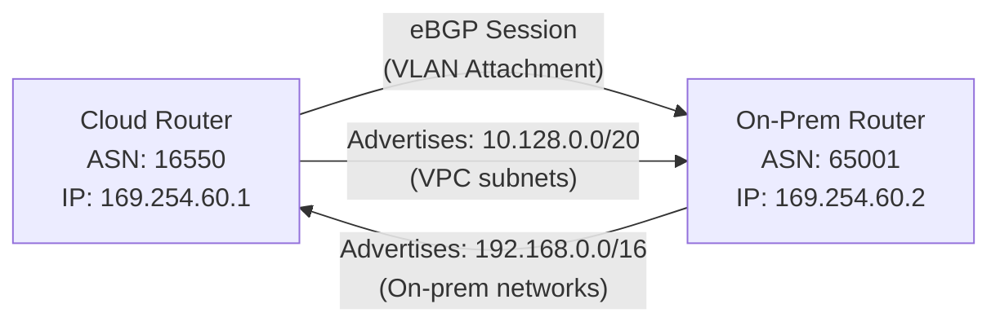

# How to Set Up BGP Sessions Between Cloud Router and On-Premises Router for Cloud Interconnect in GCP

Author: [nawazdhandala](https://www.github.com/nawazdhandala)

Tags: GCP, BGP, Cloud Router, Cloud Interconnect, Networking, Routing

Description: A detailed guide to configuring BGP sessions between GCP Cloud Router and on-premises routers for Cloud Interconnect dynamic route exchange.

---

BGP (Border Gateway Protocol) is the backbone of Cloud Interconnect routing in GCP. It is how your on-premises network and Google Cloud automatically exchange route information so traffic knows where to go. Without properly configured BGP sessions, your Interconnect is just an expensive cable that does nothing.

In this post, I will cover everything you need to know about setting up BGP between Cloud Router and your on-premises router, including ASN selection, route advertisements, and common configuration examples for popular router vendors.

## BGP Basics for Cloud Interconnect

Cloud Interconnect uses eBGP (external BGP) because Cloud Router and your on-premises router are in different Autonomous Systems. The key components:

- **ASN (Autonomous System Number)**: A unique identifier for each BGP speaker. Cloud Router gets one, your on-premises router gets one.
- **BGP Session**: A TCP connection between two BGP speakers on port 179.
- **Route Advertisements**: Each side tells the other about the networks it can reach.
- **Link-local IPs**: The BGP session runs over link-local addresses (169.254.x.x) configured on the VLAN attachment.



## Step 1: Choose Your ASN

Cloud Router supports ASN values in these ranges:

- **16550**: Default Cloud Router ASN. Fine for simple setups.
- **64512-65534**: Private 16-bit ASN range. Use these for most deployments.
- **4200000000-4294967294**: Private 32-bit ASN range. Available if you need more ASNs.

Your on-premises router needs a different ASN. If your organization already has a public ASN, use that. Otherwise, pick a private ASN that does not conflict with anything in your network.

```bash
# Create Cloud Router with a specific ASN
gcloud compute routers create ic-router \
    --network=my-vpc \
    --region=us-east4 \
    --asn=16550
```

## Step 2: Create the VLAN Attachment and BGP Interface

When you create a VLAN attachment, GCP assigns link-local IP addresses for the BGP session:

```bash
# Create the VLAN attachment
gcloud compute interconnects attachments dedicated create my-attachment \
    --interconnect=my-interconnect \
    --router=ic-router \
    --region=us-east4 \
    --bandwidth=BPS_1G \
    --vlan=100

# Check the assigned BGP peering IPs
gcloud compute interconnects attachments describe my-attachment \
    --region=us-east4 \
    --format="yaml(cloudRouterIpAddress, customerRouterIpAddress)"
```

This will output something like:

```yaml
cloudRouterIpAddress: 169.254.60.1/29
customerRouterIpAddress: 169.254.60.2/29
```

## Step 3: Add BGP Interface and Peer on Cloud Router

```bash
# Add the interface to Cloud Router
gcloud compute routers add-interface ic-router \
    --interface-name=attachment-interface \
    --interconnect-attachment=my-attachment \
    --region=us-east4

# Add the BGP peer
gcloud compute routers add-bgp-peer ic-router \
    --peer-name=onprem-peer \
    --interface=attachment-interface \
    --peer-ip-address=169.254.60.2 \
    --peer-asn=65001 \
    --region=us-east4
```

## Step 4: Configure the On-Premises Router

Here are configuration examples for popular router platforms.

### Cisco IOS / IOS XE

```text
! Configure the VLAN sub-interface
interface TenGigabitEthernet0/0.100
  description GCP Cloud Interconnect
  encapsulation dot1Q 100
  ip address 169.254.60.2 255.255.255.248
  no shutdown

! Configure BGP
router bgp 65001
  ! Set the router ID
  bgp router-id 10.0.0.1

  ! Peer with Cloud Router
  neighbor 169.254.60.1 remote-as 16550
  neighbor 169.254.60.1 description GCP-Cloud-Router
  neighbor 169.254.60.1 timers 20 60

  ! Address family configuration
  address-family ipv4 unicast
    neighbor 169.254.60.1 activate
    ! Advertise on-premises networks
    network 192.168.0.0 mask 255.255.0.0
    network 10.0.0.0 mask 255.255.0.0
```

### Juniper Junos

```text
# Interface configuration
set interfaces xe-0/0/0 unit 100 vlan-id 100
set interfaces xe-0/0/0 unit 100 family inet address 169.254.60.2/29

# BGP configuration
set routing-options router-id 10.0.0.1
set routing-options autonomous-system 65001

set protocols bgp group gcp type external
set protocols bgp group gcp peer-as 16550
set protocols bgp group gcp neighbor 169.254.60.1
set protocols bgp group gcp hold-time 60

# Export policy to advertise local routes
set policy-options policy-statement export-to-gcp term 1 from protocol direct
set policy-options policy-statement export-to-gcp term 1 from route-filter 192.168.0.0/16 orlonger
set policy-options policy-statement export-to-gcp term 1 then accept

set protocols bgp group gcp export export-to-gcp
```

### Arista EOS

```text
! Interface configuration
interface Ethernet1.100
  encapsulation dot1q vlan 100
  ip address 169.254.60.2/29

! BGP configuration
router bgp 65001
  router-id 10.0.0.1
  neighbor 169.254.60.1 remote-as 16550
  neighbor 169.254.60.1 description GCP-Cloud-Router
  neighbor 169.254.60.1 timers 20 60

  ! Advertise networks
  network 192.168.0.0/16
  network 10.0.0.0/16
```

## Step 5: Verify the BGP Session

From the GCP side:

```bash
# Check BGP peer status
gcloud compute routers get-status ic-router \
    --region=us-east4 \
    --format="yaml(result.bgpPeerStatus)"
```

Look for:

```yaml
bgpPeerStatus:
- name: onprem-peer
  ipAddress: 169.254.60.1
  peerIpAddress: 169.254.60.2
  status: UP
  numLearnedRoutes: 5
  uptimeSeconds: '3600'
```

From the on-premises side (Cisco example):

```text
! Check BGP neighbor status
show bgp ipv4 unicast summary
show bgp ipv4 unicast neighbors 169.254.60.1

! Check received and advertised routes
show bgp ipv4 unicast neighbors 169.254.60.1 routes
show bgp ipv4 unicast neighbors 169.254.60.1 advertised-routes
```

## Controlling Route Advertisements from Cloud Router

By default, Cloud Router advertises all subnet routes in the VPC. You can customize this:

### Advertise Only Specific Subnets

```bash
# Set Cloud Router to custom advertisement mode
gcloud compute routers update ic-router \
    --region=us-east4 \
    --advertisement-mode=CUSTOM \
    --set-advertisement-ranges=10.128.0.0/20,10.129.0.0/20
```

### Advertise Default Route

If you want GCP to be the default gateway for your on-premises network:

```bash
# Advertise a default route from Cloud Router
gcloud compute routers update ic-router \
    --region=us-east4 \
    --advertisement-mode=CUSTOM \
    --set-advertisement-groups=ALL_SUBNETS \
    --set-advertisement-ranges=0.0.0.0/0
```

### Per-Peer Advertisements

You can also customize advertisements per BGP peer:

```bash
# Set custom advertisements for a specific peer
gcloud compute routers update-bgp-peer ic-router \
    --peer-name=onprem-peer \
    --region=us-east4 \
    --advertisement-mode=CUSTOM \
    --set-advertisement-ranges=10.128.0.0/20
```

## Filtering Routes on the On-Premises Side

You probably do not want to accept every route Cloud Router advertises. Use route filters on your on-premises router:

```text
! Cisco - Only accept specific prefixes from GCP
ip prefix-list FROM-GCP seq 10 permit 10.128.0.0/20
ip prefix-list FROM-GCP seq 20 permit 10.129.0.0/20
ip prefix-list FROM-GCP seq 100 deny 0.0.0.0/0 le 32

router bgp 65001
  neighbor 169.254.60.1 prefix-list FROM-GCP in
```

## BGP Timer Tuning

The default BGP timers (60-second keepalive, 180-second hold) can mean a 3-minute delay before failover. For Cloud Interconnect, consider using more aggressive timers:

```bash
# Set faster BGP timers on Cloud Router
gcloud compute routers update-bgp-peer ic-router \
    --peer-name=onprem-peer \
    --region=us-east4 \
    --bfd-session-initialization-mode=ACTIVE \
    --bfd-min-receive-interval=300 \
    --bfd-min-transmit-interval=300 \
    --bfd-multiplier=3
```

BFD (Bidirectional Forwarding Detection) is even better than fast BGP timers. It runs at the data plane level and can detect failures in under a second.

Make sure your on-premises router also has BFD enabled:

```text
! Cisco - Enable BFD for BGP
router bgp 65001
  neighbor 169.254.60.1 fall-over bfd

interface TenGigabitEthernet0/0.100
  bfd interval 300 min_rx 300 multiplier 3
```

## Troubleshooting BGP Issues

**BGP session stays in IDLE state**:
- Verify IP addressing on both sides matches
- Check that the VLAN ID is correct
- Ensure there are no ACLs blocking TCP port 179

**BGP session established but no routes learned**:
- Verify route advertisements on both sides
- Check for prefix list or route map filters blocking routes
- Make sure the correct address family (IPv4) is activated

**Routes learned but traffic does not flow**:
- Check for firewall rules blocking the actual data traffic
- Verify that the routes are installed in the routing table (not just in BGP table)
- Look for more-specific routes that might be overriding the BGP routes

```bash
# View the routes learned by Cloud Router
gcloud compute routers get-status ic-router \
    --region=us-east4 \
    --format="yaml(result.bestRoutes)"
```

## Wrapping Up

BGP configuration for Cloud Interconnect follows standard eBGP practices, but the GCP-specific details matter: use the link-local IPs from the VLAN attachment, match ASN values correctly, and customize route advertisements to control what each side sees. Enable BFD for fast failover, and always verify the session is UP with routes being exchanged in both directions before sending production traffic. Taking the time to get BGP right upfront saves you from chasing down routing issues later.
