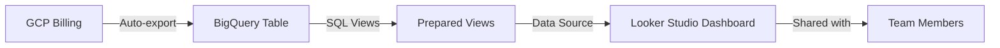

# How to Set Up Billing Export and Create Cost Dashboards in Looker Studio

Author: [nawazdhandala](https://www.github.com/nawazdhandala)

Tags: GCP, Billing Export, Looker Studio, Cost Dashboards, Google Cloud

Description: A complete walkthrough for setting up GCP billing export to BigQuery and building interactive cost dashboards in Looker Studio for your team.

---

Numbers in a spreadsheet do not drive action. Dashboards do. When your team can see a visual breakdown of cloud spending that updates automatically, cost awareness becomes part of the culture. Google Cloud's billing export to BigQuery combined with Looker Studio (formerly Data Studio) gives you a powerful, free way to build exactly that.

This post walks through the end-to-end setup: enabling billing export, preparing the data, and building a dashboard that answers the questions your team actually asks.

## Architecture Overview

The data flow is straightforward:



GCP automatically pushes billing data to BigQuery multiple times per day. You create views in BigQuery to shape the data for your dashboard. Looker Studio connects to those views and renders interactive charts.

## Step 1: Enable Billing Export

If you have not already enabled billing export, here is how:

1. Open the Cloud Console and go to Billing
2. Select your billing account
3. Click "Billing export" in the left menu
4. Under "BigQuery export," click "Edit Settings" for both Standard and Detailed exports
5. Select the project and dataset where you want the data to land
6. Click Save

Create the dataset first if it does not exist:

```bash
# Create a dataset for billing data in a dedicated project
bq mk --dataset \
  --location=US \
  --description="GCP billing export" \
  billing-project:billing_export
```

After enabling, wait a few hours for the initial data to appear.

## Step 2: Create BigQuery Views for the Dashboard

Raw billing data has a complex schema with nested fields. Creating views simplifies things for Looker Studio and keeps your dashboard queries fast.

### Monthly Cost Summary View

```sql
-- Create a view for monthly cost by service and project
CREATE OR REPLACE VIEW `billing-project.billing_export.v_monthly_costs` AS
SELECT
  FORMAT_TIMESTAMP('%Y-%m', usage_start_time) AS month,
  project.name AS project_name,
  service.description AS service_name,
  ROUND(SUM(cost), 2) AS gross_cost,
  ROUND(SUM(IFNULL((SELECT SUM(c.amount) FROM UNNEST(credits) c), 0)), 2) AS total_credits,
  ROUND(
    SUM(cost) + SUM(IFNULL((SELECT SUM(c.amount) FROM UNNEST(credits) c), 0)),
    2
  ) AS net_cost
FROM
  `billing-project.billing_export.gcp_billing_export_v1_XXXXXX`
GROUP BY
  month, project_name, service_name
```

### Daily Cost Trend View

```sql
-- Create a view for daily cost trends
CREATE OR REPLACE VIEW `billing-project.billing_export.v_daily_costs` AS
SELECT
  DATE(usage_start_time) AS date,
  project.name AS project_name,
  service.description AS service_name,
  (SELECT value FROM UNNEST(labels) WHERE key = 'team') AS team,
  (SELECT value FROM UNNEST(labels) WHERE key = 'env') AS environment,
  ROUND(
    SUM(cost) + SUM(IFNULL((SELECT SUM(c.amount) FROM UNNEST(credits) c), 0)),
    2
  ) AS net_cost
FROM
  `billing-project.billing_export.gcp_billing_export_v1_XXXXXX`
WHERE
  usage_start_time >= TIMESTAMP_SUB(CURRENT_TIMESTAMP(), INTERVAL 90 DAY)
GROUP BY
  date, project_name, service_name, team, environment
```

### Top SKU View

```sql
-- Create a view for top expensive SKUs
CREATE OR REPLACE VIEW `billing-project.billing_export.v_top_skus` AS
SELECT
  service.description AS service_name,
  sku.description AS sku_name,
  ROUND(SUM(cost), 2) AS total_cost,
  ROUND(SUM(usage.amount_in_pricing_units), 2) AS total_usage,
  usage.pricing_unit
FROM
  `billing-project.billing_export.gcp_billing_export_v1_XXXXXX`
WHERE
  usage_start_time >= TIMESTAMP_SUB(CURRENT_TIMESTAMP(), INTERVAL 30 DAY)
GROUP BY
  service_name, sku_name, pricing_unit
HAVING
  total_cost > 1
```

## Step 3: Set Up Looker Studio

### Connect to BigQuery

1. Go to [Looker Studio](https://lookerstudio.google.com)
2. Click "Create" then "Data source"
3. Choose "BigQuery" as the connector
4. Select your billing project, dataset, and the view you want to connect (start with `v_daily_costs`)
5. Click "Connect"

Looker Studio will import the schema. Review the field types and make adjustments:

- Set `date` as a Date type
- Set `net_cost` as a Currency type (USD)
- Set `team` and `environment` as Dimension types

### Create Your First Report

Click "Create Report" and start building. Here are the charts I recommend for a cost dashboard.

### Chart 1: Monthly Cost Trend

Add a time series chart:
- Dimension: `date` (aggregated to month)
- Metric: `net_cost` (SUM)
- Breakdown: `service_name`

This shows your total spending over time, broken down by service. You can quickly spot trends and anomalies.

### Chart 2: Cost by Project (Pie Chart)

Add a pie chart:
- Dimension: `project_name`
- Metric: `net_cost` (SUM)

This gives a quick visual of which projects consume the most budget.

### Chart 3: Daily Cost with Moving Average

Add a combo chart with:
- Dimension: `date`
- Metric 1: `net_cost` (SUM) as bars
- Metric 2: `net_cost` (SUM with 7-day rolling average) as a line

The bars show daily fluctuation while the line shows the trend.

### Chart 4: Cost by Team

If you have team labels, add a bar chart:
- Dimension: `team`
- Metric: `net_cost` (SUM)
- Sort: Descending by cost

This is the chart your finance team will love because it directly maps spending to organizational units.

### Chart 5: Service Breakdown Table

Add a table with:
- Dimensions: `service_name`
- Metrics: `net_cost` (SUM), with conditional formatting

Color-code rows based on cost to make high-spend services stand out.

## Step 4: Add Interactive Filters

Filters make your dashboard useful for different audiences. Add these filter controls:

- **Date range**: Let users select the time period
- **Project filter**: Dropdown to filter by project
- **Team filter**: Dropdown to filter by team label
- **Environment filter**: Filter for production vs. staging vs. development

In Looker Studio, add these as "Filter Control" components at the top of your report. Each control should reference the corresponding dimension in your data source.

## Step 5: Schedule Email Delivery

Looker Studio can automatically email dashboard snapshots on a schedule:

1. Open your report
2. Click "Share" then "Schedule email delivery"
3. Set the recipients, frequency (daily, weekly, monthly), and preferred time
4. Choose the pages to include

This ensures stakeholders see the data without having to log in.

## Step 6: Add Calculated Fields

Looker Studio supports calculated fields for custom metrics:

### Cost Per Day Average

```
net_cost / DATE_DIFF(MAX(date), MIN(date))
```

### Month-Over-Month Change

Create a calculated field that compares current month cost to the previous month. In Looker Studio, use the comparison date range feature on your time series charts to show percent change.

### Budget Utilization

If you have a fixed monthly budget, add a calculated field:

```
SUM(net_cost) / 10000
```

Display this as a gauge chart that shows what percentage of the $10,000 budget has been consumed.

## Advanced: Multi-Page Dashboard

For larger organizations, create multiple pages in your Looker Studio report:

1. **Executive Summary** - Total spend, month-over-month trend, top 5 projects
2. **Service Deep Dive** - Cost by service with SKU breakdown
3. **Team Allocation** - Cost by team with environment breakdown
4. **Anomaly Detection** - Days where cost exceeded 150% of the 7-day average
5. **Recommendations** - Embed a link to the Recommendations Hub or show recommendation data if exported to BigQuery

## Best Practices

1. **Use views, not raw tables** - Views abstract the complexity of the billing schema and are easier to maintain when the schema changes.

2. **Limit date ranges in views** - Use WHERE clauses to limit views to the last 90 days for daily data. This keeps Looker Studio responsive.

3. **Cache aggressively** - In Looker Studio data source settings, enable caching with a 12-hour refresh interval. Billing data does not change by the minute.

4. **Share with view-only access** - Give stakeholders view-only access to prevent accidental changes to the dashboard.

5. **Document your dashboard** - Add text boxes to explain what each chart shows and how to interpret the data. Not everyone reading the dashboard will be a cloud expert.

## Wrapping Up

A well-built cost dashboard turns raw billing data into a shared understanding of where your cloud money goes. The combination of BigQuery billing export and Looker Studio is free, powerful, and takes about an hour to set up. Once it is running, it updates automatically and gives your entire organization visibility into cloud spending. Start with the basic charts in this guide, then iterate based on what questions your team asks.
