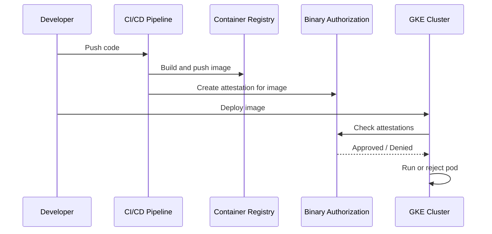

# How to Set Up Binary Authorization for GKE Clusters in Google Cloud

Author: [nawazdhandala](https://www.github.com/nawazdhandala)

Tags: GCP, Binary Authorization, GKE, Kubernetes, Container Security

Description: A complete walkthrough for setting up Binary Authorization on GKE clusters to ensure only trusted and verified container images are deployed to your Kubernetes environment.

---

Binary Authorization is a deploy-time security control for GKE that ensures only trusted container images run on your clusters. It works by requiring that images have been signed by trusted authorities (attestors) before Kubernetes will admit them. If an image does not have the required attestations, the deployment is blocked.

This is a critical control for production environments. Without it, anyone with kubectl access could deploy any image, including images from untrusted registries, images with known vulnerabilities, or images that have not been through your CI/CD pipeline. Binary Authorization closes that gap.

Let me walk you through the setup from scratch.

## How Binary Authorization Works

The flow looks like this:



## Prerequisites

- A GCP project with GKE enabled
- The Binary Authorization API enabled
- Container Analysis API enabled (for storing attestations)
- A GKE cluster (or we will create one)

```bash
# Enable the required APIs
gcloud services enable \
  binaryauthorization.googleapis.com \
  containeranalysis.googleapis.com \
  container.googleapis.com \
  --project=my-project-id
```

## Step 1: Create a GKE Cluster with Binary Authorization

If you already have a cluster, skip to Step 2.

```bash
# Create a GKE cluster with Binary Authorization enabled
gcloud container clusters create secure-cluster \
  --zone=us-central1-a \
  --num-nodes=3 \
  --binauthz-evaluation-mode=PROJECT_SINGLETON_POLICY_ENFORCE \
  --project=my-project-id
```

## Step 2: Enable Binary Authorization on an Existing Cluster

If you have an existing cluster, enable Binary Authorization on it.

```bash
# Enable Binary Authorization on an existing cluster
gcloud container clusters update my-existing-cluster \
  --zone=us-central1-a \
  --binauthz-evaluation-mode=PROJECT_SINGLETON_POLICY_ENFORCE \
  --project=my-project-id
```

## Step 3: Configure the Default Policy

Binary Authorization uses a policy that defines what images are allowed. The policy can operate in different modes.

First, view the current default policy:

```bash
# View the current Binary Authorization policy
gcloud container binauthz policy export --project=my-project-id
```

The default policy looks something like this:

```yaml
admissionWhitelistPatterns:
- namePattern: gcr.io/google_containers/*
- namePattern: gcr.io/google-containers/*
- namePattern: k8s.gcr.io/**
- namePattern: gke.gcr.io/**
- namePattern: gcr.io/stackdriver-agents/*
defaultAdmissionRule:
  enforcementMode: ENFORCED_BLOCK_AND_AUDIT_LOG
  evaluationMode: ALWAYS_ALLOW
globalPolicyEvaluationMode: ENABLE
```

## Step 4: Switch to Require Attestations

The default policy allows all images. Change it to require attestations.

Create a policy file:

```yaml
# policy.yaml - Require attestations for all images
admissionWhitelistPatterns:
  # Allow GKE system images
  - namePattern: gcr.io/google_containers/*
  - namePattern: gcr.io/google-containers/*
  - namePattern: k8s.gcr.io/**
  - namePattern: gke.gcr.io/**
  - namePattern: gcr.io/stackdriver-agents/*
  # Allow your trusted registry
  - namePattern: gcr.io/my-project-id/*
defaultAdmissionRule:
  enforcementMode: ENFORCED_BLOCK_AND_AUDIT_LOG
  evaluationMode: REQUIRE_ATTESTATION
  requireAttestationsBy:
    - projects/my-project-id/attestors/build-attestor
globalPolicyEvaluationMode: ENABLE
```

```bash
# Import the updated policy
gcloud container binauthz policy import policy.yaml --project=my-project-id
```

## Step 5: Create a KMS Key for Signing

Attestations are signed with a cryptographic key. Create one in Cloud KMS.

```bash
# Create a keyring
gcloud kms keyrings create binauthz-keyring \
  --location=global \
  --project=my-project-id

# Create an asymmetric signing key
gcloud kms keys create attestor-key \
  --location=global \
  --keyring=binauthz-keyring \
  --purpose=asymmetric-signing \
  --default-algorithm=ec-sign-p256-sha256 \
  --project=my-project-id
```

## Step 6: Create an Attestor

An attestor is the entity that vouches for an image. Typically you have one attestor per gate in your pipeline (build, QA, security scan, etc.).

```bash
# Create a Container Analysis note (required for the attestor)
curl -X POST \
  -H "Authorization: Bearer $(gcloud auth print-access-token)" \
  -H "Content-Type: application/json" \
  -d '{
    "name": "projects/my-project-id/notes/build-attestor-note",
    "attestation": {
      "hint": {
        "humanReadableName": "Build Pipeline Attestor"
      }
    }
  }' \
  "https://containeranalysis.googleapis.com/v1/projects/my-project-id/notes?noteId=build-attestor-note"

# Create the attestor
gcloud container binauthz attestors create build-attestor \
  --attestation-authority-note=build-attestor-note \
  --attestation-authority-note-project=my-project-id \
  --project=my-project-id

# Add the KMS key to the attestor
gcloud container binauthz attestors public-keys add \
  --attestor=build-attestor \
  --keyversion-project=my-project-id \
  --keyversion-location=global \
  --keyversion-keyring=binauthz-keyring \
  --keyversion-key=attestor-key \
  --keyversion=1 \
  --project=my-project-id
```

## Step 7: Create an Attestation for an Image

After your CI/CD pipeline builds an image, sign it with an attestation.

```bash
# First, get the image digest (not the tag - attestations require digests)
IMAGE_DIGEST=$(gcloud container images describe gcr.io/my-project-id/my-app:latest \
  --format='value(image_summary.digest)')

# Create the attestation
gcloud container binauthz attestations sign-and-create \
  --artifact-url="gcr.io/my-project-id/my-app@${IMAGE_DIGEST}" \
  --attestor=build-attestor \
  --attestor-project=my-project-id \
  --keyversion-project=my-project-id \
  --keyversion-location=global \
  --keyversion-keyring=binauthz-keyring \
  --keyversion-key=attestor-key \
  --keyversion=1 \
  --project=my-project-id
```

## Step 8: Deploy and Verify

Try deploying the attested image - it should succeed:

```bash
# Deploy the attested image (will be allowed)
kubectl run my-app \
  --image=gcr.io/my-project-id/my-app@${IMAGE_DIGEST} \
  --port=8080
```

Now try deploying an unattested image - it should be blocked:

```bash
# Try deploying an unattested image (will be rejected)
kubectl run rogue-app \
  --image=docker.io/library/nginx:latest \
  --port=80
```

You should see an error like: `admission webhook "imagepolicywebhook.image-policy.k8s.io" denied the request: Image docker.io/library/nginx:latest denied by Binary Authorization default admission rule.`

## Step 9: View Policy Audit Logs

Binary Authorization logs every admission decision.

```bash
# View Binary Authorization audit logs
gcloud logging read \
  'resource.type="k8s_cluster" AND protoPayload.methodName="io.k8s.core.v1.pods.create" AND protoPayload.response.reason="Forbidden"' \
  --limit=10 \
  --format="table(timestamp, protoPayload.response.message)" \
  --project=my-project-id
```

## Step 10: Handle Break-Glass Scenarios

Sometimes you need to deploy without attestation in an emergency. Binary Authorization supports a break-glass mechanism.

Add an annotation to the pod spec to bypass the policy:

```yaml
apiVersion: v1
kind: Pod
metadata:
  name: emergency-deployment
  annotations:
    # Break-glass annotation to bypass Binary Authorization
    alpha.image-policy.k8s.io/break-glass: "true"
spec:
  containers:
    - name: app
      image: docker.io/library/nginx:latest
```

Break-glass deployments are logged, so you can audit them after the fact.

## Best Practices

1. Always use image digests, not tags. Tags are mutable - someone could push a different image to the same tag. Digests are immutable.

2. Start with dry-run mode to understand the impact before enforcing. Set the enforcement mode to `DRYRUN_AUDIT_LOG_ONLY` first.

3. Create separate attestors for different pipeline stages (build, security scan, QA approval).

4. Monitor break-glass usage and investigate every instance.

5. Keep your KMS keys secure. If the signing key is compromised, the entire attestation chain is broken.

## Conclusion

Binary Authorization is a powerful supply chain security control for GKE. It ensures that every container running in your cluster has been through your approved pipeline and has been explicitly signed off. The initial setup takes some effort, but once it is in place, it runs transparently and gives you strong guarantees about what is running in your environment.
