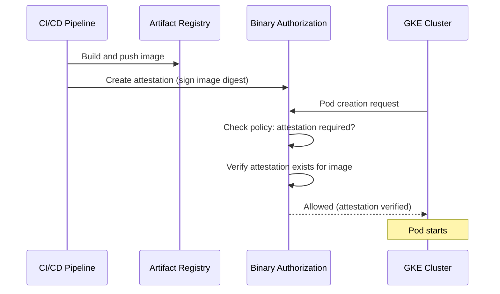

# How to Set Up Binary Authorization on GKE to Enforce Container Image Signing Policies

Author: [nawazdhandala](https://www.github.com/nawazdhandala)

Tags: GCP, GKE, Kubernetes, Binary Authorization, Security, Container Security

Description: A complete guide to setting up Binary Authorization on GKE to ensure only signed and verified container images can be deployed to your Kubernetes clusters.

---

In a world where supply chain attacks are increasingly common, just pulling container images and running them is not enough. You need to verify that every image running in your cluster was built by your CI/CD pipeline, has passed your security scans, and has not been tampered with since it was built.

Binary Authorization on GKE does exactly this. It acts as a gatekeeper at the cluster level, blocking any container image that does not have the required attestations (digital signatures). If an image was not signed by your authorized build system, it does not run. Period.

Let me walk through setting it up end to end.

## How Binary Authorization Works

The system has three main components:

1. **Attestors**: Entities that can sign (attest) container images. Usually your CI/CD system.
2. **Attestations**: Cryptographic signatures proving an image was verified by an attestor.
3. **Policy**: Rules that specify which attestations are required to deploy an image.



## Prerequisites

You need:

- A GCP project with billing enabled
- A GKE cluster
- Artifact Registry or Container Registry
- Cloud KMS for signing keys

```bash
# Enable required APIs
gcloud services enable \
  binaryauthorization.googleapis.com \
  containeranalysis.googleapis.com \
  container.googleapis.com \
  cloudkms.googleapis.com \
  artifactregistry.googleapis.com
```

## Step 1: Create a KMS Signing Key

Binary Authorization uses asymmetric signing keys. Create one in Cloud KMS.

```bash
# Create a KMS keyring
gcloud kms keyrings create attestor-keyring \
  --location global

# Create an asymmetric signing key
gcloud kms keys create attestor-key \
  --location global \
  --keyring attestor-keyring \
  --purpose asymmetric-signing \
  --default-algorithm ec-sign-p256-sha256
```

## Step 2: Create a Container Analysis Note

An attestor is backed by a Container Analysis note. The note is a metadata entity that attestations reference.

```bash
# Create a note for the attestor
curl -X POST \
  "https://containeranalysis.googleapis.com/v1/projects/YOUR_PROJECT_ID/notes/?noteId=build-attestor-note" \
  -H "Authorization: Bearer $(gcloud auth print-access-token)" \
  -H "Content-Type: application/json" \
  -d '{
    "name": "projects/YOUR_PROJECT_ID/notes/build-attestor-note",
    "attestation": {
      "hint": {
        "humanReadableName": "Build Pipeline Attestor"
      }
    }
  }'
```

## Step 3: Create the Attestor

Create an attestor that uses the KMS key for signing.

```bash
# Create the attestor
gcloud container binauthz attestors create build-attestor \
  --attestation-authority-note build-attestor-note \
  --attestation-authority-note-project YOUR_PROJECT_ID

# Add the KMS key to the attestor
gcloud container binauthz attestors public-keys add \
  --attestor build-attestor \
  --keyversion-project YOUR_PROJECT_ID \
  --keyversion-location global \
  --keyversion-keyring attestor-keyring \
  --keyversion-key attestor-key \
  --keyversion 1

# Verify the attestor is set up correctly
gcloud container binauthz attestors describe build-attestor
```

## Step 4: Configure the Binary Authorization Policy

The policy defines what attestations are required for images to be deployed.

```yaml
# policy.yaml - Binary Authorization policy
admissionWhitelistPatterns:
  # Allow GKE system images (required for cluster functionality)
  - namePattern: "gcr.io/google_containers/*"
  - namePattern: "gcr.io/google-containers/*"
  - namePattern: "k8s.gcr.io/*"
  - namePattern: "gke.gcr.io/*"
  - namePattern: "gcr.io/gke-release/*"
  - namePattern: "gcr.io/config-management-release/*"
  - namePattern: "gcr.io/stackdriver-agents/*"

defaultAdmissionRule:
  # Require attestation for all other images
  evaluationMode: REQUIRE_ATTESTATION
  enforcementMode: ENFORCED_BLOCK_AND_AUDIT_LOG
  requireAttestationsBy:
    - projects/YOUR_PROJECT_ID/attestors/build-attestor

# You can also set per-cluster rules for different environments
clusterAdmissionRules:
  # Dev cluster: allow all images (less restrictive)
  us-central1.dev-cluster:
    evaluationMode: ALWAYS_ALLOW
    enforcementMode: DRYRUN_AUDIT_LOG_ONLY
```

```bash
# Import the policy
gcloud container binauthz policy import policy.yaml
```

## Step 5: Enable Binary Authorization on GKE

Enable Binary Authorization on your cluster.

```bash
# Enable on an existing cluster
gcloud container clusters update prod-cluster \
  --region us-central1 \
  --binauthz-evaluation-mode PROJECT_SINGLETON_POLICY_ENFORCE

# Or enable at cluster creation time
gcloud container clusters create secure-cluster \
  --region us-central1 \
  --binauthz-evaluation-mode PROJECT_SINGLETON_POLICY_ENFORCE \
  --num-nodes 3
```

## Step 6: Sign Images in Your CI/CD Pipeline

Now integrate attestation into your build pipeline. Here is how to do it in Cloud Build.

```yaml
# cloudbuild.yaml - Build, scan, and attest images
steps:
  # Step 1: Build the container image
  - name: "gcr.io/cloud-builders/docker"
    args:
      - "build"
      - "-t"
      - "us-docker.pkg.dev/YOUR_PROJECT_ID/my-repo/my-app:$COMMIT_SHA"
      - "."
    id: "build"

  # Step 2: Push to Artifact Registry
  - name: "gcr.io/cloud-builders/docker"
    args:
      - "push"
      - "us-docker.pkg.dev/YOUR_PROJECT_ID/my-repo/my-app:$COMMIT_SHA"
    id: "push"
    waitFor: ["build"]

  # Step 3: Get the image digest (needed for attestation)
  - name: "gcr.io/cloud-builders/gcloud"
    entrypoint: "bash"
    args:
      - "-c"
      - |
        # Get the digest of the pushed image
        IMAGE_DIGEST=$(gcloud artifacts docker images describe \
          us-docker.pkg.dev/YOUR_PROJECT_ID/my-repo/my-app:$COMMIT_SHA \
          --format "value(image_summary.digest)")
        echo "$IMAGE_DIGEST" > /workspace/image_digest.txt
    id: "get-digest"
    waitFor: ["push"]

  # Step 4: Create the attestation (sign the image)
  - name: "gcr.io/cloud-builders/gcloud"
    entrypoint: "bash"
    args:
      - "-c"
      - |
        IMAGE_DIGEST=$(cat /workspace/image_digest.txt)
        # Create an attestation using the KMS key
        gcloud container binauthz attestations sign-and-create \
          --artifact-url "us-docker.pkg.dev/YOUR_PROJECT_ID/my-repo/my-app@${IMAGE_DIGEST}" \
          --attestor build-attestor \
          --attestor-project YOUR_PROJECT_ID \
          --keyversion-project YOUR_PROJECT_ID \
          --keyversion-location global \
          --keyversion-keyring attestor-keyring \
          --keyversion-key attestor-key \
          --keyversion 1
    id: "attest"
    waitFor: ["get-digest"]

images:
  - "us-docker.pkg.dev/YOUR_PROJECT_ID/my-repo/my-app:$COMMIT_SHA"
```

## Step 7: Test the Policy

Deploy a signed image (should succeed) and an unsigned image (should be blocked).

```bash
# Deploy the signed image - should work
kubectl run signed-app \
  --image us-docker.pkg.dev/YOUR_PROJECT_ID/my-repo/my-app@sha256:abc123... \
  --namespace default

# Try deploying an unsigned image - should be blocked
kubectl run unsigned-app \
  --image nginx:latest \
  --namespace default
# Error: admission webhook "imagepolicywebhook.image-policy.k8s.io" denied the request:
# Image nginx:latest denied by Binary Authorization policy
```

## Dry Run Mode

Before enforcing the policy, run it in dry-run mode to see what would be blocked without actually blocking anything.

```yaml
# policy-dryrun.yaml - Audit without enforcement
defaultAdmissionRule:
  evaluationMode: REQUIRE_ATTESTATION
  enforcementMode: DRYRUN_AUDIT_LOG_ONLY  # Log only, do not block
  requireAttestationsBy:
    - projects/YOUR_PROJECT_ID/attestors/build-attestor
```

Check the audit logs to see what would be blocked.

```bash
# View Binary Authorization audit logs
gcloud logging read \
  'resource.type="k8s_cluster" AND protoPayload.serviceName="binaryauthorization.googleapis.com"' \
  --limit 20 \
  --format "table(timestamp, protoPayload.response.status, protoPayload.request.image)"
```

## Break-Glass Procedure

Sometimes you need to deploy an unsigned image in an emergency. Binary Authorization supports a break-glass mechanism.

```yaml
# Add an annotation to the pod to bypass the policy
apiVersion: v1
kind: Pod
metadata:
  name: emergency-fix
  annotations:
    # This bypasses Binary Authorization (but is audit logged)
    alpha.image-policy.k8s.io/break-glass: "emergency-fix-for-outage"
spec:
  containers:
    - name: fix
      image: unsigned-emergency-image:latest
```

Every break-glass event is logged in Cloud Audit Logs, so you can review them after the emergency.

## Multiple Attestors for Multi-Stage Verification

For critical workloads, require attestations from multiple stages.

```yaml
# Policy requiring both build and security scan attestations
defaultAdmissionRule:
  evaluationMode: REQUIRE_ATTESTATION
  enforcementMode: ENFORCED_BLOCK_AND_AUDIT_LOG
  requireAttestationsBy:
    # Image must be attested by BOTH the build system AND the security scanner
    - projects/YOUR_PROJECT_ID/attestors/build-attestor
    - projects/YOUR_PROJECT_ID/attestors/vulnerability-scan-attestor
```

This ensures an image was both built by your pipeline AND passed your security scan before it can run in the cluster.

## Wrapping Up

Binary Authorization adds a critical layer of security to your GKE deployment pipeline. By requiring cryptographic attestations before any image can run, you ensure that only images built by your authorized CI/CD system, passing your security checks, can be deployed. Start with dry-run mode to understand what would be blocked, set up the attestation step in your build pipeline, and then switch to enforcement. The break-glass mechanism gives you an escape hatch for emergencies while maintaining an audit trail. For any organization concerned about supply chain security, this is one of the most impactful controls you can implement.
