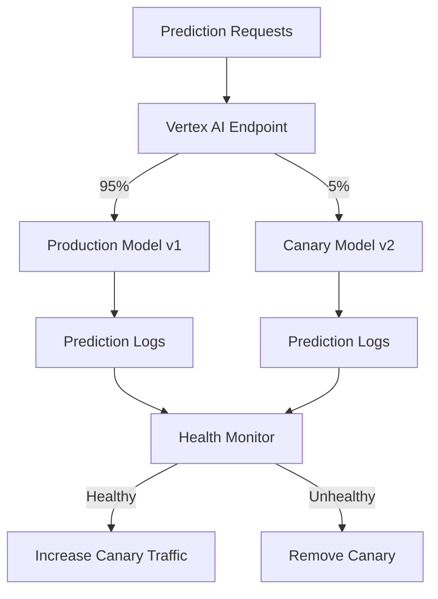

# How to Set Up Canary Deployments for ML Models on Vertex AI Endpoints

Author: [nawazdhandala](https://www.github.com/nawazdhandala)

Tags: Vertex AI, Canary Deployment, MLOps, Model Deployment, Google Cloud

Description: A step-by-step guide to setting up canary deployments for machine learning models on Vertex AI Endpoints with automated health checks and traffic management.

---

Canary deployments are the safest way to roll out a new ML model to production. Instead of switching 100% of traffic to the new model at once, you start with a small percentage - say 5% or 10% - and gradually increase it while monitoring for problems. If the new model has issues, you only affect a small fraction of your users, and you can roll back instantly.

This is standard practice for software deployments, but many ML teams still deploy models by flipping a switch. In this post, I will show you how to implement canary deployments for ML models on Vertex AI Endpoints with automated health monitoring and progressive traffic shifting.

## How Canary Deployments Work on Vertex AI

Vertex AI Endpoints support multiple deployed models with configurable traffic splits. This is the mechanism we use for canary deployments. The current production model keeps serving most traffic, while the canary gets a small slice.



## Step 1: Deploy the Canary

Start by deploying the new model alongside the existing production model with a small traffic percentage.

```python
# canary/deploy_canary.py
from google.cloud import aiplatform
import json

class CanaryDeployer:
    """Manages canary deployments for ML models on Vertex AI."""

    def __init__(self, project_id, location="us-central1"):
        aiplatform.init(project=project_id, location=location)
        self.project_id = project_id

    def start_canary(
        self,
        endpoint_id,
        new_model_resource,
        initial_traffic_pct=5,
        machine_type="n1-standard-4",
    ):
        """Deploy a new model as a canary with a small traffic percentage."""
        endpoint = aiplatform.Endpoint(endpoint_id)
        new_model = aiplatform.Model(new_model_resource)

        # Record the current state for potential rollback
        current_state = self._capture_state(endpoint)

        # Deploy the canary model
        new_model.deploy(
            endpoint=endpoint,
            deployed_model_display_name=f"canary-{new_model.version_id}",
            machine_type=machine_type,
            min_replica_count=1,
            max_replica_count=3,
            traffic_percentage=initial_traffic_pct,
        )

        deployment_info = {
            "endpoint_id": endpoint_id,
            "canary_model": new_model_resource,
            "canary_traffic_pct": initial_traffic_pct,
            "previous_state": current_state,
            "status": "active",
        }

        print(f"Canary deployed with {initial_traffic_pct}% traffic")
        return deployment_info

    def _capture_state(self, endpoint):
        """Capture the current deployment state for rollback."""
        deployed_models = endpoint.list_models()
        state = {}
        for dm in deployed_models:
            state[dm.id] = {
                "display_name": dm.display_name,
                "model": dm.model,
            }
        return state
```

## Step 2: Monitor Canary Health

The critical part of a canary deployment is monitoring. You need to compare the canary's performance against the production model in real time.

```python
# canary/health_monitor.py
from google.cloud import monitoring_v3
from google.cloud import bigquery
import time

class CanaryHealthMonitor:
    """Monitors the health of a canary deployment by comparing
    metrics against the production model."""

    def __init__(self, project_id, endpoint_id):
        self.project_id = project_id
        self.endpoint_id = endpoint_id
        self.monitoring_client = monitoring_v3.MetricServiceClient()
        self.bq_client = bigquery.Client()

    def check_health(self, window_minutes=15):
        """Compare canary metrics against production metrics.
        Returns a health assessment."""
        now = time.time()
        interval = monitoring_v3.TimeInterval({
            "end_time": {"seconds": int(now)},
            "start_time": {"seconds": int(now - window_minutes * 60)},
        })

        # Get error rates for both models
        canary_errors = self._get_error_rate("canary", interval)
        prod_errors = self._get_error_rate("production", interval)

        # Get latency for both models
        canary_latency = self._get_latency("canary", interval)
        prod_latency = self._get_latency("production", interval)

        # Get prediction accuracy if ground truth is available
        canary_accuracy = self._get_accuracy("canary", window_minutes)
        prod_accuracy = self._get_accuracy("production", window_minutes)

        health = {
            "canary_error_rate": canary_errors,
            "prod_error_rate": prod_errors,
            "canary_p95_latency_ms": canary_latency,
            "prod_p95_latency_ms": prod_latency,
            "canary_accuracy": canary_accuracy,
            "prod_accuracy": prod_accuracy,
            "healthy": True,
            "issues": [],
        }

        # Check error rate - canary should not have significantly higher errors
        if canary_errors > prod_errors * 2 and canary_errors > 0.01:
            health["healthy"] = False
            health["issues"].append(
                f"Error rate too high: {canary_errors:.4f} vs {prod_errors:.4f}"
            )

        # Check latency - canary should not be significantly slower
        if canary_latency > prod_latency * 1.5 and canary_latency > 200:
            health["healthy"] = False
            health["issues"].append(
                f"Latency too high: {canary_latency:.0f}ms vs {prod_latency:.0f}ms"
            )

        # Check accuracy if available
        if canary_accuracy is not None and prod_accuracy is not None:
            if canary_accuracy < prod_accuracy - 0.05:
                health["healthy"] = False
                health["issues"].append(
                    f"Accuracy drop: {canary_accuracy:.4f} vs {prod_accuracy:.4f}"
                )

        return health

    def _get_error_rate(self, model_type, interval):
        """Get the error rate for a specific deployed model."""
        project_name = f"projects/{self.project_id}"

        # Query error count
        filter_str = (
            'metric.type="aiplatform.googleapis.com/prediction/online/error_count" '
            f'AND resource.labels.endpoint_id="{self.endpoint_id}"'
        )

        try:
            results = self.monitoring_client.list_time_series(
                request={
                    "name": project_name,
                    "filter": filter_str,
                    "interval": interval,
                    "view": monitoring_v3.ListTimeSeriesRequest.TimeSeriesView.FULL,
                }
            )

            errors = sum(p.value.int64_value for s in results for p in s.points)

            # Query total prediction count
            pred_filter = (
                'metric.type="aiplatform.googleapis.com/prediction/online/prediction_count" '
                f'AND resource.labels.endpoint_id="{self.endpoint_id}"'
            )

            pred_results = self.monitoring_client.list_time_series(
                request={
                    "name": project_name,
                    "filter": pred_filter,
                    "interval": interval,
                    "view": monitoring_v3.ListTimeSeriesRequest.TimeSeriesView.FULL,
                }
            )

            total = sum(p.value.int64_value for s in pred_results for p in s.points)

            return errors / max(total, 1)
        except Exception as e:
            print(f"Error fetching metrics: {e}")
            return 0.0

    def _get_latency(self, model_type, interval):
        """Get p95 latency for a deployed model."""
        # Simplified - in practice, filter by deployed_model_id
        return 0.0  # Placeholder

    def _get_accuracy(self, model_type, window_minutes):
        """Get accuracy from prediction logs joined with ground truth."""
        query = f"""
        SELECT
            ROUND(
                COUNTIF(
                    JSON_EXTRACT_SCALAR(p.response, '$.predictions[0].class') = g.actual_label
                ) / NULLIF(COUNT(*), 0), 4
            ) as accuracy
        FROM ml_monitoring.prediction_logs p
        JOIN ml_monitoring.ground_truth g ON p.request_id = g.request_id
        WHERE p.logging_time > TIMESTAMP_SUB(CURRENT_TIMESTAMP(), INTERVAL {window_minutes} MINUTE)
        AND p.deployed_model_display_name LIKE '%{model_type}%'
        """

        try:
            result = list(self.bq_client.query(query).result())
            if result and result[0]["accuracy"] is not None:
                return float(result[0]["accuracy"])
        except Exception:
            pass
        return None
```

## Step 3: Progressive Traffic Shifting

If the canary is healthy, gradually increase its traffic share.

```python
# canary/traffic_manager.py
from google.cloud import aiplatform
import time

class CanaryTrafficManager:
    """Manages progressive traffic shifting for canary deployments."""

    # Traffic progression stages
    TRAFFIC_STAGES = [5, 10, 25, 50, 75, 100]

    def __init__(self, project_id, location="us-central1"):
        aiplatform.init(project=project_id, location=location)
        self.project_id = project_id

    def run_progressive_rollout(
        self,
        endpoint_id,
        health_monitor,
        stage_duration_minutes=30,
    ):
        """Run a progressive canary rollout with health checks at each stage."""
        endpoint = aiplatform.Endpoint(endpoint_id)

        for stage_pct in self.TRAFFIC_STAGES:
            print(f"\n--- Stage: {stage_pct}% traffic to canary ---")

            # Update traffic split
            self._set_canary_traffic(endpoint, stage_pct)

            # Wait for the stage duration
            print(f"Monitoring for {stage_duration_minutes} minutes...")
            check_interval = 5  # Check every 5 minutes
            checks_passed = 0
            checks_needed = stage_duration_minutes // check_interval

            for i in range(checks_needed):
                time.sleep(check_interval * 60)

                # Check canary health
                health = health_monitor.check_health(window_minutes=check_interval)
                print(f"  Health check {i+1}/{checks_needed}: "
                      f"{'HEALTHY' if health['healthy'] else 'UNHEALTHY'}")

                if health["healthy"]:
                    checks_passed += 1
                else:
                    print(f"  Issues: {health['issues']}")
                    # If more than 30% of checks fail, roll back
                    fail_rate = 1 - (checks_passed / (i + 1))
                    if fail_rate > 0.3:
                        print("Too many failed health checks. Rolling back.")
                        self._rollback(endpoint)
                        return {"status": "rolled_back", "stage": stage_pct}

            if stage_pct == 100:
                print("\nCanary promoted to 100% traffic!")
                self._cleanup_old_model(endpoint)
                return {"status": "completed", "stage": 100}

        return {"status": "completed", "stage": 100}

    def _set_canary_traffic(self, endpoint, canary_pct):
        """Update the traffic split between production and canary."""
        deployed_models = endpoint.list_models()

        canary_id = None
        prod_id = None

        for dm in deployed_models:
            if "canary" in dm.display_name:
                canary_id = dm.id
            else:
                prod_id = dm.id

        if canary_id and prod_id:
            traffic_split = {
                canary_id: canary_pct,
                prod_id: 100 - canary_pct,
            }
            endpoint.update(traffic_split=traffic_split)
            print(f"Traffic split: canary={canary_pct}%, production={100 - canary_pct}%")

    def _rollback(self, endpoint):
        """Remove the canary and restore full traffic to production."""
        deployed_models = endpoint.list_models()

        for dm in deployed_models:
            if "canary" in dm.display_name:
                # First route all traffic away
                prod_models = {
                    d.id: 100 for d in deployed_models if "canary" not in d.display_name
                }
                prod_models[dm.id] = 0
                endpoint.update(traffic_split=prod_models)

                # Then undeploy the canary
                time.sleep(60)  # Wait for traffic to drain
                endpoint.undeploy(deployed_model_id=dm.id)
                print(f"Canary removed. Traffic restored to production model.")
                break

    def _cleanup_old_model(self, endpoint):
        """After full promotion, remove the old production model."""
        deployed_models = endpoint.list_models()

        for dm in deployed_models:
            if "canary" not in dm.display_name:
                # Route all traffic to canary (now the new production model)
                canary_models = {
                    d.id: 100 for d in deployed_models if "canary" in d.display_name
                }
                canary_models[dm.id] = 0
                endpoint.update(traffic_split=canary_models)

                time.sleep(300)  # 5 minute grace period
                endpoint.undeploy(deployed_model_id=dm.id)
                print(f"Old production model removed.")
                break
```

## Step 4: Putting It All Together

Here is the complete canary deployment workflow.

```python
# canary/run_canary.py
from canary.deploy_canary import CanaryDeployer
from canary.health_monitor import CanaryHealthMonitor
from canary.traffic_manager import CanaryTrafficManager

def run_canary_deployment(
    project_id,
    endpoint_id,
    new_model_resource,
):
    """Execute a complete canary deployment workflow."""

    # Step 1: Deploy the canary with 5% traffic
    deployer = CanaryDeployer(project_id)
    deployment = deployer.start_canary(
        endpoint_id=endpoint_id,
        new_model_resource=new_model_resource,
        initial_traffic_pct=5,
    )

    # Step 2: Set up health monitoring
    monitor = CanaryHealthMonitor(project_id, endpoint_id)

    # Step 3: Run progressive rollout
    manager = CanaryTrafficManager(project_id)
    result = manager.run_progressive_rollout(
        endpoint_id=endpoint_id,
        health_monitor=monitor,
        stage_duration_minutes=15,  # 15 minutes per stage
    )

    print(f"\nCanary deployment result: {result}")
    return result


# Run the canary deployment
if __name__ == "__main__":
    result = run_canary_deployment(
        project_id="my-project",
        endpoint_id="ENDPOINT_ID",
        new_model_resource="projects/my-project/locations/us-central1/models/MODEL_ID@2",
    )
```

## Configuring Health Check Criteria

Different models need different health check criteria. Here is how to customize them.

```python
# canary/health_config.py

# Configuration for different model types
HEALTH_CONFIGS = {
    "classification": {
        "max_error_rate_ratio": 2.0,   # Canary errors must be < 2x production
        "max_latency_ratio": 1.5,      # Canary latency must be < 1.5x production
        "min_accuracy_drop": 0.05,     # Max 5% accuracy drop allowed
        "min_sample_size": 100,        # Need at least 100 predictions to evaluate
    },
    "regression": {
        "max_error_rate_ratio": 2.0,
        "max_latency_ratio": 1.5,
        "max_mae_increase": 0.1,       # Max 10% MAE increase
        "min_sample_size": 200,
    },
    "recommendation": {
        "max_error_rate_ratio": 2.0,
        "max_latency_ratio": 2.0,      # Recommendations can be slower
        "min_ctr_ratio": 0.9,          # CTR must be at least 90% of production
        "min_sample_size": 500,        # Need more samples for CTR stability
    },
}
```

## Wrapping Up

Canary deployments are the safest way to roll out ML model updates in production. By starting with a small traffic percentage, monitoring health at each stage, and progressively increasing traffic only when the canary is healthy, you minimize the risk of deploying a bad model. The implementation on Vertex AI is straightforward thanks to built-in traffic splitting. The complexity is in the health monitoring - defining the right metrics to compare and setting appropriate thresholds for your specific use case. Start with error rate and latency comparisons, add accuracy tracking when ground truth is available, and tune the thresholds based on your model's behavior.
