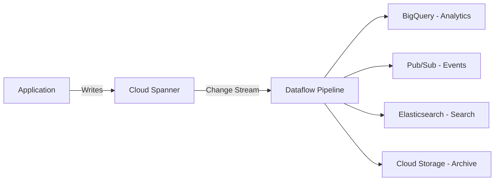

# How to Set Up Change Streams in Cloud Spanner for Real-Time Data Capture

Author: [nawazdhandala](https://www.github.com/nawazdhandala)

Tags: GCP, Cloud Spanner, Change Streams, CDC, Real-Time Data

Description: Step-by-step guide to setting up Cloud Spanner change streams to capture and process real-time data changes for event-driven architectures.

---

Change data capture (CDC) is a pattern where you track and react to changes in your database in real time. Cloud Spanner introduced change streams to support this natively. Instead of polling your database for updates or maintaining triggers, you can define a change stream that continuously emits records whenever rows are inserted, updated, or deleted. In this post, I will show you how to set up change streams, read from them, and integrate them into your data pipeline.

## What Are Change Streams?

A change stream is a schema object in Spanner that watches for data modifications (INSERT, UPDATE, DELETE) on specified tables and columns. When a change occurs, Spanner records the change in the stream with the exact commit timestamp, the old and new values, and metadata about the operation.

Change streams are useful for:

- Replicating data to other systems (BigQuery, Pub/Sub, Elasticsearch)
- Building event-driven microservices
- Maintaining audit logs
- Keeping caches in sync with the database
- Feeding analytics pipelines with real-time data

## Creating a Change Stream

You create change streams using DDL statements. The simplest form watches all tables in the database:

```sql
-- Create a change stream that watches ALL tables and columns
CREATE CHANGE STREAM WatchEverything
  FOR ALL;
```

More commonly, you want to watch specific tables:

```sql
-- Watch only the Orders and Payments tables
CREATE CHANGE STREAM OrderChanges
  FOR Orders, Payments;
```

You can narrow it down to specific columns:

```sql
-- Watch only the Status and UpdatedAt columns of the Orders table
CREATE CHANGE STREAM OrderStatusChanges
  FOR Orders(Status, UpdatedAt);
```

To create the change stream using gcloud:

```bash
# Add a change stream to your database schema
gcloud spanner databases ddl update my-database \
    --instance=my-spanner-instance \
    --ddl='CREATE CHANGE STREAM OrderChanges FOR Orders, Payments'
```

## Change Stream Options

Change streams support several configuration options:

```sql
-- Create a change stream with custom retention and value capture
CREATE CHANGE STREAM OrderChanges
  FOR Orders
  OPTIONS (
    retention_period = '7d',
    value_capture_type = 'OLD_AND_NEW_VALUES'
  );
```

The `retention_period` controls how long change records are kept. The default is 1 day, and you can set it up to 7 days. After the retention period, old records are automatically cleaned up.

The `value_capture_type` has three options:

- `OLD_AND_NEW_VALUES` - Captures both the old and new values of tracked columns. Most useful for audit trails.
- `NEW_ROW` - Captures all columns of the row after the change. Good for replication scenarios.
- `NEW_VALUES` - Captures only the new values of tracked columns. Most storage-efficient.

## Reading Change Streams with Dataflow

The most common way to process change streams in production is through Apache Beam on Dataflow. Google provides a built-in Spanner change streams connector.

Here is a Java-based Dataflow pipeline that reads from a change stream and writes to BigQuery:

```java
import org.apache.beam.sdk.Pipeline;
import org.apache.beam.sdk.io.gcp.spanner.SpannerConfig;
import org.apache.beam.sdk.io.gcp.spanner.SpannerIO;
import org.apache.beam.sdk.options.PipelineOptionsFactory;

public class ChangeStreamPipeline {
    public static void main(String[] args) {
        // Create the pipeline with Dataflow runner options
        Pipeline pipeline = Pipeline.create(
            PipelineOptionsFactory.fromArgs(args).create()
        );

        // Configure the Spanner connection details
        SpannerConfig spannerConfig = SpannerConfig.create()
            .withProjectId("my-project")
            .withInstanceId("my-instance")
            .withDatabaseId("my-database");

        // Read from the change stream and process each record
        pipeline
            .apply("ReadChangeStream",
                SpannerIO.readChangeStream()
                    .withSpannerConfig(spannerConfig)
                    .withChangeStreamName("OrderChanges")
                    .withMetadataInstance("my-instance")
                    .withMetadataDatabase("my-metadata-db")
            )
            .apply("ProcessChanges", ParDo.of(new ProcessChangeRecordFn()))
            .apply("WriteToBigQuery",
                BigQueryIO.writeTableRows()
                    .to("my-project:my_dataset.order_changes")
                    .withSchema(getTableSchema())
                    .withWriteDisposition(WriteDisposition.WRITE_APPEND)
            );

        pipeline.run();
    }
}
```

The metadata database is used by the connector to track its read position, manage partitions, and coordinate between workers. It should be a separate database from the one being watched.

## Reading Change Streams Directly with the API

For simpler use cases or during development, you can read change streams directly using the Spanner API. This is done through a special TVF (table-valued function):

```sql
-- Read change records from the stream starting at a specific timestamp
SELECT ChangeRecord
FROM READ_OrderChanges(
    start_timestamp => '2026-02-17T00:00:00Z',
    end_timestamp => NULL,
    partition_token => NULL,
    heartbeat_milliseconds => 10000
);
```

Setting `end_timestamp` to NULL means the stream will remain open and continuously return new records. The `heartbeat_milliseconds` parameter controls how often Spanner sends heartbeat records when there are no data changes.

## Change Record Structure

Each change record contains rich information about the modification. Here is what a typical record looks like:

```json
{
  "data_change_record": {
    "commit_timestamp": "2026-02-17T10:30:00.000000Z",
    "record_sequence": "00000001",
    "server_transaction_id": "abc-123",
    "is_last_record_in_transaction_in_partition": true,
    "table_name": "Orders",
    "column_types": [...],
    "mods": [
      {
        "keys": {"OrderId": "order-456"},
        "new_values": {"Status": "SHIPPED", "UpdatedAt": "2026-02-17T10:30:00Z"},
        "old_values": {"Status": "PENDING", "UpdatedAt": "2026-02-16T08:00:00Z"}
      }
    ],
    "mod_type": "UPDATE"
  }
}
```

The `mod_type` is one of INSERT, UPDATE, or DELETE. For INSERTs, `old_values` is empty. For DELETEs, `new_values` is empty.

## Architecture Overview

Here is how change streams fit into a typical data architecture:



## Managing Change Streams

To see existing change streams, inspect the database schema:

```bash
# View the database DDL including change stream definitions
gcloud spanner databases ddl describe my-database \
    --instance=my-spanner-instance
```

To modify a change stream:

```sql
-- Add another table to an existing change stream
ALTER CHANGE STREAM OrderChanges
  SET FOR Orders, Payments, Shipments;

-- Change the retention period
ALTER CHANGE STREAM OrderChanges
  SET OPTIONS (retention_period = '3d');
```

To drop a change stream:

```sql
-- Remove the change stream
DROP CHANGE STREAM OrderChanges;
```

## Performance Considerations

Change streams add minimal overhead to write operations. Spanner writes change records as part of the same transaction that modifies the data, so there is no separate write path. The additional storage for change records depends on your retention period and write volume.

However, reading from change streams does consume resources. If you have a high-throughput change stream and multiple readers, make sure your Spanner instance has enough capacity.

A few tips for production deployments:

- Use a dedicated metadata database for the Dataflow connector to avoid impacting your main database
- Start with `NEW_VALUES` capture type unless you specifically need old values
- Set the retention period to the minimum your use case requires
- Monitor the lag between write time and processing time to detect pipeline bottlenecks

## Wrapping Up

Change streams turn Cloud Spanner from a transactional database into the source of truth for an event-driven architecture. Instead of building custom polling mechanisms or maintaining dual-write logic, you let Spanner track changes natively and feed them to wherever they need to go. The combination of change streams with Dataflow gives you a production-grade CDC pipeline with minimal custom code. Whether you are replicating to BigQuery for analytics, feeding events to Pub/Sub, or maintaining a search index, change streams provide a reliable, ordered, exactly-once foundation to build on.
