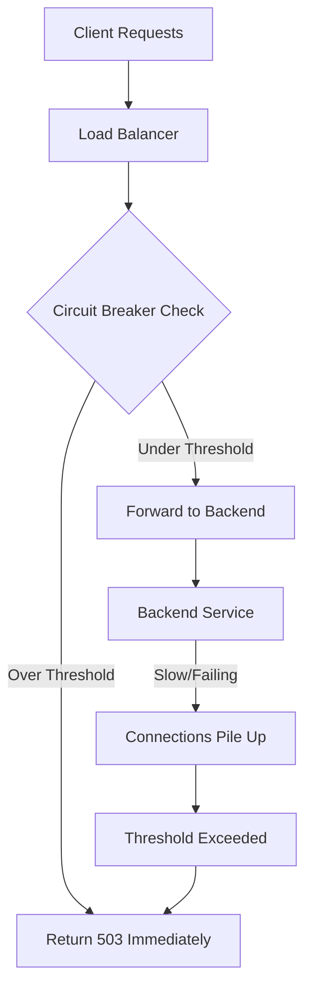

# How to Set Up Circuit Breaking Thresholds for Backend Services on GCP Load Balancer

Author: [nawazdhandala](https://www.github.com/nawazdhandala)

Tags: GCP, Load Balancer, Circuit Breaking, Reliability, Backend Services

Description: Learn how to configure circuit breaking thresholds on GCP Load Balancer to prevent backend overload and cascading failures in your microservices architecture.

---

When a backend service starts failing, the worst thing you can do is keep pounding it with more requests. Every new request adds load to an already struggling service, making the problem worse and potentially causing cascading failures across your entire system. Circuit breaking stops this cycle by putting a limit on the number of connections and requests to a backend. When the limit is reached, new requests fail fast instead of waiting for an overloaded backend to respond.

Google Cloud Load Balancer supports circuit breaking through backend service configuration. In this post, I will show you how to set appropriate thresholds and how they work in practice.

## How Circuit Breaking Works

Circuit breaking on GCP's load balancer works by setting limits at the backend service level. When the number of active connections, pending requests, or concurrent retries exceeds your configured thresholds, the load balancer rejects new requests immediately rather than forwarding them.



The circuit breaker does not "trip" and "reset" like the traditional pattern. Instead, it continuously enforces limits. As connections drain and the backend recovers, new requests start flowing again automatically.

## Circuit Breaking Parameters

GCP's circuit breaker has four configurable parameters:

- **maxConnections**: Maximum number of connections to the backend service. Applies to HTTP/1.1 (each request uses one connection).
- **maxPendingRequests**: Maximum number of requests waiting for a connection. When all connections are busy, new requests queue up here.
- **maxRequests**: Maximum number of concurrent requests to the backend. Applies to HTTP/2 (multiple requests share a connection).
- **maxRetries**: Maximum number of parallel retries allowed. Prevents retry storms.

## Step 1 - Configure Basic Circuit Breaking

Here is how to set circuit breaking thresholds on a backend service.

```bash
# Create a backend service with circuit breaking
gcloud compute backend-services create my-api-backend \
    --global \
    --protocol=HTTP \
    --health-checks=api-health-check \
    --port-name=http

# Update the backend service with circuit breaker settings
gcloud compute backend-services update my-api-backend \
    --global \
    --circuit-breakers=max-connections=1000,max-pending-requests=500,max-requests=2000,max-retries=3
```

Let me explain why I chose these numbers:

- **max-connections=1000**: If your backend has 10 instances, this gives about 100 connections per instance. For a typical web service, that is reasonable.
- **max-pending-requests=500**: Half the connection limit. If 500 requests are waiting for a connection, the backend is already saturated and more queuing will only make things worse.
- **max-requests=2000**: For HTTP/2, multiple requests share connections. Set this higher than max-connections since each connection can handle many requests.
- **max-retries=3**: Limit concurrent retries to prevent retry storms when the backend is failing.

## Step 2 - Use the REST API for Full Control

The gcloud CLI covers the basics, but the REST API gives you more control over the configuration.

```python
from google.cloud import compute_v1

# Initialize the client
client = compute_v1.BackendServicesClient()

# Get the current backend service
backend = client.get(
    project="my-project",
    backend_service="my-api-backend"
)

# Configure circuit breakers
backend.circuit_breakers = compute_v1.CircuitBreakers(
    max_connections=1000,
    max_pending_requests=500,
    max_requests=2000,
    max_retries=3
)

# Update the backend service
operation = client.update(
    project="my-project",
    backend_service="my-api-backend",
    backend_service_resource=backend
)

print(f"Updated circuit breakers: {operation.name}")
```

## Step 3 - Calculate Appropriate Thresholds

Setting the right thresholds is the hard part. Here is a framework for calculating them.

Start with your backend's known capacity:

```
Backend instances: 10
Max concurrent connections per instance: 200
Expected average response time: 100ms
Target requests per second: 10,000

Max total connections = instances * connections_per_instance
                     = 10 * 200 = 2,000

Max pending should be a fraction of max connections
max_pending = max_connections * 0.5 = 1,000

For HTTP/2 (multiplexed):
max_requests = target_rps * avg_response_time * safety_factor
             = 10,000 * 0.1 * 2 = 2,000
```

Here is a script that helps you calculate based on load test results:

```python
# calculate_thresholds.py - Calculate circuit breaker thresholds from load test data
def calculate_thresholds(
    num_instances,
    max_conns_per_instance,
    avg_response_time_ms,
    target_rps,
    safety_factor=2.0
):
    """Calculate recommended circuit breaker thresholds."""
    max_connections = int(num_instances * max_conns_per_instance)
    max_pending = int(max_connections * 0.5)

    # For HTTP/2 multiplexing
    avg_response_sec = avg_response_time_ms / 1000
    max_requests = int(target_rps * avg_response_sec * safety_factor)
    max_requests = max(max_requests, max_connections)  # At least as many as connections

    # Retries should be a small fraction of total requests
    max_retries = min(int(max_requests * 0.05), 100)
    max_retries = max(max_retries, 3)  # At least 3

    return {
        "max_connections": max_connections,
        "max_pending_requests": max_pending,
        "max_requests": max_requests,
        "max_retries": max_retries
    }

# Example calculation
thresholds = calculate_thresholds(
    num_instances=10,
    max_conns_per_instance=200,
    avg_response_time_ms=100,
    target_rps=10000
)

print("Recommended circuit breaker thresholds:")
for key, value in thresholds.items():
    print(f"  {key}: {value}")

# Output:
#   max_connections: 2000
#   max_pending_requests: 1000
#   max_requests: 2000
#   max_retries: 100
```

## Step 4 - Configure Per-Service Thresholds

Different backend services have different capacity profiles. Configure thresholds independently.

```bash
# High-throughput API service - generous limits
gcloud compute backend-services update api-backend \
    --global \
    --circuit-breakers=max-connections=5000,max-pending-requests=2000,max-requests=10000,max-retries=50

# Database proxy service - conservative limits
gcloud compute backend-services update db-proxy-backend \
    --global \
    --circuit-breakers=max-connections=200,max-pending-requests=50,max-requests=500,max-retries=3

# File upload service - fewer connections, higher pending tolerance
gcloud compute backend-services update upload-backend \
    --global \
    --circuit-breakers=max-connections=500,max-pending-requests=1000,max-requests=500,max-retries=5
```

## Step 5 - Combine with Outlier Detection

Circuit breaking works best when combined with outlier detection. Circuit breaking limits the total load, while outlier detection removes individual unhealthy instances from the pool.

```bash
# Configure both circuit breaking and outlier detection
gcloud compute backend-services update my-api-backend \
    --global \
    --circuit-breakers=max-connections=2000,max-pending-requests=500,max-requests=4000,max-retries=10

# Outlier detection ejects instances that are returning too many errors
gcloud compute backend-services update my-api-backend \
    --global \
    --outlier-detection=consecutive-errors=5,interval=10s,base-ejection-time=30s,max-ejection-percent=50,enforcing-consecutive-errors=100
```

## Step 6 - Monitor Circuit Breaker Activity

Set up monitoring to track when circuit breakers activate. Look for `loadbalancing.googleapis.com/https/backend_request_count` with response code 503 as an indicator.

```bash
# Query Cloud Logging for circuit breaker events
gcloud logging read 'resource.type="http_load_balancer" AND httpRequest.status=503' \
    --format="table(timestamp, httpRequest.requestUrl, httpRequest.status)" \
    --limit=50
```

Create an alert for when circuit breakers start triggering:

```python
from google.cloud import monitoring_v3

client = monitoring_v3.AlertPolicyServiceClient()

# Create an alert when 503 errors spike (indicating circuit breaker activation)
alert_policy = monitoring_v3.AlertPolicy(
    display_name="Circuit Breaker Activation Alert",
    conditions=[
        monitoring_v3.AlertPolicy.Condition(
            display_name="High 503 rate from load balancer",
            condition_threshold=monitoring_v3.AlertPolicy.Condition.MetricThreshold(
                filter=(
                    'resource.type="https_lb_rule" '
                    'AND metric.type="loadbalancing.googleapis.com/https/request_count" '
                    'AND metric.labels.response_code="503"'
                ),
                comparison=monitoring_v3.ComparisonType.COMPARISON_GT,
                threshold_value=100,
                duration={"seconds": 60},
                aggregations=[
                    monitoring_v3.Aggregation(
                        alignment_period={"seconds": 60},
                        per_series_aligner=monitoring_v3.Aggregation.Aligner.ALIGN_RATE,
                    )
                ],
            ),
        )
    ],
    notification_channels=["projects/my-project/notificationChannels/12345"],
)

result = client.create_alert_policy(
    name="projects/my-project",
    alert_policy=alert_policy,
)
print(f"Created alert: {result.name}")
```

## Tuning Over Time

Circuit breaker thresholds are not set-and-forget. As your traffic patterns change and your backend scales, you need to adjust them.

Start with conservative thresholds (lower than your backend's theoretical maximum), monitor for false positives (circuit breaker triggering during normal traffic), and gradually increase thresholds until you find the right balance between protection and headroom.

If the circuit breaker never triggers, your thresholds might be too generous and will not protect you during a real incident. If it triggers during normal traffic spikes, your thresholds are too tight.

## Wrapping Up

Circuit breaking on GCP Load Balancer is a straightforward configuration on the backend service. Set limits for connections, pending requests, concurrent requests, and retries, and the load balancer enforces them automatically. The result is that overloaded backends get relief instead of more traffic, and your clients get fast failures instead of slow timeouts. Combine circuit breaking with outlier detection for comprehensive backend protection, and build monitoring to track when thresholds are hit so you can tune them over time.
