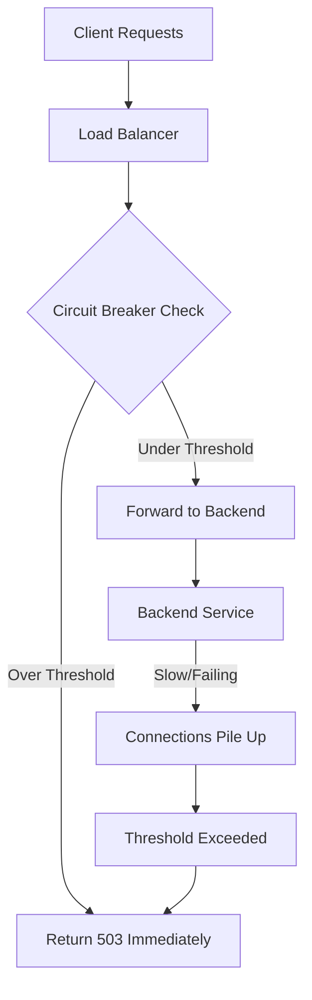

# How to Set Up Circuit Breaking Thresholds for Backend Services

Author: [nawazdhandala](https://www.github.com/nawazdhandala)

Tags: GCP, Load Balancer, Circuit Breaking, Reliability, Backend Service

Description: Learn how to configure circuit breaking thresholds on GCP Load Balancer to prevent backend overload and cascading failures in your microservices architecture.

---

When a backend service starts failing, the worst thing you can do is keep pounding it with more requests. Every new request adds load to an already struggling service, making the problem worse and potentially causing cascading failures across your entire system. Circuit breaking stops this cycle by putting a limit on the number of connections and requests to a backend. When the limit is reached, new requests fail fast instead of waiting for an overloaded backend to respond.

Google Cloud backend services support circuit breaking through backend service configuration. In this post, I will show you how to set appropriate thresholds and how they work in practice.

## How Circuit Breaking Works

Circuit breaking works by setting limits at the backend service level. When the number of active connections, pending requests, parallel requests, or concurrent retries exceeds your configured thresholds, the proxy rejects new requests immediately rather than forwarding them.


```mermaid
flowchart TD
    A[Client Requests] --> B[Load Balancer]
    B --> C{Circuit Breaker Check}
    C -->|Under Threshold| D[Forward to Backend]
    C -->|Over Threshold| E[Return 503 Immediately]
    D --> F[Backend Service]
    F -->|Slow/Failing| G[Connections Pile Up]
    G --> H[Threshold Exceeded]
    H --> E
```

The circuit breaker does not "trip" and "reset" like the traditional pattern. Instead, it continuously enforces limits. As connections drain and the backend recovers, new requests start flowing again automatically.

## Circuit Breaking Parameters

GCP's circuit breaker has five configurable parameters:

- **maxConnections**: Maximum number of connections to the backend service.
- **maxPendingRequests**: Maximum number of requests waiting for a connection. When all connections are busy, new requests queue up here.
- **maxRequests**: Maximum number of parallel requests to the backend service.
- **maxRequestsPerConnection**: Maximum number of requests for a single backend connection. Setting this to 1 effectively disables keep-alive.
- **maxRetries**: Maximum number of parallel retries allowed. Prevents retry storms.

## Step 1 - Configure Basic Circuit Breaking

Here is how to set circuit breaking thresholds on a backend service.

```bash
# Create a backend service with circuit breaking

gcloud compute backend-services create my-api-backend \
    --global \
    --protocol=HTTP \
    --health-checks=api-health-check \
    --port-name=http

# Export the backend service configuration
gcloud compute backend-services export my-api-backend \
    --global \
    --destination=my-api-backend.yaml
```

Then add the `circuitBreakers` block to `my-api-backend.yaml` and import the file.

```yaml
circuitBreakers:
  maxConnections: 1000
  maxPendingRequests: 500
  maxRequests: 2000
  maxRequestsPerConnection: 100
  maxRetries: 3
```

```bash
gcloud compute backend-services import my-api-backend \
    --global \
    --source=my-api-backend.yaml
```

Let me explain why I chose these numbers:

- **max-connections=1000**: If your backend has 10 instances, this gives about 100 connections per instance. For a typical web service, that is reasonable.
- **max-pending-requests=500**: Half the connection limit. If 500 requests are waiting for a connection, the backend is already saturated and more queuing will only make things worse.
- **max-requests=2000**: Limit the number of parallel requests to the backend service. Set this higher than max-connections when your protocol can multiplex requests.
- **max-requests-per-connection=100**: Recycle backend connections after 100 requests while still keeping connection reuse enabled.
- **max-retries=3**: Limit concurrent retries to prevent retry storms when the backend is failing.

## Step 2 - Use the REST API for Full Control

The gcloud CLI uses export and import for this field, but the REST API lets you update the configuration directly.

```python
from google.cloud import compute_v1

# Initialize the client
client = compute_v1.BackendServicesClient()

# Get the current backend service
backend = client.get(
    project="my-project",
    backend_service="my-api-backend"
)

# Configure circuit breakers
backend.circuit_breakers = compute_v1.CircuitBreakers(
    max_connections=1000,
    max_pending_requests=500,
    max_requests=2000,
    max_requests_per_connection=100,
    max_retries=3
)

# Update the backend service
operation = client.update(
    project="my-project",
    backend_service="my-api-backend",
    backend_service_resource=backend
)

print(f"Updated circuit breakers: {operation.name}")
```

## Step 3 - Calculate Appropriate Thresholds

Setting the right thresholds is the hard part. Here is a framework for calculating them.

Start with your backend's known capacity:

```text
Backend instances: 10
Max concurrent connections per instance: 200
Expected average response time: 100ms
Target requests per second: 10,000

Max total connections = instances * connections_per_instance
                     = 10 * 200 = 2,000

Max pending should be a fraction of max connections
max_pending = max_connections * 0.5 = 1,000

For HTTP/2 (multiplexed):
max_requests = target_rps * avg_response_time * safety_factor
             = 10,000 * 0.1 * 2 = 2,000
```

Here is a script that helps you calculate based on load test results:

```python
# calculate_thresholds.py - Calculate circuit breaker thresholds from load test data
def calculate_thresholds(
    num_instances,
    max_conns_per_instance,
    avg_response_time_ms,
    target_rps,
    safety_factor=2.0
):
    """Calculate recommended circuit breaker thresholds."""
    max_connections = int(num_instances * max_conns_per_instance)
    max_pending = int(max_connections * 0.5)

    # For HTTP/2 multiplexing
    avg_response_sec = avg_response_time_ms / 1000
    max_requests = int(target_rps * avg_response_sec * safety_factor)
    max_requests = max(max_requests, max_connections)  # At least as many as connections

    # Requests per connection controls backend connection reuse
    max_requests_per_connection = 100

    # Retries should be a small fraction of total requests
    max_retries = min(int(max_requests * 0.05), 100)
    max_retries = max(max_retries, 3)  # At least 3

    return {
        "max_connections": max_connections,
        "max_pending_requests": max_pending,
        "max_requests": max_requests,
        "max_requests_per_connection": max_requests_per_connection,
        "max_retries": max_retries
    }

# Example calculation
thresholds = calculate_thresholds(
    num_instances=10,
    max_conns_per_instance=200,
    avg_response_time_ms=100,
    target_rps=10000
)

print("Recommended circuit breaker thresholds:")
for key, value in thresholds.items():
    print(f"  {key}: {value}")

# Output:
#   max_connections: 2000
#   max_pending_requests: 1000
#   max_requests: 2000
#   max_requests_per_connection: 100
#   max_retries: 100
```

## Step 4 - Configure Per-Service Thresholds

Different backend services have different capacity profiles. Configure thresholds independently.

```yaml
# High-throughput API service - generous limits
circuitBreakers:
  maxConnections: 5000
  maxPendingRequests: 2000
  maxRequests: 10000
  maxRequestsPerConnection: 1000
  maxRetries: 50

# Database proxy service - conservative limits
circuitBreakers:
  maxConnections: 200
  maxPendingRequests: 50
  maxRequests: 500
  maxRequestsPerConnection: 50
  maxRetries: 3

# File upload service - fewer connections, higher pending tolerance
circuitBreakers:
  maxConnections: 500
  maxPendingRequests: 1000
  maxRequests: 500
  maxRequestsPerConnection: 20
  maxRetries: 5
```

## Step 5 - Combine with Outlier Detection

Circuit breaking works best when combined with outlier detection. Circuit breaking limits the total load, while outlier detection removes individual unhealthy instances from the pool.

```bash
# Export the backend service, add both blocks, then import it again.
gcloud compute backend-services export my-api-backend \
    --global \
    --destination=my-api-backend.yaml
```

```yaml
circuitBreakers:
  maxConnections: 2000
  maxPendingRequests: 500
  maxRequests: 4000
  maxRequestsPerConnection: 100
  maxRetries: 10
outlierDetection:
  consecutiveErrors: 5
  interval:
    seconds: 10
    nanos: 0
  baseEjectionTime:
    seconds: 30
    nanos: 0
  maxEjectionPercent: 50
  enforcingConsecutiveErrors: 100
```

```bash
gcloud compute backend-services import my-api-backend \
    --global \
    --source=my-api-backend.yaml
```

## Step 6 - Monitor Circuit Breaker Activity

Set up monitoring to track when circuit breakers might be activating. Look for `loadbalancing.googleapis.com/https/request_count` with response code 503 as an indicator, then check load balancer logs to confirm the exact `statusDetails` value because 503 responses can have multiple causes.

```bash
# Query Cloud Logging for circuit breaker events
gcloud logging read 'resource.type="http_load_balancer" AND httpRequest.status=503 AND jsonPayload.statusDetails!="response_sent_by_backend"' \
    --format="table(timestamp, httpRequest.requestUrl, httpRequest.status, jsonPayload.statusDetails)" \
    --limit=50
```

Create an alert for possible circuit breaker activation:

```python
from google.cloud import monitoring_v3

client = monitoring_v3.AlertPolicyServiceClient()

# Create an alert when load balancer 503 errors spike
alert_policy = monitoring_v3.AlertPolicy(
    display_name="Circuit Breaker Activation Alert",
    conditions=[
        monitoring_v3.AlertPolicy.Condition(
            display_name="High 503 rate from load balancer",
            condition_threshold=monitoring_v3.AlertPolicy.Condition.MetricThreshold(
                filter=(
                    'resource.type="https_lb_rule" '
                    'AND metric.type="loadbalancing.googleapis.com/https/request_count" '
                    'AND metric.labels.response_code="503"'
                ),
                comparison=monitoring_v3.ComparisonType.COMPARISON_GT,
                threshold_value=100,
                duration={"seconds": 60},
                aggregations=[
                    monitoring_v3.Aggregation(
                        alignment_period={"seconds": 60},
                        per_series_aligner=monitoring_v3.Aggregation.Aligner.ALIGN_RATE,
                    )
                ],
            ),
        )
    ],
    notification_channels=["projects/my-project/notificationChannels/12345"],
)

result = client.create_alert_policy(
    name="projects/my-project",
    alert_policy=alert_policy,
)
print(f"Created alert: {result.name}")
```

## Tuning Over Time

Circuit breaker thresholds are not set-and-forget. As your traffic patterns change and your backend scales, you need to adjust them.

Start with conservative thresholds (lower than your backend's theoretical maximum), monitor for false positives (circuit breaker triggering during normal traffic), and gradually increase thresholds until you find the right balance between protection and headroom.

If the circuit breaker never triggers, your thresholds might be too generous and will not protect you during a real incident. If it triggers during normal traffic spikes, your thresholds are too tight.

## Wrapping Up

Circuit breaking on Google Cloud backend services is a straightforward configuration on the backend service resource. Set limits for connections, pending requests, concurrent requests, requests per connection, and retries, and the proxy enforces them automatically. The result is that overloaded backends get relief instead of more traffic, and your clients get fast failures instead of slow timeouts. Combine circuit breaking with outlier detection for comprehensive backend protection, and build monitoring to track when thresholds are hit so you can tune them over time.
