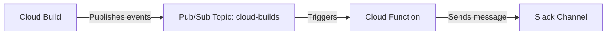

# How to Set Up Cloud Build Notifications with Pub/Sub and Slack Integration

Author: [nawazdhandala](https://www.github.com/nawazdhandala)

Tags: GCP, Cloud Build, Pub/Sub, Slack, Notifications, CI/CD, DevOps

Description: Set up real-time Cloud Build notifications using Google Pub/Sub and Slack webhooks so your team knows immediately when builds succeed or fail.

---

When a production build fails at 3 AM, you want to know about it right away - not when you check the console the next morning. Google Cloud Build publishes build status events to a Pub/Sub topic by default, and you can hook into that to send notifications to Slack, email, PagerDuty, or any other service.

In this post, I will show you how to set up the full pipeline from Cloud Build events through Pub/Sub to Slack messages.

## How Cloud Build Notifications Work

Every time a build starts, succeeds, fails, or times out, Cloud Build automatically publishes a message to a Pub/Sub topic called `cloud-builds` in your project. The message contains the full build object with details like status, duration, source, and images.

The flow looks like this:



## Step 1: Enable the Required APIs

First, make sure the necessary APIs are enabled:

```bash
# Enable Cloud Build, Pub/Sub, and Cloud Functions APIs
gcloud services enable \
  cloudbuild.googleapis.com \
  pubsub.googleapis.com \
  cloudfunctions.googleapis.com \
  --project=my-project
```

## Step 2: Create a Slack Incoming Webhook

Before writing any GCP code, you need a Slack webhook URL:

1. Go to https://api.slack.com/apps
2. Create a new app (or use an existing one)
3. Under "Features", click "Incoming Webhooks"
4. Activate incoming webhooks
5. Click "Add New Webhook to Workspace"
6. Select the channel where you want build notifications
7. Copy the webhook URL - it looks like `https://hooks.slack.com/services/T00/B00/xxxx`

Keep this URL safe. You will need it in the next step.

## Step 3: Create the Cloud Function

Now create a Cloud Function that listens to the `cloud-builds` Pub/Sub topic and sends formatted messages to Slack.

Create a directory for your function:

```bash
# Create the function directory
mkdir -p cloud-build-notifier
cd cloud-build-notifier
```

Create the function code:

```javascript
// index.js - Cloud Function to send build notifications to Slack
const https = require('https');
const url = require('url');

// Slack webhook URL - store this in an environment variable
const SLACK_WEBHOOK_URL = process.env.SLACK_WEBHOOK_URL;

// Map build statuses to Slack colors and emoji
const STATUS_MAP = {
  SUCCESS: { color: '#36a64f', emoji: ':white_check_mark:', text: 'succeeded' },
  FAILURE: { color: '#d32f2f', emoji: ':x:', text: 'failed' },
  TIMEOUT: { color: '#ff9800', emoji: ':hourglass:', text: 'timed out' },
  CANCELLED: { color: '#9e9e9e', emoji: ':no_entry_sign:', text: 'was cancelled' },
  QUEUED: { color: '#2196f3', emoji: ':clock1:', text: 'is queued' },
  WORKING: { color: '#2196f3', emoji: ':hammer:', text: 'is building' },
};

exports.cloudBuildSlackNotifier = async (event, context) => {
  // Decode the Pub/Sub message
  const build = JSON.parse(
    Buffer.from(event.data, 'base64').toString()
  );

  // Only notify on terminal statuses (skip QUEUED and WORKING)
  const terminalStatuses = ['SUCCESS', 'FAILURE', 'TIMEOUT', 'CANCELLED'];
  if (!terminalStatuses.includes(build.status)) {
    console.log(`Skipping notification for status: ${build.status}`);
    return;
  }

  const statusInfo = STATUS_MAP[build.status] || {
    color: '#9e9e9e',
    emoji: ':question:',
    text: build.status,
  };

  // Calculate build duration
  const startTime = new Date(build.startTime);
  const finishTime = new Date(build.finishTime);
  const durationMs = finishTime - startTime;
  const durationMin = Math.floor(durationMs / 60000);
  const durationSec = Math.floor((durationMs % 60000) / 1000);

  // Build the Slack message
  const message = {
    attachments: [
      {
        color: statusInfo.color,
        blocks: [
          {
            type: 'section',
            text: {
              type: 'mrkdwn',
              text: `${statusInfo.emoji} Build \`${build.id.substring(0, 8)}\` ${statusInfo.text}`,
            },
          },
          {
            type: 'section',
            fields: [
              {
                type: 'mrkdwn',
                text: `*Project:*\n${build.projectId}`,
              },
              {
                type: 'mrkdwn',
                text: `*Duration:*\n${durationMin}m ${durationSec}s`,
              },
              {
                type: 'mrkdwn',
                text: `*Trigger:*\n${build.buildTriggerId || 'Manual'}`,
              },
              {
                type: 'mrkdwn',
                text: `*Branch:*\n${
                  build.substitutions?.BRANCH_NAME || 'N/A'
                }`,
              },
            ],
          },
          {
            type: 'actions',
            elements: [
              {
                type: 'button',
                text: { type: 'plain_text', text: 'View Build Logs' },
                url: build.logUrl,
              },
            ],
          },
        ],
      },
    ],
  };

  // Send to Slack
  await sendSlackMessage(message);
  console.log(`Notification sent for build ${build.id} with status ${build.status}`);
};

// Helper function to post a message to Slack
function sendSlackMessage(message) {
  return new Promise((resolve, reject) => {
    const webhookUrl = new url.URL(SLACK_WEBHOOK_URL);
    const postData = JSON.stringify(message);

    const options = {
      hostname: webhookUrl.hostname,
      path: webhookUrl.pathname,
      method: 'POST',
      headers: {
        'Content-Type': 'application/json',
        'Content-Length': Buffer.byteLength(postData),
      },
    };

    const req = https.request(options, (res) => {
      if (res.statusCode === 200) {
        resolve();
      } else {
        reject(new Error(`Slack returned status ${res.statusCode}`));
      }
    });

    req.on('error', reject);
    req.write(postData);
    req.end();
  });
}
```

Create a package.json for the function:

```json
{
  "name": "cloud-build-slack-notifier",
  "version": "1.0.0",
  "description": "Sends Cloud Build notifications to Slack",
  "main": "index.js",
  "engines": {
    "node": ">=18"
  }
}
```

## Step 4: Deploy the Cloud Function

Deploy the function with your Slack webhook URL:

```bash
# Deploy the Cloud Function triggered by the cloud-builds Pub/Sub topic
gcloud functions deploy cloudBuildSlackNotifier \
  --runtime=nodejs18 \
  --trigger-topic=cloud-builds \
  --set-env-vars=SLACK_WEBHOOK_URL="https://hooks.slack.com/services/T00/B00/xxxx" \
  --region=us-central1 \
  --project=my-project \
  --memory=256MB \
  --timeout=60s
```

Replace the webhook URL with your actual Slack webhook URL.

## Step 5: Test the Integration

Trigger a build to test the notification:

```bash
# Submit a simple build to test notifications
gcloud builds submit --no-source \
  --config=- <<'EOF'
steps:
  - name: 'ubuntu'
    args: ['echo', 'Hello from Cloud Build!']
EOF
```

You should see a Slack message appear in your channel within a few seconds of the build completing.

## Filtering Notifications

You probably do not want notifications for every single build. Here is how to filter by status or branch:

```javascript
// index.js - Only notify on failures for the main branch
exports.cloudBuildSlackNotifier = async (event, context) => {
  const build = JSON.parse(
    Buffer.from(event.data, 'base64').toString()
  );

  // Only notify on failures
  if (build.status !== 'FAILURE' && build.status !== 'TIMEOUT') {
    return;
  }

  // Only notify for the main branch
  const branch = build.substitutions?.BRANCH_NAME;
  if (branch && branch !== 'main' && branch !== 'master') {
    return;
  }

  // ... rest of the notification logic
};
```

## Using Cloud Build Notifiers (Alternative Approach)

Google also provides a pre-built notifier image that you can configure without writing code. Here is how to set that up:

```yaml
# slack-notifier.yaml - Cloud Build notifier config
apiVersion: cloud-build-notifiers/v1
kind: SlackNotifier
metadata:
  name: slack-build-notifier
spec:
  notification:
    filter: build.status == Build.Status.FAILURE
    delivery:
      webhookUrl:
        secretRef: slack-webhook-url
  secrets:
    - name: slack-webhook-url
      value: projects/my-project/secrets/slack-webhook/versions/latest
```

Store the webhook URL in Secret Manager:

```bash
# Store the Slack webhook URL in Secret Manager
echo -n "https://hooks.slack.com/services/T00/B00/xxxx" | \
  gcloud secrets create slack-webhook \
    --data-file=- \
    --project=my-project
```

Deploy the notifier:

```bash
# Deploy the pre-built Slack notifier
gcloud builds submit \
  --config=setup.yaml \
  --substitutions=_NOTIFIER_CONFIG=slack-notifier.yaml
```

## Sending Notifications to Multiple Channels

If you want different channels for different projects or environments, you can route based on build metadata:

```javascript
// index.js - Route notifications to different Slack channels
const CHANNEL_MAP = {
  'production': process.env.SLACK_WEBHOOK_PROD,
  'staging': process.env.SLACK_WEBHOOK_STAGING,
  'default': process.env.SLACK_WEBHOOK_DEFAULT,
};

exports.cloudBuildSlackNotifier = async (event, context) => {
  const build = JSON.parse(
    Buffer.from(event.data, 'base64').toString()
  );

  // Determine the channel based on the trigger name or branch
  const branch = build.substitutions?.BRANCH_NAME || 'default';
  let webhookUrl;

  if (branch === 'main' || branch === 'master') {
    webhookUrl = CHANNEL_MAP['production'];
  } else if (branch === 'staging' || branch === 'develop') {
    webhookUrl = CHANNEL_MAP['staging'];
  } else {
    webhookUrl = CHANNEL_MAP['default'];
  }

  // ... build and send the message using the selected webhook
};
```

## Wrapping Up

Setting up Cloud Build notifications through Pub/Sub and Slack keeps your team informed about build statuses without anyone having to watch the console. The approach is flexible - you can filter by status, branch, or project, and route notifications to different channels. Whether you use a custom Cloud Function or the pre-built notifier, the important thing is that your team finds out about build failures quickly so they can be addressed before they become bigger problems.
